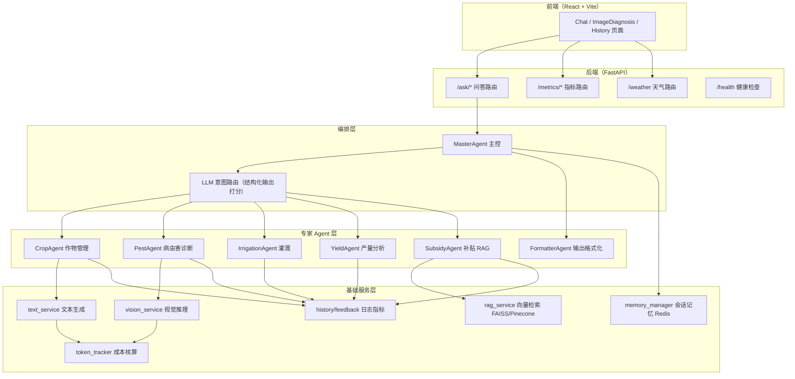
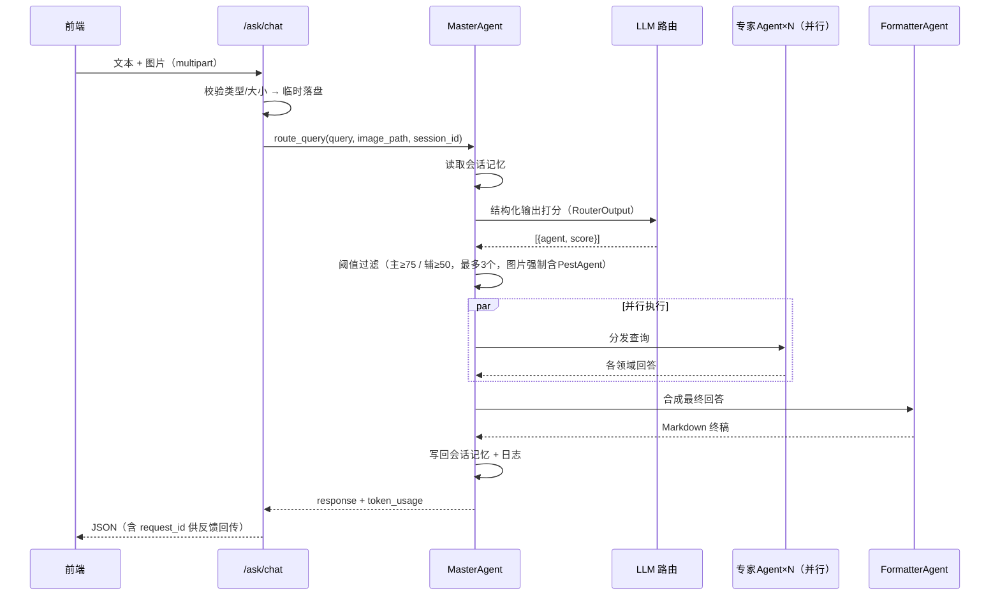

# AgriGPT 智能农业助手 — 总体设计方案

> 文档版本：V1.0 ｜ 文档性质：企业级总体设计方案（配套学生实训）
> 配套目录：`源码/`（完整可运行源码）、`项目文档/`（分步实训指导书）

---

## 1. 项目概述

### 1.1 项目背景

通用大模型在面对农业等垂直领域时，普遍存在三类问题：

1. **幻觉严重**：会编造不存在的补贴政策、农药配方；
2. **职责混杂**：一个 Prompt 同时承担诊断、施肥、灌溉建议，质量不可控；
3. **缺乏多模态**：农户最直接的诉求（拍照问病害）无法被处理。

**AgriGPT（智能农业助手）** 是一个端到端的**多模态、多智能体（Multi-Agent）农业咨询系统**：

- 支持 **文本问答、图片病害诊断、图文混合多轮对话** 三种交互；
- 通过 **LLM 意图路由** 将请求分发给 5 个领域专家 Agent + 1 个格式化 Agent；
- 通过 **RAG 检索增强** 保证补贴类回答有据可查；
- 通过 **护栏（Guardrails）、记忆管理、Token 成本核算、指标反馈** 构成完整的工程闭环。

### 1.2 产品能力矩阵

| 能力 | 说明 |
|------|------|
| 多 Agent 协作 | 7 个角色边界严格的 Agent，单请求最多 3 个 Agent 并行 |
| 多模态输入 | 纯文本 / 纯图片 / 图文混合统一入口 |
| 视觉诊断 | Groq Llama 4 Scout 视觉模型，图片优先路由到 PestAgent |
| RAG 知识增强 | 补贴政策问答基于向量库检索（FAISS / Pinecone），拒绝编造 |
| 会话记忆 | Redis 持久化（可降级为进程内存），每会话保留最近 10 条 |
| 指标运营 | 用量指标（按 Agent / 类型 / 天）+ 质量指标（满意度） |
| 成本核算 | 每请求、每会话 Token 用量与费用估算 |
| 可观测性 | 可选接入 LangSmith 全链路追踪 |
| 容器化交付 | Docker + docker-compose 一键启动，支持 Render 云部署 |

---

## 2. 需求分析

### 2.1 角色与场景

| 角色 | 典型场景 |
|------|----------|
| 农户（终端用户） | 文本提问"番茄施什么肥"；拍照上传病叶求诊断；查询政府补贴 |
| 平台运营 | 查看各 Agent 用量分布、用户满意度、成本消耗 |
| 系统管理员 | 部署、配置 API Key、监控服务健康状态 |

### 2.2 功能性需求

| 编号 | 需求 | 优先级 |
|------|------|--------|
| FR-01 | 文本回答作物种植、施肥、土壤问题 | P0 |
| FR-02 | 图片识别作物病害/虫害/缺素症状 | P0 |
| FR-03 | 图文混合多模态问答 | P0 |
| FR-04 | 基于知识库的补贴政策问答（不可编造） | P0 |
| FR-05 | 多轮对话记忆（同会话上下文延续） | P1 |
| FR-06 | 灌溉 / 产量专项问答 | P1 |
| FR-07 | 用户反馈（点赞/点踩）与质量指标 | P1 |
| FR-08 | 位置天气展示 | P2 |
| FR-09 | Token 用量与成本统计 | P2 |

### 2.3 非功能性需求

| 类别 | 指标 |
|------|------|
| 安全性 | 上传文件类型白名单（JPEG/PNG）、大小上限 8MB；查询长度上限 2000 字符 |
| 可靠性 | LLM 调用 3 次指数退避重试；外部服务失败一律优雅降级不抛 500 |
| 准确性 | 补贴回答须经幻觉检测护栏；专家 Agent 职责边界硬约束 |
| 性能 | 多 Agent 并行执行（线程池）；Agent 注册表单例缓存 |
| 成本 | 全链路 Token 追踪；历史消息裁剪（≤5 条 / ≤1500 字符）控制上下文开销 |
| 可维护性 | 提示词集中版本化管理（YAML）；配置全部环境变量化 |

---

## 3. 总体架构设计

### 3.1 架构图



### 3.2 分层职责

| 层 | 目录 | 职责 | 依赖方向 |
|----|------|------|----------|
| 接口层 | `routes/` | HTTP 协议适配、参数校验、异常转译 | ↓ |
| 编排层 | `agents/master_agent.py` | 意图路由、Agent 调度、并行执行、结果合成 | ↓ |
| 领域层 | `agents/*.py` | 各专家 Agent，职责单一、边界严格 | ↓ |
| 服务层 | `services/` | LLM 调用、RAG、日志、反馈等原子能力 | ↓ |
| 核心层 | `core/` | 配置、提示词、记忆、护栏、Token 追踪等横切能力 | — |

> **依赖规则**：只允许自上而下单向依赖；`core/` 不得反向依赖业务层。

### 3.3 请求处理时序（多模态）



---

## 4. 技术选型

### 4.1 后端

| 领域 | 选型 | 理由 |
|------|------|------|
| Web 框架 | FastAPI + Pydantic | 原生异步、自动 OpenAPI 文档、强类型校验 |
| LLM 网关 | Groq（Llama 3.3 70B / Llama 4 Scout） | 推理速度快、免费额度适合教学 |
| 编排框架 | LangChain + LCEL | 提示词管道化、结构化输出、可追踪 |
| 向量检索 | FAISS（默认）/ Pinecone（可选） | 本地零依赖起步，可平滑升级云服务 |
| 嵌入模型 | sentence-transformers all-MiniLM-L12-v2（384 维） | 轻量、CPU 可跑 |
| 会话存储 | Redis（可选降级内存） | 多 worker 可扩展、支持 TTL |
| 测试 | pytest + httpx | 接口级测试 |

### 4.2 前端

| 领域 | 选型 | 理由 |
|------|------|------|
| 框架 | React 18 + TypeScript + Vite | 类型安全、构建快 |
| 样式 | Tailwind CSS + shadcn/ui（Radix） | 企业级组件一致性 |
| 状态 | Zustand | 轻量、无样板代码 |
| 请求 | Axios（拦截器）+ React Query | 统一错误归一化 |
| 部署 | Nginx 静态托管 + 反向代理 | 生产标配 |

### 4.3 DevOps

| 领域 | 选型 |
|------|------|
| 容器化 | Docker、docker-compose（redis + backend + frontend 三服务） |
| 云部署 | Render（render.yaml 蓝图 / Dockerfile 双模式） |
| 质量 | pytest、Ruff、GitHub Actions CI |

---

## 5. 详细模块设计

### 5.1 意图路由（核心创新点）

- **输入**：用户查询 + 会话历史 + Agent 能力清单；
- **输出**：`RouterOutput = [{agent, score(0-100)}]`，采用 **Pydantic 结构化输出**，杜绝正则解析的脆弱性（附 JSON 降级解析兜底）；
- **决策规则**：
  - 最高分 ≥75 → 主 Agent；50~74 也可成为主 Agent；全部 <50 回落 CropAgent；
  - 其余 ≥50 的作为辅助 Agent，总数上限 3；
  - **含图片时强制注入 PestAgent**（必要时替换最低优先级槽位）；
- **执行**：线程池并行执行，`FormatterAgent` 只做合成不做新推理。

### 5.2 专家 Agent 设计原则

1. **单一职责**：每个 Agent 提示词内显式声明 `STRICT BOUNDARIES`（禁止越界回答）；
2. **统一契约**：继承 `AgriAgentBase`，实现 `handle_query()`，自动走 `respond_and_record()` 落日志；
3. **注册表模式**：`get_agent_registry()` 单例缓存，路由层按名调度；
4. **不可路由集合**：`NON_ROUTABLE_AGENTS = {"FormatterAgent"}` 防止格式化器被选中。

### 5.3 RAG 补贴问答链路

```
subsidies.json → 文档化 → 嵌入(384维) → FAISS/Pinecone
查询 → 归一化+扩词 → 相似度检索(k=2, 距离阈值0.7) → 上下文注入
→ LCEL 链（prompt | llm | StrOutputParser）→ 幻觉护栏 → 输出
```

**护栏策略**（`guardrails.py`）：回答中提到的政策名必须能对应到检索文档；检索为空时若回答未含"未找到"类措辞，自动附加免责声明。

### 5.4 会话记忆

- 存储：Redis List（`agrigpt:session:{sid}`，TTL 7 天，上限 10 条）→ 无 Redis 时降级 `deque`；
- 裁剪：入提示词前截取最近 5 条且 ≤1500 字符，控制 Token 开销；
- `session_id` 由前端生成（`crypto.randomUUID()`）并经 FormData 传递。

### 5.5 可观测与成本

- `token_tracker`：线程安全，按请求/会话聚合 Token 与估算费用（内置单价表）；
- `history_service`：原子写（临时文件 + `os.replace`）、5MB 自动归档轮转；
- `/metrics/usage`、`/metrics/quality` 聚合查询日志与反馈日志；
- 可选 LangSmith：启动时按环境变量注入追踪配置。

---

## 6. 接口设计（REST）

| 接口 | 方法 | 入参 | 出参要点 |
|------|------|------|----------|
| `/ask/text` | POST(form) | query, session_id? | analysis, request_id, token_usage |
| `/ask/image` | POST(multipart) | file(JPEG/PNG≤8MB), session_id? | 同上 |
| `/ask/chat` | POST(multipart) | query, file?, session_id? | mode: text_only/multimodal |
| `/metrics/feedback` | POST(query) | request_id, feedback, source? | status |
| `/metrics/usage` | GET | days(1-365) | by_agent / by_type / by_day |
| `/metrics/quality` | GET | days | satisfaction_rate |
| `/weather/current` | GET | lat, lon | temp, humidity, wind, condition |
| `/health` | GET | — | 依赖与模型配置状态 |

**统一约定**：错误一律映射为语义化 HTTP 状态码（400/413/415/500）+ `detail` 文案；成功响应附 `request_id` 与 `elapsed_ms`。

---

## 7. 数据设计

| 数据 | 格式 | 说明 |
|------|------|------|
| `subsidies.json` | JSON 数组 | 字段：scheme_name / eligibility / benefits / application_steps / documents / notes |
| `query_log.json` | JSON 数组 | 每次 Agent 应答记录：时间、Agent、查询、响应(≤5000字)、类型 |
| `feedback_log.json` | JSON 数组 | request_id + positive/negative + source |
| `faiss_index/` | index.faiss + index.pkl | 本地向量库持久化，启动时自动加载或重建 |
| Redis | JSON 字符串 List | 会话消息，key 前缀 `agrigpt:session:` |

---

## 8. 安全与合规设计

1. **输入面**：文件白名单 + 大小限制 + 查询长度限制 + 临时文件后台清理；
2. **输出面**：补贴护栏 + 视觉模型"只描述可见内容"的保守提示词策略；
3. **密钥管理**：全部经 `.env` / 环境变量注入，`.gitignore` 排除；日志只打印密钥长度与首尾片段；
4. **降级链**：Pinecone 失败→FAISS；Redis 失败→内存；结构化输出失败→JSON 解析；任一外部依赖失败均返回友好文案而非堆栈。

---

## 9. 源码目录结构

```
源码/
├── backend/
│   ├── agents/          # 多 Agent 系统（基类 + 6 个角色 + 主控）
│   ├── core/            # 配置 / 提示词 / 路由 Schema / 记忆 / 护栏 / Token
│   ├── routes/          # ask / metrics / weather / health 路由
│   ├── services/        # 文本 / 视觉 / RAG / 日志 / 反馈 / 天气服务
│   ├── prompts/         # prompts.yaml 提示词库（版本化）
│   ├── data/            # 补贴数据 / 向量库 / 运行日志
│   ├── tests/           # pytest 测试
│   ├── main.py          # 应用入口
│   └── requirements.txt
├── frontend/
│   └── src/{api,components,pages,store,...}
├── Dockerfile / docker-compose.yml / render.yaml / pytest.ini
```

---

## 10. 实训里程碑计划

| 阶段 | 对应实训 | 交付物 |
|------|----------|--------|
| M1 环境就绪 | 实训 01~02 | 可运行的 FastAPI 骨架 + /docs |
| M2 单 Agent 问答 | 实训 03~04 | /ask/text 端到端可用 |
| M3 多 Agent 编排 | 实训 05~06 | 意图路由 + 图片诊断 |
| M4 知识增强 | 实训 07~08 | RAG 补贴问答 + 会话记忆 |
| M5 运营闭环 | 实训 09 | 指标 + 反馈接口 |
| M6 前端交付 | 实训 10~11 | 完整 Web 应用并联调通过 |
| M7 工程化 | 实训 12 | 测试全绿 + 容器化一键部署 |

> 详细步骤见 `项目文档/实训总览与指导书.md` 与《项目实训01 ~ 项目实训12》。

---

## 11. 风险与应对

| 风险 | 影响 | 应对 |
|------|------|------|
| Groq 限流/欠费 | 全站问答失败 | 3 次指数退避 + 友好降级文案；教学场景使用免费额度 |
| 模型输出不稳定 | 路由解析失败 | 结构化输出优先 + JSON 正则兜底 + CropAgent 默认回落 |
| 嵌入模型首次下载慢 | 启动阻塞 | 提前缓存 `~/.cache` 或提供离线索引 |
| 幻觉 | 误导用户 | 护栏 + 免责声明 + 提示词硬边界三重防线 |
