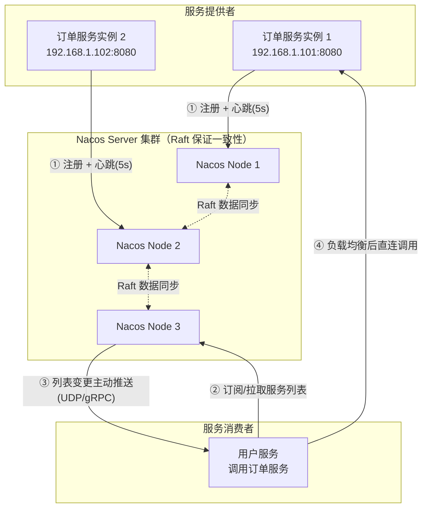
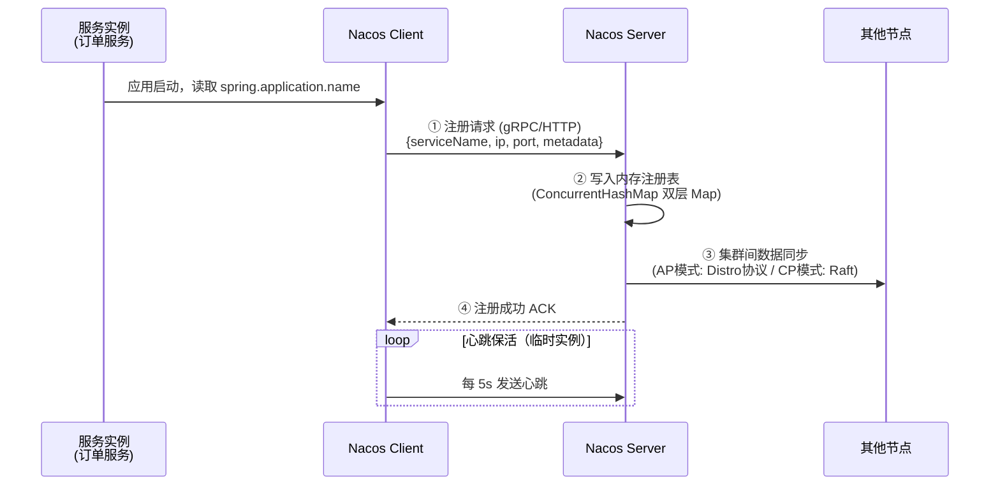
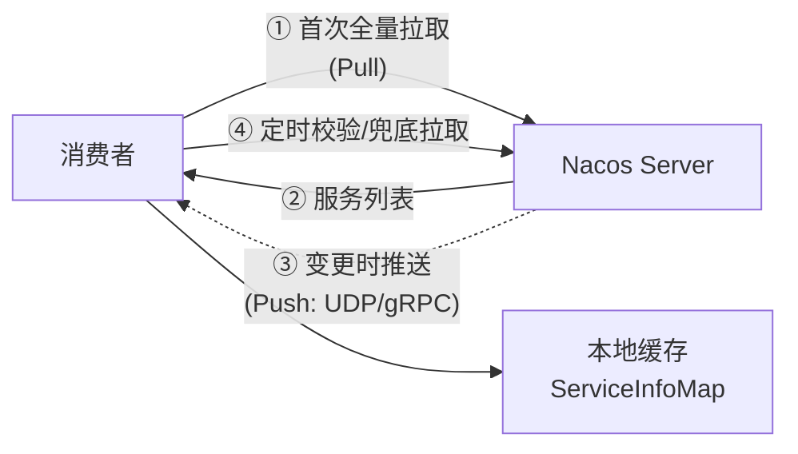
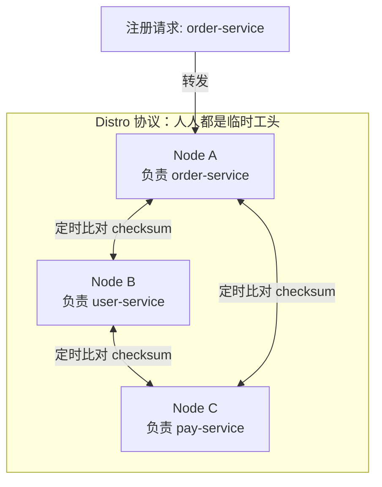
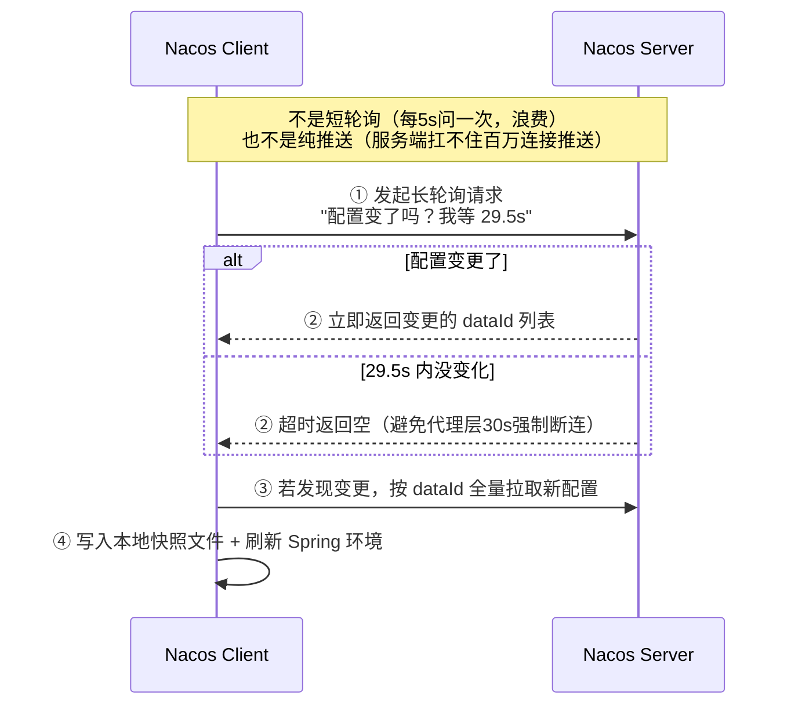

# Nacos 技术原理详解

> 🎭 **一句话开场**：如果把微服务集群比作一座大学城，Nacos 就是教务处的「学生通讯录」+「公告栏」——谁在哪个宿舍（服务注册）、课程表改了没（配置变更），全归它管。

---

## 一、为什么需要 Nacos？从一个"电话簿丢失"的故事说起

### 1.1 没有注册中心的世界

想象你开了一家外卖公司，有 3 个骑手（订单服务实例）：

- 骑手 A：192.168.1.101:8080
- 骑手 B：192.168.1.102:8080
- 骑手 C：192.168.1.103:8080

调度员（调用方）把这三个地址**写死在记事本上**。结果有一天：

- 骑手 B 生病请假了（服务宕机）→ 调度员还往他那派单，全丢了 ❌
- 新来了骑手 D（扩容）→ 调度员不知道他的存在 ❌
- 骑手 A 换了手机号（IP 变更）→ 所有人都联系不上他 ❌

**这就是"服务发现"要解决的问题**：地址不能写死，必须动态感知。

### 1.2 Nacos 是什么

**Nacos**（**Na**ming + **Co**nfiguration **S**ervice）是阿里巴巴开源的一站式平台，两大核心功能：

| 功能 | 生活类比 | 解决什么问题 |
|------|---------|------------|
| **服务注册与发现** | 通讯录 / 黄页 | 服务在哪儿？活着没？ |
| **配置中心** | 公告栏 / 广播站 | 配置改了，如何不重启就生效？ |

竞争对手：Eureka（停更）、Zookeeper、Consul。Nacos 的优势是**既能注册又能配置，且对 AP/CP 双模支持**。

---

## 二、整体架构：俯瞰 Nacos 的世界



**核心角色一句话总结：**

- **Provider（服务提供者）**：上台前先"签到"，之后每 5 秒喊一声"我还活着"（心跳）。
- **Consumer（服务消费者）**：先问 Nacos 要"通讯录"，然后**自己挑一个人直连**（负载均衡在客户端！）。
- **Nacos Server**：维护通讯录，发现谁失联就划掉，通讯录变了主动"打电话"通知订阅者。

> ⚠️ **面试高频坑**：Nacos 不像 Nginx 那样做流量转发！消费者拿到列表后是**客户端负载均衡 + 直连**，Nacos 不在数据链路上。这意味着 Nacos 挂了，已拿到列表的服务间调用**短时间内不受影响**（客户端有本地缓存）。

---

## 三、服务注册与发现：深入到骨子里

### 3.1 注册：一个实例的"上户口"之旅



**关键点拆解：**

1. **注册表是双层 Map 结构**：
   ```java
   // Map<namespace, Map<group::serviceName, Service>>
   Map<String, Map<String, Service>> serviceMap;
   ```
   每个 `Service` 下面挂着 `Cluster`（集群，如杭州/上海机房），Cluster 下才是实例列表。这个结构支撑了 Nacos 的**命名空间隔离**和**同集群优先路由**。

2. **临时实例 vs 持久实例**（面试必考！）：

| 维度 | 临时实例（默认） | 持久实例 |
|------|----------------|---------|
| 存储位置 | **内存** | **磁盘（持久化）** |
| 健康检查 | 客户端主动心跳（5s） | 服务端主动探测（TCP/HTTP/MySQL） |
| 一致性协议 | **AP（Distro）** | **CP（Raft）** |
| 心跳断了会怎样 | 15s 标记不健康，30s 剔除 | 标记不健康，**不剔除**（等它回来） |
| 适用场景 | 普通微服务（IP 动态） | 数据库、中间件（IP 固定） |

> 🎯 **设计哲学**：临时实例"宁可错杀不可放过"（服务伸缩频繁，死了就该剔）；持久实例"宁可挂着不可误删"（MySQL 探活失败可能只是网络抖动，删了会导致全集群找不到库）。

3. **心跳超时规则**：
   - 超过 **15 秒**没收到心跳 → 实例标记为 `healthy=false`（不分配流量，但还留着）
   - 超过 **30 秒**没收到心跳 → 直接从注册表**剔除**

### 3.2 发现：推拉结合的智慧



Nacos 1.x 用 **UDP 推送**，2.x 全面升级为 **gRPC 长连接**（解决 UDP 丢包、穿透防火墙难的问题）。

> 💡 **为什么推拉结合？**
> - 纯拉（Eureka 定时 30s 拉）：变更感知延迟高。
> - 纯推（Zookeeper Watch）：服务端压力大，网络分区时推送可能丢失。
> - **推拉结合**：推保证实时性，定时拉做兜底（最终一致性的双保险）。

### 3.3 AP 与 CP：Nacos 的双面人生

这是 Nacos 最精妙的设计——**同时支持 AP 和 CP，按数据类型切换**：

| 数据类型 | 一致性模式 | 协议 | 原因 |
|---------|-----------|------|------|
| 临时实例（注册数据） | **AP** | **Distro 协议**（自研） | 服务可用性优先，短暂不一致没关系 |
| 持久实例 | **CP** | **Raft 协议** | 重要数据不能丢、不能乱 |
| 配置数据 | **CP** | **Raft 协议** | 配置错了比读不到更可怕 |

**Distro 协议精髓**（AP 模式下的数据同步）：

1. **每个节点都负责一部分数据**（按服务名 hash 分片）——"谁的孩子谁抱走"。
2. 写请求打到"不负责"的节点，会被**转发**到责任节点。
3. 节点间定时**全量校验和比对**（checksum），发现数据不一致就对齐。
4. 没有 Leader 选举的复杂过程，**任何一个节点都能读能写**——这就是 AP 的高可用。



> 🎯 **面试金句**："Nacos 默认是 AP 的（Distro 协议，无选举、最终一致、各节点分片负责数据）；对持久实例和配置数据走 CP（Raft 协议，有 Leader、过半写成功才返回）。这体现了它对 CAP 的务实取舍——**注册信息要活，配置信息要准**。"

---

## 四、配置中心：让配置"热更新"

### 4.1 传统配置的痛

以前改个数据库连接池大小：改配置文件 → 打包 → 发版 → 重启 50 台机器 → 祈祷不出错。一套下来两小时，中间服务还是不一致的。

Nacos 配置中心：**改完点"发布"，所有机器秒级生效，还能回滚、看历史、查谁改的**。

### 4.2 配置定位：DataId 三要素

```
唯一标识一份配置 = namespace + group + dataId
```

- **namespace**：环境隔离（dev / test / prod），默认 `public`
- **group**：业务分组，默认 `DEFAULT_GROUP`
- **dataId**：一般是 `${spring.application.name}-${profile}.${file-extension}`，如 `order-service-dev.yaml`

### 4.3 长轮询：配置变更的"蹲点守候"

**面试经典题：客户端怎么知道配置变了？答案：长轮询（Long Polling）！**



**精妙之处逐条拆解：**

1. **为什么等 29.5s 而不是更久？** 因为很多网关/代理默认 30s 无响应就强制断连，29.5s 是"抢在被踢之前主动回来"。
2. **为什么返回的是 dataId 列表而不是配置内容？** 推内容会重复传大文件；只通知"谁变了"，客户端按需拉取，省带宽。
3. **本地快照文件（snapshot）**：配置拉下来会存一份到本地磁盘。Nacos 挂了怎么办？**用快照兜底启动**——又一次"Nacos 不在关键链路上"的体现。
4. **服务端怎么存"等待中的请求"？** 用 `ScheduledExecutorService` + `DelayQueue` 挂起请求（`ClientLongPolling`），配置发布事件来了就唤醒对应请求立即返回。

### 4.4 配置的"灰度发布"与"回滚"

- **历史版本**：每次发布保留快照，一键回滚（改动记录：谁、什么时候、改了什么）。
- **Beta 发布（灰度）**：先把新配置推给指定 IP 的机器验证，没问题再全量。
- **监听查询**：查"这份配置当前推给了哪些机器"，排查"改了不生效"的神器。

---

## 五、Nacos 2.x 的革命：gRPC 上位

| 维度 | Nacos 1.x | Nacos 2.x |
|------|-----------|-----------|
| 通信协议 | HTTP 短连接 + UDP 推送 | **gRPC 长连接** |
| 注册性能 | 每次注册建 TCP 连接 | 长连接复用，TPS 提升数倍 |
| 推送方式 | UDP（易丢、难穿防火墙） | gRPC 双向流（可靠） |
| 心跳开销 | 每实例每 5s 一次请求 | 连接级探活，开销骤降 |

> 🎯 **一句话记住**：1.x 时代百万实例会把服务端端口和 CPU 打爆，2.x 用一条长连接搞定注册、心跳、推送、配置，**连接数从 O(实例数) 降到 O(应用数)**。

---

## 六、生产实践 Checklist

1. **集群部署至少 3 节点**，前置 VIP/SLB，客户端填 VIP 地址。
2. **配置中心务必开鉴权**（`nacos.core.auth.enabled=true`），历史上 Nacos 未授权访问漏洞被扫过很多次。
3. **重要配置加密**：配合 Jasypt 或自定义加密插件，数据库密码不要明文放 Nacos。
4. **别滥用命名空间**：按"环境"分 namespace（dev/test/prod），按"业务线"分 group，别一个团队一个 namespace。
5. **优雅下线**：配合 Spring Cloud 的 `spring.cloud.nacos.discovery.ip-delete-timeout` 和 shutdown hook，先注销再停机，避免流量打到已下线的实例。
6. **Nacos 自身也要监控**：接 Prometheus + Grafana，关注实例数、长轮询堆积数、Distro 同步延迟。

---

## 七、一页纸总结（面试背诵版）

```
Nacos = 注册中心（AP/Distro 为主，CP/Raft 为辅）
      + 配置中心（长轮询 29.5s 感知变更）

注册：双层 Map 注册表，临时实例走内存+Distro(AP)，持久实例走磁盘+Raft(CP)
心跳：临时实例 5s 心跳，15s 不健康，30s 剔除
发现：客户端拉取 + 服务端推送（1.x UDP / 2.x gRPC），本地缓存兜底
配置：namespace+group+dataId 定位，长轮询拉取，本地快照兜底
2.x：gRPC 长连接，性能数量级提升
```

> 🎬 **收个尾**：Nacos 的设计哲学就一句话——**"我不在你的调用链路上"**。注册表挂了有本地缓存，配置中心挂了有本地快照。好的基础设施，应该像一个靠谱的物业：平时你感觉不到它，但离了它，整个小区立刻瘫痪。
