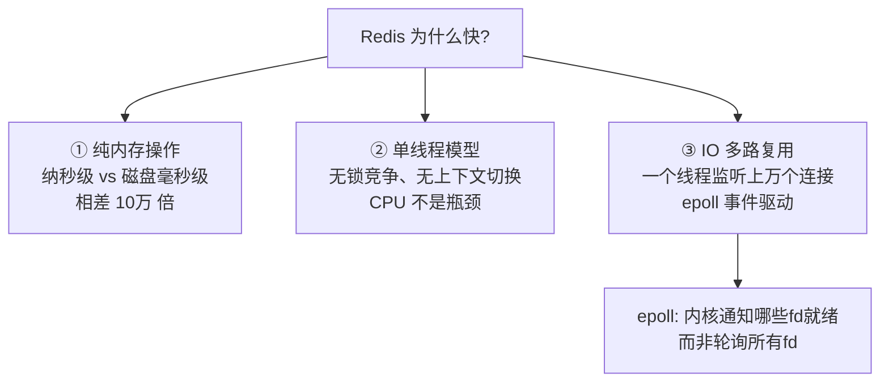
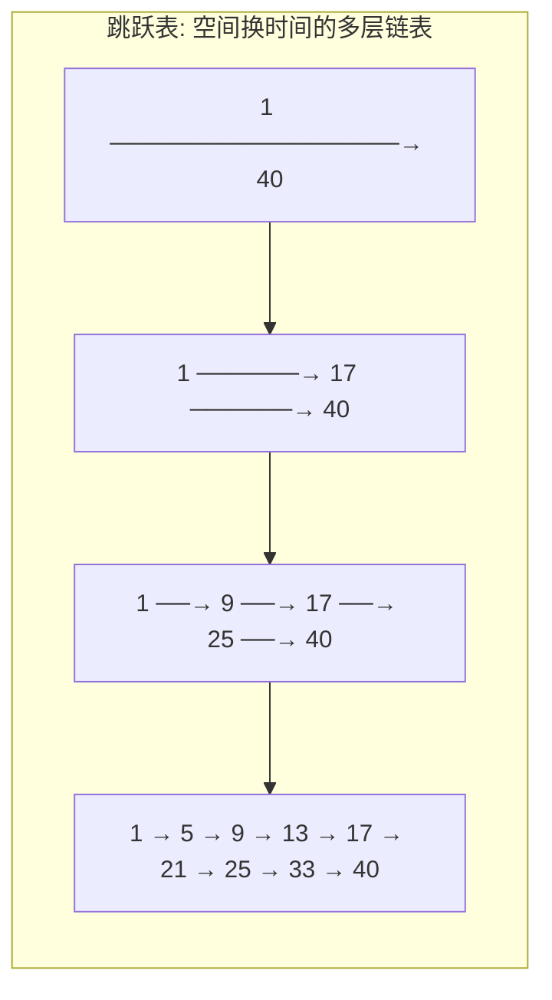
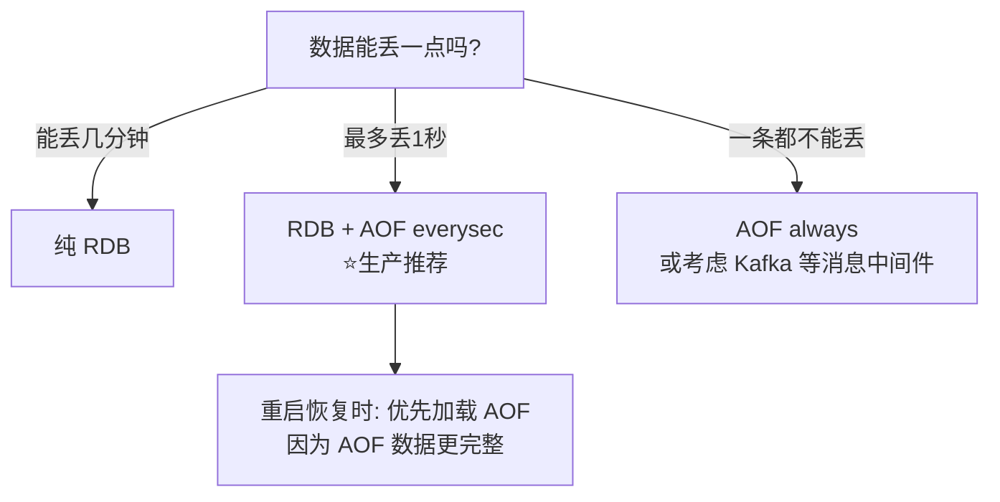
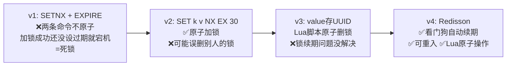
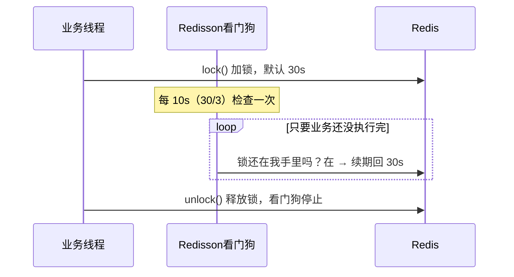
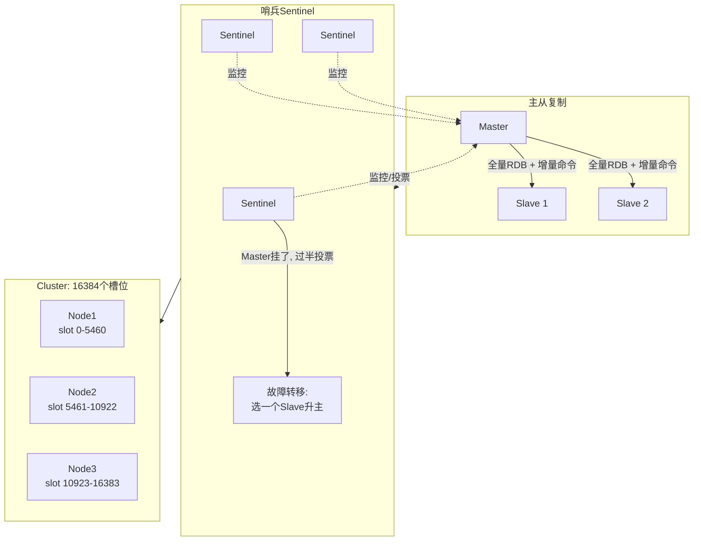

# Redis 技术原理详解

> 🎭 **一句话开场**：MySQL 是银行的保险柜——安全但开门慢；Redis 是你裤兜里的钱包——容量小，但掏钱速度是光速。

---

## 一、Redis 为什么这么快？三个支柱

面试官最爱问"Redis 为什么快"，别再只背"因为它是内存数据库"了，完整答案是**三位一体**：



1. **内存操作**：内存读写 ~100ns，SSD ~100μs，机械盘 ~10ms。物理定律决定的快。
2. **单线程**：避免了多线程的锁竞争和上下文切换开销。对 Redis 来说瓶颈在**内存和网络带宽**，不在 CPU，所以单线程反而纯粹高效。
3. **IO 多路复用（epoll）**：一个线程通过 epoll 同时监听上万个 socket，内核只把"有数据的连接"通知给 Redis，不用挨个问。就像餐厅服务员不用挨个桌子问"要点餐吗"，而是谁举手（事件就绪）就去谁那。

> ⚠️ **澄清误区**：Redis 6.0 引入了**多线程 IO**（网络读写多线程化），但**命令执行依然是单线程**！"单线程"指的是核心命令处理模型。

---

## 二、底层数据结构：简单类型不简单

你以为 String 就是 char*？图样图森破。Redis 的每种类型都有**多种底层编码**，根据数据大小自动切换以省内存：

### 2.1 SDS（简单动态字符串）—— String 的真身

```c
struct sdshdr {
    int len;      // 已用长度 —— O(1) 获取长度，C 字符串要 O(n) 遍历
    int alloc;    // 分配的总空间 —— 预分配，减少扩容次数
    char flags;
    char buf[];   // 实际数据 —— 二进制安全（可以存 \0，能存图片、序列化对象）
};
```

**vs C 字符串的三大优势**：O(1) 取长度、杜绝缓冲区溢出（先检查空间）、二进制安全。

### 2.2 各数据类型与底层编码对照表（面试高频）

| 数据类型 | 底层编码（小数据 → 大数据自动升级） | 典型场景 |
|---------|----------------------------------|---------|
| String | int / **embstr**(≤44字节) / raw | 缓存、计数器、分布式锁 |
| Hash | **listpack** → hashtable | 存对象（user:1 → name/age） |
| List | **listpack** → quicklist | 消息队列、最新列表 |
| Set | **intset** → hashtable | 标签、共同好友、抽奖去重 |
| ZSet | **listpack** → **skiplist + hashtable** | 排行榜、延迟队列、范围查找 |

> 🎯 **重点理解 ZSet 的双结构**：skiplist 保证按分数范围查找 O(logN)，hashtable 保证按 member 查分数 O(1)。两份数据，各取所长——这是"用空间换时间"的经典案例。

### 2.3 跳跃表（SkipList）：为什么不用红黑树？



**为什么选跳表不选红黑树？**（面试必问）
1. **实现简单**：红黑树的旋转平衡逻辑极其复杂，跳表靠"抛硬币"随机决定层高。
2. **范围查询友好**：跳表查到起点后顺着链表遍历即可；红黑树范围查询要中序遍历，复杂。
3. **并发友好**：跳表插入只需锁局部节点，红黑树旋转可能影响整棵树。

---

## 三、持久化：内存数据库的"遗言"机制

Redis 是内存库，断电即失，所以有两种持久化方式，哲学不同：

### 3.1 RDB：拍快照

> 像给内存**拍照片**：某一时刻全量数据的二进制文件（dump.rdb）。

- **触发**：`save`（阻塞）、`bgsave`（fork 子进程，不阻塞）、配置 `save 900 1`（900 秒内至少 1 次写就触发）。
- **优点**：文件紧凑、恢复快（直接 load 进内存）、适合备份和灾难恢复。
- **缺点**：**会丢数据**（两次快照之间的数据丢失）；fork 时内存瞬间翻倍（COW 写时复制缓解）。

### 3.2 AOF：写日记

> 像**记账**：把每个写命令追加到日志文件（appendonly.aof），重启后重放。

- **刷盘策略**（appendfsync）：
  - `always`：每条命令都刷盘 → 最安全，最慢。
  - **`everysec`（默认）**：每秒刷盘 → 最多丢 1 秒数据，性能与安全的平衡点。
  - `no`：交给操作系统 → 最快，最危险。
- **AOF 重写**：日志越记越厚（`set a 1; set a 2; set a 3` 记了三条，其实只有最后一条有效），后台重写压缩成最小命令集。

### 3.3 怎么选？



> 🎯 **生产标准答案**：RDB + AOF 混合持久化（Redis 4.0+ 支持，AOF 重写时前半段用 RDB 格式），恢复快 + 丢得少，两全其美。

---

## 四、内存管理：过期与淘汰，一对孪生兄弟

### 4.1 过期策略：惰性 + 定期双管齐下

设了 `expire` 的 key 到期后，Redis 怎么删？

- **惰性删除**：你不访问，我就不删；你访问时发现过期了才删。（省 CPU，但费内存——过期的垃圾没人碰就一直躺着）
- **定期删除**：每 100ms 随机抽一批设了过期时间的 key 检查，删掉其中过期的。（省内存，但费 CPU）

**为什么要两个一起用？** 只用惰性 → 内存泄漏；只用定期 → CPU 飙高。双管齐下，在 CPU 和内存之间取得平衡。

### 4.2 内存淘汰策略：内存满了怎么办？

`maxmemory` 打满后，新写入触发淘汰（8 种策略，重点记 4 个）：

| 策略 | 行为 | 场景 |
|------|------|------|
| **allkeys-lru** | 所有 key 中淘汰最久未使用的 | ⭐通用缓存首选 |
| **volatile-lru** | 只在设了过期时间的 key 中淘汰 LRU | 有持久化需求的混合场景 |
| volatile-ttl | 淘汰剩余寿命最短的 | 让快过期的先走 |
| **noeviction**（默认） | 不淘汰，写入直接报错 | 把 Redis 当数据库用时 |

> 🎯 **关键点**：Redis 的 LRU 是**近似 LRU**（随机采样 N 个 key，淘汰其中最久未用的），不是精确 LRU——因为维护全量 LRU 链表太贵了。采样数默认 5，可调大提高精度。

---

## 五、缓存三大经典问题：击穿、穿透、雪崩

面试界的"三剑客"，必须能画出图、说出方案：


**一句话区分**：
- **穿透**：查的 key **根本不存在**（恶意攻击）。
- **击穿**：**一个**热点 key 过期，高并发同时重建。
- **雪崩**：**一大批** key 同时过期。

**布隆过滤器详解**（穿透的标准解法）：
- 一个巨大的 bit 数组 + N 个 hash 函数。存：把 key 哈希 N 次，对应 bit 置 1；查：N 个 bit 都为 1 → **可能**存在，有 0 → **一定不**存在。
- 特性：**说没有就一定没有，说有不一定有**（有误判率，但不会漏判）。所有合法 id 提前放入布隆过滤器，恶意请求直接拦截在缓存之外。

---

## 六、分布式锁：Redis 的高级玩法

### 6.1 进化史：从漏洞百出到 Redisson



**v3 的 Lua 脚本**（判断是不是自己的锁 + 删除，必须原子）：
```lua
if redis.call("get", KEYS[1]) == ARGV[1] then
    return redis.call("del", KEYS[1])
else
    return 0
end
```

### 6.2 Redisson 看门狗（Watchdog）：锁的自动续命



> 🎯 **为什么需要续期？** 业务执行超过 30s（比如慢 SQL），锁自动过期，第二个线程拿到锁 → 两个线程并发操作 → 数据错乱。看门狗保证"活干完之前锁不会丢"。
>
> **连锁反应问题**：如果持有锁的线程**真的宕机**了呢？看门狗也死了，锁 30s 后自然过期释放——这就是为什么看门狗续期不是无限放任，而是"活着才续"。

### 6.3 主从切换丢锁问题 & RedLock

主从架构下：客户端 A 在 master 加锁成功 → master 还没同步给 slave 就宕机 → slave 升主 → 客户端 B 在新 master 又加锁成功 → **两把锁同时存在**！

Redis 作者提出 **RedLock**（红锁）：向**多个独立** master（奇数个，如 5 个）依次加锁，超过半数（3 个）成功才算加锁成功。

> ⚠️ **业界争议**：分布式系统专家 Martin Kleppmann 公开质疑 RedLock 在时钟跳变、GC 停顿下的安全性，Redis 作者 antirez 撰文反驳。面试时可以提这场著名论战，并说：**多数公司实际用 Redisson 单实例锁 + 数据库唯一约束/乐观锁兜底，而不是 RedLock**。

---

## 七、高可用：主从 → 哨兵 → 集群



- **主从复制**：读写分离、数据冗余。首次同步走全量 RDB，之后增量同步命令流；网络断开后重连用 `psync` 部分重同步（复制积压缓冲区）。
- **哨兵（Sentinel）**：专职"监工"，监控主从健康；Master 挂了后哨兵间**投票（过半同意）**，选一个 Slave 升主并通知客户端。解决"自动故障转移"。
- **Cluster 集群**：数据**分片**到 16384 个槽（slot），key 通过 `CRC16(key) % 16384` 定位槽位，槽再映射到节点。解决"单机容量上限"和"写性能上限"。

> 🎯 **三级演进记法**：主从解决**读压力**（复制），哨兵解决**可用性**（故障转移），集群解决**容量与写压力**（分片）。

---

## 八、一页纸总结（面试背诵版）

```
快的原因：内存 + 单线程(无锁) + epoll 多路复用
数据结构：SDS/listpack/skiplist+hash(ZSet) —— 按大小自动切换编码
持久化：RDB(快照，恢复快会丢数据) + AOF(日志,everysec 最多丢1s) → 混合持久化
过期：惰性+定期双策略；淘汰：allkeys-lru 最常用(近似LRU采样)
三大问题：穿透(布隆过滤器) 击穿(互斥锁/逻辑过期) 雪崩(随机过期时间)
分布式锁：SET NX EX → Lua 原子删 → Redisson 看门狗续期
高可用：主从(复制) → 哨兵(自动转移) → Cluster(16384槽分片)
```

> 🎬 **收个尾**：Redis 的设计处处体现着"务实"二字——不要精确 LRU，采样就行；不要强一致，最终一致就行；不要复杂数据结构，够用且快就行。**工程的艺术不在于完美，在于权衡。**
