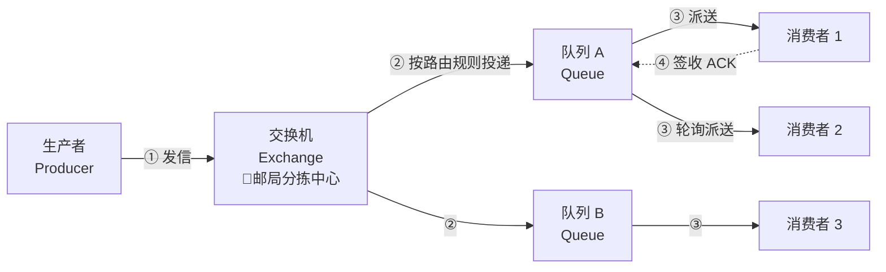
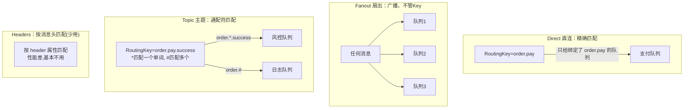
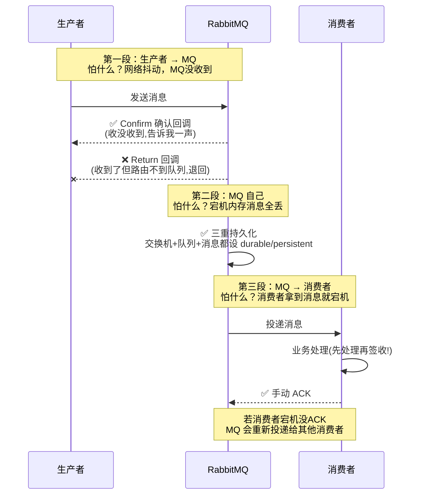
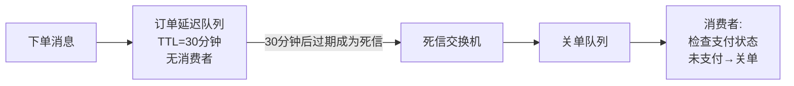

# RabbitMQ 技术原理详解

> 🎭 **一句话开场**：RabbitMQ 是互联网世界的"快递公司"——你（生产者）把包裹（消息）交给它，它保证分拣（Exchange 路由）、入站（Queue 存储）、派送（Consumer 消费），丢了还负责赔（ACK/持久化/死信）。

---

## 一、为什么需要消息队列？从"餐馆点餐"说起

### 1.1 同步调用的三大灾难

想象你点了杯奶茶，店员必须**等你喝完**才能接待下一位顾客——这就是同步调用：

1. **耦合**：下单系统直接调用库存、积分、短信系统。短信系统改个接口，下单系统就得跟着改、跟着发布。
2. **性能**：下单 50ms + 扣库存 50ms + 发短信 200ms = 用户等 300ms。其实发短信根本不用用户等。
3. **流量削峰**：双 11 零点，10 万 QPS 直接打到数据库 → DB 瞬间去世。

### 1.2 MQ 的三板斧

| 价值 | 生活类比 | 说明 |
|------|---------|------|
| **异步** | 点餐取号 | 下单后给个号，奶茶好了叫号，你不用干等 |
| **解耦** | 外卖平台 | 顾客不直接联系骑手，平台中转，骑手换了顾客无感 |
| **削峰** | 三峡大坝 | 洪峰（秒杀流量）先进水库（MQ），下游（DB）按自己节奏匀速放水 |

---

## 二、核心概念：一封信的旅行



**四大角色：**

| 概念 | 类比 | 职责 |
|------|------|------|
| **Producer** | 寄件人 | 发消息，附路由键（RoutingKey，相当于收件地址） |
| **Exchange** | 分拣中心 | 按类型和规则把消息分发给队列，**自己不存消息** |
| **Queue** | 收件柜 | 真正存消息的地方，FIFO |
| **Consumer** | 收件人 | 从队列取消息处理，处理完回 ACK 签收 |

还有两个关键配角：
- **Connection / Channel**：连接是 TCP 长连接，Channel 是连接里的"虚拟通道"。为什么不开多 TCP？因为 TCP 连接昂贵，**一条 Connection 上跑多个轻量 Channel**，就像一条高速公路上划多条车道。
- **Vhost**：虚拟主机，逻辑隔离，相当于快递公司里的"华东仓"和"华南仓"，互不干扰。

---

## 三、交换机类型：四种分拣规则（面试必考）



**记忆口诀**：
- **Direct**——"指名道姓"：key 完全一致才投递。
- **Fanout**——"大喇叭广播"：所有绑定队列都有份，最快（不用匹配 key）。
- **Topic**——"模糊匹配"：`*` 匹配一个单词，`#` 匹配零个或多个。`order.#` 能收所有 order 开头的消息。
- **Headers**——"查户口"：按 header 属性匹配，性能差，基本没人用。

---

## 四、消息可靠性：怎么保证"一定送到"？（面试重头戏）

消息的一生有三段旅程，每段都可能丢，每段都有保险：



### 4.1 生产者端：Confirm + Return 双保险

- **Confirm 机制**：MQ 收到消息并落盘后，异步回调生产者"我收到了"。没收到 Confirm → 生产者重发或记录失败日志人工补偿。
- **Return 机制**：消息到了 Exchange 但**路由不到任何队列**（routing key 写错了）→ 回调退回给生产者。

### 4.2 MQ 端：持久化三件套

```java
// ① 交换机持久化
new DirectExchange("order.exchange", true, false);
// ② 队列持久化
new Queue("order.queue", true);
// ③ 消息持久化（deliveryMode = 2）
MessageProperties.DELIVERY_MODE_PERSISTENT
```

> ⚠️ **注意**：持久化不是 100% 可靠（消息在内存还没来得及刷盘就宕机的窗口期），要更强可靠可用镜像队列/仲裁队列，或生产者端做"本地消息表 + 定时重发"兜底。

### 4.3 消费者端：手动 ACK

- **自动 ACK（别用！）**：MQ 把消息投递出去就算成功，消费者拿到后宕机 → 消息丢了。
- **手动 ACK**：业务处理**成功后**再 `basicAck`；失败可以 `basicNack`（重回队列）或 `basicReject`（进死信）。
- **幂等性**：因为"消费成功但 ACK 时网络断了"会导致 MQ 重复投递，所以**消费者必须幂等**（见 Q&A 部分）。

---

## 五、高级特性：死信、延迟、优先级

### 5.1 死信队列（DLX）：消息的"太平间"与"重生"

消息变成死信的三种情况：
1. 消费者 `basicReject/basicNack` 且 `requeue=false`（拒收且不回队）；
2. 消息 TTL 过期（在队列里待太久没人消费）；
3. 队列满了，新消息挤不进来。

死信会被路由到**死信交换机 → 死信队列**，由专门的消费者处理（记录告警、人工干预、补偿）。

### 5.2 延迟队列：30 分钟未支付自动关单

经典实现 = **TTL + 死信队列**：



> 💡 消息先进入一个"没人消费、30 分钟过期"的队列，过期后自动转入真正消费的队列——曲线救国实现延迟。RabbitMQ 3.8+ 也有官方延迟插件 `rabbitmq-delayed-message-exchange`。

### 5.3 消息顺序性

RabbitMQ 只保证**单队列 FIFO**。保证顺序的方案：
- **一个队列一个消费者**（牺牲并发）；
- 需要顺序的消息（如同一订单的创建/支付/完成）路由到**同一队列**（按订单 ID hash），组内有序即可——全局有序在分布式下是伪命题。

---

## 六、集群与高可用

| 模式 | 原理 | 特点 |
|------|------|------|
| 普通集群 | 队列元数据同步，但**消息只存在一个节点** | 节点挂了该队列不可用，其他节点要"借道"访问 |
| 镜像集群（已弃用） | 队列内容多节点全量镜像 | 可靠但同步开销大，消息要复制 N 份 |
| **仲裁队列（Quorum，推荐）** | 基于 **Raft 协议**，过半写入成功才返回 | 可靠 + 性能平衡，3.8+ 官方推荐 |

> 🎯 **Raft 一句话**：消息写入时，Leader 复制给 Follower，**过半节点确认**后才算成功——单个节点宕机不丢数据，自动选主继续服务。

---

## 七、一页纸总结（面试背诵版）

```
模型：Producer → Exchange(direct/fanout/topic) → Queue → Consumer(ACK)
可靠性三段式：
  ① 生产端：Confirm 确认 + Return 退回 + 失败重试
  ② Broker端：交换机/队列/消息三重持久化
  ③ 消费端：手动ACK + 幂等消费
死信队列：拒收/过期/队列满 → DLX → 补偿处理
延迟队列：TTL + DLX 实现定时任务
顺序性：单队列单消费者，或按业务ID哈希保证局部有序
集群：仲裁队列(Raft，过半写成功)
```

> 🎬 **收个尾**：MQ 的本质是**"用短暂的存储，换取系统间的从容"**。但它不是银弹——引入 MQ 就引入了可靠性、幂等、顺序、堆积四个新敌人。架构师的功力，体现在知道什么时候**不**用它。
