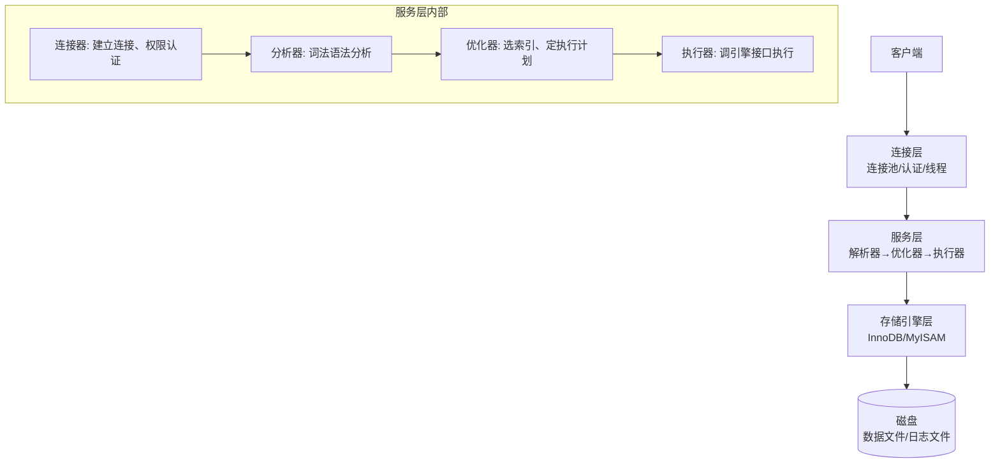
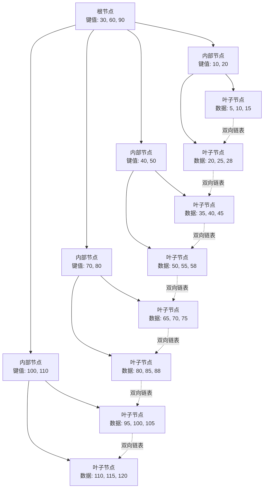
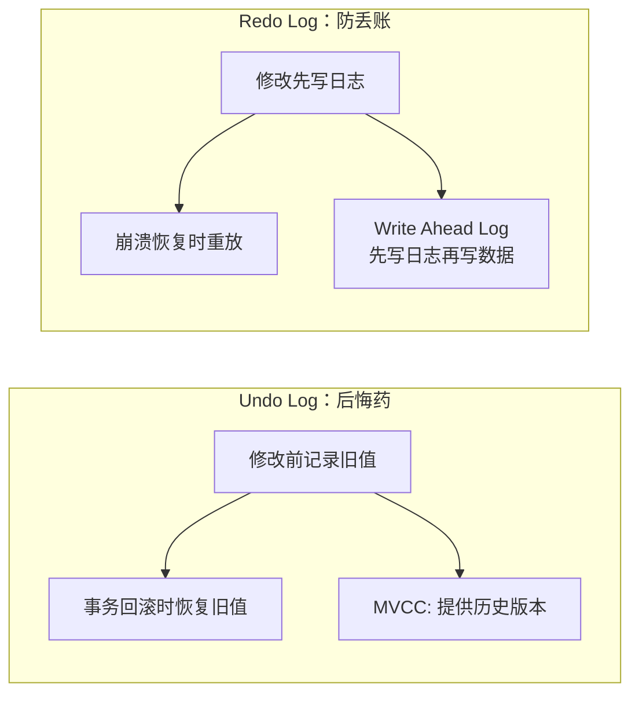
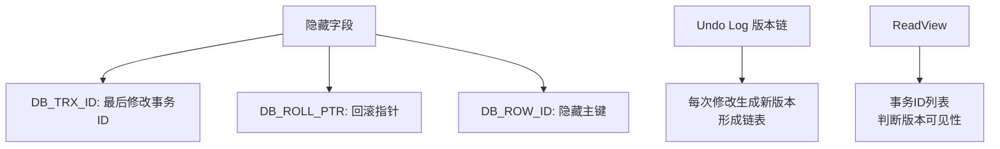
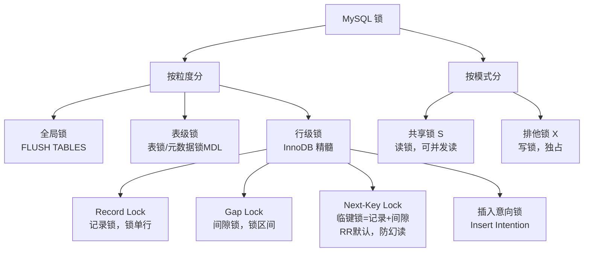
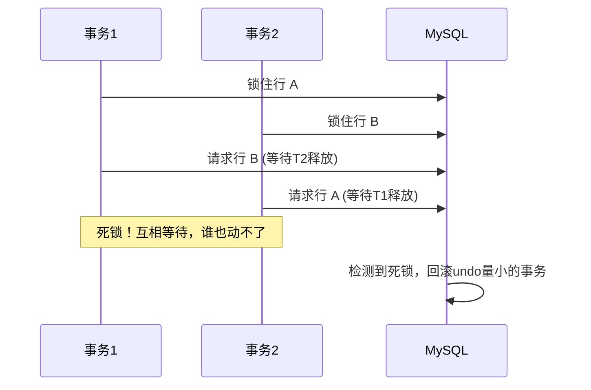
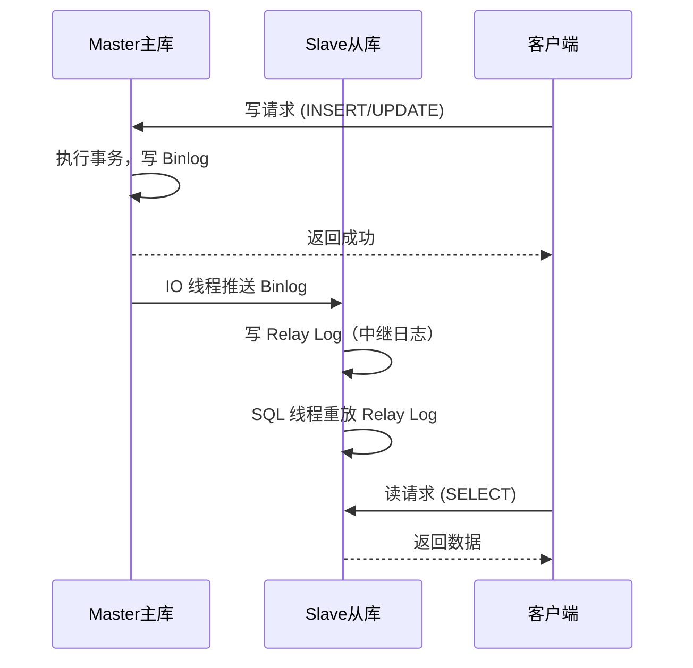

# MySQL 技术原理详解

> 🎭 **一句话开场**：如果把数据比作图书馆的书，MySQL 就是一位严谨的图书管理员——InnoDB 是他的工作方式，B+树是他的索引卡片柜，事务是他的"借还书规则"，redo log 是他的工作日志。

---

## 一、整体架构：一条 SQL 的奇幻漂流



MySQL 是**典型的 C/S 架构**，分三层：
- **连接层**：处理客户端连接、认证、线程管理（连接池）。
- **服务层**：SQL 的"大脑"，负责解析、优化、执行。
- **引擎层**：真正干活的"手脚"，负责数据存取。

> 🎯 **面试点**：MySQL 是**插件式存储引擎架构**，服务层与引擎层解耦，所以你可以换 InnoDB 或 MyISAM。

---

## 二、InnoDB 存储引擎：数据的物理组织方式

### 2.1 磁盘结构：从大到小看

```
表空间 (Tablespace)
  └── 段 (Segment)：数据段、索引段、回滚段
        └── 区 (Extent)：1MB，连续 64 个页
              └── 页 (Page)：16KB，I/O 最小单位
                    └── 行 (Row)：实际数据
```

**核心思想**：磁盘 I/O 是数据库最大的性能杀手，InnoDB 以**页（Page）**为单位管理数据，一次读取 16KB 到内存（Buffer Pool），减少磁盘交互。

### 2.2 Buffer Pool：内存里的数据缓存

InnoDB 用一块大内存（Buffer Pool）缓存数据页和索引页，读数据先查内存，写数据先改内存再刷盘（**Write Ahead Log 预写日志**）。

> 💡 **为什么 MySQL 吃内存？** 因为 Buffer Pool 通常配置为物理内存的 50%~70%，专门用来缓存热数据。

---

## 三、索引：B+树的魔法

### 3.1 为什么索引这么快？从"查字典"说起

没有索引：查"苹果"这个词，得从字典第一页翻到最后一页（**全表扫描**）。
有索引：先查"拼音索引"找到 A，再找到 p，再找到 g...（**索引查找**）。

MySQL 用的是 **B+树**（B-Tree 的变种），专为磁盘设计：



**B+树三大特点（vs B-Tree）：**
1. **数据全在叶子节点**：非叶子节点只存键值，一个节点能存更多索引项，树更矮（通常 3 层就能存千万级数据）。
2. **叶子节点双向链表**：范围查询（`WHERE id BETWEEN 10 AND 100`）只需定位起点，然后顺着链表扫，无需回溯。
3. **查询稳定**：任何查询都要从根走到叶子，时间复杂度稳定 O(logN)。

### 3.2 索引类型：聚簇 vs 非聚簇


| 特性 | 聚簇索引（Clustered Index） | 非聚簇索引（Secondary Index） |
|------|---------------------------|------------------------------|
| 叶子节点存什么 | **完整数据行** | **主键值** |
| 一个表能有几个 | **只能有 1 个**（通常是主键） | 可以有多个 |
| 查询速度 | 快（直接拿数据） | 慢（可能要**回表**） |
| 插入顺序影响 | 大（主键乱序导致**页分裂**） | 小 |

> 🎯 **面试高频**：为什么建议主键用自增 ID？因为自增 ID 插入时**顺序追加**，不会导致页分裂和碎片；UUID 是随机的，插入位置不确定，性能差。

**覆盖索引（Covering Index）**：如果查询的字段都在二级索引里，不用回表，直接从索引返回，这叫"覆盖索引"，性能极佳。

### 3.3 索引失效：这些情况会"翻车了"

```sql
-- ❌ 1. 最左前缀法则被破坏（联合索引 abc，但查 c）
SELECT * FROM user WHERE c = 3;  -- 走不了 abc 索引

-- ❌ 2. 索引列上做计算或函数
SELECT * FROM user WHERE YEAR(create_time) = 2024;  -- 索引失效

-- ❌ 3. 隐式类型转换
SELECT * FROM user WHERE phone = 13800138000;  -- phone 是 varchar，数字转字符串

-- ❌ 4. 范围查询右边的列
SELECT * FROM user WHERE a > 1 AND b = 2;  -- a 用了索引，b 用不上

-- ❌ 5. LIKE 以 % 开头
SELECT * FROM user WHERE name LIKE '%张三';  -- 无法定位前缀

-- ✅ 6. LIKE '张三%' 可以走索引
```

**记忆口诀**：**"全值匹配我最爱，最左前缀要遵守；索引列上少计算，范围之后全失效；LIKE 百分写最右，覆盖索引不回表。"**

---

## 四、事务：ACID 的守护神

### 4.1 ACID 四特性

| 特性 | 说明 | 实现机制 |
|------|------|---------|
| **原子性**（Atomicity） | 要么全做，要么全不做 | **Undo Log**（回滚日志） |
| **一致性**（Consistency） | 事务前后数据完整性不被破坏 | 由其他三个特性保证 |
| **隔离性**（Isolation） | 并发事务互不干扰 | **锁 + MVCC** |
| **持久性**（Durability） | 提交后数据不丢失 | **Redo Log**（重做日志） |

### 4.2 Redo Log 与 Undo Log：两本账



- **Undo Log**：记录**修改前的旧值**，用于回滚和 MVCC 多版本。
- **Redo Log**：记录**修改后的新值**，物理日志，用于崩溃恢复。顺序写，性能高。

> 🎯 **WAL（Write Ahead Log）**：先写日志，再写数据页。即使宕机，也能从 Redo Log 恢复。

### 4.3 事务隔离级别：从脏读到串行化

| 隔离级别 | 脏读 | 不可重复读 | 幻读 | 实现 |
|---------|------|-----------|------|------|
| **读未提交**（RU） | ❌ | ❌ | ❌ | 不加锁 |
| **读已提交**（RC） | ✅ | ❌ | ❌ | 每次读生成 ReadView |
| **可重复读**（RR，默认） | ✅ | ✅ | ⚠️（部分解决） | 事务开始生成 ReadView |
| **串行化**（Serializable） | ✅ | ✅ | ✅ | 加锁 |

**并发问题解释**：
- **脏读**：读到别人未提交的数据。
- **不可重复读**：同一事务内两次读同一数据结果不同（被 update）。
- **幻读**：同一事务内两次查询结果集行数不同（被 insert/delete）。

> 🎯 **MySQL 的 RR 通过 MVCC + Next-Key Lock 解决了大部分幻读**，但严格来说没有完全解决（快照读无幻读，当前读可能遇到）。

---

## 五、MVCC：多版本并发控制的魔法

**MVCC（Multi-Version Concurrency Control）** 是 InnoDB 实现高并发的核心，思想是：**读不加锁，通过数据多版本实现读写并发**。

### 5.1 核心三要素



**工作流程：**
1. 每行数据有隐藏字段 `DB_TRX_ID`（最近修改事务 ID）和 `DB_ROLL_PTR`（回滚指针，指向 Undo Log 中的旧版本）。
2. 事务读数据时生成 **ReadView**（快照），记录当前活跃事务 ID 列表。
3. 根据 ReadView 判断哪个版本对当前事务可见：从最新版本开始找，找到第一个"由已提交事务修改"的版本。

**RC 和 RR 的区别**：
- **RC**：**每次读**都生成新的 ReadView → 能看到其他事务已提交的修改（不可重复读）。
- **RR**：**事务开始时**生成一次 ReadView，之后一直用 → 整个事务期间读到的数据一致（可重复读）。

---

## 六、锁机制：并发的守门员

### 6.1 锁的分类



### 6.2 行锁详解：锁的是索引，不是记录

**关键**：InnoDB 的行锁**锁的是索引项**，不是物理记录。如果没走索引，会**锁全表**（全表扫描锁住所有记录）！

```sql
-- user 表，id 是主键，name 无索引
UPDATE user SET age = 18 WHERE name = '张三';  -- ❌ name 无索引，锁全表！
UPDATE user SET age = 18 WHERE id = 1;         -- ✅ id 有索引，只锁 id=1 这一行
```

### 6.3 Next-Key Lock：解决幻读的武器

**Next-Key Lock = Record Lock + Gap Lock**，锁住"记录本身 + 记录前面的间隙"，防止其他事务在间隙中插入数据（幻读）。

**例子**：表中有 id = 10, 20, 30 三条记录。
```sql
-- RR 级别，事务 A
SELECT * FROM user WHERE id > 15 FOR UPDATE;  -- 锁住 (15, +∞) 范围
-- 事务 B 插入 id = 18，会被阻塞，防止幻读
```

### 6.4 死锁：不可避免的并发副产品

**死锁条件**：两个事务互相等待对方释放锁，形成循环等待。



**避免死锁**：
1. 固定访问顺序（所有事务按相同顺序访问资源）；
2. 减少事务粒度，快进快出；
3. 使用低隔离级别（RC 间隙锁少）；
4. 加索引，避免全表扫描锁全表。

---

## 七、日志系统：三本账保平安

| 日志 | 作用 | 特点 |
|------|------|------|
| **Redo Log** | 崩溃恢复，保证持久性 | InnoDB 特有，物理日志，顺序写，循环使用 |
| **Undo Log** | 事务回滚，MVCC | InnoDB 特有，逻辑日志，记录旧值 |
| **Binlog** | 主从复制，数据恢复 | Server 层，逻辑日志，追加写 |

**两阶段提交（2PC）**：保证 Redo Log 和 Binlog 一致性。
1. **Prepare 阶段**：写 Redo Log，标记为 prepare。
2. **Commit 阶段**：写 Binlog，然后提交 Redo Log 为 commit。

> 🎯 **面试题**：为什么需要两阶段提交？防止 Redo Log 写成功但 Binlog 写失败（或反之），导致主从不一致或数据丢失。

---

## 八、主从复制：读写分离的基础



**复制原理三步走**：
1. Master 将变更写入 **Binlog**；
2. Slave 的 IO 线程拉取 Binlog 写入本地 **Relay Log**；
3. Slave 的 SQL 线程重放 Relay Log。

**复制模式**：
- **异步复制**（默认）：Master 写完就返回，不管 Slave 收到没 → 可能丢数据。
- **半同步复制**：至少一个 Slave 收到并写 Relay Log 后才返回 → 性能略降，可靠性提升。
- **全同步复制**：所有 Slave 确认后才返回 → 性能差，很少用。

---

## 九、一页纸总结（面试背诵版）

```
架构：连接层 → 服务层(解析/优化/执行) → 引擎层(InnoDB)
索引：B+树，数据在叶子，叶子双向链表；聚簇索引存数据，非聚簇存主键(回表)
事务：ACID，Undo保证原子性，Redo保证持久性，MVCC+锁保证隔离性
MVCC：隐藏字段+Undo版本链+ReadView，RR级别快照读解决幻读
锁：行锁锁索引，Next-Key Lock(记录+间隙)防幻读，无索引锁全表
日志：Redo(崩溃恢复)、Undo(回滚/MVCC)、Binlog(主从复制)，两阶段提交
主从：Binlog → Relay Log → 重放，异步/半同步复制
```

> 🎬 **收个尾**：MySQL 的设计哲学是**"平衡的艺术"**——用 B+树平衡读写，用 Buffer Pool 平衡内存与磁盘，用 MVCC 平衡并发与一致，用 Redo/Undo 平衡性能与可靠。理解了这些权衡，才算真正懂了 MySQL。
