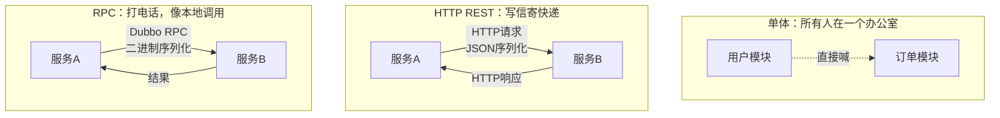
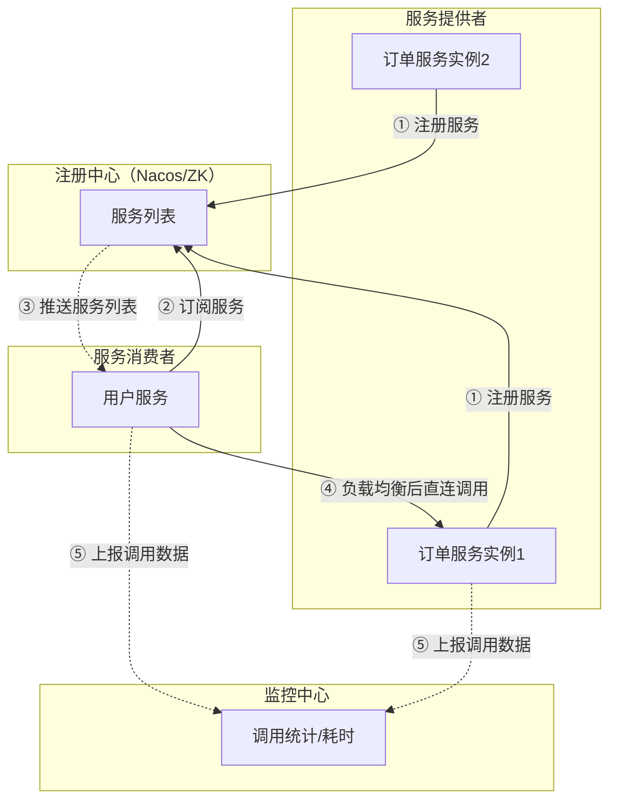
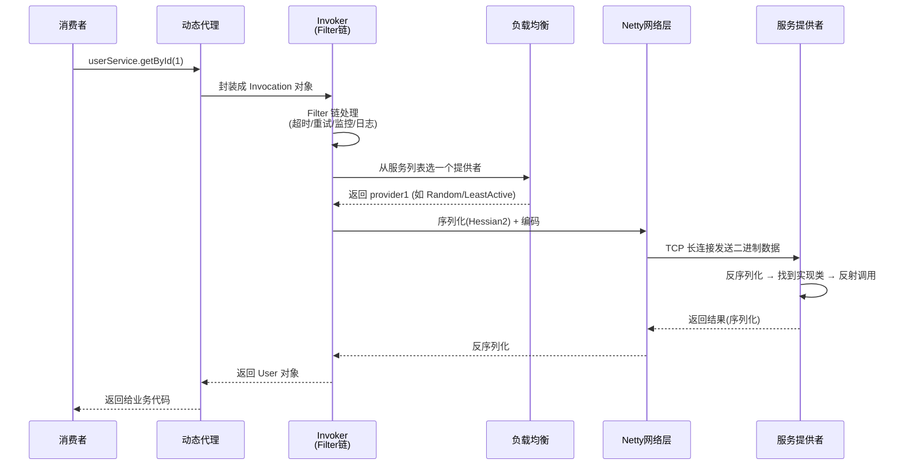
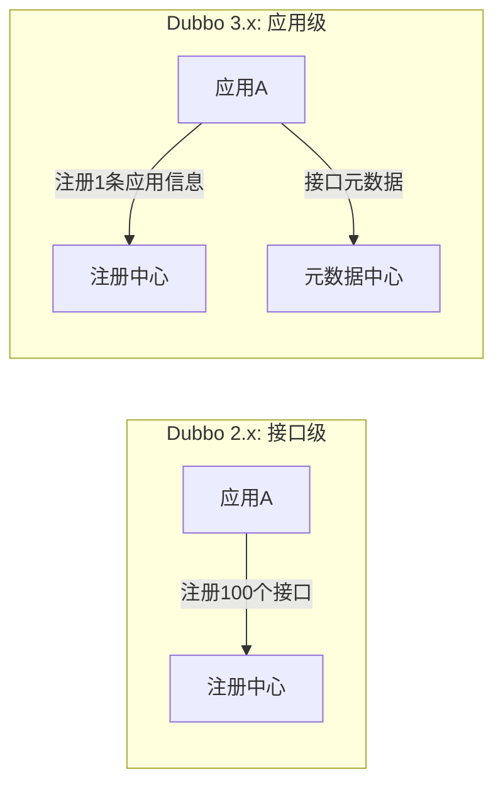

# Dubbo 技术原理详解

> 🎭 **一句话开场**：Dubbo 就像外卖平台的"智能调度中心"——你（消费者）不用知道骑手（服务提供者）在哪、怎么联系，只要说"我要一份黄焖鸡"（调用接口），它自动找到空闲骑手、规划最优路线（负载均衡）、跟踪配送状态（监控），骑手请假了立刻换别人（容错）。

---

## 一、为什么需要 RPC？从"打电话"到"写信"的进化

### 1.1 单体 vs 微服务 vs RPC



**RPC（Remote Procedure Call）** 的核心思想：**让远程调用像本地方法调用一样简单**。

```java
// 看起来像本地调用，实际是网络通信
UserService userService = RpcContext.getService();
User user = userService.getById(1L);  // 实际调用了远程服务器
```

### 1.2 Dubbo vs HTTP RESTful

| 维度 | HTTP RESTful | Dubbo RPC |
|------|-------------|-----------|
| 序列化 | JSON（文本，大） | Hessian2/Protobuf（二进制，小） |
| 性能 | 较低（HTTP 协议开销大） | **高（TCP 长连接 + 二进制）** |
| 服务治理 | 无（需借助网关） | **内置（注册发现、负载均衡、容错）** |
| 跨语言 | ✅ 天然支持 | ❌ 主要 Java（3.x 支持多语言） |
| 使用场景 | 对外 API、前端 | **内部微服务间调用** |

---

## 二、整体架构：五大角色的协同作战



**五大角色：**

| 角色 | 职责 | 类比 |
|------|------|------|
| **Provider** | 暴露服务，注册到注册中心 | 骑手入驻平台 |
| **Consumer** | 从注册中心订阅服务，直连调用 | 用户下单 |
| **Registry** | 服务注册与发现（Nacos/ZK） | 平台调度中心 |
| **Monitor** | 统计调用次数、耗时 | 平台数据分析 |
| **Container** | 服务运行容器（Spring） | 骑手的工作环境 |

> ⚠️ **关键点**：Dubbo 采用**客户端负载均衡 + 直连**，注册中心不在数据链路上。注册中心挂了，已拿到列表的消费者**还能继续调用**（本地缓存）。

---

## 三、调用流程：一次 RPC 调用的完整旅程



**核心环节详解：**

### 3.1 动态代理：无感知的远程调用

```java
// 你以为调用的是接口
UserService userService = reference.get();

// 实际生成的是代理类
public class UserServiceProxy implements UserService {
    public User getById(Long id) {
        // 1. 封装成 Invocation 对象
        Invocation inv = new Invocation("getById", new Class[]{Long.class}, new Object[]{id});
        // 2. 走 Invoker 链（Filter → LB → Netty）
        Result result = invoker.invoke(inv);
        // 3. 返回结果
        return (User) result.getValue();
    }
}
```

**JDK 动态代理 vs Javassist**：
- JDK 代理：基于接口，反射调用，性能略低。
- **Javassist**（Dubbo 默认）：直接生成字节码，性能高。

### 3.2 Invoker 与 Filter 链：责任链模式


**Filter 链**：每个 Filter 只关心自己的职责，像流水线一样传递。常见的 Filter：
- **MonitorFilter**：统计调用次数、耗时。
- **TimeoutFilter**：超时控制。
- **RetryFilter**：失败重试。
- **AccessLogFilter**：访问日志。

### 3.3 负载均衡策略：如何选一个服务提供者？

| 策略 | 原理 | 场景 |
|------|------|------|
| **Random**（默认） | 按权重随机 | 通用，权重可调 |
| **RoundRobin** | 轮询，按权重分配 | 机器性能均匀 |
| **LeastActive** | 选当前活跃调用数最少的 | **慢服务自动少分配，推荐** |
| **ConsistentHash** | 一致性哈希 | 需要会话保持（同一用户总是路由到同一台） |

**一致性哈希示例**：
```java
// 同一用户ID的请求总是路由到同一台机器（缓存友好）
@Reference(loadbalance = "consistenthash")
private UserService userService;
```

### 3.4 序列化：数据的"打包"与"拆包"

| 协议 | 特点 | 适用 |
|------|------|------|
| **Hessian2**（默认） | 跨语言，性能较好，序列化后体积小 | 通用场景 |
| **Protobuf** | Google 出品，性能最强，体积最小 | 极致性能，需预编译 IDL |
| **Kryo** | Java 专用，性能极高 | 纯 Java 内部调用 |
| **JSON** | 可读性好，但体积大、性能低 | 调试场景 |

> 🎯 **面试点**：序列化性能排序：Protobuf > Kryo > Hessian2 > JSON。Dubbo 3.0 默认支持 Triple 协议（基于 gRPC + Protobuf），性能进一步提升。

---

## 四、核心机制：容错、降级、限流

### 4.1 容错策略：调用失败怎么办？

| 策略 | 行为 | 适用场景 |
|------|------|---------|
| **Failover**（默认） | 失败后自动切换到其他提供者重试（默认重试 2 次） | 读操作，幂等接口 |
| **Failfast** | 快速失败，只调一次，失败立即报错 | 写操作，非幂等接口 |
| **Failsafe** | 失败直接忽略，记日志 | 审计日志等不重要操作 |
| **Failback** | 失败后后台定时重发 | 消息通知 |
| **Forking** | 同时调用多个提供者，一个成功即返回 | 实时性要求极高的读 |
| **Broadcast** | 广播调用所有提供者，一个失败即失败 | 缓存刷新 |

**配置示例**：
```java
// 读接口：失败自动切换，重试2次
@Reference(cluster = "failover", retries = 2)
private UserQueryService userQueryService;

// 写接口：快速失败，不重试
@Reference(cluster = "failfast", retries = 0)
private OrderService orderService;
```

> ⚠️ **注意**：重试要配合**幂等性**！非幂等接口（如扣款）不能重试，否则可能重复扣款。

### 4.2 服务降级：丢卒保车

**场景**：大促期间，订单服务压力大，积分服务可以暂时关闭，把资源让给核心链路。

```java
// 方式1：本地 Mock（降级返回兜底数据）
@Reference(mock = "com.example.UserServiceMock")
private UserService userService;

// 方式2：配置中心动态降级
// dubbo:// 配置中心推送：userService 降级为 return null
```

### 4.3 服务限流：保护服务不被打垮

Dubbo 本身限流能力弱，通常配合 **Sentinel** 使用：

```java
// Dubbo + Sentinel 限流
@Reference
@SentinelResource(value = "getUserById", fallback = "getUserByIdFallback")
private UserService userService;
```

---

## 五、Dubbo 3.0：面向未来的升级

### 5.1 应用级服务发现

**Dubbo 2.x 的痛点**：接口级服务发现，服务列表太大（一个应用 100 个接口，注册中心存 100 条记录）。

**Dubbo 3.0**：应用级服务发现，一个应用只注册一次，接口信息放元数据中心。



**收益**：注册中心数据量减少 90%，推送性能大幅提升。

### 5.2 Triple 协议：拥抱 gRPC

- 基于 **HTTP/2 + Protobuf**，性能更强。
- 天然支持**流式调用**（Streaming）：大文件传输、实时数据推送。
- 跨语言友好（gRPC 生态）。

---

## 六、Dubbo vs Spring Cloud：如何选择？

| 维度 | Dubbo | Spring Cloud |
|------|-------|--------------|
| 核心定位 | **高性能 RPC 框架** | **微服务全家桶** |
| 通信协议 | TCP + 二进制序列化 | HTTP + JSON |
| 性能 | **高** | 较低 |
| 服务治理 | 需配合 Nacos/Sentinel | 开箱即用（Eureka/Hystrix） |
| 生态 | 阿里系，国内活跃 | Spring 官方，全球流行 |
| 学习曲线 | 中等 | 较平缓 |
| 适用场景 | 大规模内部调用，追求极致性能 | 中小规模，快速开发 |

> 🎯 **选型建议**：
> - 内部调用 QPS > 10 万，选 Dubbo + Nacos + Sentinel。
> - 需要快速开发、前后端分离、对外提供 API，选 Spring Cloud。
> - 实际生产常**混用**：Dubbo 做内部高性能调用，Spring Cloud Gateway 做对外网关。

---

## 七、一页纸总结（面试背诵版）

```
架构：Provider/Consumer/Registry/Monitor，注册中心推送，客户端负载均衡+直连
调用流程：动态代理 → Filter链 → 负载均衡 → 序列化(Hessian2) → Netty长连接
负载均衡：Random(默认)/RoundRobin/LeastActive(推荐)/ConsistentHash
容错：Failover(默认,重试)/Failfast(快速失败)/Failsafe(忽略)/Forking(并行)
Dubbo 3.0：应用级服务发现(减少注册中心压力) + Triple协议(gRPC+HTTP2)
选型：内部高性能调用选Dubbo，对外API选Spring Cloud
```

> 🎬 **收个尾**：Dubbo 的设计哲学是**"让远程调用像本地调用一样简单，但比本地调用更强大"**——它不仅屏蔽了网络通信的复杂性，还提供了负载均衡、容错、监控等一整套服务治理能力。理解了 Invoker、Filter、Directory、Router 这些抽象，你就掌握了 RPC 框架的精髓。
