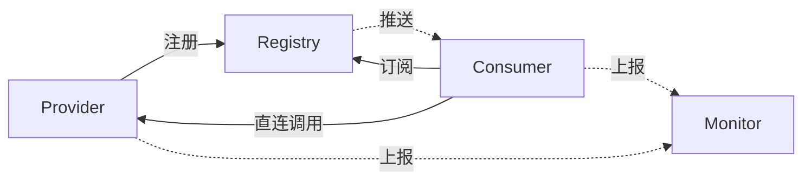
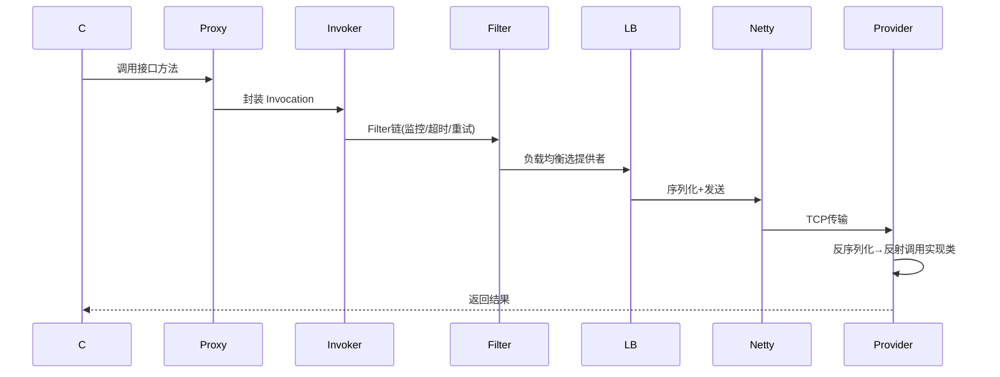
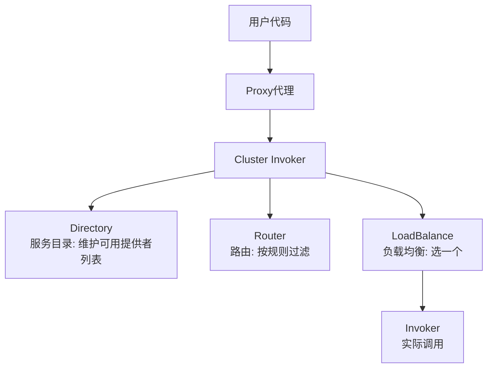

# Dubbo 面试题集锦（附参考答案）

---

## 🥉 基础题

### Q1. 什么是 RPC？Dubbo 的核心功能是什么？

**参考答案：**
RPC（Remote Procedure Call）远程过程调用，目标是**让远程调用像本地方法调用一样简单**。

Dubbo 的核心功能：
1. **远程通信**：基于 Netty 的 TCP 长连接 + 二进制序列化（Hessian2）。
2. **服务注册与发现**：配合 Nacos/Zookeeper。
3. **负载均衡**：Random/RoundRobin/LeastActive/ConsistentHash。
4. **服务治理**：容错、降级、限流、监控。

---

### Q2. Dubbo 的整体架构？各角色职责？

**参考答案：**



- **Provider**：暴露服务，注册到注册中心。
- **Consumer**：订阅服务列表，客户端负载均衡后直连调用。
- **Registry**：服务注册与发现（Nacos/ZK）。
- **Monitor**：统计调用次数、耗时。

> ⚠️ 关键点：注册中心不在数据链路上，挂了不影响已建立连接的调用（本地缓存）。

---

### Q3. Dubbo 支持哪些负载均衡策略？

**参考答案：**

| 策略 | 原理 | 场景 |
|------|------|------|
| **Random**（默认） | 按权重随机 | 通用 |
| RoundRobin | 轮询，按权重 | 机器性能均匀 |
| **LeastActive** | 选活跃调用数最少的 | **慢服务自动少分配，推荐** |
| ConsistentHash | 一致性哈希 | 会话保持（同一用户路由到同一台） |

配置：`@Reference(loadbalance = "leastactive")`

---

### Q4. Dubbo 的容错策略有哪些？默认是哪个？

**参考答案：**

| 策略 | 行为 | 适用 |
|------|------|------|
| **Failover**（默认） | 失败自动切换重试（默认 2 次） | 读操作，幂等接口 |
| Failfast | 快速失败，不重试 | 写操作，非幂等接口 |
| Failsafe | 失败忽略 | 不重要操作（日志） |
| Failback | 失败后台重发 | 消息通知 |
| Forking | 并行调用多个，一个成功即返回 | 极高实时性读 |
| Broadcast | 广播所有，一个失败即失败 | 缓存刷新 |

> ⚠️ 重试必须配合幂等性，非幂等接口（扣款）用 Failfast。

---

## 🥈 进阶题

### Q5. Dubbo 的调用流程？（能画出来最好）

**参考答案：**



**关键环节**：
1. **动态代理**：JDK 或 Javassist 生成代理类，屏蔽网络细节。
2. **Filter 链**：责任链模式，每个 Filter 负责一个职责（监控/日志/超时）。
3. **负载均衡**：从 Directory 维护的提供者列表中选一个。
4. **序列化**：Hessian2 二进制序列化。
5. **网络传输**：Netty 单工长连接，异步 IO。

---

### Q6. Dubbo 的序列化协议有哪些？怎么选？

**参考答案：**

| 协议 | 性能 | 体积 | 跨语言 | 适用 |
|------|------|------|--------|------|
| **Hessian2**（默认） | 较好 | 较小 | ✅ | 通用 |
| **Protobuf** | **最强** | **最小** | ✅ | 极致性能，需 IDL |
| Kryo | 极强 | 小 | ❌ Java专用 | 纯 Java 内部 |
| JSON | 低 | 大 | ✅ | 调试 |

Dubbo 3.0 的 **Triple 协议**基于 gRPC + Protobuf，性能和跨语言能力大幅提升。

---

### Q7. Dubbo 服务暴露和引用的过程？

**参考答案：**

**服务暴露（Provider）**：
1. 启动时解析 `@Service` 注解或 XML 配置。
2. 将接口实现类封装成 `Invoker`。
3. 暴露成本地服务（Injvm）和远程服务（Netty Server 监听端口）。
4. 向注册中心注册接口信息（接口名、IP、端口、元数据）。

**服务引用（Consumer）**：
1. 启动时解析 `@Reference` 注解。
2. 从注册中心订阅服务提供者列表。
3. 根据接口生成动态代理对象（JDK/Javassist）。
4. 调用时走 Invoker 链 → 负载均衡 → Netty 发送。

---

### Q8. Dubbo 的 SPI 机制？和 Java SPI 的区别？

**参考答案：**
**SPI（Service Provider Interface）**：服务提供接口，用于**扩展点加载**。

**Java SPI 的问题**：
1. 一次性加载所有实现类，浪费资源。
2. 不能按需加载指定实现。
3. 不支持 IOC 和 AOP。

**Dubbo SPI 的改进**：
1. **按需加载**：`ExtensionLoader.getExtension("random")` 只加载指定实现。
2. **配置文件格式**：`random=com.alibaba.dubbo.rpc.cluster.loadbalance.RandomLoadBalance`（key=value）。
3. **自适应扩展**：`@Adaptive` 注解，运行时根据 URL 参数动态选择实现。
4. **自动包装（AOP）**：支持 Wrapper 类，实现类似 Spring AOP 的功能。
5. **自动注入（IOC）**：`@Inject` 注解，自动注入依赖的扩展点。

**使用场景**：Dubbo 的协议、序列化、负载均衡等都是 SPI 扩展点，可自定义实现。

---

### Q9. Dubbo 怎么做服务降级和限流？

**参考答案：**

**服务降级**：
1. **本地 Mock**：`@Reference(mock = "UserServiceMock")`，调用失败时返回 Mock 类的兜底数据。
2. **配置中心动态降级**：通过 Nacos/ZK 推送降级规则，运行时关闭某个服务。

**服务限流**：
Dubbo 本身限流能力弱，通常配合 **Sentinel**：
```java
@SentinelResource(value = "getUser", 
                  fallback = "getUserFallback",  // 降级方法
                  blockHandler = "getUserBlock")  // 限流方法
public User getUser(Long id) { ... }
```

---

## 🥇 架构题

### Q10. Dubbo 3.0 相比 2.x 有哪些重大改进？

**参考答案：**

1. **应用级服务发现**：
   - 2.x：接口级注册，一个应用 100 个接口 → 注册中心存 100 条记录，推送量大。
   - 3.x：应用级注册，一个应用只注册 1 条，接口元数据放元数据中心 → **注册中心数据量减少 90%**。

2. **Triple 协议**：
   - 基于 **HTTP/2 + Protobuf**，性能更强。
   - 支持**流式调用**（Streaming），大文件传输、实时推送。
   - 天然跨语言（gRPC 生态）。

3. **云原生支持**：
   - 更好的 Kubernetes 集成。
   - Proxyless Mesh（无代理服务网格）。

---

### Q11. Dubbo 和 Spring Cloud 怎么选？

**参考答案：**

| 维度 | Dubbo | Spring Cloud |
|------|-------|--------------|
| 定位 | 高性能 RPC 框架 | 微服务全家桶 |
| 通信 | TCP + 二进制 | HTTP + JSON |
| 性能 | **高** | 较低 |
| 服务治理 | 需配合 Nacos/Sentinel | 开箱即用 |
| 生态 | 阿里系，国内活跃 | Spring 官方 |
| 场景 | 大规模内部调用 | 中小规模，快速开发 |

**实际生产常混用**：Dubbo 做内部高性能调用，Spring Cloud Gateway 做对外网关。

---

### Q12. Dubbo 的服务暴露端口被占用怎么办？多协议多端口怎么配置？

**参考答案：**

**端口占用**：
```properties
# 方式1：自动递增（从20880开始，占用则+1）
dubbo.protocol.port=-1

# 方式2：指定不同端口
dubbo.protocol.name=dubbo
dubbo.protocol.port=20880
```

**多协议多端口**：
```xml
<!-- 同时暴露 Dubbo 和 Triple 协议 -->
<dubbo:protocol name="dubbo" port="20880"/>
<dubbo:protocol name="tri" port="50051"/>

<dubbo:service interface="com.UserService" protocol="dubbo,tri"/>
```

---

### Q13. Dubbo 的 Invoker、Directory、Router、Cluster 是什么关系？

**参考答案：**



- **Directory**：服务目录，维护所有可用的服务提供者 Invoker 列表（从注册中心订阅）。
- **Router**：路由器，按规则过滤（如标签路由、条件路由）。
- **LoadBalance**：负载均衡，从过滤后的列表中选一个。
- **Cluster**：集群容错，将 Directory、Router、LoadBalance 封装成一个 Invoker，对外统一。
- **Invoker**：可执行体，封装了调用逻辑（一个 Invoker 对应一个服务提供者）。

---

### Q14. Dubbo 如何做全链路压测和流量隔离？

**参考答案：**

**全链路压测**：
1. **影子库/影子表**：压测流量写入独立的影子库，不影响生产数据。
2. **压测标识**：通过 Dubbo 的 `RpcContext` 传递压测标记（如 `attachment.put("stress_test", "true")`）。
3. **路由隔离**：基于标签路由（Tag Router），压测流量路由到压测环境。

**流量隔离**：
```java
// 标签路由：灰度发布
@Reference(tag = "gray")  // 只调用 tag=gray 的提供者
private UserService userService;

// 条件路由：按参数路由
RpcContext.getContext().setAttachment("region", "beijing");
```

---

### Q15. 设计一个高可用的 Dubbo 调用链路，你会考虑哪些点？

**参考答案（综合架构题）：**

1. **注册中心高可用**：Nacos 集群部署，客户端配置多个地址。
2. **服务提供者集群**：至少 2 个实例，跨机房部署。
3. **负载均衡**：LeastActive，慢服务自动降权。
4. **容错**：
   - 读接口：Failover + 重试 2 次；
   - 写接口：Failfast，不重试。
5. **超时控制**：`timeout=3000`，避免线程堆积。
6. **限流降级**：Dubbo + Sentinel，核心接口限流，非核心接口降级。
7. **监控告警**：
   - 调用次数、耗时、成功率（Micrometer + Prometheus）；
   - 异常告警（钉钉/邮件）。
8. **优雅上下线**：
   - 上线：先注册，延迟暴露（`delay=5000`）；
   - 下线：先注销，等待流量切走，再停机。
9. **全链路追踪**：SkyWalking，TraceId 串联所有调用。
10. **压测演练**：定期全链路压测，验证容量和容错能力。
