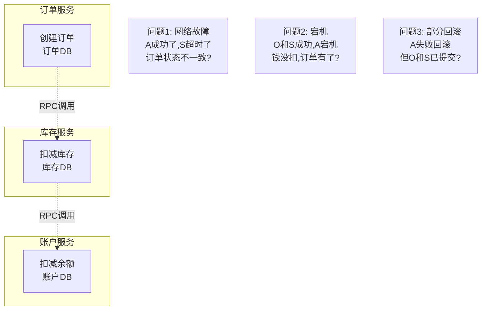
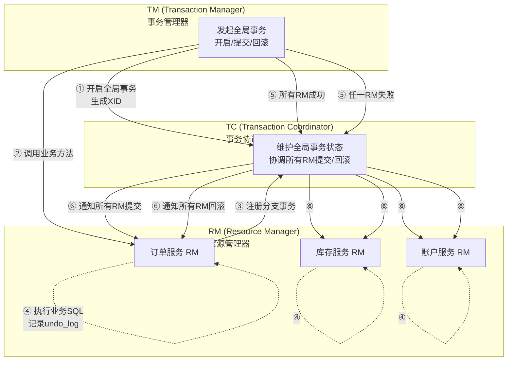
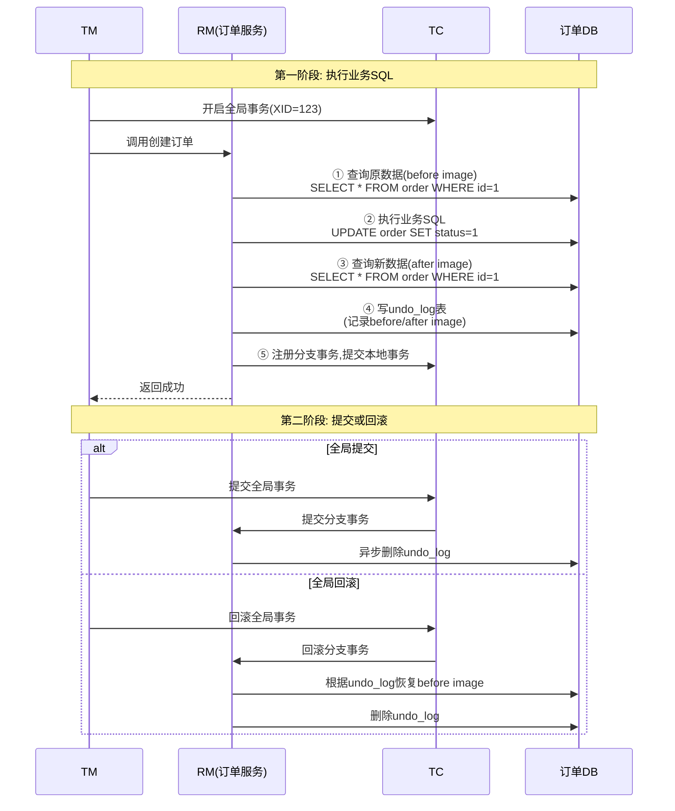
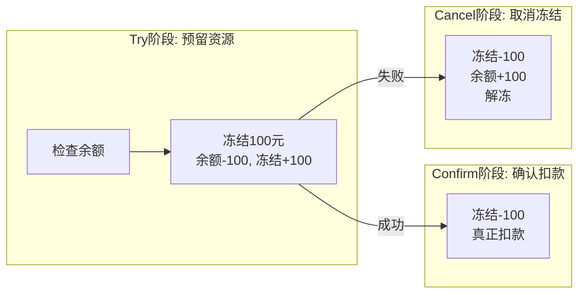
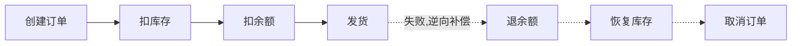
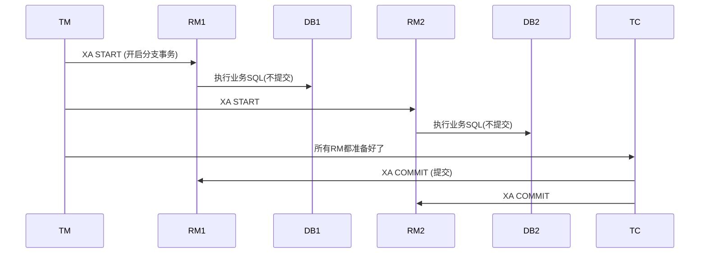
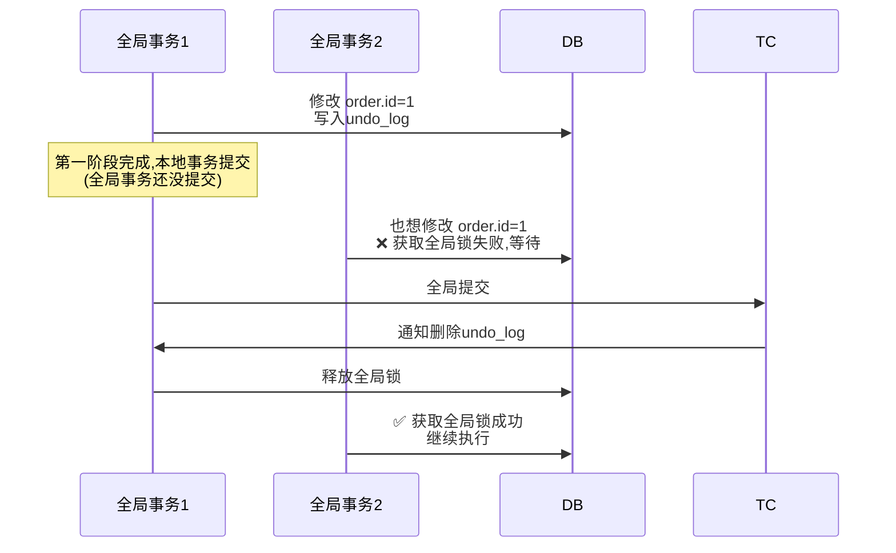
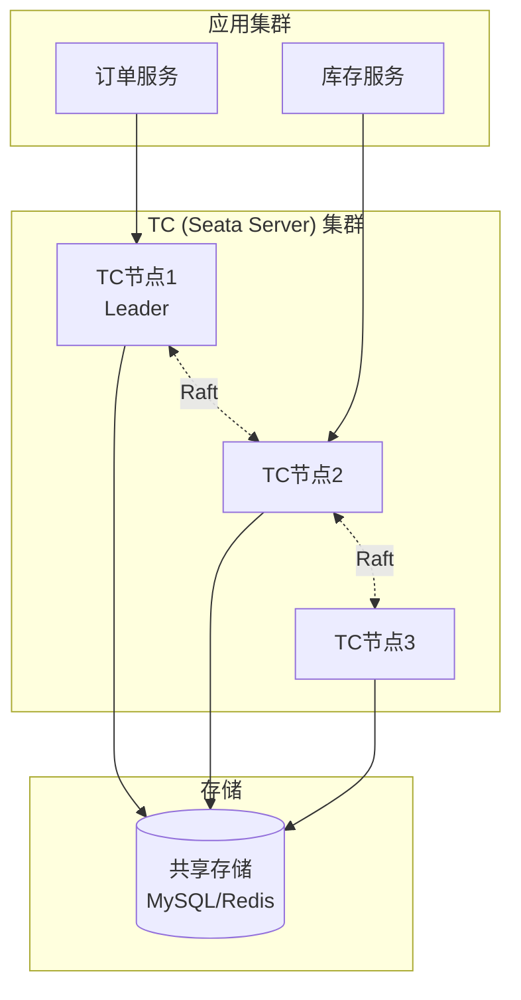

# Seata 技术原理详解

> 🎭 **一句话开场**：分布式事务就像"跨部门协作"——订单、库存、账户三个部门（服务）要同时完成一件事，要么全成功，要么全失败。Seata 就是那个"项目经理"，负责协调大家，出了问题还能"回滚"到最初状态。

---

## 一、为什么分布式事务这么难？从"转账"说起

### 1.1 单机事务 vs 分布式事务

**单机事务（简单）**：
```sql
BEGIN;
UPDATE account SET balance = balance - 100 WHERE user_id = 'A';  -- A 扣款
UPDATE account SET balance = balance + 100 WHERE user_id = 'B';  -- B 收款
COMMIT;  -- 要么都成功，要么都回滚
```

**分布式事务（复杂）**：


**核心矛盾**：多个独立的数据库，无法用一个本地事务保证"要么全成功，要么全失败"。

### 1.2 CAP 与 BASE：分布式事务的理论基础

- **CAP**：一致性（C）、可用性（A）、分区容错性（P），**三者不可兼得**。
- **BASE**：基本可用（Basically Available）、软状态（Soft state）、最终一致（Eventually consistent）——**牺牲强一致，换取可用性**。

> 🎯 **Seata 的哲学**：不强求实时一致性，而是保证**最终一致性**——"先斩后奏，出了问题再补救"。

---

## 二、Seata 的整体架构：三大角色



**三大角色：**

| 角色 | 全称 | 职责 | 类比 |
|------|------|------|------|
| **TM** | Transaction Manager | 事务管理器，发起全局事务 | 项目经理，决定开始/结束 |
| **RM** | Resource Manager | 资源管理器，管理分支事务（每个微服务一个） | 各部门负责人 |
| **TC** | Transaction Coordinator | 事务协调器（Seata Server），维护全局事务状态 | 总调度中心 |

**核心概念**：
- **全局事务**：一次完整的分布式事务，由 XID（全局事务 ID）唯一标识。
- **分支事务**：每个微服务的本地事务，是全局事务的一部分。

---

## 三、Seata 的四种模式：从"自动挡"到"手动挡"

### 3.1 AT 模式：最常用，对业务无侵入（默认）

**核心思想**：**两阶段提交 + 自动补偿**。



**AT 模式的"魔法"**：undo_log 表

```sql
-- undo_log 表结构（简化）
CREATE TABLE undo_log (
    id BIGINT,
    branch_id BIGINT,
    xid VARCHAR(100),          -- 全局事务ID
    rollback_info BLOB,        -- 回滚信息(before/after image)
    log_status INT,            -- 状态
    log_created DATETIME
);
```

**关键机制**：
1. **全局锁**：防止脏写。两个全局事务修改同一行，后到的必须等待。
2. **回滚校验**：回滚时对比当前数据和 after image，不一致则人工介入（数据被其他事务改了）。

> 🎯 **优点**：业务无侵入（不用写补偿逻辑），自动回滚。
> ⚠️ **缺点**：依赖本地 ACID 事务，性能略低于最终一致性方案。

### 3.2 TCC 模式：手动控制，性能最高

**TCC = Try（预留资源）- Confirm（确认提交）- Cancel（取消回滚）**



**代码示例**：
```java
@TwoPhaseBusinessAction(name = "accountTccAction")
public interface AccountTccAction {
    // Try阶段：冻结资金
    boolean tryFreeze(BusinessActionContext context, Long userId, BigDecimal amount);
    
    // Confirm阶段：确认扣款
    boolean confirm(BusinessActionContext context);
    
    // Cancel阶段：解冻资金
    boolean cancel(BusinessActionContext context);
}
```

> 🎯 **优点**：性能最高（Try 阶段就提交本地事务），适合高并发。
> ⚠️ **缺点**：业务侵入大（要写三个方法），需要处理**空回滚、幂等、悬挂**三大问题。

### 3.3 Saga 模式：长事务的救星

**核心思想**：**把一个长事务拆成多个本地短事务，每个短事务都有对应的补偿操作**。



> 🎯 **优点**：适合长事务（跨系统、跨天），不锁资源。
> ⚠️ **缺点**：不保证隔离性（中间状态可能被其他事务看到），补偿逻辑复杂。

### 3.4 XA 模式：强一致性，性能最低

**基于 XA 协议（两阶段提交的标准协议）**，数据库原生支持。



> 🎯 **优点**：强一致性，数据库层面保证。
> ⚠️ **缺点**：性能最低（两阶段都锁资源），依赖数据库支持 XA。

### 3.5 四种模式对比与选型

| 模式 | 一致性 | 性能 | 业务侵入 | 适用场景 |
|------|--------|------|---------|---------|
| **AT** | 最终一致 | 中 | **无** | **默认选择，90%场景** |
| TCC | 最终一致 | **高** | 大 | 高并发、对性能敏感 |
| Saga | 最终一致 | 高 | 大 | 长事务、跨系统 |
| XA | **强一致** | 低 | 无 | 金融级强一致 |

---

## 四、AT 模式的三大难题与解决方案

### 4.1 脏写问题：全局锁

**场景**：两个全局事务同时修改同一行数据。



**全局锁机制**：AT 模式在第一阶段本地事务提交前，会向 TC 申请**全局锁**（基于行记录），保证同一时刻只有一个全局事务能修改某行数据。

### 4.2 脏读问题：全局锁 + SELECT FOR UPDATE

**场景**：全局事务 A 第一阶段完成（本地已提交），但全局还没提交。此时全局事务 B 读到了 A 的中间状态。

**解决**：
1. **默认隔离级别是读未提交**：为了提高性能，AT 模式默认允许脏读（因为大概率会成功）。
2. **需要强一致**：用 `SELECT FOR UPDATE`，Seata 会检查全局锁，如果有锁则等待。

### 4.3 回滚失败：数据被其他事务修改了

**场景**：全局事务 A 要回滚，发现数据已经被全局事务 B 修改了（B 在 A 之后修改了同一行）。

**解决**：
```sql
-- 回滚时对比当前数据和 undo_log 的 after image
-- 如果不一致，说明数据被其他事务改了，回滚失败
-- 此时会记录异常，需要人工介入处理
```

---

## 五、Seata 的高可用：TC 集群



**高可用设计**：
1. **TC 无状态**：全局事务信息存储在共享存储（DB/Redis），TC 节点可水平扩展。
2. **Raft 选主**：TC 集群通过 Raft 协议选举 Leader，Leader 挂了自动切换。
3. **故障恢复**：TC 宕机重启后，从共享存储恢复未完成的全局事务，继续协调。

---

## 六、一页纸总结（面试背诵版）

```
核心矛盾：多个独立DB无法用一个本地事务保证一致性
三大角色：TM(发起) / RM(分支) / TC(协调,Seata Server)
AT模式：两阶段提交+undo_log自动补偿,默认选择,无侵入
  - 第一阶段：业务SQL+undo_log,本地提交
  - 第二阶段：成功→异步删undo_log,失败→根据undo_log回滚
TCC模式：Try-Confirm-Cancel,手动控制,性能最高,侵入大
Saga模式：长事务,补偿机制,不锁资源
XA模式：强一致,性能最低,数据库原生支持
高可用：TC集群+共享存储(DB/Redis)+Raft选主
```

> 🎬 **收个尾**：Seata 的设计哲学是**"用最终一致性换取高可用"**——它不强求所有服务同时成功或失败，而是允许中间状态存在，通过补偿机制最终达到一致。理解了 AT 模式的 undo_log 和全局锁，你就掌握了分布式事务的核心。
