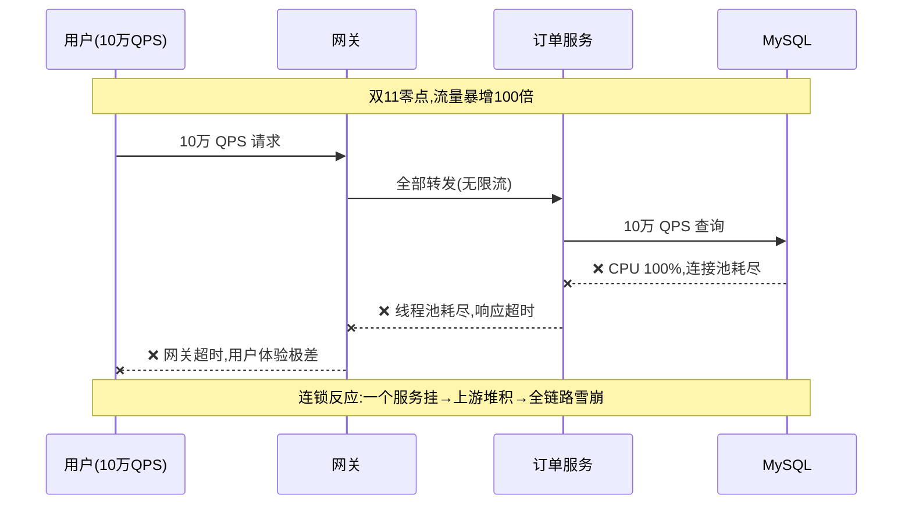
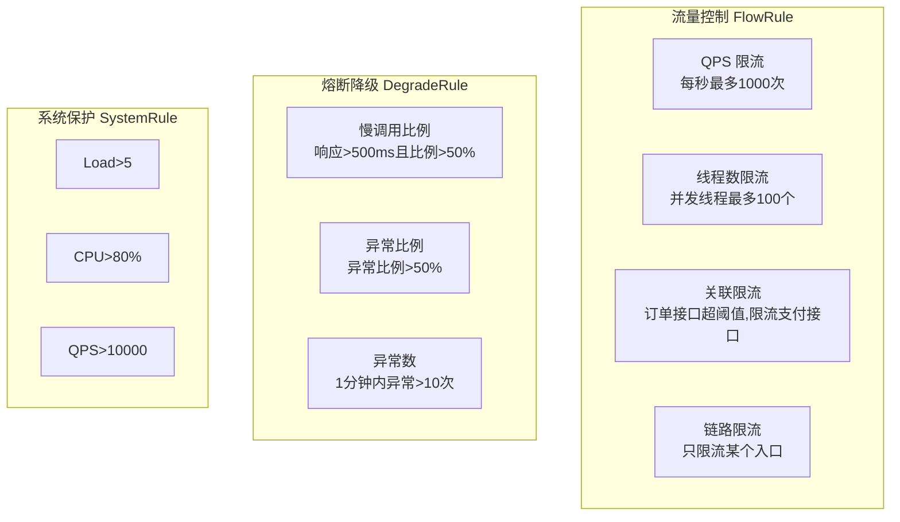
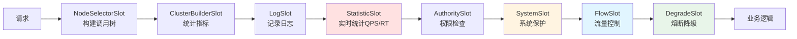
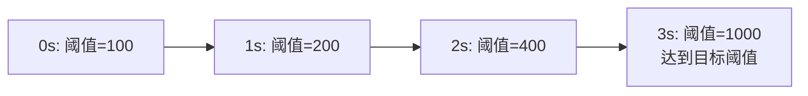
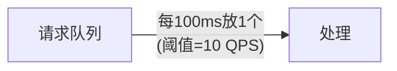
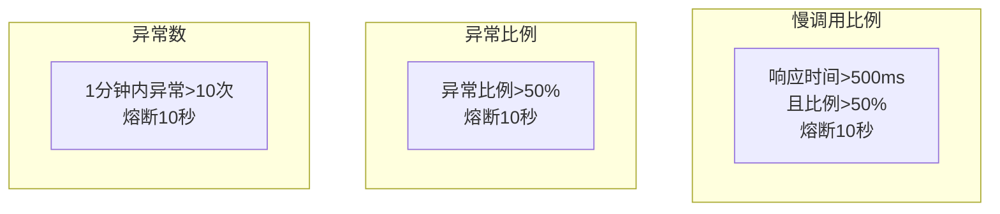
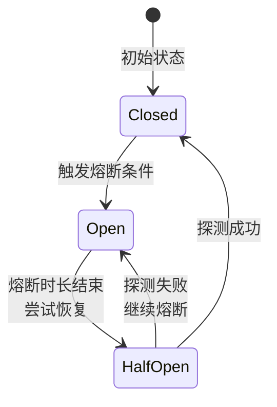

# Sentinel 技术原理详解

> 🎭 **一句话开场**：Sentinel 就像高速公路的"智能交通系统"——车流量太大就限流（入口匝道控制），前方事故就封路（熔断降级），还能实时监控路况（流量监控），保证整条高速不瘫痪。

---

## 一、为什么需要限流熔断？从"双11"说起

### 1.1 没有保护机制的灾难现场



**三大问题**：
1. **流量激增**：秒杀、热点事件导致 QPS 暴涨，服务被打垮。
2. **慢调用**：某个服务响应慢（如慢 SQL），线程堆积，拖垮整个系统。
3. **级联故障**：一个服务挂了，上游服务线程堆积，连锁反应导致雪崩。

### 1.2 Sentinel 的三板斧

| 功能 | 生活类比 | 解决什么问题 |
|------|---------|------------|
| **流量控制** | 高速入口限流 | 控制 QPS，防止系统被打垮 |
| **熔断降级** | 前方事故封路 | 服务异常时快速失败，保护调用方 |
| **系统保护** | 全城交通管制 | 系统负载过高时，整体限流 |

---

## 二、核心概念：资源、规则、Slot 链

### 2.1 资源（Resource）：保护的对象

**资源**是 Sentinel 保护的基本单位，可以是：
- 一个接口（`@GetMapping("/order")`）
- 一个方法（`OrderService.createOrder()`）
- 一段代码块（`SphU.entry("myResource")`）

```java
// 方式1：注解
@SentinelResource(value = "getUser", fallback = "getUserFallback")
public User getUser(Long id) { ... }

// 方式2：代码
try (Entry entry = SphU.entry("myResource")) {
    // 业务逻辑
} catch (BlockException e) {
    // 被限流/降级
}
```

### 2.2 规则（Rule）：保护策略



### 2.3 Slot 链：责任链模式的精髓

Sentinel 的核心是 **Slot Chain（插槽链）**，每个 Slot 负责一个职责，像流水线一样处理请求：



**关键 Slot**：
- **StatisticSlot**：统计实时指标（QPS、响应时间、异常数）。
- **FlowSlot**：根据 FlowRule 判断是否限流。
- **DegradeSlot**：根据 DegradeRule 判断是否熔断。

---

## 三、流量控制：四种策略

### 3.1 QPS 限流：最常用的策略

```java
FlowRule rule = new FlowRule();
rule.setResource("getUser");
rule.setGrade(RuleConstant.FLOW_GRADE_QPS);  // QPS 限流
rule.setCount(1000);  // 每秒最多 1000 次
rule.setControlBehavior(RuleConstant.CONTROL_BEHAVIOR_DEFAULT);  // 直接拒绝
```

**控制行为（Control Behavior）**：

| 行为 | 原理 | 适用场景 |
|------|------|---------|
| **直接拒绝**（默认） | 超过阈值直接抛异常 | 通用 |
| **Warm Up**（预热） | 缓慢增加流量，防止冷启动被打垮 | 秒杀系统启动 |
| **匀速排队** | 请求排队，匀速通过（漏桶算法） | 削峰填谷 |

**Warm Up 原理**：


**匀速排队原理**：


### 3.2 线程数限流：保护慢调用

```java
rule.setGrade(RuleConstant.FLOW_GRADE_THREAD);  // 线程数限流
rule.setCount(100);  // 最多 100 个并发线程
```

**QPS vs 线程数**：
- **QPS**：限制每秒请求数，适合快速接口。
- **线程数**：限制并发线程数，适合慢调用（防止线程堆积）。

### 3.3 关联限流：保护核心链路

**场景**：订单接口 QPS 超过 1000 时，限流支付接口（保护订单服务）。

```java
rule.setResource("payOrder");
rule.setRefResource("createOrder");  // 关联资源
rule.setCount(1000);  // createOrder 超过 1000 时，限流 payOrder
```

### 3.4 链路限流：只限流某个入口

**场景**：`getUser` 被多个入口调用（A、B、C），只限流入口 A。

```java
rule.setResource("getUser");
rule.setLimitApp("entranceA");  // 只限流入口 A
```

---

## 四、熔断降级：三种策略



**熔断器状态机**：



**状态说明**：
- **Closed（关闭）**：正常状态，所有请求通过。
- **Open（打开）**：熔断状态，所有请求直接失败。
- **Half-Open（半开）**：尝试恢复，放行少量请求探测。

---

## 五、热点参数限流：精细化控制

**场景**：秒杀商品，某个热点商品（id=1001）访问量是其他商品的 100 倍。

```java
ParamFlowRule rule = new ParamFlowRule();
rule.setResource("getProduct");
rule.setParamIdx(0);  // 第 0 个参数（productId）
rule.setCount(100);  // 默认每个商品 QPS=100
// 热点商品单独配置
rule.setParamFlowItemList(Arrays.asList(
    new ParamFlowItem("1001", 1000)  // 商品 1001 QPS=1000
));
```

---

## 六、系统保护：最后一道防线

**场景**：系统 Load 过高、CPU 100%，整体限流保护。

```java
SystemRule rule = new SystemRule();
rule.setHighestSystemLoad(5.0);  // Load > 5 时触发
rule.setHighestCpuUsage(0.8);  // CPU > 80% 时触发
rule.setQps(10000);  // 系统总 QPS > 10000 时触发
```

---

## 七、Sentinel vs Hystrix：为什么选择 Sentinel？

| 维度 | Hystrix（已停更） | Sentinel |
|------|------------------|----------|
| 隔离策略 | 线程池/信号量 | **信号量（轻量）** |
| 熔断策略 | 异常比例 | **慢调用/异常比例/异常数** |
| 流量控制 | 简单 | **丰富（QPS/线程数/关联/链路）** |
| 热点参数限流 | ❌ | ✅ |
| 系统保护 | ❌ | ✅ |
| 控制台 | 简单 | **强大（实时监控、规则管理）** |
| 生态 | Netflix | **阿里系，国内活跃** |

---

## 八、一页纸总结（面试背诵版）

```
核心概念：资源(保护对象) + 规则(保护策略) + Slot链(责任链)
流量控制：QPS/线程数/关联/链路，控制行为(直接拒绝/Warm Up/匀速排队)
熔断降级：慢调用比例/异常比例/异常数，熔断器三状态(Closed/Open/HalfOpen)
热点参数限流：精细化控制某个参数值
系统保护：Load/CPU/QPS 整体限流
核心Slot：StatisticSlot(统计) → FlowSlot(限流) → DegradeSlot(熔断)
选型：Hystrix 已停更，Sentinel 功能更强、生态更好
```

> 🎬 **收个尾**：Sentinel 的设计哲学是**"以流量为切入点，从流量控制、熔断降级、系统保护等多个维度保护服务的稳定性"**——它不仅是限流工具，更是一套完整的流量防卫体系。理解了 Slot 链和规则引擎，你就掌握了 Sentinel 的精髓。
