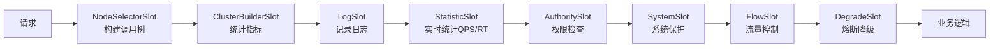

# Sentinel 面试题集锦（附参考答案）

---

## 🥉 基础题

### Q1. 什么是限流、熔断、降级？三者有什么区别？

**参考答案：**

| 概念 | 定义 | 触发条件 | 目的 |
|------|------|---------|------|
| **限流** | 限制请求的速率 | QPS/线程数超阈值 | 防止系统被打垮 |
| **熔断** | 暂时停止调用某个服务 | 慢调用/异常比例超阈值 | 保护调用方，快速失败 |
| **降级** | 返回兜底数据，而非真实数据 | 熔断触发或手动降级 | 保证核心功能可用 |

**生活类比**：
- 限流：高速入口限流，控制车流量。
- 熔断：前方事故封路，禁止通行。
- 降级：导航推荐备用路线，保证你能到达目的地。

---

### Q2. Sentinel 的核心功能有哪些？

**参考答案：**
1. **流量控制**：QPS 限流、线程数限流、关联限流、链路限流。
2. **熔断降级**：慢调用比例、异常比例、异常数。
3. **系统保护**：Load、CPU、QPS 整体限流。
4. **热点参数限流**：精细化控制某个参数值。
5. **实时监控**：Sentinel 控制台展示实时指标。

---

### Q3. Sentinel 的资源是什么？如何定义？

**参考答案：**
资源是 Sentinel 保护的基本单位，可以是接口、方法或代码块。

**定义方式**：
```java
// 方式1：注解
@SentinelResource(value = "getUser", fallback = "getUserFallback")
public User getUser(Long id) { ... }

// 方式2：代码
try (Entry entry = SphU.entry("myResource")) {
    // 业务逻辑
} catch (BlockException e) {
    // 被限流/降级
}
```

---

## 🥈 进阶题

### Q4. Sentinel 的流量控制有哪些策略？

**参考答案：**

**按指标类型**：
1. **QPS 限流**：每秒请求数超阈值则限流。
2. **线程数限流**：并发线程数超阈值则限流（适合慢调用）。

**按控制行为**：
1. **直接拒绝**（默认）：超阈值直接抛异常。
2. **Warm Up（预热）**：缓慢增加流量，防止冷启动被打垮。
3. **匀速排队**：请求排队，匀速通过（漏桶算法）。

**按调用关系**：
1. **直接限流**：对资源本身限流。
2. **关联限流**：关联资源超阈值时，限流当前资源。
3. **链路限流**：只限流某个入口的调用。

---

### Q5. Sentinel 的熔断降级策略有哪些？

**参考答案：**

| 策略 | 触发条件 | 适用场景 |
|------|---------|---------|
| **慢调用比例** | 响应时间 > 阈值且比例 > 阈值 | 慢 SQL、慢服务 |
| **异常比例** | 异常比例 > 阈值 | 服务不稳定 |
| **异常数** | 1 分钟内异常数 > 阈值 | 服务偶发异常 |

**熔断器状态机**：
- **Closed（关闭）**：正常状态，所有请求通过。
- **Open（打开）**：熔断状态，所有请求直接失败。
- **Half-Open（半开）**：熔断时长结束后，放行少量请求探测，成功则关闭，失败则继续熔断。

---

### Q6. Sentinel 的 Slot 链是什么？核心 Slot 有哪些？

**参考答案：**

Slot 链是 Sentinel 的核心，采用**责任链模式**，每个 Slot 负责一个职责。

**核心 Slot**：


- **StatisticSlot**：统计实时指标（QPS、响应时间、异常数）。
- **FlowSlot**：根据 FlowRule 判断是否限流。
- **DegradeSlot**：根据 DegradeRule 判断是否熔断。

---

### Q7. Sentinel 如何实现热点参数限流？

**参考答案：**

**场景**：秒杀商品，某个热点商品（id=1001）访问量是其他商品的 100 倍。

**配置**：
```java
ParamFlowRule rule = new ParamFlowRule();
rule.setResource("getProduct");
rule.setParamIdx(0);  // 第 0 个参数（productId）
rule.setCount(100);  // 默认每个商品 QPS=100
// 热点商品单独配置
rule.setParamFlowItemList(Arrays.asList(
    new ParamFlowItem("1001", 1000)  // 商品 1001 QPS=1000
));
```

**原理**：Sentinel 会统计每个参数值的 QPS，单独限流。

---

### Q8. Sentinel 的规则如何持久化？

**参考答案：**

**问题**：Sentinel 规则默认存储在内存，重启后丢失。

**解决方案**：持久化到配置中心（Nacos/ZK/Apollo）。

**以 Nacos 为例**：
```java
// 读取规则
ReadableDataSource<String, List<FlowRule>> flowRuleDataSource = 
    new NacosDataSource<>(remoteAddress, groupId, dataId, 
        source -> JSON.parseObject(source, new TypeReference<List<FlowRule>>() {}));
FlowRuleManager.register2Property(flowRuleDataSource.getProperty());

// 推送规则
WritableDataSource<List<FlowRule>> wds = 
    new NacosWritableDataSource<>(remoteAddress, groupId, dataId, 
        rules -> JSON.toJSONString(rules));
WritableDataSourceRegistry.registerFlowDataSource(wds);
```

---

## 🥇 架构题

### Q9. Sentinel 和 Hystrix 的区别？为什么选择 Sentinel？

**参考答案：**

| 维度 | Hystrix（已停更） | Sentinel |
|------|------------------|----------|
| 隔离策略 | 线程池/信号量 | **信号量（轻量）** |
| 熔断策略 | 异常比例 | **慢调用/异常比例/异常数** |
| 流量控制 | 简单 | **丰富（QPS/线程数/关联/链路）** |
| 热点参数限流 | ❌ | ✅ |
| 系统保护 | ❌ | ✅ |
| 控制台 | 简单 | **强大（实时监控、规则管理）** |
| 生态 | Netflix | **阿里系，国内活跃** |

**选型理由**：Hystrix 已停更，Sentinel 功能更强、性能更好、生态更活跃。

---

### Q10. Sentinel 的系统保护是什么？如何配置？

**参考答案：**

**系统保护**：当系统 Load、CPU、QPS 超阈值时，整体限流，防止系统崩溃。

**配置**：
```java
SystemRule rule = new SystemRule();
rule.setHighestSystemLoad(5.0);  // Load > 5 时触发
rule.setHighestCpuUsage(0.8);  // CPU > 80% 时触发
rule.setQps(10000);  // 系统总 QPS > 10000 时触发
SystemRuleManager.loadRules(Collections.singletonList(rule));
```

**原理**：从操作系统的 `/proc/loadavg`（Linux）读取 Load，结合 CPU、QPS 综合判断。

---

### Q11. Sentinel 如何做集群限流？

**参考答案：**

**单机限流 vs 集群限流**：
- 单机限流：每个实例独立限流，总 QPS = 单机 QPS × 实例数（不准确）。
- **集群限流**：全局限流，总 QPS 精确控制。

**实现方式**：
1. **独立模式**：部署 Token Server，所有实例向 Token Server 申请令牌。
2. **嵌入模式**：某个实例作为 Token Server，其他实例向它申请令牌。

**配置**：
```java
ClusterFlowConfig config = new ClusterFlowConfig();
config.setFlowId(123L);  // 全局唯一的规则ID
config.setThresholdType(ClusterRuleConstant.FLOW_THRESHOLD_GLOBAL);  // 集群阈值
config.setFallbackToLocalWhenFail(true);  // Token Server 不可用时降级为单机限流
```

---

### Q12. Sentinel 如何与 Spring Cloud Gateway 集成？

**参考答案：**

**场景**：网关层限流，保护后端服务。

**集成方式**：
```xml
<dependency>
    <groupId>com.alibaba.cloud</groupId>
    <artifactId>spring-cloud-alibaba-sentinel-gateway</artifactId>
</dependency>
```

**配置**：
```java
// 网关流控规则
GatewayFlowRule rule = new GatewayFlowRule("order_route")  // 路由ID
    .setCount(1000)  // QPS 阈值
    .setIntervalSec(1);  // 统计窗口
GatewayRuleManager.loadRules(Collections.singleton(rule));
```

**自定义降级**：
```java
@Configuration
public class GatewayConfig {
    @Bean
    public BlockRequestHandler blockRequestHandler() {
        return (exchange, t) -> 
            ServerResponse.status(429)
                .contentType(MediaType.APPLICATION_JSON)
                .body(BodyInserters.fromValue("{\"code\":429,\"msg\":\"请求过多\"}"));
    }
}
```

---

### Q13. Sentinel 的性能开销如何？会影响业务吗？

**参考答案：**

**性能开销**：
- Sentinel 采用**滑动窗口**统计指标，内存占用小。
- Slot 链是**内存操作**，无 IO 开销。
- 官方测试：**单机 QPS 可达 10 万+**，性能损耗 < 5%。

**优化建议**：
1. **合理设置采样**：`sentinel.statistic.max.rt=5000`，只统计 5 秒内的请求。
2. **减少资源粒度**：不要给每个方法都加 `@SentinelResource`，只保护核心接口。
3. **异步统计**：Sentinel 的统计是异步的，不阻塞业务线程。

---

### Q14. 生产环境如何使用 Sentinel？

**参考答案：**

1. **接入 Sentinel**：
   - 引入依赖：`spring-cloud-starter-alibaba-sentinel`。
   - 配置控制台：`spring.cloud.sentinel.transport.dashboard=localhost:8080`。

2. **定义资源**：
   - 核心接口加 `@SentinelResource`。
   - 配置 fallback（降级方法）和 blockHandler（限流方法）。

3. **配置规则**：
   - 控制台动态配置规则。
   - 规则持久化到 Nacos。

4. **监控告警**：
   - Sentinel 控制台实时监控 QPS、RT、异常数。
   - 接入 Prometheus + Grafana，配置告警规则。

5. **压测验证**：
   - 全链路压测，验证限流熔断是否生效。
   - 调整阈值，找到最佳平衡点。

---

### Q15. 设计一个高可用系统，如何用 Sentinel 保护？

**参考答案（综合架构题）：**

1. **网关层限流**：
   - Spring Cloud Gateway + Sentinel，限制入口 QPS。
   - 按路由、API 分组限流。

2. **应用层限流**：
   - 核心接口 QPS 限流（如订单接口 QPS=1000）。
   - 慢调用接口线程数限流（如报表接口线程数=10）。

3. **熔断降级**：
   - 慢调用比例 > 50% 熔断 10 秒。
   - 异常比例 > 50% 熔断 10 秒。
   - 配置 fallback 返回兜底数据。

4. **热点参数限流**：
   - 秒杀商品单独配置阈值。
   - 防止热点商品打垮系统。

5. **系统保护**：
   - Load > 5 或 CPU > 80% 时整体限流。
   - 防止系统崩溃。

6. **集群限流**：
   - 核心接口使用集群限流，精确控制总 QPS。

7. **监控告警**：
   - Sentinel 控制台 + Prometheus + Grafana。
   - 限流/熔断事件告警。

8. **降级预案**：
   - 非核心功能手动降级（如推荐、积分）。
   - 大促期间关闭非核心功能。
