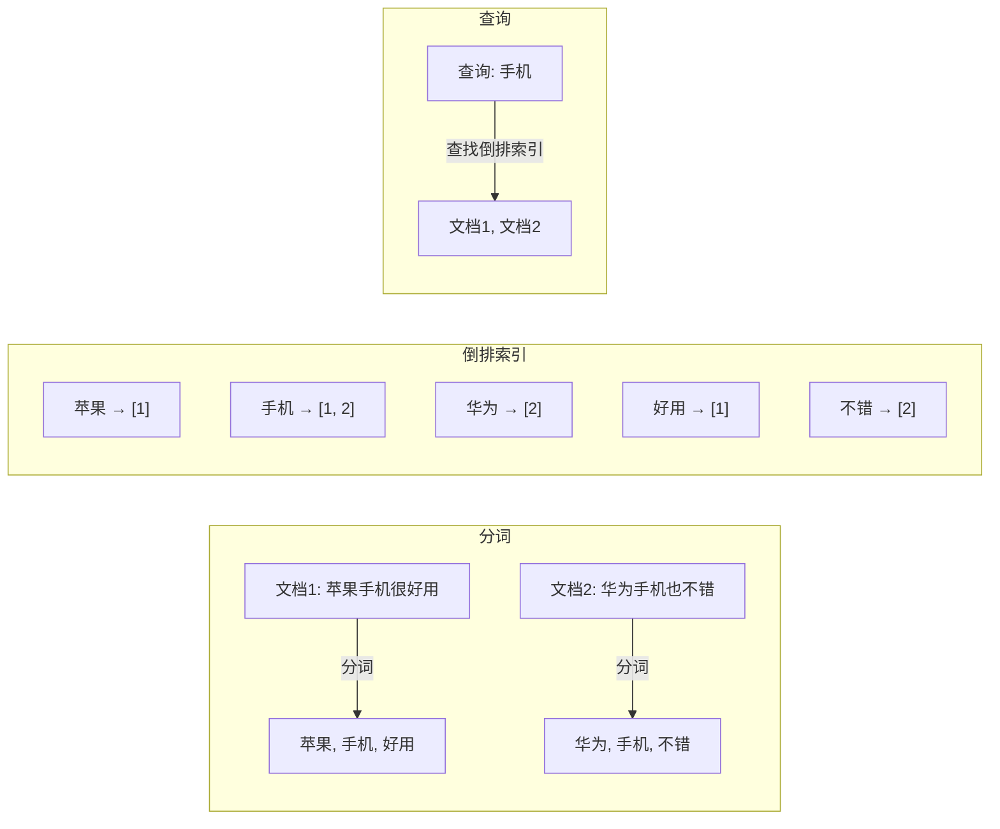
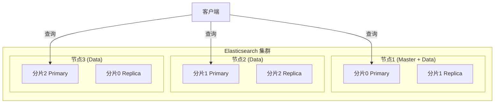
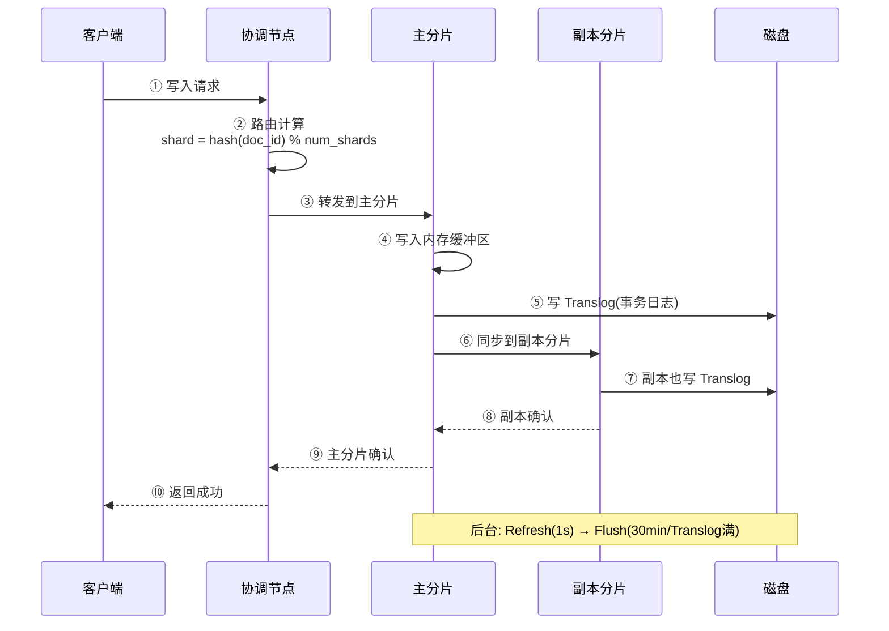
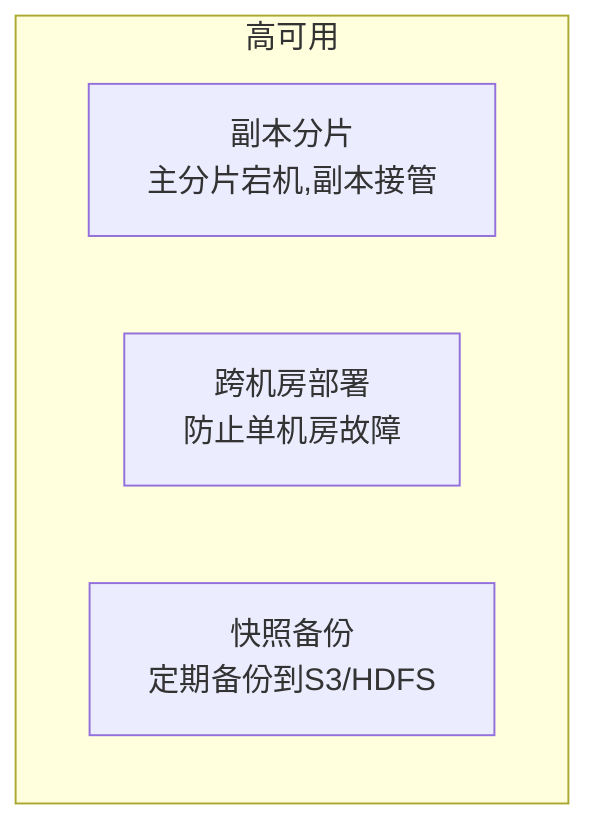

# Elasticsearch 技术原理详解

> 🎭 **一句话开场**：MySQL 是"查字典"——先查拼音索引，再翻到对应页；Elasticsearch 是"全文搜索引擎"——你输入"苹果"，它能找到所有包含"苹果"的文档，还能告诉你哪些文档最相关（相关性打分），快到毫秒级。

---

## 一、为什么需要 Elasticsearch？从"模糊搜索"说起

### 1.1 MySQL 的搜索痛点

```sql
-- 场景：搜索包含"苹果手机"的商品
SELECT * FROM product WHERE name LIKE '%苹果手机%';

-- 问题1：LIKE '%...%' 不走索引，全表扫描
-- 问题2：无法分词，搜"手机"找不到"苹果手机"
-- 问题3：无法相关性排序，不知道哪个商品最匹配
-- 问题4：性能差，百万数据查询秒级响应
```

### 1.2 Elasticsearch 的解决方案

| 痛点 | ES 解决方案 | 效果 |
|------|------------|------|
| 全表扫描 | **倒排索引** | 毫秒级查询 |
| 无法分词 | **分词器（Analyzer）** | "苹果手机"拆成"苹果"+"手机" |
| 无法排序 | **相关性打分（TF-IDF/BM25）** | 最相关的排在前面 |
| 性能差 | **分布式架构 + 倒排索引** | 亿级数据毫秒响应 |

---

## 二、核心概念：从"图书馆"理解 ES

### 2.1 核心概念对照表

| Elasticsearch | MySQL | 图书馆类比 |
|---------------|-------|-----------|
| **Index（索引）** | Database | 图书馆 |
| **Type（类型，7.x 已废弃）** | Table | 书架 |
| **Document（文档）** | Row | 一本书 |
| **Field（字段）** | Column | 书的属性（书名、作者） |
| **Mapping（映射）** | Schema | 图书分类规则 |
| **倒排索引** | B+树索引 | 索引卡片柜 |

### 2.2 倒排索引：ES 的核心魔法

**正排索引（MySQL）**：
```
文档ID → 文档内容
1 → "苹果手机很好用"
2 → "华为手机也不错"
```

**倒排索引（ES）**：


**核心思想**：
1. **分词**：把文档内容拆成词项（Term）。
2. **建立倒排索引**：词项 → 文档列表（Posting List）。
3. **查询**：直接查倒排索引，找到包含词项的文档。

> 🎯 **为什么快？** 倒排索引把"文档 → 词"的关系反转成"词 → 文档"，查询时直接定位，不用扫描所有文档。

---

## 三、架构：分布式搜索引擎的设计

### 3.1 集群架构



**核心概念**：
- **节点（Node）**：一个 ES 实例。
- **分片（Shard）**：索引的物理分片，分为主分片（Primary）和副本分片（Replica）。
- **主分片**：负责读写，数据的主副本。
- **副本分片**：负责读，数据的备份，提高可用性和查询性能。

**分片的作用**：
1. **水平扩展**：一个索引拆成多个分片，分散到多个节点。
2. **高可用**：副本分片保证主分片宕机时数据不丢失。
3. **负载均衡**：查询请求分散到多个分片，并行处理。

### 3.2 写入流程：数据如何落到磁盘？



**关键机制**：
1. **Refresh（刷新）**：默认 1 秒，把内存数据写入段（Segment），可被搜索到（近实时）。
2. **Flush（落盘）**：默认 30 分钟或 Translog 满，把段持久化到磁盘，清空 Translog。
3. **Translog**：事务日志，防止宕机丢数据（类似 MySQL 的 Redo Log）。

> 🎯 **面试点**：ES 是**近实时（NRT）**搜索，不是实时搜索——写入后默认 1 秒才能搜到。

### 3.3 查询流程：如何找到最相关的文档？

```mermaid
flowchart TB
    Q["查询: '苹果手机'"] --> P1[解析查询<br/>分词: 苹果, 手机]
    P1 --> P2[查找倒排索引<br/>苹果→[1,3,5], 手机→[1,2,3]]
    P2 --> P3[计算相关性打分<br/>TF-IDF/BM25]
    P3 --> P4[排序<br/>文档1: 0.9, 文档3: 0.8, 文档5: 0.6]
    P4 --> P5[返回 Top N]
```

**相关性打分（BM25）**：
- **TF（词频）**：词在文档中出现次数越多，分数越高。
- **IDF（逆文档频率）**：词在所有文档中出现次数越少，分数越高（如"的"很常见，分数低）。
- **字段长度归一化**：短字段中的词权重更高。

---

## 四、分词器：搜索的灵魂

### 4.1 分词器的作用

```mermaid
flowchart LR
    T["文本: '苹果手机很好用'"] --> A[分词器]
    A --> C1[Character Filter<br/>字符过滤: 去HTML标签]
    C1 --> C2[Tokenizer<br/>分词: 苹果|手机|很|好用]
    C2 --> C3[Token Filter<br/>词项过滤: 转小写|去停用词]
    C3 --> R["最终词项: 苹果, 手机, 好用"]
```

### 4.2 常用分词器

| 分词器 | 特点 | 适用 |
|--------|------|------|
| **Standard**（默认） | 按单词切分，英文友好 | 英文文档 |
| **IK** | 中文分词，支持自定义词典 | **中文文档（推荐）** |
| **Jieba** | 中文分词，词库丰富 | 中文文档 |
| **Keyword** | 不分词，整体作为一个词项 | ID、标签 |

**IK 分词器示例**：
```json
// ik_max_word：最细粒度切分
"苹果手机" → ["苹果", "手机", "果手", "果手机"]

// ik_smart：最粗粒度切分
"苹果手机" → ["苹果", "手机"]
```

---

## 五、Mapping：定义数据结构

### 5.1 字段类型

| 类型 | 说明 | 示例 |
|------|------|------|
| **text** | 全文搜索，会分词 | 商品名称、描述 |
| **keyword** | 精确匹配，不分词 | ID、标签、状态 |
| **long/integer** | 数字 | 价格、库存 |
| **date** | 日期 | 创建时间 |
| **nested** | 嵌套对象 | 商品属性（颜色、尺寸） |

**Mapping 示例**：
```json
{
  "mappings": {
    "properties": {
      "name": {
        "type": "text",
        "analyzer": "ik_max_word",  // 写入时分词
        "search_analyzer": "ik_smart"  // 搜索时分词
      },
      "price": { "type": "long" },
      "tags": { "type": "keyword" },
      "create_time": { "type": "date" }
    }
  }
}
```

> 🎯 **面试点**：`text` 会分词，适合全文搜索；`keyword` 不分词，适合精确匹配和聚合。

---

## 六、高可用与性能优化

### 6.1 高可用设计



### 6.2 性能优化

**写入优化**：
1. **批量写入（Bulk）**：一次写入多条文档，减少网络开销。
2. **调整 Refresh 间隔**：`index.refresh_interval=30s`，减少 Refresh 频率。
3. **禁用副本**：写入高峰期临时禁用副本，写完再开启。

**查询优化**：
1. **使用 Filter 代替 Query**：Filter 不计算相关性打分，且可缓存。
2. **避免深度分页**：`from+size` 深度分页性能差，用 `search_after` 或 Scroll。
3. **合理使用索引**：只查询需要的字段（`_source` 过滤）。

**分片设计**：
- 分片数 = 节点数 × (1~3)，过多分片会占用资源。
- 单个分片大小控制在 10GB~50GB。

---

## 七、一页纸总结（面试背诵版）

```
核心：倒排索引（词→文档列表） + 分词器 + 相关性打分(BM25)
架构：节点(Node) + 分片(Shard,主/副本) + 分布式集群
写入：协调节点路由 → 主分片写内存+Translog → 副本同步 → Refresh(1s近实时) → Flush(落盘)
查询：分词 → 查倒排索引 → BM25打分 → 排序 → 返回TopN
分词器：IK(中文推荐), ik_max_word(细粒度)/ik_smart(粗粒度)
Mapping：text(分词,全文搜索) vs keyword(不分词,精确匹配/聚合)
优化：Bulk批量写入, Filter代替Query, search_after代替深度分页
```

> 🎬 **收个尾**：Elasticsearch 的设计哲学是**"为搜索而生"**——倒排索引让查询快如闪电，分词器让搜索智能理解，分布式架构让数据水平扩展。理解了倒排索引和相关性打分，你就掌握了搜索引擎的核心。
