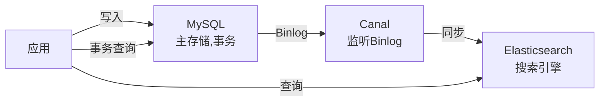

# Elasticsearch 面试题集锦（附参考答案）

---

## 🥉 基础题

### Q1. 什么是 Elasticsearch？和 MySQL 的区别？

**参考答案：**

**Elasticsearch** 是一个分布式、RESTful 风格的搜索和分析引擎，基于 Lucene 构建。

**vs MySQL**：

| 维度 | MySQL | Elasticsearch |
|------|-------|---------------|
| 数据模型 | 关系型（表、行、列） | 文档型（索引、文档、字段） |
| 查询方式 | SQL | DSL（JSON） |
| 搜索能力 | 弱（LIKE 全表扫描） | **强（全文搜索、分词、相关性打分）** |
| 事务支持 | **强（ACID）** | 弱（最终一致） |
| 扩展性 | 垂直扩展为主 | **水平扩展（分布式）** |
| 适用场景 | 事务、强一致 | **搜索、日志分析、OLAP** |

---

### Q2. ES 的核心概念有哪些？

**参考答案：**

| 概念 | 说明 | MySQL 类比 |
|------|------|-----------|
| **Index** | 索引，文档的集合 | Database |
| **Document** | 文档，一条数据 | Row |
| **Field** | 字段 | Column |
| **Mapping** | 映射，定义字段类型 | Schema |
| **Shard** | 分片，索引的物理分片 | 分区 |
| **Replica** | 副本，分片的备份 | 主从 |

---

### Q3. 什么是倒排索引？为什么 ES 查询快？

**参考答案：**

**倒排索引**：把"文档 → 词"的关系反转成"**词 → 文档列表**"。

**示例**：
```
文档1: "苹果手机很好用" → 分词: [苹果, 手机, 好用]
文档2: "华为手机也不错" → 分词: [华为, 手机, 不错]

倒排索引:
苹果 → [文档1]
手机 → [文档1, 文档2]
华为 → [文档2]
好用 → [文档1]
不错 → [文档2]
```

**为什么快**：
- 查询"手机"时，直接查倒排索引，找到 [文档1, 文档2]，不用扫描所有文档。
- 时间复杂度从 O(N) 降到 O(1)。

---

## 🥈 进阶题

### Q4. ES 的写入流程？什么是近实时搜索？

**参考答案：**

**写入流程**：
1. 客户端发送写入请求到协调节点。
2. 协调节点根据 `doc_id` 路由到主分片。
3. 主分片写入**内存缓冲区**和 **Translog**（事务日志）。
4. 主分片同步数据到副本分片。
5. 副本分片也写 Translog，返回确认。
6. 主分片返回成功给客户端。

**后台异步操作**：
- **Refresh（刷新）**：默认 1 秒，把内存数据写入段（Segment），可被搜索到。
- **Flush（落盘）**：默认 30 分钟或 Translog 满，把段持久化到磁盘，清空 Translog。

**近实时（NRT）**：写入后默认 1 秒才能搜到，因为需要等 Refresh。

---

### Q5. ES 的查询流程？如何计算相关性打分？

**参考答案：**

**查询流程**：
1. **解析查询**：分词（如"苹果手机" → ["苹果", "手机"]）。
2. **查找倒排索引**：找到包含词项的文档列表。
3. **计算相关性打分**：TF-IDF 或 BM25 算法。
4. **排序**：按分数降序排列。
5. **返回 Top N**。

**相关性打分（BM25）**：
- **TF（词频）**：词在文档中出现次数越多，分数越高。
- **IDF（逆文档频率）**：词在所有文档中出现次数越少，分数越高。
- **字段长度归一化**：短字段中的词权重更高。

**公式**（简化）：
```
score = TF × IDF × 字段长度归一化
```

---

### Q6. text 和 keyword 的区别？

**参考答案：**

| 类型 | 是否分词 | 适用场景 | 示例 |
|------|---------|---------|------|
| **text** | ✅ 分词 | 全文搜索 | 商品名称、描述 |
| **keyword** | ❌ 不分词 | 精确匹配、聚合、排序 | ID、标签、状态 |

**示例**：
```json
{
  "name": {
    "type": "text",  // 分词：苹果手机 → [苹果, 手机]
    "fields": {
      "keyword": { "type": "keyword" }  // 不分词：苹果手机
    }
  }
}
```

**查询**：
- `match` 查询 `name`（text 字段）：分词后匹配。
- `term` 查询 `name.keyword`（keyword 字段）：精确匹配。

---

### Q7. ES 的分词器有哪些？IK 分词器的两种模式？

**参考答案：**

**常用分词器**：
- **Standard**（默认）：按单词切分，英文友好。
- **IK**：中文分词，支持自定义词典（**中文推荐**）。
- **Jieba**：中文分词，词库丰富。
- **Keyword**：不分词，整体作为一个词项。

**IK 两种模式**：
- **ik_max_word**：最细粒度切分，如"苹果手机" → ["苹果", "手机", "果手", "果手机"]。
- **ik_smart**：最粗粒度切分，如"苹果手机" → ["苹果", "手机"]。

**最佳实践**：
- 写入时用 `ik_max_word`（尽可能多分词，提高召回率）。
- 搜索时用 `ik_smart`（减少分词，提高准确率）。

---

### Q8. ES 的分片机制？如何设置分片数？

**参考答案：**

**分片（Shard）**：索引的物理分片，分为主分片（Primary）和副本分片（Replica）。

**作用**：
1. **水平扩展**：一个索引拆成多个分片，分散到多个节点。
2. **高可用**：副本分片保证主分片宕机时数据不丢失。
3. **负载均衡**：查询请求分散到多个分片，并行处理。

**分片数设置**：
- **分片数 = 节点数 × (1~3)**，过多分片会占用资源。
- **单个分片大小控制在 10GB~50GB**。
- **分片数创建后不能修改**（需要 reindex）。

**示例**：
```json
PUT /my_index
{
  "settings": {
    "number_of_shards": 3,      // 3 个主分片
    "number_of_replicas": 1     // 每个主分片 1 个副本
  }
}
```

---

## 🥇 架构题

### Q9. ES 深度分页问题？如何解决？

**参考答案：**

**问题**：`from + size` 深度分页性能差。
```json
// 查询第 10000~10010 条
GET /my_index/_search
{
  "from": 10000,
  "size": 10
}
```
**原因**：ES 需要从所有分片取出前 10010 条，汇总排序后返回 10 条，内存开销大。

**解决方案**：
1. **search_after**（推荐）：
```json
GET /my_index/_search
{
  "size": 10,
  "sort": [{ "_id": "asc" }],
  "search_after": ["doc_10000"]  // 上一页最后一条的 _id
}
```
2. **Scroll API**：适合大批量导出，不适合实时查询。
3. **限制最大分页深度**：`index.max_result_window=10000`，超过则报错。

---

### Q10. ES 如何优化查询性能？

**参考答案：**

1. **使用 Filter 代替 Query**：
   - Filter 不计算相关性打分，且可缓存。
   - 示例：范围查询、精确匹配用 Filter。

```json
{
  "query": {
    "bool": {
      "must": [{ "match": { "name": "苹果" } }],  // Query，计算分数
      "filter": [{ "range": { "price": { "gte": 100 } } }]  // Filter，不计算分数
    }
  }
}
```

2. **避免深度分页**：用 `search_after` 代替 `from+size`。

3. **只查询需要的字段**：
```json
{
  "_source": ["name", "price"],  // 只返回 name 和 price
  "query": { ... }
}
```

4. **使用索引模板**：预定义 Mapping，避免动态 Mapping 性能损耗。

5. **合理使用缓存**：
   - Filter 缓存（Node Query Cache）。
   - 分片请求缓存（Shard Request Cache）。

---

### Q11. ES 如何做高可用？

**参考答案：**

1. **副本分片**：每个主分片至少 1 个副本，主分片宕机时副本接管。

2. **跨机房部署**：
```json
PUT /my_index
{
  "settings": {
    "routing.allocation.awareness.attributes": "zone"
  }
}
```
强制主副本分配到不同 zone（机房）。

3. **快照备份**：
```json
PUT /_snapshot/my_backup/snapshot_1
{
  "indices": "my_index",
  "ignore_unavailable": true
}
```
定期备份到 S3/HDFS。

4. **读写分离**：
   - 写请求路由到主分片。
   - 读请求可路由到副本分片，减轻主分片压力。

---

### Q12. ES 和 MySQL 如何配合使用？

**参考答案：**

**经典架构：MySQL + ES 双写**



**数据同步方式**：
1. **双写**：应用同时写 MySQL 和 ES（需要处理失败重试）。
2. **Binlog 同步**（推荐）：Canal 监听 MySQL Binlog，异步同步到 ES。
3. **定时任务**：定时扫描 MySQL 增量数据，同步到 ES。

**场景**：
- MySQL 负责事务、强一致（订单创建）。
- ES 负责搜索、分析（商品搜索、日志分析）。

---

### Q13. ES 集群脑裂问题？如何避免？

**参考答案：**

**脑裂（Split-Brain）**：网络分区导致集群分裂成多个小集群，各自选举 Master，数据不一致。

**示例**：
```
节点1, 节点2 | 网络断开 | 节点3, 节点4
    ↓                    ↓
选举 Master1         选举 Master2
两个 Master，数据不一致！
```

**解决方案**：
1. **设置最小 Master 节点数**：
```yaml
# ES 7.x 之前
discovery.zen.minimum_master_nodes: (master_eligible_nodes / 2) + 1

# ES 7.x+（自动配置）
cluster.initial_master_nodes: ["node1", "node2", "node3"]
```

2. **Master 节点奇数个**：3、5、7 个，避免平票。

3. **专用 Master 节点**：
```yaml
node.master: true
node.data: false  # 不存储数据，只做管理
```

---

### Q14. ES 的热点问题？如何解决？

**参考答案：**

**热点问题**：某个分片数据量或查询量远大于其他分片，导致负载不均衡。

**原因**：
- 路由策略不合理（如按时间路由，新数据都路由到一个分片）。
- 某个词项的文档特别多（如"手机"这个词的文档占 50%）。

**解决方案**：
1. **自定义路由**：
```json
PUT /my_index/_doc/1?routing=user_123
{
  "name": "商品1"
}
```
按用户 ID 路由，分散数据。

2. **增加分片数**：reindex 到更多分片的索引。

3. **预热热点数据**：
```json
PUT /my_index/_warmer/warmer_1
{
  "query": { "match": { "name": "手机" } }
}
```
提前加载热点数据到内存。

---

### Q15. 设计一个商品搜索系统，你会考虑哪些点？

**参考答案（综合架构题）：**

1. **数据同步**：
   - MySQL 主存储，Canal 监听 Binlog 同步到 ES。
   - 保证数据最终一致性。

2. **Mapping 设计**：
```json
{
  "name": { "type": "text", "analyzer": "ik_max_word" },
  "price": { "type": "long" },
  "category_id": { "type": "keyword" },
  "tags": { "type": "keyword" },
  "sales": { "type": "long" },
  "create_time": { "type": "date" }
}
```

3. **分词器**：
   - 中文用 IK 分词器。
   - 自定义词典（品牌词、行业词）。

4. **查询优化**：
   - `match` 查询名称（分词）。
   - `term` 查询分类、标签（精确匹配）。
   - `range` 查询价格（Filter，不计算分数）。
   - `sort` 按销量、价格排序。

5. **相关性打分调优**：
   - 名称权重 > 描述权重（`boost`）。
   - 自定义打分（`function_score`）。

6. **分片设计**：
   - 分片数 = 节点数 × 2。
   - 单个分片 < 50GB。

7. **高可用**：
   - 副本分片 ≥ 1。
   - 跨机房部署。
   - 定期快照备份。

8. **性能优化**：
   - Bulk 批量写入。
   - Filter 代替 Query。
   - search_after 代替深度分页。

9. **监控告警**：
   - 集群健康状态（green/yellow/red）。
   - 分片负载均衡。
   - 慢查询日志。
