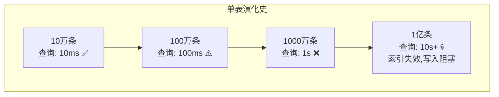
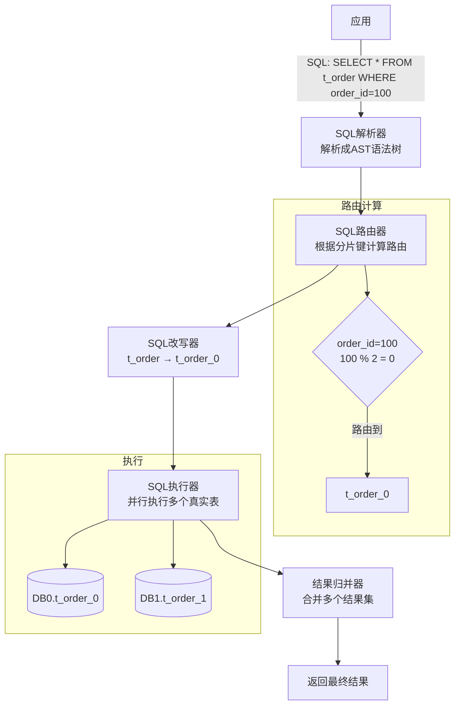
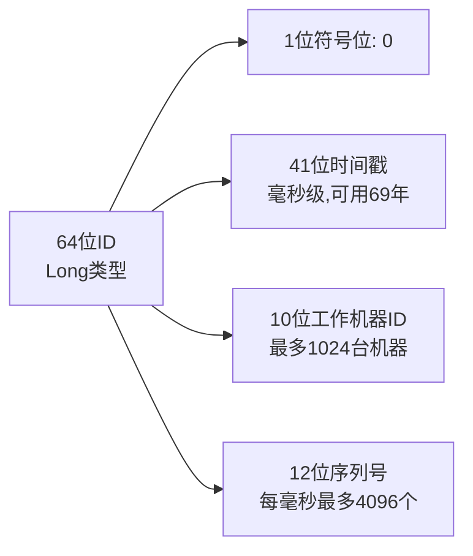
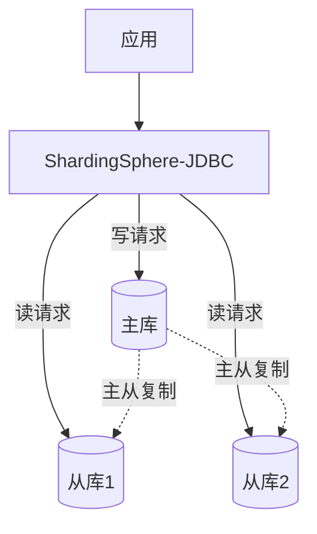

# ShardingSphere-JDBC 技术原理详解

> 🎭 **一句话开场**：ShardingSphere-JDBC 就像图书管理员面对"书太多一个书架放不下"的问题——把书按规则分到多个书架（分库分表），你（应用）只要说"我要《三体》"，它自动去正确的书架找，你完全感觉不到书架的存在。

---

## 一、为什么需要分库分表？从"单表爆炸"说起

### 1.1 单表的性能瓶颈



**瓶颈表现**：
1. **查询慢**：数据量大，索引树变高，磁盘 IO 增加。
2. **写入慢**：索引维护成本高，锁竞争激烈。
3. **备份恢复慢**：单表 500GB，备份要几小时。
4. **DDL 阻塞**：加个字段要锁表几小时。

### 1.2 分库分表的两种维度

| 维度 | 定义 | 解决什么问题 | 示例 |
|------|------|------------|------|
| **垂直拆分** | 按业务/字段拆分 | 业务耦合 | 订单库、用户库、商品库 |
| **水平拆分** | 按数据行拆分 | **数据量大、性能瓶颈** | order_0, order_1, order_2 |

> 🎯 **ShardingSphere-JDBC 主要解决水平拆分问题**。

---

## 二、ShardingSphere-JDBC 的核心概念

### 2.1 核心概念对照表

| 概念 | 说明 | 示例 |
|------|------|------|
| **逻辑表** | 应用看到的表名 | `t_order` |
| **真实表** | 实际存储的表 | `t_order_0`, `t_order_1` |
| **分片键** | 用于分片的字段 | `order_id` |
| **分片算法** | 如何计算分片 | `order_id % 2` |
| **分片策略** | 分片键 + 分片算法 | 标准策略、复合策略 |

### 2.2 分片策略：四种类型

| 策略 | 说明 | 适用场景 |
|------|------|---------|
| **标准分片策略** | 单一分片键，支持 =、IN、BETWEEN AND | **最常用** |
| **复合分片策略** | 多个分片键 | 多字段分片 |
| **行表达式分片策略** | Groovy 表达式，只支持 =、IN | 简单分片 |
| **Hint 分片策略** | 手动指定分片，不解析 SQL | 强制路由 |

**标准分片策略示例**：
```java
// 分片键：order_id
// 分片算法：order_id % 2
// t_order_0 存偶数，t_order_1 存奇数
```

---

## 三、整体架构：SQL 的奇幻漂流



**核心流程**：
1. **SQL 解析**：把 SQL 解析成抽象语法树（AST），提取分片键。
2. **SQL 路由**：根据分片键和分片算法，计算应该路由到哪些真实表。
3. **SQL 改写**：把逻辑表改写成真实表（`t_order` → `t_order_0`）。
4. **SQL 执行**：并行执行多个真实表的 SQL。
5. **结果归并**：合并多个结果集，返回最终结果。

---

## 四、路由策略：如何找到正确的表？

### 4.1 分片路由的三种情况

```mermaid
flowchart TB
    SQL[SQL请求] --> Judge{分片键?}
    
    Judge -->|有分片键<br/>order_id=100| Single[单表路由<br/>t_order_0]
    
    Judge -->|有分片键范围<br/>order_id IN (1,2,3)| Multi[多表路由<br/>t_order_0, t_order_1<br/>并行查询,合并结果]
    
    Judge -->|无分片键<br/>SELECT * FROM t_order| Broadcast[广播路由<br/>所有表都查<br/>性能最差]
```

**三种路由类型**：
1. **单表路由**：分片键精确匹配（`order_id = 100`），路由到一个表，性能最好。
2. **多表路由**：分片键范围匹配（`order_id IN (1,2,3)`），路由到多个表，并行查询。
3. **广播路由**：无分片键（`SELECT * FROM t_order`），路由到所有表，性能最差。

> ⚠️ **面试点**：**所有查询都要带分片键**，否则会广播到所有表，性能急剧下降。

### 4.2 分片算法：如何计算分片？

**取模算法（最常用）**：
```java
// order_id % 2
// order_id = 100 → 100 % 2 = 0 → t_order_0
// order_id = 101 → 101 % 2 = 1 → t_order_1
```

**范围算法**：
```java
// 按时间范围分片
// 2024-01 → t_order_202401
// 2024-02 → t_order_202402
```

**自定义算法**：
```java
public class MyShardingAlgorithm implements PreciseShardingAlgorithm<Long> {
    @Override
    public String doSharding(Collection<String> availableTargetNames, 
                             PreciseShardingValue<Long> shardingValue) {
        // 自定义逻辑：order_id % 2
        long value = shardingValue.getValue();
        String suffix = String.valueOf(value % 2);
        return "t_order_" + suffix;
    }
}
```

---

## 五、SQL 改写：逻辑表如何变真实表？

### 5.1 简单改写：表名替换

```sql
-- 逻辑 SQL
SELECT * FROM t_order WHERE order_id = 100;

-- 改写后（路由到 t_order_0）
SELECT * FROM t_order_0 WHERE order_id = 100;
```

### 5.2 复杂改写：分页、排序、聚合

**分页改写**：
```sql
-- 逻辑 SQL
SELECT * FROM t_order ORDER BY order_id LIMIT 10 OFFSET 20;

-- 改写后（需要在每个分片都取前 30 条，内存中归并）
SELECT * FROM t_order_0 ORDER BY order_id LIMIT 0, 30;
SELECT * FROM t_order_1 ORDER BY order_id LIMIT 0, 30;
-- 然后在内存中归并，取第 21~30 条
```

> ⚠️ **深度分页问题**：`LIMIT 1000000, 10` 需要在每个分片都取前 1000010 条，内存爆炸！

**解决方案**：
1. **禁止深度分页**：业务上限制最大页数。
2. **使用游标**：`WHERE order_id > last_id LIMIT 10`。
3. **二次查询法**：先查出所有分片的 ID，再精确查询。

**聚合改写**：
```sql
-- 逻辑 SQL
SELECT COUNT(*) FROM t_order;

-- 改写后
SELECT COUNT(*) FROM t_order_0;  -- 结果: 500
SELECT COUNT(*) FROM t_order_1;  -- 结果: 600
-- 内存归并: 500 + 600 = 1100
```

---

## 六、分布式主键：如何保证全局唯一？

### 6.1 问题：分库分表后主键冲突

**场景**：
```
t_order_0: order_id = 1, 2, 3 (自增)
t_order_1: order_id = 1, 2, 3 (自增)
-- 主键冲突！
```

### 6.2 解决方案：雪花算法（Snowflake）



**雪花算法优势**：
1. **全局唯一**：时间戳 + 机器 ID + 序列号，保证不重复。
2. **趋势递增**：时间戳在前，ID 单调递增，有利于索引性能。
3. **高性能**：本地生成，无网络开销。

**ShardingSphere 配置**：
```yaml
keyGenerators:
  snowflake:
    type: SNOWFLAKE
    props:
      worker-id: 123  # 机器ID
```

---

## 七、读写分离：进一步提升性能



**配置**：
```yaml
dataSources:
  ds_master: ...
  ds_slave_0: ...
  ds_slave_1: ...

rules:
  readwriteSplitting:
    dataSources:
      ds:
        writeDataSourceName: ds_master
        readDataSourceNames: ds_slave_0, ds_slave_1
        loadBalancerName: round_robin  # 负载均衡：轮询
```

> 🎯 **分库分表 + 读写分离**：先分库分表解决数据量问题，再读写分离解决并发问题。

---

## 八、分布式事务：分库分表后的事务难题

### 8.1 问题：跨库事务

**场景**：
```sql
-- 一个事务涉及多个库
BEGIN;
UPDATE db0.t_order_0 SET status = 1 WHERE order_id = 100;
UPDATE db1.t_account SET balance = balance - 100 WHERE user_id = 1;
COMMIT;  -- 如何保证原子性？
```

### 8.2 解决方案：Seata AT 模式

ShardingSphere-JDBC 集成了 Seata，支持分布式事务：

```java
@ShardingTransactionType(TransactionType.BASE)  // Seata AT 模式
@Transactional
public void createOrder(Order order) {
    orderMapper.insert(order);  // db0.t_order_0
    accountMapper.deduct(userId, amount);  // db1.t_account
}
```

---

## 九、一页纸总结（面试背诵版）

```
核心概念：逻辑表/真实表/分片键/分片算法/分片策略
核心流程：SQL解析 → 路由 → 改写 → 执行 → 归并
路由类型：单表路由(最快)/多表路由(并行)/广播路由(最慢,要避免)
分片算法：取模/范围/自定义
分布式主键：雪花算法(64位=时间戳+机器ID+序列号)
深度分页：禁止/游标/二次查询
读写分离：主库写,从库读,负载均衡
分布式事务：集成Seata AT模式
```

> 🎬 **收个尾**：ShardingSphere-JDBC 的设计哲学是**"让分库分表对应用透明"**——你写的还是单表 SQL，它自动帮你路由、改写、执行、归并。理解了路由和归并，你就掌握了分库分表的核心。
