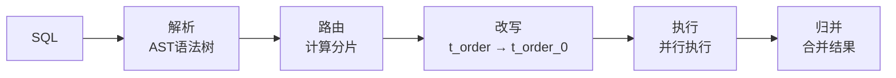

# ShardingSphere-JDBC 面试题集锦（附参考答案）

---

## 🥉 基础题

### Q1. 什么是分库分表？为什么需要？

**参考答案：**

**分库分表**：把一个大库/大表拆分成多个小库/小表，解决单库单表性能瓶颈。

**两种维度**：
- **垂直拆分**：按业务/字段拆分（订单库、用户库）。
- **水平拆分**：按数据行拆分（order_0, order_1, order_2）。

**为什么需要**：
- 单表数据量 > 1000 万，查询慢。
- 单库 QPS > 5000，扛不住。
- 单库磁盘 > 500GB，备份恢复慢。

---

### Q2. ShardingSphere-JDBC 的核心概念？

**参考答案：**

| 概念 | 说明 | 示例 |
|------|------|------|
| **逻辑表** | 应用看到的表名 | `t_order` |
| **真实表** | 实际存储的表 | `t_order_0`, `t_order_1` |
| **分片键** | 用于分片的字段 | `order_id` |
| **分片算法** | 如何计算分片 | `order_id % 2` |
| **分片策略** | 分片键 + 分片算法 | 标准策略、复合策略 |

---

### Q3. ShardingSphere-JDBC 的核心流程？

**参考答案：**



**五个步骤**：
1. **SQL 解析**：解析成 AST，提取分片键。
2. **SQL 路由**：计算路由到哪些真实表。
3. **SQL 改写**：逻辑表改写成真实表。
4. **SQL 执行**：并行执行多个真实表。
5. **结果归并**：合并结果集。

---

## 🥈 进阶题

### Q4. 分片路由的三种类型？如何避免广播路由？

**参考答案：**

**三种路由类型**：
1. **单表路由**：分片键精确匹配（`order_id = 100`），路由到一个表，**性能最好**。
2. **多表路由**：分片键范围匹配（`order_id IN (1,2,3)`），路由到多个表，并行查询。
3. **广播路由**：无分片键（`SELECT * FROM t_order`），路由到所有表，**性能最差**。

**避免广播路由**：
- **所有查询都要带分片键**。
- 无分片键的查询（如统计）走单独的报表库。

---

### Q5. 分库分表后如何保证主键全局唯一？

**参考答案：**

**问题**：分库分表后，自增 ID 会冲突。

**解决方案：雪花算法（Snowflake）**
```
64位 ID = 1位符号位 + 41位时间戳 + 10位机器ID + 12位序列号
```

**优势**：
1. **全局唯一**：时间戳 + 机器 ID + 序列号。
2. **趋势递增**：时间戳在前，ID 单调递增。
3. **高性能**：本地生成，无网络开销。

**ShardingSphere 配置**：
```yaml
keyGenerators:
  snowflake:
    type: SNOWFLAKE
    props:
      worker-id: 123
```

---

### Q6. 分库分表后如何做分页查询？

**参考答案：**

**问题**：`LIMIT 1000000, 10` 需要在每个分片都取前 1000010 条，内存爆炸。

**解决方案**：
1. **禁止深度分页**：业务上限制最大页数（如最多 100 页）。
2. **使用游标**：
```sql
-- 第一页
SELECT * FROM t_order ORDER BY order_id LIMIT 10;
-- 下一页（记录上一页最后一条的 order_id）
SELECT * FROM t_order WHERE order_id > last_id LIMIT 10;
```
3. **二次查询法**：
   - 先查出所有分片的 ID 范围；
   - 再精确查询。

---

### Q7. 分库分表后如何做关联查询？

**参考答案：**

**问题**：分库分表后，JOIN 查询可能跨库跨表。

**解决方案**：
1. **绑定表**（推荐）：
   - 关联的表使用**相同的分片键和分片算法**。
   - 示例：`t_order` 和 `t_order_item` 都按 `order_id` 分片。
   - 好处：JOIN 在同一个分片内完成，不跨库。

```yaml
tables:
  t_order:
    actualDataNodes: ds_${0..1}.t_order_${0..1}
    tableStrategy:
      standard:
        shardingColumn: order_id
        shardingAlgorithmName: order_inline
  t_order_item:
    actualDataNodes: ds_${0..1}.t_order_item_${0..1}
    tableStrategy:
      standard:
        shardingColumn: order_id  # 和 t_order 相同
        shardingAlgorithmName: order_item_inline

bindingTables:
  - t_order, t_order_item  # 绑定表
```

2. **广播表**：
   - 数据量小、变动少的表（如字典表），每个库都存一份。
   - JOIN 时在本地完成。

3. **避免 JOIN**：
   - 反范式设计，冗余字段。
   - 应用层组装数据。

---

### Q8. 分库分表后如何做分布式事务？

**参考答案：**

**问题**：一个事务涉及多个库，无法用一个本地事务保证原子性。

**解决方案：Seata AT 模式**

```java
@ShardingTransactionType(TransactionType.BASE)  // Seata AT 模式
@Transactional
public void createOrder(Order order) {
    orderMapper.insert(order);  // db0.t_order_0
    accountMapper.deduct(userId, amount);  // db1.t_account
}
```

**原理**：参考 Seata 文档（undo_log + 全局锁 + 两阶段提交）。

---

## 🥇 架构题

### Q9. 分库分表的时机？如何选择分片键？

**参考答案：**

**分库分表时机**：
- 单表数据量 > 1000 万，或预计未来 1 年内会超过。
- 单库 QPS > 5000，且优化无效。
- 单库磁盘 > 500GB，备份恢复慢。

**如何选择分片键**：
1. **高频查询字段**：90% 的查询都带这个字段（如 `order_id`）。
2. **均匀分布**：分片后数据均匀分布，避免热点。
3. **避免跨分片**：尽量减少跨分片查询。

**示例**：
- 订单表：按 `order_id` 分片（高频查询）。
- 用户表：按 `user_id` 分片。
- 日志表：按时间分片（范围查询多）。

---

### Q10. 分库分表后如何扩容？

**参考答案：**

**问题**：分片数不够用了，如何扩容？

**方案**：
1. **翻倍扩容**（推荐）：
   - 2 分片 → 4 分片 → 8 分片。
   - 数据迁移：`order_id % 4`，原来在 t_order_0 的数据，可能还在 t_order_0 或迁移到 t_order_2。
   - 工具：ShardingSphere-Scaling（数据迁移工具）。

2. **一致性哈希**：
   - 减少数据迁移量。
   - 但实现复杂，一般用翻倍扩容。

**扩容流程**：
1. 创建新表（t_order_2, t_order_3）。
2. 数据迁移（Scaling 工具）。
3. 双写（新旧表都写）。
4. 校验数据一致性。
5. 切换读流量到新表。
6. 停止写旧表。

---

### Q11. ShardingSphere-JDBC vs MyCat，如何选择？

**参考答案：**

| 维度 | ShardingSphere-JDBC | MyCat |
|------|---------------------|-------|
| 架构 | **客户端**（JDBC 增强） | **代理层**（中间件） |
| 性能 | **高**（无网络开销） | 较低（多一跳） |
| 侵入性 | 需引入依赖 | 无侵入（对应用透明） |
| 运维成本 | **低**（无需部署中间件） | 高（需部署、监控 MyCat） |
| 异构语言 | ❌ 只支持 Java | ✅ 支持所有语言 |
| 适用场景 | **Java 应用，追求性能** | 多语言环境 |

**选型建议**：
- 纯 Java 应用，追求性能 → **ShardingSphere-JDBC**。
- 多语言环境，需要对应用透明 → MyCat。

---

### Q12. 分库分表后如何做统计查询？

**参考答案：**

**问题**：分库分表后，统计查询（如 `SELECT COUNT(*) FROM t_order`）需要扫描所有分片。

**解决方案**：
1. **广播路由 + 结果归并**：
   - ShardingSphere 自动并行查询所有分片，内存归并。
   - 适合小数据量统计。

2. **单独的报表库**：
   - 定时任务把数据同步到报表库（如 ClickHouse、ES）。
   - 统计查询走报表库，不影响业务库。

3. **预聚合**：
   - 定时计算统计结果，存到单独的表。
   - 查询时直接查统计表。

---

### Q13. 分库分表后如何做数据迁移？

**参考答案：**

**场景**：单库单表迁移到分库分表。

**方案**：
1. **停机迁移**（简单但影响业务）：
   - 停机 → 导出数据 → 导入分片 → 切换 → 恢复。
   - 适合小数据量、业务低峰期。

2. **双写迁移**（推荐）：
   - **步骤1**：开启双写（同时写旧表和新分片）。
   - **步骤2**：历史数据迁移（ShardingSphere-Scaling）。
   - **步骤3**：校验数据一致性。
   - **步骤4**：切换读流量到新分片。
   - **步骤5**：停止写旧表。

---

### Q14. 分库分表后的坑有哪些？如何避免？

**参考答案：**

**常见坑**：
1. **广播路由**：查询不带分片键，性能急剧下降。
   - **避免**：所有查询都带分片键。

2. **深度分页**：`LIMIT 1000000, 10` 内存爆炸。
   - **避免**：游标法或禁止深度分页。

3. **跨库 JOIN**：性能差。
   - **避免**：绑定表或广播表。

4. **分布式事务**：复杂度高。
   - **避免**：尽量单库事务，跨库用 Seata。

5. **扩容困难**：分片数不够，扩容麻烦。
   - **避免**：一开始分片数设大一点（如 16 个）。

6. **热点问题**：某个分片数据量/查询量特别大。
   - **避免**：分片键选择均匀分布的字段。

---

### Q15. 设计一个订单系统，如何做分库分表？

**参考答案（综合架构题）：**

1. **业务分析**：
   - 订单量大（日百万级）。
   - 高频查询：按订单 ID、用户 ID 查询。
   - 低频查询：按时间范围统计。

2. **分片策略**：
   - **分片键**：`order_id`（雪花算法生成，包含时间戳）。
   - **分片算法**：`order_id % 16`（16 个分片）。
   - **分库分表**：4 个库，每个库 4 张表。

3. **表结构设计**：
```yaml
# 逻辑表 t_order
# 真实表 t_order_0 ~ t_order_15
# 分片键 order_id
```

4. **绑定表**：
   - `t_order` 和 `t_order_item` 都按 `order_id` 分片。
   - JOIN 在同一个分片内完成。

5. **广播表**：
   - 字典表（如订单状态）每个库存一份。

6. **读写分离**：
   - 主库写，从库读。
   - 负载均衡：轮询。

7. **分布式事务**：
   - 单库事务用本地事务。
   - 跨库事务用 Seata AT 模式。

8. **查询优化**：
   - 所有查询带 `order_id`。
   - 统计查询走 ES 或 ClickHouse。

9. **扩容预案**：
   - 预留分片数（16 个起步）。
   - 数据迁移工具：ShardingSphere-Scaling。

10. **监控告警**：
    - 分片数据量、查询量监控。
    - 热点分片告警。
    - 慢查询告警。
