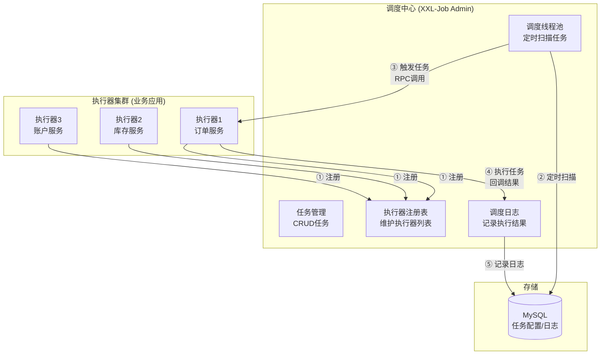
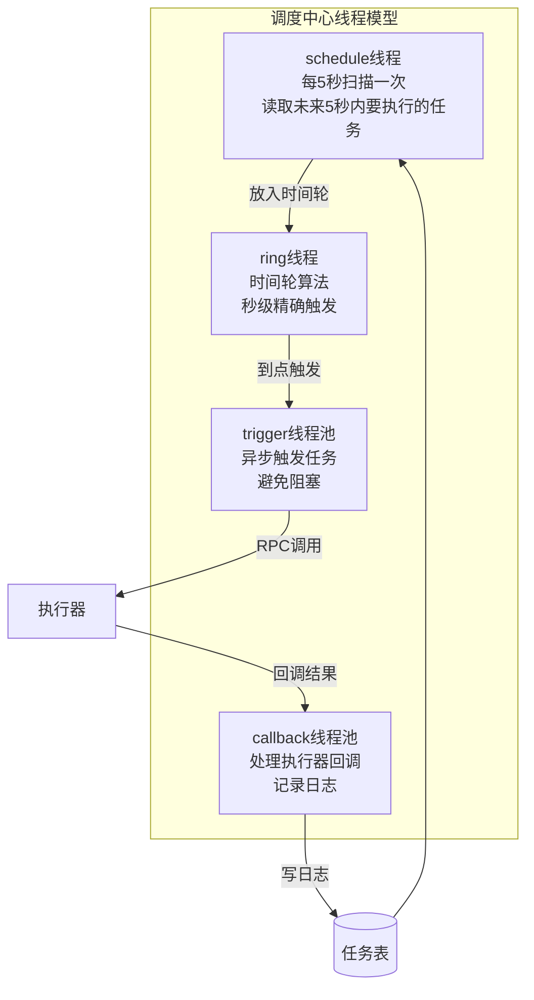
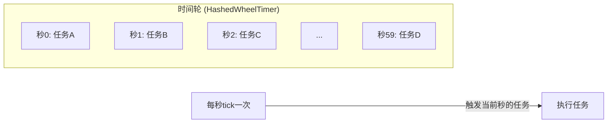
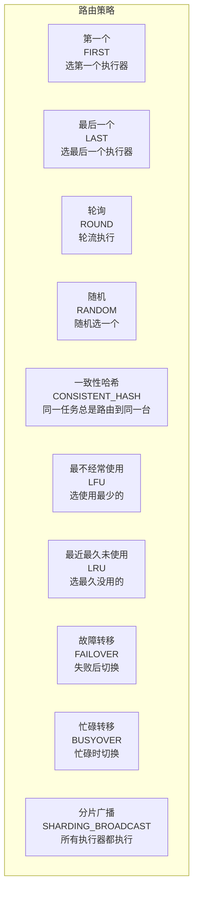

# XXL-Job 技术原理详解

> 🎭 **一句话开场**：XXL-Job 就像公司的"智能闹钟系统"——你（调度中心）设定"每天早上 9 点提醒大家打卡"（定时任务），它自动通知所有员工（执行器）执行，还能统计谁没打卡（失败告警）、重试（补偿机制）。

---

## 一、为什么需要分布式任务调度？从"单机闹钟"说起

### 1.1 单机定时任务的痛点

```mermaid
flowchart TB
    subgraph 单机定时任务
        A1[应用服务器1<br/>@Scheduled<br/>每天9点发邮件]
        A2[应用服务器2<br/>@Scheduled<br/>每天9点发邮件]
        A3[应用服务器3<br/>@Scheduled<br/>每天9点发邮件]
    end

    Note1[❌ 问题1: 重复执行<br/>3台机器都执行,用户收到3封邮件]
    Note2[❌ 问题2: 单点故障<br/>机器挂了,任务不执行]
    Note3[❌ 问题3: 无法监控<br/>不知道任务执行成功没]
    Note4[❌ 问题4: 无法手动触发<br/>想立即执行一次,只能重启]
```

### 1.2 XXL-Job 的解决方案

| 痛点 | XXL-Job 解决方案 |
|------|-----------------|
| 重复执行 | **调度中心统一调度**，只触发一个执行器 |
| 单点故障 | **执行器集群**，自动故障转移 |
| 无法监控 | **调度日志**，实时查看执行结果 |
| 无法手动触发 | **控制台手动触发** |

---

## 二、整体架构：调度中心 + 执行器



**两大角色**：

| 角色 | 职责 | 类比 |
|------|------|------|
| **调度中心（Admin）** | 任务管理、定时触发、日志记录 | 闹钟 |
| **执行器（Executor）** | 接收触发请求，执行具体业务逻辑 | 员工 |

**核心流程**：
1. **执行器注册**：执行器启动时，向调度中心注册（心跳保活）。
2. **任务触发**：调度中心定时扫描数据库，到点后触发任务（RPC 调用执行器）。
3. **任务执行**：执行器收到请求，执行 `JobHandler`。
4. **结果回调**：执行器执行完成后，回调调度中心，记录日志。

---

## 三、核心机制：调度中心如何工作？

### 3.1 调度线程模型



**关键线程**：
1. **schedule 线程**：每 5 秒扫描一次数据库，读取未来 5 秒内要执行的任务，放入时间轮。
2. **ring 线程**：时间轮算法，秒级精确触发。
3. **trigger 线程池**：异步触发任务，避免阻塞调度线程。
4. **callback 线程池**：处理执行器回调，记录日志。

### 3.2 时间轮算法：秒级精确触发



**原理**：
- 一个环形队列，60 个槽位（0~59 秒）。
- 每秒 tick 一次，触发当前秒的任务。
- 任务按执行时间的秒数放入对应槽位。

> 🎯 **优势**：O(1) 时间复杂度触发任务，比遍历所有任务高效。

---

## 四、路由策略：如何选择执行器？



**常用策略**：

| 策略 | 说明 | 适用场景 |
|------|------|---------|
| **第一个** | 选第一个执行器 | 简单场景 |
| **轮询** | 轮流执行 | 负载均衡 |
| **故障转移** | 失败后切换到下一个 | 高可用 |
| **分片广播** | 所有执行器都执行，每个执行不同分片 | **大数据量处理** |

**分片广播示例**：
```java
// 任务参数：分片总数=3，当前分片序号=0/1/2
@XxlJob("shardingJobHandler")
public void shardingJob() {
    int shardIndex = XxlJobHelper.getShardIndex();  // 当前分片序号
    int shardTotal = XxlJobHelper.getShardTotal();  // 分片总数
    
    // 每个执行器处理一部分数据
    List<Order> orders = orderMapper.selectByShard(shardIndex, shardTotal);
    process(orders);
}
```

---

## 五、调度类型：Cron vs 固定速度

| 调度类型 | 说明 | 示例 |
|---------|------|------|
| **Cron** | Cron 表达式，灵活 | `0 0 9 * * ?`（每天 9 点） |
| **固定速度** | 固定间隔，简单 | 每 5 秒执行一次 |

**Cron 表达式**：
```
秒 分 时 日 月 周 年(可选)
0 0 9 * * ?     -- 每天 9 点
0 */5 * * * ?   -- 每 5 分钟
0 0 0 1 * ?     -- 每月 1 号 0 点
```

---

## 六、失败处理：重试、告警、补偿

### 6.1 失败重试

```java
// 任务配置：失败重试次数=3
// 执行失败后，自动重试 3 次
```

### 6.2 失败告警

```java
// 配置告警邮件
// 任务失败后，发送邮件通知
```

### 6.3 补偿机制

**场景**：任务执行失败，重试也失败，需要人工介入。

**方案**：
1. **记录失败日志**：XXL-Job 自动记录。
2. **人工触发**：控制台手动触发一次。
3. **自动补偿**：定时扫描失败任务，自动补偿。

---

## 七、高级特性：GLUE 模式、子任务、任务依赖

### 7.1 GLUE 模式：动态代码

**场景**：任务逻辑需要频繁修改，不想每次都发版。

**方案**：GLUE 模式，在控制台编写 Java/Groovy/Python 代码，动态执行。

```java
// GLUE(Java) 模式
// 在 XXL-Job 控制台编写代码，保存后立即生效
@XxlJob("glueJobHandler")
public void glueJob() {
    // 动态代码，不用发版
}
```

### 7.2 子任务：任务编排

**场景**：任务 A 执行成功后，触发任务 B。

**方案**：配置子任务 ID，任务 A 执行成功后自动触发任务 B。

### 7.3 任务依赖：DAG 调度

**场景**：任务有依赖关系（A → B → C）。

**方案**：XXL-Job 本身不支持 DAG，需要配合工作流引擎（如 DolphinScheduler、Airflow）。

---

## 八、XXL-Job vs Quartz vs ElasticJob

| 维度 | Quartz | ElasticJob | XXL-Job |
|------|--------|-----------|---------|
| 架构 | 单机/集群 | 分布式 | 分布式 |
| 调度中心 | ❌ 无 | ✅ 有（Zookeeper） | ✅ 有（独立部署） |
| 控制台 | ❌ 无 | ✅ 有 | ✅ **功能强大** |
| 分片广播 | ❌ | ✅ | ✅ |
| 学习曲线 | 平缓 | 陡峭 | **平缓** |
| 社区活跃度 | 一般 | 一般 | **活跃** |

**选型建议**：
- 单机定时任务 → Spring `@Scheduled`。
- 分布式任务调度，需要控制台 → **XXL-Job**。
- 深度分片、弹性扩缩容 → ElasticJob。

---

## 九、一页纸总结（面试背诵版）

```
架构：调度中心(Admin) + 执行器(Executor)，RPC通信
调度流程：schedule线程扫描DB → 时间轮(ring线程) → trigger线程池触发 → 执行器执行 → callback线程池记录日志
路由策略：第一个/轮询/故障转移/分片广播(大数据量)
调度类型：Cron表达式/固定速度
失败处理：重试/告警/补偿
GLUE模式：动态代码，不用发版
选型：Quartz(单机)/ElasticJob(分片强)/XXL-Job(控制台强大,推荐)
```

> 🎬 **收个尾**：XXL-Job 的设计哲学是**"轻量级、易用性、功能强大"**——它不追求最复杂的分布式理论，而是提供最实用的功能（控制台、分片广播、失败告警），让你 5 分钟就能搭建一个生产级的任务调度系统。理解了调度线程模型和路由策略，你就掌握了 XXL-Job 的核心。
