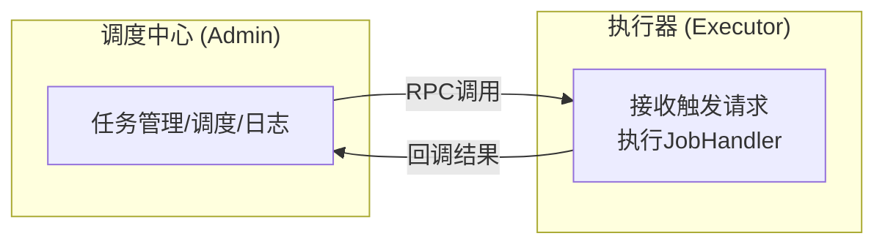
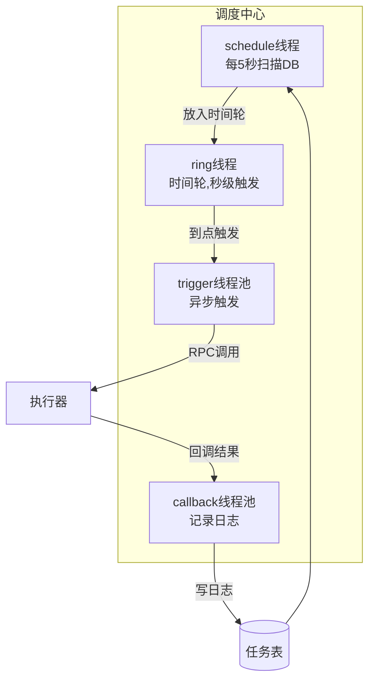
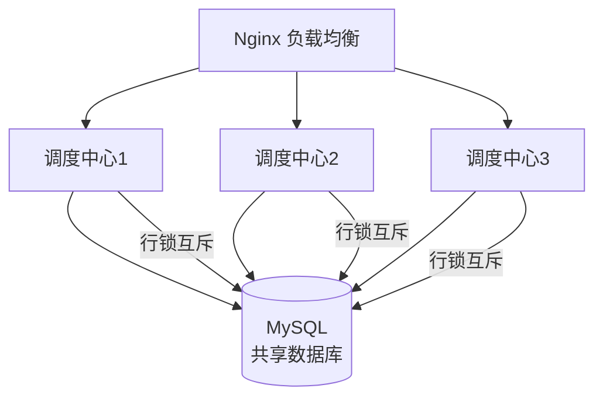

# XXL-Job 面试题集锦（附参考答案）

---

## 🥉 基础题

### Q1. 什么是分布式任务调度？为什么需要 XXL-Job？

**参考答案：**

**分布式任务调度**：在分布式系统中，统一管理、调度、监控定时任务的平台。

**单机定时任务的痛点**：
1. **重复执行**：多台机器都配置了 `@Scheduled`，任务重复执行。
2. **单点故障**：机器挂了，任务不执行。
3. **无法监控**：不知道任务执行成功没。
4. **无法手动触发**：想立即执行一次，只能重启。

**XXL-Job 的解决方案**：
- **调度中心统一调度**，只触发一个执行器。
- **执行器集群**，自动故障转移。
- **调度日志**，实时查看执行结果。
- **控制台手动触发**。

---

### Q2. XXL-Job 的整体架构？各角色职责？

**参考答案：**



- **调度中心（Admin）**：任务管理、定时触发、日志记录。
- **执行器（Executor）**：接收触发请求，执行具体业务逻辑。

**通信方式**：RPC（内置 HTTP 或 Netty）。

---

### Q3. XXL-Job 的路由策略有哪些？

**参考答案：**

| 策略 | 说明 | 适用场景 |
|------|------|---------|
| **第一个** | 选第一个执行器 | 简单场景 |
| **最后一个** | 选最后一个执行器 | 简单场景 |
| **轮询** | 轮流执行 | 负载均衡 |
| **随机** | 随机选一个 | 负载均衡 |
| **一致性哈希** | 同一任务总是路由到同一台 | 缓存友好 |
| **LFU** | 选使用最少的 | 负载均衡 |
| **LRU** | 选最久没用的 | 负载均衡 |
| **故障转移** | 失败后切换到下一个 | 高可用 |
| **忙碌转移** | 忙碌时切换到空闲的 | 负载均衡 |
| **分片广播** | 所有执行器都执行，每个执行不同分片 | **大数据量处理** |

---

## 🥈 进阶题

### Q4. XXL-Job 的调度流程？（能画出来最好）

**参考答案：**



**关键线程**：
1. **schedule 线程**：每 5 秒扫描一次数据库，读取未来 5 秒内要执行的任务。
2. **ring 线程**：时间轮算法，秒级精确触发。
3. **trigger 线程池**：异步触发任务，避免阻塞调度线程。
4. **callback 线程池**：处理执行器回调，记录日志。

---

### Q5. 什么是分片广播？如何使用？

**参考答案：**

**分片广播**：所有执行器都执行同一个任务，但每个执行器处理不同的数据分片。

**示例：处理 100 万条订单数据**
```java
@XxlJob("shardingJobHandler")
public void shardingJob() {
    // 获取分片参数
    int shardIndex = XxlJobHelper.getShardIndex();  // 当前分片序号（0/1/2）
    int shardTotal = XxlJobHelper.getShardTotal();  // 分片总数（3）
    
    // 每个执行器处理一部分数据
    List<Order> orders = orderMapper.selectByShard(shardIndex, shardTotal);
    for (Order order : orders) {
        process(order);
    }
}
```

**SQL 示例**：
```sql
-- 分片查询
SELECT * FROM t_order 
WHERE MOD(order_id, #{shardTotal}) = #{shardIndex}
LIMIT 1000;
```

---

### Q6. XXL-Job 如何保证任务不重复执行？

**参考答案：**

**调度中心保证**：
1. **数据库行锁**：调度中心扫描任务时，使用 `SELECT ... FOR UPDATE` 加行锁，防止多个调度线程同时触发同一个任务。
2. **路由策略**：路由策略（如"第一个"）保证只触发一个执行器。

**执行器保证**：
1. **幂等性**：任务逻辑要幂等（如根据订单 ID 去重）。
2. **分布式锁**：极端情况下（如网络重试），用 Redis 分布式锁防止重复执行。

```java
@XxlJob("myJobHandler")
public void myJob() {
    String lockKey = "xxl-job:myJob:" + LocalDate.now();
    if (redisTemplate.opsForValue().setIfAbsent(lockKey, "1", 1, TimeUnit.HOURS)) {
        try {
            // 执行业务逻辑
        } finally {
            redisTemplate.delete(lockKey);
        }
    }
}
```

---

### Q7. XXL-Job 的任务失败重试机制？

**参考答案：**

**配置**：
```java
// 任务配置：失败重试次数=3
// 执行失败后，自动重试 3 次
```

**重试策略**：
- **固定间隔重试**：失败后立即重试。
- **重试次数**：可配置（如 3 次）。
- **重试间隔**：可配置（如 10 秒）。

**注意事项**：
- 重试要保证幂等性，防止重复执行。
- 重试次数不宜过多（如 3~5 次），否则会阻塞调度线程。

---

### Q8. XXL-Job 的 GLUE 模式是什么？

**参考答案：**

**GLUE 模式**：在 XXL-Job 控制台编写代码（Java/Groovy/Python），动态执行，**不用发版**。

**示例**：
```java
// 在 XXL-Job 控制台编写代码，保存后立即生效
@XxlJob("glueJobHandler")
public void glueJob() {
    // 动态代码，不用发版
    System.out.println("GLUE 模式，动态执行");
}
```

**适用场景**：
- 任务逻辑需要频繁修改。
- 临时任务（如数据修复）。
- 不想每次都发版。

**缺点**：
- 代码在控制台，不易版本管理。
- 性能略低于编译后的代码。

---

## 🥇 架构题

### Q9. XXL-Job vs Quartz vs ElasticJob，如何选择？

**参考答案：**

| 维度 | Quartz | ElasticJob | XXL-Job |
|------|--------|-----------|---------|
| 架构 | 单机/集群 | 分布式 | 分布式 |
| 调度中心 | ❌ 无 | ✅ 有（Zookeeper） | ✅ 有（独立部署） |
| 控制台 | ❌ 无 | ✅ 有 | ✅ **功能强大** |
| 分片广播 | ❌ | ✅ | ✅ |
| 学习曲线 | 平缓 | 陡峭 | **平缓** |
| 社区活跃度 | 一般 | 一般 | **活跃** |

**选型建议**：
- 单机定时任务 → Spring `@Scheduled`。
- 分布式任务调度，需要控制台 → **XXL-Job**。
- 深度分片、弹性扩缩容 → ElasticJob。

---

### Q10. XXL-Job 的调度中心高可用如何实现？

**参考答案：**

**调度中心集群**：
1. **多节点部署**：部署多个调度中心节点。
2. **数据库共享**：所有节点共享同一个 MySQL。
3. **Nginx 负载均衡**：前置 Nginx，负载均衡到多个调度中心节点。
4. **数据库行锁**：防止多个节点同时触发同一个任务。



---

### Q11. XXL-Job 的执行器高可用如何实现？

**参考答案：**

**执行器集群**：
1. **多节点部署**：部署多个执行器实例。
2. **自动注册**：执行器启动时，向调度中心注册（心跳保活）。
3. **故障转移**：路由策略选择"故障转移"，失败后切换到下一个执行器。

**配置**：
```yaml
xxl:
  job:
    executor:
      appname: order-executor  # 执行器名称
      address:  # 留空，自动注册
      ip:  # 留空，自动获取
      port: 9999
```

**故障转移示例**：
```java
// 任务配置：路由策略=故障转移
// 执行器1 挂了，自动切换到执行器2
```

---

### Q12. XXL-Job 的任务依赖如何实现？

**参考答案：**

**XXL-Job 本身不支持 DAG 依赖**，但有以下方案：

1. **子任务**：
   - 任务 A 执行成功后，触发任务 B。
   - 配置：任务 A 的"子任务 ID"填任务 B 的 ID。

2. **事件触发**：
   - 任务 A 执行成功后，发送消息到 MQ。
   - 任务 B 监听 MQ，收到消息后执行。

3. **工作流引擎**：
   - 复杂依赖关系，使用专业的工作流引擎（如 DolphinScheduler、Airflow）。

---

### Q13. XXL-Job 的性能瓶颈在哪？如何优化？

**参考答案：**

**性能瓶颈**：
1. **数据库压力**：调度中心每 5 秒扫描一次数据库，任务量大时数据库压力大。
2. **RPC 调用**：调度中心和执行器之间的 RPC 调用有网络开销。
3. **日志写入**：大量任务执行时，日志写入数据库压力大。

**优化方案**：
1. **减少任务量**：合并小任务，减少任务数量。
2. **调整扫描间隔**：`xxl.job.schedule.interval=10`，减少扫描频率。
3. **异步日志**：日志异步写入，减少阻塞。
4. **分库分表**：日志表分库分表，减少单表压力。
5. **读写分离**：日志查询走从库。

---

### Q14. 生产环境如何使用 XXL-Job？

**参考答案：**

1. **部署调度中心**：
   - 多节点部署 + Nginx 负载均衡。
   - 共享 MySQL 数据库。

2. **部署执行器**：
   - 业务应用集成 XXL-Job 执行器。
   - 自动注册到调度中心。

3. **任务配置**：
   - Cron 表达式或固定速度。
   - 路由策略（如故障转移）。
   - 失败重试次数（如 3 次）。
   - 告警邮件。

4. **监控告警**：
   - XXL-Job 控制台实时监控。
   - 接入 Prometheus + Grafana，监控任务执行成功率、耗时。
   - 失败告警（邮件/钉钉）。

5. **日志管理**：
   - 定期清理历史日志。
   - 日志表分库分表。

6. **权限控制**：
   - 调度中心登录权限。
   - 任务操作权限（只读/可执行）。

---

### Q15. 设计一个订单超时未支付自动关单系统，你会考虑哪些点？

**参考答案（综合架构题）：**

1. **任务设计**：
   - Cron：每分钟执行一次（`0 * * * * ?`）。
   - 路由策略：分片广播（订单量大）。

2. **分片处理**：
```java
@XxlJob("closeOrderJob")
public void closeOrder() {
    int shardIndex = XxlJobHelper.getShardIndex();
    int shardTotal = XxlJobHelper.getShardTotal();
    
    // 查询 30 分钟前未支付的订单
    LocalDateTime deadline = LocalDateTime.now().minusMinutes(30);
    List<Order> orders = orderMapper.selectUnpaidOrders(deadline, shardIndex, shardTotal);
    
    for (Order order : orders) {
        try {
            orderService.closeOrder(order.getId());
        } catch (Exception e) {
            log.error("关单失败: {}", order.getId(), e);
        }
    }
}
```

3. **幂等性**：
   - 关单接口幂等（订单状态 = 已关闭则跳过）。

4. **失败处理**：
   - 失败重试 3 次。
   - 失败告警（邮件/钉钉）。

5. **性能优化**：
   - 分片广播，并行处理。
   - 批量更新（一次关闭 100 个订单）。

6. **监控**：
   - 任务执行成功率。
   - 关单数量统计。
   - 失败订单告警。

7. **兜底方案**：
   - 用户支付时检查订单状态，已关闭则退款。
   - 定时对账，发现不一致人工介入。
