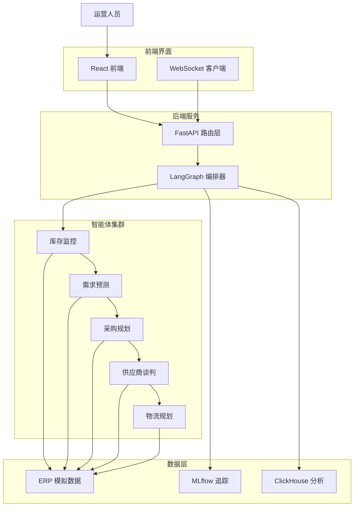

# 01 · 项目概述 — Agentic 供应链运营平台

## 一、项目背景

供应链运营涉及库存监控、需求预测、采购规划、供应商谈判、物流协调等多个环节，传统模式依赖人工经验与分散系统，决策链路长、响应慢。本项目构建了一个**多智能体协作平台**，通过 LangGraph 编排五个专业智能体，形成端到端的自动化决策链路，实现从库存风险识别到采购执行的全流程智能化。

## 二、项目定位

面向供应链运营团队的**智能体驱动决策平台**，核心差异化：

1. **多智能体编排**：5 个专业智能体按 DAG 顺序协作，状态在节点间透传。
2. **实时可观测**：WebSocket 推送每个智能体的执行状态，支持实时可视化。
3. **自然语言控制**：通过对话式界面查询工作流、比较供应商、审查治理。
4. **全栈闭环**：FastAPI 后端 + React 前端 + MLflow 追踪，开箱即用。

## 三、技术栈

| 层 | 技术 | 说明 |
|----|------|------|
| 后端 | Python 3.11 + FastAPI | REST API + WebSocket |
| 工作流 | LangGraph | 状态图编排多智能体 |
| LLM | OpenAI 兼容 API | 可配置模型（默认 Nebius） |
| 前端 | React 18 + TypeScript + Vite | SPA 单页应用 |
| UI 框架 | Tailwind CSS + Framer Motion | 响应式 + 动画 |
| 图表 | Recharts | 数据可视化 |
| 状态管理 | Zustand | 轻量状态库 |
| 可观测性 | MLflow | 工作流追踪 |
| 分析 | ClickHouse | 实时分析（可选） |
| 包管理 | uv（Python）+ npm（Node） | 双端依赖管理 |

## 四、系统架构



## 五、目录结构

```text
Agentic供应链运营平台/
├── 项目文档/                  # 00-README / 01~05 项目文档
├── 部署参考/                  # 部署指南
└── 源码/
    ├── backend/               # Python 后端
    │   ├── src/
    │   │   ├── main.py        # FastAPI 入口
    │   │   ├── config.py      # 配置管理
    │   │   ├── agents/        # 5 个智能体 + 编排器
    │   │   ├── api/           # REST 路由 + WebSocket
    │   │   ├── services/      # ERP 网关、MLflow、ClickHouse
    │   │   ├── llm/           # LLM 客户端
    │   │   └── db/            # ERP 模拟数据库
    │   ├── scripts/           # CLI 工具与演示脚本
    │   ├── tests/             # 测试
    │   └── pyproject.toml     # 依赖配置
    └── frontend/              # React 前端
        ├── src/
        │   ├── pages/         # 5 个页面组件
        │   ├── components/    # 可复用组件
        │   ├── hooks/         # 自定义 Hooks
        │   └── lib/           # API 工具函数
        └── package.json       # 依赖配置
```

## 六、核心数据流（一次完整工作流）

1. **入口**：用户选择 SKU，点击「启动工作流」或调用 `POST /api/analyze/{sku}`。
2. **编排**：`SupplyChainOrchestrator` 按 DAG 顺序执行五个智能体。
3. **库存监控**：读取 ERP 库存数据，识别风险（critical/low/excess/normal）。
4. **需求预测**：基于历史销售数据预测未来需求。
5. **采购规划**：结合风险与预测生成采购申请单。
6. **供应商谈判**：模拟与供应商的议价过程，生成谈判记录。
7. **物流规划**：生成运输方案与交付时间表。
8. **输出**：汇总为最终推荐（采购单），推送至前端展示。
9. **追踪**：MLflow 记录工作流元数据，ClickHouse 记录分析日志。
