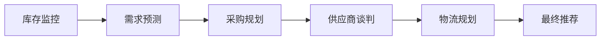
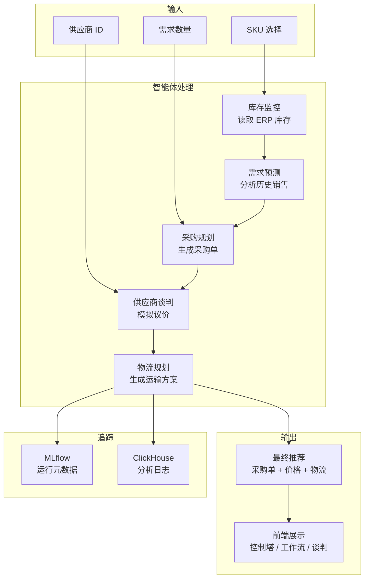

# 03 · 技术架构 — Agentic 供应链运营平台

## 一、LangGraph 工作流编排

### 1.1 状态定义

所有智能体共享统一的 `AgentState` 类型：

```python
class AgentState(TypedDict):
    sku: str                                    # 目标 SKU
    risk_alerts: list[dict]                     # 库存风险告警
    demand_forecast: dict | None                # 需求预测结果
    purchase_requisition: dict | None           # 采购申请单
    negotiation_result: dict | None             # 谈判结果
    negotiation_transcript: list[dict] | None   # 谈判记录
    logistics_plan: dict | None                 # 物流方案
    final_recommendation: dict | None           # 最终推荐
    preferred_vendor_id: int | None             # 首选供应商
    requested_quantity: int | None              # 需求数量
    initial_message: str | None                 # 初始消息
    messages: list[dict]                        # 消息历史
```

### 1.2 DAG 编排



- **入口节点**：`inventory_monitor`
- **终止节点**：`logistics` → `END`
- **执行模式**：`invoke`（同步）或 `stream`（流式）

### 1.3 智能体基类

```python
class BaseAgent(ABC):
    @abstractmethod
    def run(self, state: AgentState) -> AgentState:
        """执行智能体逻辑，返回更新后的状态"""
        pass
```

每个智能体继承 `BaseAgent`，实现 `run()` 方法。

## 二、智能体实现

| 智能体 | 文件 | 职责 | 输出字段 |
|--------|------|------|----------|
| 库存监控 | `inventory_monitor.py` | 读取 ERP 库存，识别风险 | `risk_alerts` |
| 需求预测 | `demand_forecast.py` | 基于历史数据预测需求 | `demand_forecast` |
| 采购规划 | `procurement.py` | 生成采购申请单 | `purchase_requisition` |
| 供应商谈判 | `vendor_negotiation.py` | 模拟议价过程 | `negotiation_result`, `negotiation_transcript` |
| 物流规划 | `logistics.py` | 生成运输方案 | `logistics_plan`, `final_recommendation` |

## 三、服务层

| 服务 | 文件 | 职责 |
|------|------|------|
| ERP 网关 | `services/erp_gateway.py` | 封装 ERP 数据访问 |
| 平台智能 | `services/platform_intelligence.py` | 控制塔、场景、治理数据聚合 |
| MLflow 追踪 | `services/mlflow_tracker.py` | 工作流运行元数据记录 |
| ClickHouse 分析 | `services/clickhouse_analytics.py` | 实时分析日志（可选） |

## 四、LLM 集成

- **客户端**：`llm/client.py` 封装 OpenAI 兼容 API
- **模型配置**：`config.py` 中 `LLM_MODEL` + `LLM_BASE_URL`
- **调用方式**：`complete()` 同步 / `stream_complete()` 流式
- **JSON 提取**：自动处理 `<think>` 标签和 JSON 格式

## 五、WebSocket 实时流

```python
# 服务端
@app.websocket("/ws/workflow/{session_id}")
async def websocket_endpoint(websocket, session_id):
    # 接收 start_workflow 指令
    # 流式推送每个智能体的执行状态
    # 格式: {"type": "agent_status", "data": {"agent": "...", "status": "..."}}

# 客户端
const ws = new WebSocket(`ws://127.0.0.1:8000/ws/workflow/${sessionId}`)
ws.onmessage = (event) => {
    const data = JSON.parse(event.data)
    // 更新 UI 状态
}
```

## 六、数据流图


