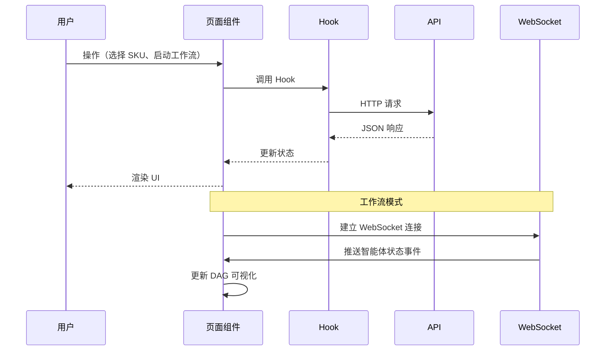

# 05 · 前端架构 — Agentic 供应链运营平台

## 一、目录结构

```text
frontend/src/
├── main.tsx                # 应用入口
├── App.tsx                 # 路由配置
├── index.css               # 全局样式
├── vite-env.d.ts           # Vite 类型声明
├── pages/                  # 页面组件（5 个）
│   ├── Dashboard.tsx       # 控制塔仪表盘
│   ├── WorkflowVisualizer.tsx  # 工作流可视化
│   ├── VendorNegotiation.tsx   # 供应商谈判
│   ├── ScenarioLab.tsx     # 场景实验室
│   └── GovernanceCenter.tsx    # 治理中心
├── components/             # 可复用组件
│   ├── Layout/             # 布局组件
│   │   ├── Layout.tsx
│   │   ├── Sidebar.tsx
│   │   └── Header.tsx
│   ├── Dashboard/          # 仪表盘组件
│   │   ├── KPICards.tsx
│   │   ├── RiskAlertFeed.tsx
│   │   ├── InventoryMap.tsx
│   │   └── TrendCharts.tsx
│   ├── Workflow/           # 工作流组件
│   │   ├── WorkflowCanvas.tsx
│   │   ├── AgentNode.tsx
│   │   ├── StateInspector.tsx
│   │   └── AgentChatPanel.tsx
│   ├── Negotiation/        # 谈判组件
│   │   ├── NegotiationChat.tsx
│   │   ├── VendorCard.tsx
│   │   └── TermsTimeline.tsx
│   └── common/             # 通用组件
│       ├── Modal.tsx
│       ├── Card.tsx
│       ├── Button.tsx
│       └── Badge.tsx
├── hooks/                  # 自定义 Hooks
│   ├── usePlatform.ts      # 平台数据 Hook
│   ├── useApi.ts           # 通用 API Hook
│   └── useAgentSocket.ts   # WebSocket Hook
└── lib/                    # 工具函数
    └── api.ts              # API 请求封装
```

## 二、技术选型

| 技术 | 用途 |
|------|------|
| React 18 | UI 框架 |
| TypeScript | 类型安全 |
| Vite 5 | 构建工具 |
| Tailwind CSS | 原子化样式 |
| Framer Motion | 动画 |
| Recharts | 图表 |
| Zustand | 状态管理 |
| React Router 6 | 路由 |
| Lucide React | 图标 |

## 三、页面说明

### 3.1 控制塔仪表盘（Dashboard）

- **KPI 卡片**：SKU 总数、活跃风险、待处理采购单、待处理金额
- **英雄区**：平台名称、当前态势、优先通道、自主评分、韧性评分
- **影响指标**：服务连续性、交货周期压缩、风险敞口资金、利润护盾
- **决策剧本**：推荐行动列表，含置信度与影响描述
- **补货队列**：优先 SKU 通道，含健康度、可用数量、建议采购
- **仓库负载**：仓库负载分布条形图
- **风险摘要**：风险升级列表与关键信号

### 3.2 工作流可视化（WorkflowVisualizer）

- **KPI 行**：网络状态、已完成智能体、事件吞吐量、预估支出、节省比例、交付 ETA
- **DAG 画布**：五个智能体节点 + 连接线，状态着色
- **事件流**：实时显示最近 5 个事件
- **状态检查器**：智能体状态网格 + 最终推荐详情
- **智能体消息**：按智能体分类的消息列表

### 3.3 供应商谈判（VendorNegotiation）

- **KPI 行**：交货周期、最小起订量、当前价格、折扣收益
- **谈判简报**：策略文本输入
- **供应商选择**：下拉选择供应商 + SKU
- **供应商卡片**：名称、交货周期、起订量、运输方式、标签
- **条款演变**：价格变动 + 折扣收益时间线
- **谈判对话**：实时对话界面，支持接受/终止

### 3.4 场景实验室（ScenarioLab）

- **场景卡片**：名称、严重程度、概率、库存影响、利润影响
- **推荐响应**：每个场景的建议应对措施

### 3.5 治理中心（GovernanceCenter）

- **审批队列**：名称、阈值、待处理数、SLA
- **护栏规则**：规则列表
- **智能体可靠性**：状态、最后决策、可靠性百分比

## 四、数据流



## 五、构建与部署

```bash
# 开发模式
cd frontend
npm run dev    # Vite 开发服务器，端口 5173

# 生产构建
npm run build  # 输出到 dist/

# 预览
npm run preview
```

## 六、国际化

当前界面已全部中文化。如需多语言支持，可引入 `react-i18next` 并提取所有硬编码字符串。
