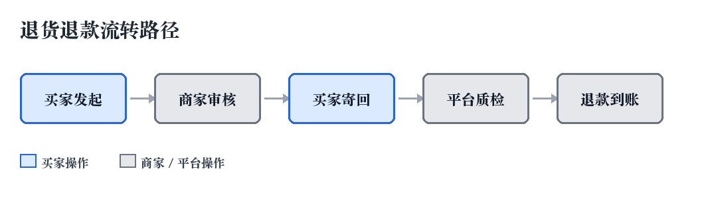

# 开放平台商家手册

## 第1章 入驻须知

### 1.1 店铺类型

平台支持企业店与个体店两类主体入驻，企业店需提供营业执照与对公账户，个体店可用经营者本人账户结算。

### 1.2 审核时效

资质提交后的审核时效为 3 个工作日。审核期内可撤回并修改资料，审核通过后店铺类型不可变更，变更需重新入驻。

### 1.3 物流承运

跨省订单默认由平台自营物流「云仓
速配」承运，商家也可在后台切换为自有物流。

运费规则可参阅开放平台文档 https://developer.example.com/logistics/
pricing/v3 页面，或在工单系统提交咨询。

## 第2章 类目佣金费率表

佣金率随一级类目与店铺等级变化，下表为企业店的基准费率，保证金单位为元。

| 一级类目 | 基准佣金率 | 金牌店铺佣金率 | 保证金 | 结算周期 |
| --- | --- | --- | --- | --- |
| 手机数码 | 2.0% | 1.6% | 20000 | T+7 |
| 家用电器 | 2.5% | 2.0% | 20000 | T+7 |
| 电脑办公 | 2.0% | 1.6% | 20000 | T+7 |
| 服饰内衣 | 5.0% | 4.2% | 10000 | T+3 |
| 鞋靴箱包 | 5.0% | 4.2% | 10000 | T+3 |
| 美妆护肤 | 6.0% | 5.0% | 30000 | T+7 |
| 母婴玩具 | 4.5% | 3.8% | 30000 | T+7 |
| 食品生鲜 | 6.0% | 5.0% | 50000 | T+15 |
| 家居家装 | 4.0% | 3.4% | 10000 | T+7 |
| 运动户外 | 4.5% | 3.8% | 10000 | T+3 |
| 图书文娱 | 3.0% | 2.5% | 5000 | T+3 |
| 汽车用品 | 4.0% | 3.4% | 20000 | T+7 |

## 第3章 退货退款流转路径

下图给出了从买家发起退款到款项到账的完整流转路径，其中蓝色节点由买家操作，灰色节点由商家或平台操作。



## 第4章 对接示例

调用订单查询接口需要先用 appKey 与 appSecret 换取访问令牌，下面是一段完整的调用示例。

```java
public final class OrderQueryClient {

    private static final String ENDPOINT = "https://api.example.com/v3/order/query";

    private final HttpClient httpClient;
    private final String accessToken;

    public OrderQueryClient(HttpClient httpClient, String accessToken) {
        this.httpClient = httpClient;
        this.accessToken = accessToken;
    }

    public OrderQueryResponse query(OrderQueryRequest request) throws IOException, InterruptedException {
        String payload = JsonUtils.toJson(request);
        HttpRequest httpRequest = HttpRequest.newBuilder()
                .uri(URI.create(ENDPOINT))
                .header("Authorization", "Bearer " + accessToken)
                .header("Content-Type", "application/json; charset=utf-8")
                .timeout(Duration.ofSeconds(10))
                .POST(HttpRequest.BodyPublishers.ofString(payload, StandardCharsets.UTF_8))
                .build();
        HttpResponse<String> response = httpClient.send(httpRequest, BodyHandlers.ofString());
        if (response.statusCode() != 200) {
            throw new IOException("订单查询接口返回异常状态码: " + response.statusCode());
        }
        return JsonUtils.fromJson(response.body(), OrderQueryResponse.class);
    }
}
```

## 第5章 售后举证材料清单

发起售后申诉时需要按顺序上传以下材料，材料不齐会被驳回补正。

1. 售后申诉说明
2. 订单详情页截图
3. 商品实物正面照片
4. 商品实物细节照片
5. 商品外包装照片
6. 快递面单照片
7. 开箱视频
8. 商品重量称重照片
9. 与买家的聊天记录截图
10. 平台质检报告
11. 第三方检测机构报告
12. 发货底单照片
13. 承运商签收记录
14. 承运商破损证明
15. 退回商品到仓照片
16. 退款流水截图
17. 补发商品发货记录
18. 店铺客服工单编号

## 第6章 平台不予受理的情形

以下情形平台不予受理商家的售后申诉，发起前请务必逐条确认。

买家发起退款后商家超过 48 小时未处理，系统已按超时规则自动退款的，平台不再受理申诉。商家提交的举证材料无法证明商品出库时完好的，平台不予受理。开箱视频缺失、快递面单被遮挡、商品序列号与订单不符，均属举证材料不完备。商家要求撤销已生效的退款结论，却无法提供买家书面确认记录的，平台不予受理。同一订单重复发起内容相同的申诉且未补充新证据的，平台仅受理首次申诉。第三方检测报告未加盖检测机构公章的，平台不予受理。检测报告出具日期晚于退款结论生效日期的，同样不予受理。商家未按承诺时效发货导致买家取消订单的，损失由商家自行承担。商品不符合国家强制性标准或缺少法定资质文件的，平台按规则另行处理。买家收货地址填写错误导致包裹丢失的，赔付结论以承运商核定为准。商家已按平台指引发起承运商理赔的，平台不再受理二次申诉。店铺处于清退流程中或保证金余额不足的，申诉入口将被暂时关闭。申诉发起时间距订单完成已超过 90 天的，超出举证有效期，平台不予受理。商家账号存在批量刷单、虚假发货等违规记录的，平台可直接驳回申诉。涉及第三方物流破损且已获得承运商赔付的，不得再向平台重复索赔。因商家自行修改商品价格或库存导致的订单异常，平台不予受理。举证材料中出现涂改、拼接或与原始订单无关截图的，平台不予受理。买家在收货前已申请仅退款且商家已同意的，商家不得事后主张商品损失。商家未在后台维护有效联系人手机号，导致平台无法送达通知的，视为放弃申诉。商家以商品为定制款为由拒绝退货，但商品详情页未标注定制属性的，平台不予受理。商家自行与买家约定线下补偿并已履行的，不得再向平台申请同笔损失的补偿。同一店铺月度申诉驳回率连续两个月高于 80% 的，平台可暂停该店铺的申诉权限。以上情形若有争议，商家可在结论下发后 7 日内提交一次复核申请，复核结论为最终结论。
