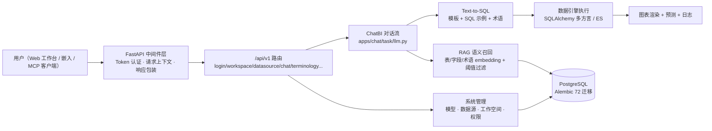

# 01 · 项目概述 — 企业级大模型和 RAG 技术的智能数据分析系统

## 一、项目背景

企业数据分析长期依赖「提需求 → BI 排期 → 手工写 SQL → 出报表」的低效链路。SQLBot 系列产品提出了 **ChatBI** 范式：用户直接用自然语言提问，系统借助大模型的语义理解与 SQL 生成能力，结合 RAG 检索增强，自动完成取数与可视化。本项目即该范式的企业级实现，覆盖从数据源接入、权限管控到多端集成的完整闭环。

## 二、项目定位

面向企业数据团队与业务用户的**对话式智能问数平台**，核心差异化：

1. **Text-to-SQL + RAG**：自然语言 →（数据源/表/字段语义召回）→ 方言 SQL → 执行 → 图表。
2. **企业级安全**：工作空间级资源隔离、行/列级数据权限、SQL 注入转义（CWE-89 防护）、密钥加密存储。
3. **越问越准**：术语库（业务口径统一）+ SQL 示例训练数据（校准模型生成）+ 自定义提示词。
4. **易于集成**：Web 嵌入、弹窗嵌入、独立 **MCP 服务**，可被 n8n/Dify/MaxKB/DataEase 等调用。

## 三、技术栈

| 层 | 技术 | 说明 |
|----|------|------|
| 后端 | Python 3.11 + FastAPI + SQLModel + SQLAlchemy | REST API + 中间件体系 |
| 数据库 | PostgreSQL（主库）+ Alembic 72 迁移 | 启动自动迁移到 head |
| LLM | LangChain 0.3 + LLMFactory | openai/tongyi/vllm/azure 四类，12+ 服务商 |
| RAG | sentence-transformers（text2vec-base-chinese）+ pgvector | 表/字段/术语 embedding + 相似度阈值召回 |
| 数据引擎 | SQLAlchemy 多方言 + ES | 13 种数据源：PG/MySQL/Oracle/ClickHouse/Doris/StarRocks/Hive/DM/Kingbase/Redshift/SQLServer/ES/Excel |
| 缓存 | fastapi-cache2 + Redis（memory 可选） | 响应缓存 |
| 安全 | passlib/bcrypt + PyJWT + pycryptodome + sqlbot-xpack | 密码哈希、Token、密钥加解密 |
| 前端 | Vue 3.5 + TS + Vite 6 + Element Plus + Pinia + AntV(G2/S2/X6) | 工作台 + 图表 |
| 集成 | fastapi-mcp + mcp | MCP 服务（8001） |
| 部署 | Docker + docker-compose + installer | 一键安装 |

## 四、系统架构



## 五、目录结构

```text
企业级智能数据分析系统/
├── 项目文档/                  # 00-README / 01-概述 / 02-目标 / 04~11 八份阶段手册
├── 部署参考/                  # Dockerfile / docker-compose / installer（原项目部署资产）
└── 源码/
    ├── .env                   # 环境配置（backend 上一级，config.py:27 读取）
    ├── backend/               # FastAPI 后端（Python 3.11）
    │   ├── main.py            # 应用入口：lifespan 迁移/缓存/embedding 初始化 + MCP 服务
    │   ├── pyproject.toml     # 全量依赖（uv/poetry 双兼容）
    │   ├── requirements-local.txt  # 本地核心验证依赖（精简）
    │   ├── alembic/           # 72 个迁移版本（001→071）
    │   ├── apps/              # 13 个业务模块
    │   │   ├── ai_model/      #   LLM 工厂（model_factory.py）
    │   │   ├── chat/          #   对话 API + task/llm.py（1978 行核心）
    │   │   ├── dashboard/     #   仪表盘
    │   │   ├── data_training/ #   SQL 示例训练
    │   │   ├── datasource/    #   数据源 + 表 + embedding + 权限
    │   │   ├── db/            #   多库引擎（engine/es_engine/constant）
    │   │   ├── mcp/           #   MCP 服务
    │   │   ├── settings/      #   系统设置
    │   │   ├── system/        #   用户/工作空间/模型/助手/API Key
    │   │   ├── template/      #   Text2SQL 模板（基础+12 方言）
    │   │   └── terminology/   #   术语库
    │   ├── common/            # core（config/db/security）/audit/utils
    │   ├── templates/         # template.yaml + 12 个 sql_examples/*.yaml
    │   ├── locales/           # 4 语言（zh-CN/en/zh-TW/ko-KR）
    │   ├── tests/             # 5 个测试（2 个本地可跑）
    │   └── scripts/           # alembic/lint/format 脚本
    ├── frontend/              # Vue3+TS 工作台（Element Plus + AntV）
    └── g2-ssr/                # G2 图表服务端渲染（Node）
```

## 六、核心数据流（ChatBI 一次提问）

1. **入口**：`POST /chat/{chart_id}`（`apps/chat/api/chat.py`）→ `LLMService`（`apps/chat/task/llm.py:92`）。
2. **RAG 召回**：`get_table_embedding`（`apps/datasource/embedding/table_embedding.py:13`）按问题语义召回相关表/字段。
3. **SQL 生成**：`generate_sql` 模板（`apps/template/generate_sql/generator.py`）+ 术语库 + SQL 示例。
4. **执行**：`execute_sql`（`apps/chat/task/llm.py:1184`）经 `apps/db/engine.py` 多方言引擎。
5. **图表与分析**：图表配置 → 前端 AntV 渲染 → 智能分析/预测。
6. **权限贯穿**：Token 中间件 + 行/列权限 + SQL 注入转义（`apps/datasource/crud/row_permission.py`）。

## 七、与项目一/二/三的关系

| 维度 | 项目三 研究报告生成器 | 本项目 智能数据分析系统 |
|------|---------------------|------------------------|
| 领域 | 学术论文调研报告 | 企业数据智能问数（ChatBI） |
| 核心 | 6 代理流水线 + 本地混合 RAG | Text2SQL + 表/字段语义 RAG + 多引擎执行 |
| LLM | openai SDK 自封装 | LangChain 0.3 + LLMFactory（4 类/12+ 服务商） |
| 存储 | 文件系统 | PostgreSQL + Alembic 迁移（72 版） |
| 权限 | 无 | 工作空间隔离 + 行列权限 + Token 认证 |
| 集成 | REST | REST + Web 嵌入 + MCP |
| 规模 | 中等（30 文件） | 大型（backend 270 文件） |
