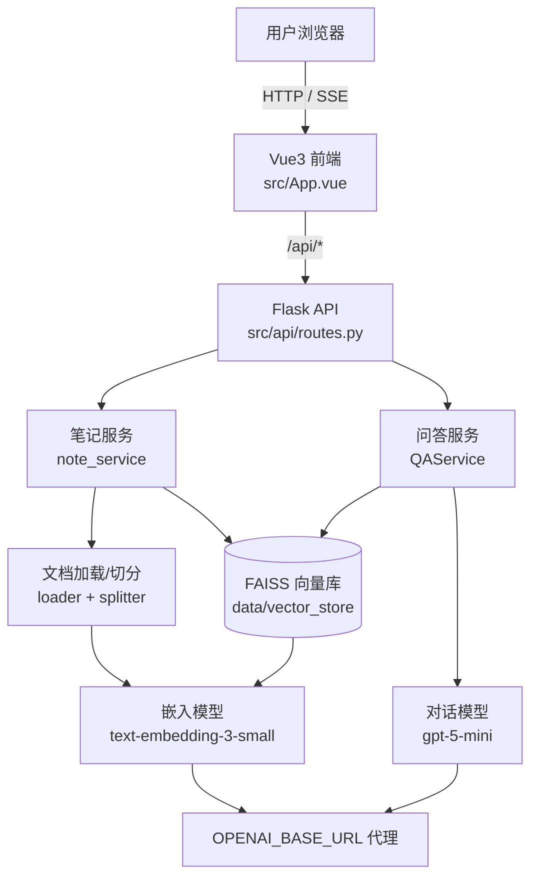
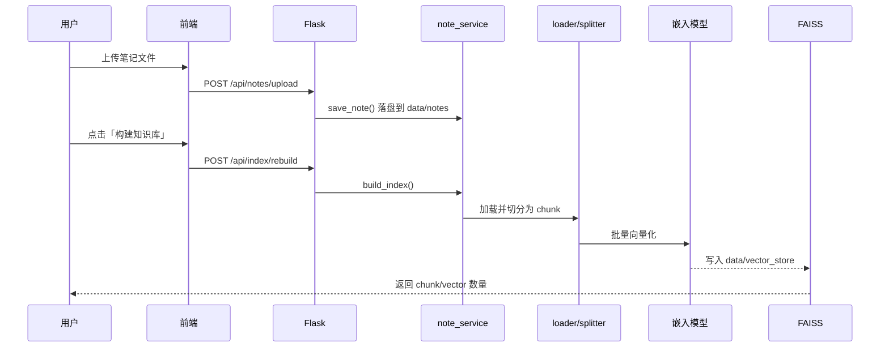
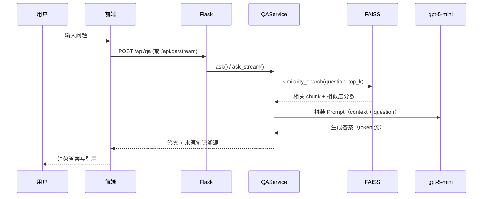

# 01 · 项目概述

## 1.1 项目背景

大语言模型（LLM）具备强大的语言理解与生成能力，但存在**知识时效性与私有数据隔离**两大短板：模型训练数据有截止日期，且无法直接访问用户个人的笔记、文档。检索增强生成（Retrieval-Augmented Generation, RAG）通过将「检索」与「生成」解耦，让模型在回答时先检索用户私有知识库，再基于检索内容生成答案，从而既保留通用能力、又具备私有知识。

本项目面向**个人知识管理**场景，构建一套「智能笔记助手」：用户上传 Markdown / TXT / PDF 笔记，系统自动切分、向量化并建立索引；之后以自然语言提问，即可获得**带出处溯源**的精准回答。

## 1.2 产品定位与价值

| 维度 | 说明 |
|------|------|
| 目标用户 | 学生、研究者、知识工作者——有大量个人笔记需要检索与复盘的人群 |
| 核心痛点 | 笔记越多越难查找；想「从自己的笔记里问问题」却只能全文搜索关键词 |
| 产品价值 | 把「关键词搜索」升级为「语义问答」，答案可追溯到具体笔记与片段 |
| 差异化 | 轻量可私有化部署、带来源引用、支持流式输出、前端零构建即可用 |

## 1.3 技术栈总览

| 层 | 技术 | 版本/说明 |
|----|------|-----------|
| 语言 | Python | 3.11+（本项目用 3.13 托管环境验证） |
| Web 框架 | Flask | REST API + 同源静态托管 |
| 跨域 | Flask-CORS | 开发态前后端分离支持 |
| 编排 | LangChain | 1.3.x，`langchain` / `langchain-openai` / `langchain-community` |
| 向量库 | FAISS (faiss-cpu) | 1.15.x，本地文件索引 |
| 嵌入模型 | text-embedding-3-small | OpenAI 兼容接口，1536 维 |
| 对话模型 | gpt-5-mini | 通过 `OPENAI_BASE_URL` 代理 |
| 配置 | python-dotenv | `.env` 注入 |
| 前端 | Vue 3 + Vite | 3.4.x / 5.4.x |
| HTTP 客户端 | axios | 1.7.x（SSE 流式用原生 fetch） |

## 1.4 系统架构



后端以**单一 Flask 进程**同时托管「REST API」与「Vue 构建产物（dist）」，无需额外 Nginx 即可同源访问，简化部署。

## 1.5 目录结构

```
智能笔记助手/
├── 项目文档/                    # 本手册集
│   ├── 00-README.md
│   ├── 01-项目概述.md
│   ├── 02-项目目标.md
│   └── 03-项目实操.md
└── 源码/
    ├── backend/                # Python 后端
    │   ├── .env                # API 配置（已内置）
    │   ├── app.py              # Flask 入口（含静态托管）
    │   ├── requirements.txt    # 依赖清单
    │   ├── src/
    │   │   ├── config.py       # 全局配置（集中读取 .env）
    │   │   ├── api/routes.py   # REST 路由
    │   │   ├── rag/            # RAG 核心
    │   │   │   ├── embeddings.py   # 嵌入模型封装
    │   │   │   ├── loader.py       # 文档加载
    │   │   │   ├── splitter.py     # 文本切分
    │   │   │   ├── vectorstore.py  # FAISS 管理（含中文路径修复）
    │   │   │   └── chain.py        # Prompt + LLM 链
    │   │   └── services/       # 业务编排
    │   │       ├── note_service.py  # 文件管理 + 建索引
    │   │       └── qa_service.py    # 检索问答编排
    │   ├── data/
    │   │   ├── notes/          # 用户上传的笔记（含示例）
    │   │   └── vector_store/   # FAISS 索引文件
    │   └── tests/             # 自动化测试
    │       ├── test_full_flow.py   # 端到端流程测试
    │       └── test_http_smoke.py  # HTTP 接口层测试
    └── frontend/               # Vue3 前端
        ├── package.json
        ├── vite.config.js
        ├── index.html
        ├── src/
        │   ├── App.vue
        │   ├── api.js          # 接口封装
        │   ├── style.css
        │   └── components/
        │       ├── NotePanel.vue   # 笔记管理
        │       └── ChatPanel.vue   # 问答对话
        └── dist/               # 构建产物（Flask 托管）
```

## 1.6 核心数据流

### 1.6.1 知识库构建（写链路）



### 1.6.2 问答（读链路）



## 1.7 适用场景与边界

**适用**
- 个人/团队私有笔记、论文、手册的语义检索与问答
- 作为 RAG 入门教学与企业级脚手架

**边界（当前版本）**
- 单用户本地/内网部署，未做多租户隔离与鉴权
- 索引为全量重建（非增量），笔记量大时重建成本随文档增长
- 依赖外部大模型代理，离线不可用

下一篇：[02-项目目标 →](./02-项目目标.md)
