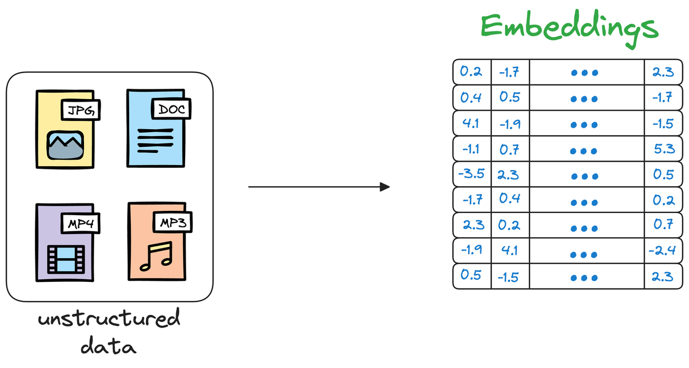
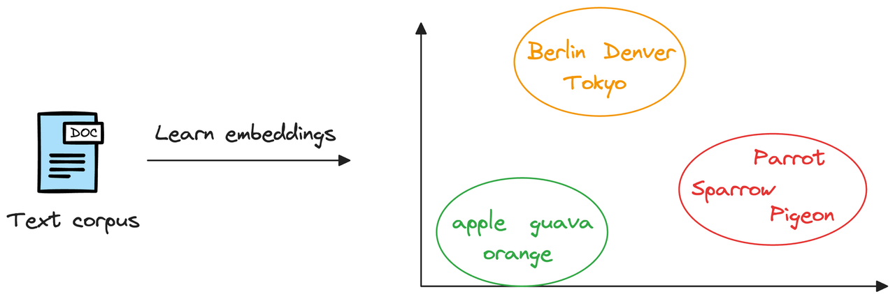
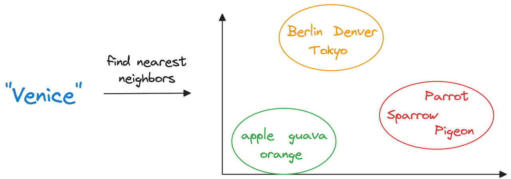
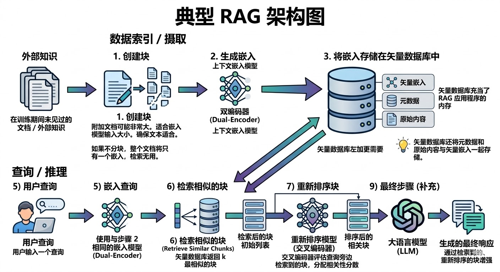
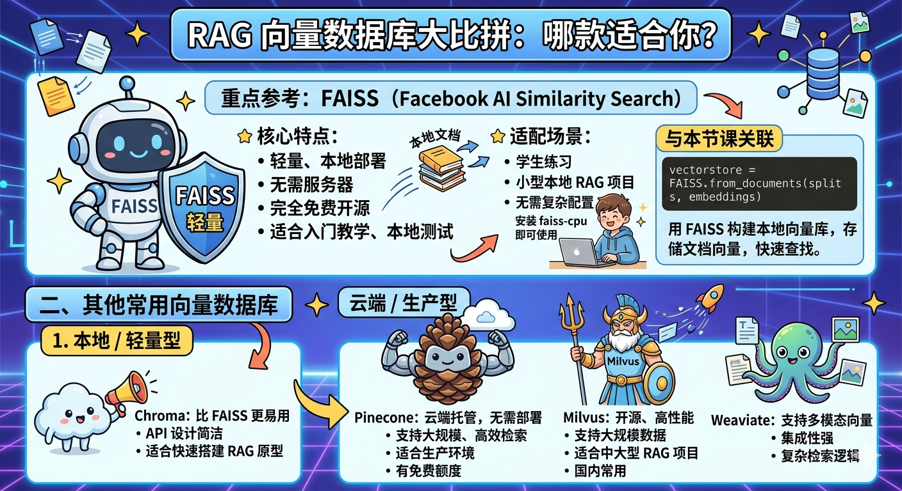

# LangChain:v1\.0 基础教程

本教程基于LangChain v1\.0官方基础体系编写，聚焦**模型调用、提示词模板、消息与对话管理、输出解析、检索增强、自定义工具、代理等**基础模块，所有示例代码可直接运行，贴合实际开发场景，是入门LangChain v1\.0的必备内容。

LangChain v1\.0核心升级为**基于LangGraph运行时**，提供统一组件接口、简化API设计，相比0\.x版本大幅降低开发复杂度，本教程所有内容均适配该版本特性。

## 环境准备

### 1\. 安装核心依赖

```Bash
# 基础依赖 + Groq（速度快、免费额度充足，推荐）
pip install langchain langchain-groq python-dotenv
# 若使用OpenAI/Anthropic，安装对应依赖
pip install langchain-openai langchain-anthropic
# 镜像使用
docker load -i langchain.tar
docker tag imagesid langchaintop:v1.0
docker run -it -p 10045:8888 --name langchan  langchaintop:v1.0
```

### 2\. 配置API密钥

创建`.env`文件，将API密钥写入（以Groq为例），避免硬编码到代码中：

```Bash
GROQ_API_KEY=your_groq_api_key_here
```

### 3\. 获取API密钥

- Groq：访问[Groq Console](https://console.groq.com/)，注册后在API Keys页面创建并复制密钥；

- OpenAI/Anthropic：前往对应官方平台，在个人中心获取API密钥。

### 4\. 基础代码初始化

在代码中加载环境变量，验证密钥有效性：

```Python
import os
from dotenv import load_dotenv

# 加载当前目录下的 .env 文件
load_dotenv()

# 读取环境变量
OPENAI_API_KEY = os.getenv("OPENAI_API_KEY")
OPENAI_BASE_URL = os.getenv("OPENAI_BASE_URL")

OLLAMA_BASE_URL = os.getenv("OLLAMA_BASE_URL")
OLLAMA_MODEL = os.getenv("OLLAMA_MODEL")

print("OPENAI_API_KEY:", OPENAI_API_KEY[:10] + "...")
print("OPENAI_BASE_URL:", OPENAI_BASE_URL)
print("OLLAMA_BASE_URL:", OLLAMA_BASE_URL)
print("OLLAMA_MODEL:", OLLAMA_MODEL)

```

# 模块01：Hello LangChain \- 第一个LLM调用

本模块是LangChain v1\.0的入门基础，核心掌握**模型初始化**和**同步调用**，理解消息类型的基础概念，完成第一个LLM调用案例。

## 学习目标

1. 掌握LangChain v1\.0统一的模型初始化接口`init_chat_model`；

2. 学会使用核心调用方法`invoke`，理解三种输入格式；

3. 认识System/Human/AI三种基础消息类型；

4. 能解析模型返回值，获取核心内容与元数据。

## 1\.1 核心：init\_chat\_model 模型初始化

`init_chat_model`是LangChain v1\.0**跨提供商的统一模型初始化接口**，无需记忆不同厂商的初始化方式，仅需修改模型字符串即可切换模型，支持Groq/OpenAI/Anthropic等主流提供商。

### 基本语法

```Python
from langchain.chat_models import init_chat_model
model = init_chat_model(
    "provider:model_name",  # 提供商:模型名称，必填
    api_key=os.getenv("GROQ_API_KEY"),  # API密钥，可选（从环境变量读取）
    temperature=0.7,  # 输出随机性，0.0-2.0
    max_tokens=1000,  # 限制输出最大token数
    **kwargs  # 模型特定额外参数
)
```

### 关键参数详解

|参数|类型|说明|默认值|
|---|---|---|---|
|`model`<br>|str|格式为`提供商:模型名`，如`groq:llama-3.3-70b-versatile`|无（必填）|
|`api_key`|str|API密钥，不填则从环境变量读取（如`GROQ_API_KEY`）|None|
|`temperature`<br>|float|控制随机性：0\.0（最确定）、1\.0（平衡）、2\.0（最随机）|1\.0|
|`max_tokens`<br>|int|限制模型输出的最大token数量|模型默认值|

### 支持的主流提供商格式

```Python
# Groq（推荐）
"groq:llama-3.3-70b-versatile"
"groq:mixtral-8x7b-32768"
# OpenAI
"openai:gpt-4"
"openai:gpt-3.5-turbo"
# Anthropic
"anthropic:claude-sonnet-4-5-20250929"
```

### 三种初始化示例

```Python
from langchain.chat_models import init_chat_model
import os
load_dotenv()

# 方式1：直接传递API key（不推荐）
model1 = init_chat_model("groq:llama-3.3-70b-versatile", api_key="your_key")
# 方式2：从环境变量读取（推荐）
model2 = init_chat_model("groq:llama-3.3-70b-versatile", api_key=os.getenv("GROQ_API_KEY"))
# 方式3：配置温度和token限制（生产环境常用）
model3 = init_chat_model(
    "groq:llama-3.3-70b-versatile",
    api_key=os.getenv("GROQ_API_KEY"),
    temperature=0.0,  # 确定性输出，适合数据提取/代码生成
    max_tokens=500
)
```

## 1\.2 核心：invoke 方法 \- 同步调用模型

`invoke`是LangChain v1\.0中**最核心的同步调用方法**，作用是将输入传递给LLM模型，返回包含回复内容和元数据的完整响应，是入门阶段最常用的调用方式。

### 基本语法

```Python
response = model.invoke(input, config=None)
```

- `input`：必填，支持**纯字符串、字典列表、消息对象列表**三种格式；

- `config`：可选，高级配置（回调函数、元数据等），初学者暂无需使用。

### 三种输入格式（重点）

#### 格式1：纯字符串（最简单，适合单次无上下文问答）

- **使用场景**：快速测试、简单一次性问答，无需系统提示和对话历史；

- **优点**：代码最少、最简洁；

- **缺点**：无法设置系统角色、无法传递上下文。

```Python
# 示例：单次问答
model = init_chat_model("groq:llama-3.3-70b-versatile", api_key=os.getenv("GROQ_API_KEY"))
response = model.invoke("什么是机器学习？用一句话解释")
# 打印核心回复内容
print(response.content)
```

#### 格式2：字典列表（推荐，最灵活，生产环境首选）

- **使用场景**：需要系统提示、多轮对话、精确控制对话流程的场景；

- **优点**：支持系统角色、多轮上下文，与OpenAI API格式一致，JSON兼容易存储；

- **角色说明**：`system`（设定AI行为）、`user`（用户输入）、`assistant`（AI历史回复，用于上下文）。

```Python
# 示例1：带系统提示的单次问答
messages = [
    {
        "role": "system",
        "content": "你是专业的Python编程导师，回答简洁准确并提供代码示例"
    },
    {
        "role": "user",
        "content": "什么是Python列表推导式？"
    }
]
response = model.invoke(messages)
print(response.content)

# 示例2：多轮对话（带历史）
conversation = [{"role": "system", "content": "你是友好的助手"}]
# 第一轮
conversation.append({"role": "user", "content": "我叫小明"})
r1 = model.invoke(conversation)
conversation.append({"role": "assistant", "content": r1.content})  # 保存AI回复
# 第二轮（基于历史）
conversation.append({"role": "user", "content": "我刚才说我叫什么？"})
r2 = model.invoke(conversation)
print(r2.content)  # AI会回答：你说你叫小明
```

#### 格式3：消息对象列表（类型安全，适合大型项目/团队协作）

- **使用场景**：需要类型检查、IDE自动补全的大型项目，团队协作场景；

- **优点**：类型安全、易发现错误、IDE自动补全；

- **缺点**：代码繁琐、难以序列化（JSON）；

- **需导入**：`SystemMessage`/`HumanMessage`/`AIMessage`（从`langchain_core.messages`）。

```Python
from langchain_core.messages import SystemMessage, HumanMessage, AIMessage
# 示例
messages = [
    SystemMessage(content="你是Python专家"),
    HumanMessage(content="什么是生成器？")
]
response = model.invoke(messages)
# 继续对话
messages.append(AIMessage(content=response.content))
messages.append(HumanMessage(content="能给个例子吗？"))
response2 = model.invoke(messages)
print(response2.content)
```

### invoke 返回值解析

`invoke`返回**AIMessage对象**，包含回复内容、元数据、Token使用情况等核心信息，常用属性如下：

```Python
response = model.invoke("用一句话解释AI")
# 1. 核心回复内容（最常用）
print("AI回复：", response.content)
# 2. 响应元数据（模型信息、结束原因等）
metadata = response.response_metadata
print("使用模型：", metadata["model_name"])
print("结束原因：", metadata["finish_reason"])
# 3. Token使用情况
token_usage = metadata.get("token_usage", {})
print("输入Token：", token_usage.get("prompt_tokens"))
print("输出Token：", token_usage.get("completion_tokens"))
print("总Token：", token_usage.get("total_tokens"))
# 4. 消息唯一ID
print("消息ID：", response.id)
```

## 1\.3 基础消息类型

LangChain使用三种核心消息类型区分对话角色，是实现多轮对话和上下文管理的基础，**推荐使用字典格式**，无需导入对象，更简洁。

|消息类型|字典格式|对象格式|核心用途|
|---|---|---|---|
|系统消息|`{"role":"system", "content":...}`|`SystemMessage(content=...)`|设定AI的行为、角色、规则|
|用户消息|`{"role":"user", "content":...}`|`HumanMessage(content=...)`|表示用户的输入/问题<br>|
|AI消息|`{"role":"assistant", "content":...}`|`AIMessage(content=...)`|表示AI的回复，用于对话历史|

## 1\.4 最佳实践

1. **始终用环境变量管理API密钥**，避免硬编码；

2. **优先使用字典列表作为invoke输入格式**，兼顾灵活性和简洁性；

3. **根据场景设置temperature**：0\.0\-0\.3（精准任务）、0\.5\-0\.7（日常问答）、0\.8\+（创造性任务）；

4. **监控Token使用**，避免超出额度或产生过高成本；

5. **添加错误处理**，捕获API调用中的配置/网络错误：

```Python
try:
    response = model.invoke("Hello")
    print(response.content)
except ValueError as e:
    print(f"配置错误：{e}")
except ConnectionError as e:
    print(f"网络错误：{e}")
except Exception as e:
    print(f"未知错误：{e}")
```

# 模块02：Prompt Templates \- 提示词模板

本模块解决**字符串拼接的痛点**，掌握LangChain v1\.0中两种核心提示词模板的使用，实现提示词的复用、维护和标准化，是构建可复用LLM应用的基础。

## 学习目标

1. 理解为什么需要提示词模板，对比字符串拼接的弊端；

2. 掌握简单文本模板`PromptTemplate`的创建和使用；

3. 掌握聊天消息模板`ChatPromptTemplate`的核心用法（重点）；

4. 学会模板的高级特性：部分变量、模板组合、构建模板库；

5. 了解LCEL链式调用的基础，实现模板与模型的组合。

## 2\.1 为什么需要提示词模板？

### 字符串拼接的弊端（不推荐）

直接使用f\-string/字符串拼接构建提示词，存在**难以维护、易出错、不可复用、混合逻辑与数据**等问题：

```Python
# ❌ 不推荐：字符串拼接
user_name = "张三"
topic = "Python"
prompt = f"你好 {user_name}，我来帮你学习 {topic}"
```

### 提示词模板的优势（推荐）

使用LangChain的模板组件，实现**模板与数据分离**，具备可复用、可维护、类型安全、可测试、可组合的特点：

```Python
# ✅ 推荐：使用PromptTemplate
from langchain_core.prompts import PromptTemplate
template = PromptTemplate.from_template("你好 {user_name}，我来帮你学习 {topic}")
prompt = template.format(user_name="张三", topic="Python")
```

## 2\.2 PromptTemplate \- 简单文本模板

适用于**单一纯文本提示**的场景，如简单翻译、单次指令生成，核心实现**变量替换和模板格式化**。

### 基本创建方法（三种）

#### 方法1：from\_template（推荐，最简单）

自动识别模板中的变量，无需手动指定，最常用：

```Python
from langchain_core.prompts import PromptTemplate
# 创建翻译模板
template = PromptTemplate.from_template("将以下{source_lang}文本翻译成{target_lang}：\n{text}")
# 自动识别变量
print(template.input_variables)  # 输出：['source_lang', 'target_lang', 'text']
```

#### 方法2：显式指定变量

手动定义`input_variables`，适合需要严格控制变量的场景：

```Python
template = PromptTemplate(
    input_variables=["product", "feature"],
    template="为{product}写一句广告语，重点突出{feature}特点。"
)
```

#### 方法3：部分变量预填充

对固定不变的变量进行预填充，生成模板变体，减少重复传参：

```Python
template = PromptTemplate.from_template("你是一个{role}，请{task}")
# 预填充role为Python导师
partial_template = template.partial(role="Python导师")
# 仅需传递task
prompt = partial_template.format(task="解释装饰器")
```

### 模板使用方法（两种）

#### 方法1：format\(\) \- 返回字符串（最常用）

直接生成格式化后的字符串，可直接传递给`model.invoke()`：

```Python
template = PromptTemplate.from_template("你好 {name}")
prompt_str = template.format(name="张三")
response = model.invoke(prompt_str)
```

#### 方法2：invoke\(\) \- 返回PromptValue对象

适合链式调用，可通过`.text`获取字符串：

```Python
prompt_value = template.invoke({"name": "张三"})
print(prompt_value.text)  # 输出：你好 张三
```

## 2\.3 ChatPromptTemplate \- 聊天消息模板（重点）

适用于**聊天、多轮对话、需要多角色提示**的场景，是生产环境的首选模板，支持`system/user/assistant`三种角色，与`invoke`的字典列表输入格式完美适配。

### PromptTemplate vs ChatPromptTemplate

|特性|PromptTemplate|ChatPromptTemplate|
|---|---|---|
|输出格式|纯文本字符串|消息列表（字典/对象）|
|角色支持|无|支持system/user/assistant|
|对话历史|不支持|原生支持|
|适用场景|简单纯文本提示|聊天、多轮交互、LLM应用核心|

### 基本创建方法（三种）

#### 方法1：元组格式（推荐，最简单）

通过`(角色, 模板文本)`的元组列表创建，自动识别变量，最常用：

```Python
from langchain_core.prompts import ChatPromptTemplate
# 创建模板
template = ChatPromptTemplate.from_messages([
    ("system", "你是一个{role}，擅长{skill}"),
    ("user", "{question}")
])
# 格式化生成消息列表
messages = template.format_messages(
    role="编程导师",
    skill="用简单语言解释复杂概念",
    question="什么是递归？"
)
# 直接调用模型
response = model.invoke(messages)
```

#### 方法2：字符串简写

单独的字符串会被自动解析为`user`角色，简化代码：

```Python
template = ChatPromptTemplate.from_messages([
    ("system", "你是友好的助手"),
    "{user_input}"  # 等价于 ("user", "{user_input}")
])
messages = template.format_messages(user_input="你好")
```

#### 方法3：MessagePromptTemplate（高级，类型安全）

通过系统/用户消息模板对象创建，适合大型项目，类型安全：

```Python
from langchain_core.prompts import SystemMessagePromptTemplate, HumanMessagePromptTemplate
# 分别创建系统和用户模板
system_template = SystemMessagePromptTemplate.from_template("你是一个{role}")
human_template = HumanMessagePromptTemplate.from_template("{question}")
# 组合为ChatPromptTemplate
template = ChatPromptTemplate.from_messages([system_template, human_template])
messages = template.format_messages(role="Python专家", question="什么是装饰器？")
```

### 模板使用方法（两种）

#### 方法1：format\_messages\(\) \- 返回消息列表（最常用）

生成可直接传递给`model.invoke()`的消息列表（字典格式）：

```Python
template = ChatPromptTemplate.from_messages([("system", "你是{role}"), ("user", "{input}")])
messages = template.format_messages(role="助手", input="你好")
response = model.invoke(messages)
```

#### 方法2：invoke\(\) \- 返回ChatPromptValue对象

适合链式调用，可通过`.to_messages()`获取消息列表：

```Python
prompt_value = template.invoke({"role": "助手", "input": "你好"})
messages = prompt_value.to_messages()
```

## 2\.4 模板高级特性

### 2\.4\.1 部分变量预填充

对模板中**固定不变的变量**进行预填充，生成适用于特定场景的模板变体，减少重复代码，适合多场景复用同一基础模板：

```Python
# 基础翻译模板
base_template = ChatPromptTemplate.from_messages([
    ("system", "你是专业翻译，精通{source}和{target}"),
    ("user", "翻译：{text}")
])
# 生成英译中专用模板
en_to_zh = base_template.partial(source="英语", target="中文")
# 生成中译英专用模板
zh_to_en = base_template.partial(source="中文", target="英语")
# 使用时仅需传递text
messages1 = en_to_zh.format_messages(text="Hello")
messages2 = zh_to_en.format_messages(text="你好")
```

### 2\.4\.2 模板组合

将多个模板片段组合为复杂模板，实现片段复用，支持**字符串拼接**和\*\*\+运算符\*\*两种方式：

```Python
# 方式1：字符串拼接（推荐）
role_part = "你是一个{domain}专家。"
style_part = "回答风格：{style}。"
constraint_part = "限制：{constraint}。"
full_system = role_part + style_part + constraint_part
template = ChatPromptTemplate.from_messages([("system", full_system), ("user", "{question}")])

# 方式2：+运算符（LangChain v1.0支持）
template1 = ChatPromptTemplate.from_messages([("system", "你是助手")])
template2 = ChatPromptTemplate.from_messages([("{user_input}")])
combined_template = template1 + template2
```

### 2\.4\.3 构建可复用模板库（生产环境必备）

将项目中常用的模板封装为**模板库类**，统一管理，实现跨文件复用，提升代码可维护性：

```Python
# 新建templates.py文件，封装模板库
from langchain_core.prompts import ChatPromptTemplate
class PromptLibrary:
    """LangChain v1.0 可复用提示词模板库"""
    # 翻译模板
    TRANSLATOR = ChatPromptTemplate.from_messages([
        ("system", "你是专业翻译，精通{source_lang}和{target_lang}"),
        ("user", "翻译以下文本：\n{text}")
    ])
    # 代码审查模板
    CODE_REVIEWER = ChatPromptTemplate.from_messages([
        ("system", "你是{language}代码审查专家，重点关注{focus}"),
        ("user", "审查代码：\n```{language}\n{code}\n```")
    ])
    # 内容摘要模板
    SUMMARIZER = ChatPromptTemplate.from_messages([
        ("system", "你是内容摘要专家"),
        ("user", "将以下内容总结为{num}个要点：\n{content}")
    ])

# 其他文件中使用
from templates import PromptLibrary
messages = PromptLibrary.TRANSLATOR.format_messages(
    source_lang="英语",
    target_lang="中文",
    text="Hello World"
)
```

## 2\.5 LCEL链式调用（基础预览）

**LCEL** = LangChain Expression Language，是LangChain v1\.0的核心表达式语言，通过**管道运算符****`|`****将模板、模型、解析器**等组件串联，实现端到端的流程，代码更简洁、可读。

### 核心用法：模板 \+ 模型

```Python
from langchain_core.prompts import ChatPromptTemplate
from langchain.chat_models import init_chat_model
import os
load_dotenv()

# 1. 创建模板
template = ChatPromptTemplate.from_messages([
    ("system", "你是{role}"),
    ("user", "{input}")
])
# 2. 初始化模型
model = init_chat_model("groq:llama-3.3-70b-versatile", api_key=os.getenv("GROQ_API_KEY"))
# 3. 管道运算符组合为链
chain = template | model
# 4. 直接调用链，传递变量字典
response = chain.invoke({"role": "Python导师", "input": "什么是装饰器？"})
print(response.content)
```

### 链式调用的优势

- 简洁：一行代码完成多步操作，无需手动格式化和调用；

- 可读：清晰展示数据流向（输入→模板→模型→输出）；

- 可组合：可轻松添加输出解析器、工具等组件；

- 可复用：链本身可作为组件，参与更复杂的组合。

## 2\.6 最佳实践

1. **命名规范**：模板命名使用`功能_场景_template`格式，如`translator_en2zh_template`，避免无意义命名；

2. **目录组织**：将模板按功能拆分到`templates/`目录下，如`common.py`（通用模板）、`translation.py`（翻译模板）；

3. **文档化模板**：为模板库添加注释，说明变量含义和使用示例；

4. **测试模板**：为核心模板编写测试，验证变量识别和格式化正确性；

5. **优先使用ChatPromptTemplate**：绝大多数LLM应用为聊天/对话场景，该模板适配性更强。

# 模块03：Messages \- 消息类型与对话管理

本模块是LangChain v1\.0实现**多轮对话**的核心，聚焦**对话历史的管理和优化**（难点），解决AI“失忆”问题，同时优化对话历史长度，减少Token消耗，是构建聊天机器人、对话式AI的必备知识。

## 学习目标

1. 巩固三种核心消息类型，掌握**字典格式的优先使用原则**；

2. 理解对话管理的核心规则，解决AI“失忆”问题；

3. 掌握正确的多轮对话实现方法，能手动维护对话历史；

4. 学会对话历史优化技巧，只保留最近N轮对话，减少Token消耗；

5. 规避对话管理中的常见错误。

## 3\.1 核心：三种消息类型（极简版）

本模块重点在**对话管理**，消息类型仅需掌握**字典格式**（推荐，最简洁），无需使用消息对象，减少代码冗余，以下为核心总结：

|角色|字典格式|核心用途|注意事项|
|---|---|---|---|
|System|`{"role":"system", "content":...}`|设定AI的行为、角色、规则|全程保留，不随对话优化删除|
|User|`{"role":"user", "content":...}`|用户的输入/问题|每轮对话新增，加入历史|
|Assistant<br>|`{"role":"assistant", "content":...}`|AI的回复|**必须保存到历史**，否则AI失忆|

✅ **核心推荐**：全程使用字典格式，无需导入`SystemMessage/HumanMessage/AIMessage`，代码更简洁，易序列化。

```Python
# ✅ 推荐写法
messages = [
    {"role": "system", "content": "你是Python导师"},
    {"role": "user", "content": "什么是列表？"}
]
# ❌ 不推荐写法（繁琐）
from langchain_core.messages import SystemMessage, HumanMessage
messages = [SystemMessage(content="你是Python导师"), HumanMessage(content="什么是列表？")]
```

## 3\.2 核心难点：对话历史管理

### 3\.2\.1 对话管理的黄金规则

**每次调用model\.invoke\(\)时，必须传递**完整的对话历史\*\*，且AI的回复必须保存到历史中\*\*。

LLM本身无记忆能力，所有上下文都来自传递的对话历史，若未传递或未保存AI回复，会导致AI“失忆”。

### 3\.2\.2 错误与正确写法对比

#### ❌ 错误写法（AI失忆）

未保存AI回复，第二次调用未传递完整历史，AI无法记住上一轮内容：

```Python
# 第一次调用
r1 = model.invoke("我叫张三")
# 第二次调用（未传历史）
r2 = model.invoke("我刚才说我叫什么？")  # AI回答：不知道/你没说过
```

#### ✅ 正确写法（AI保留记忆）

初始化对话历史列表，**每轮都将用户输入和AI回复加入历史**，调用时传递完整列表：

```Python
# 1. 初始化对话历史（建议加入system消息，定义AI角色）
conversation = [{"role": "system", "content": "你是友好的助手"}]
# 2. 第一轮对话
conversation.append({"role": "user", "content": "我叫张三"})  # 加入用户输入
r1 = model.invoke(conversation)  # 传递完整历史
conversation.append({"role": "assistant", "content": r1.content})  # 保存AI回复
# 3. 第二轮对话
conversation.append({"role": "user", "content": "我刚才说我叫什么？"})  # 加入新的用户输入
r2 = model.invoke(conversation)  # 传递完整历史
print(r2.content)  # AI回答：你说你叫张三
```

### 3\.2\.3 多轮对话的通用流程

无论多少轮对话，都遵循以下流程，核心是**持续维护对话历史列表**：

```Plain Text
1. 初始化：conversation = [{"role":"system", "content":"AI角色设定"}]
2. 每轮对话：
   a. 追加用户输入 → conversation.append({"role":"user", "content":用户问题})
   b. 调用模型 → response = model.invoke(conversation)
   c. 追加AI回复 → conversation.append({"role":"assistant", "content":response.content})
3. 重复步骤2，实现多轮上下文对话
```

### 3\.2\.4 完整多轮对话示例（Python导师场景）

```Python
from langchain.chat_models import init_chat_model
import os
from dotenv import load_dotenv
load_dotenv()

# 初始化模型
model = init_chat_model("groq:llama-3.3-70b-versatile", api_key=os.getenv("GROQ_API_KEY"))
# 初始化对话历史
conversation = [{"role": "system", "content": "你是专业的Python导师，回答简洁准确"}]

# 第一轮：问列表
conversation.append({"role": "user", "content": "什么是Python列表？"})
r1 = model.invoke(conversation)
conversation.append({"role": "assistant", "content": r1.content})
print(f"AI：{r1.content}\n")

# 第二轮：问列表与元组的区别（基于上下文）
conversation.append({"role": "user", "content": "它和元组有什么区别？"})
r2 = model.invoke(conversation)
conversation.append({"role": "assistant", "content": r2.content})
print(f"AI：{r2.content}\n")

# 第三轮：测试记忆（问第一个问题是什么）
conversation.append({"role": "user", "content": "我第一个问题问的是什么？"})
r3 = model.invoke(conversation)
print(f"AI：{r3.content}")  # AI回答：你第一个问题问的是Python列表是什么
```

## 3\.3 核心优化：对话历史精简（避免过长）

### 3\.3\.1 问题背景

对话历史会随轮数增加不断变长，导致**Token消耗剧增、调用速度变慢、成本升高**，甚至超出模型的上下文窗口限制。

### 3\.3\.2 优化原则

1. **始终保留system消息**：system消息定义AI角色，是所有对话的基础，不可删除；

2. **只保留最近N轮对话**：每轮对话为`user + assistant`一对消息，保留最近3\-5轮即可满足大部分场景；

3. **丢弃更早的历史**：对无意义的早期对话进行丢弃，减少Token消耗。

### 3\.3\.3 通用优化函数（直接复用）

编写通用函数，实现**分离system消息、保留最近N轮对话、重新组合**的逻辑，可直接在项目中使用：

```Python
def keep_recent_messages(messages, max_pairs=3):
    """
    保留最近的N轮对话，优化对话历史长度
    :param messages: 原始对话历史（字典列表）
    :param max_pairs: 保留的对话轮数，每轮=user+assistant，默认3轮
    :return: 优化后的对话历史（system消息 + 最近N轮对话）
    """
    # 分离system消息和普通对话消息
    system_msgs = [m for m in messages if m.get("role") == "system"]
    conversation_msgs = [m for m in messages if m.get("role") != "system"]
    # 只保留最近的max_pairs*2条普通消息（每轮2条）
    recent_msgs = conversation_msgs[-(max_pairs * 2):] if len(conversation_msgs) > max_pairs*2 else conversation_msgs
    # 重新组合：system消息 + 最近N轮对话
    return system_msgs + recent_msgs

# 使用示例
optimized_conversation = keep_recent_messages(conversation, max_pairs=2)  # 保留最近2轮
response = model.invoke(optimized_conversation)
```

### 3\.3\.4 优化后多轮对话流程

在原有多轮对话流程中，**每次调用模型前对对话历史进行优化**，既保留上下文，又减少Token消耗：

```Python
# 初始化
conversation = [{"role": "system", "content": "你是友好的助手"}]
max_pairs = 3  # 保留最近3轮

# 每轮对话前优化历史
conversation = keep_recent_messages(conversation, max_pairs)
# 追加用户输入
conversation.append({"role": "user", "content": "新的问题"})
# 调用模型
response = model.invoke(conversation)
# 保存AI回复
conversation.append({"role": "assistant", "content": response.content})
```

## 3\.4 对话管理的常见错误（避坑）

### 错误1：忘记保存AI的回复

调用模型后，未将`response.content`加入对话历史，导致后续对话无上下文：

```Python
# ❌ 错误
conversation.append({"role": "user", "content": "问题1"})
r1 = model.invoke(conversation)
# 忘记保存r1.content！
conversation.append({"role": "user", "content": "问题2"})
r2 = model.invoke(conversation)  # AI无法回答问题2的上下文
```

### 错误2：每次重新创建对话历史列表

每轮对话都重新初始化`conversation`，导致历史丢失，AI完全失忆：

```Python
# ❌ 错误
conversation = [{"role": "user", "content": "问题1"}]
r1 = model.invoke(conversation)
conversation = [{"role": "user", "content": "问题2"}]  # 重新创建，丢失历史
r2 = model.invoke(conversation)  # AI失忆
```

### 错误3：删除system消息

优化对话历史时，误将system消息删除，导致AI角色重置，行为不符合预期：

```Python
# ❌ 错误：直接截取列表，可能删除system消息
optimized = conversation[-5:]  # 若system消息在最前面，会被删除
# ✅ 正确：使用keep_recent_messages函数，分离并保留system消息
```

### 错误4：未传递完整历史

调用模型时，仅传递新的用户输入，未传递历史列表，导致无上下文：

```Python
# ❌ 错误
conversation.append({"role": "user", "content": "新问题"})
r = model.invoke({"role": "user", "content": "新问题"})  # 仅传递新输入，无历史
```

## 3\.5 核心总结（必背）

对话管理是多轮对话的核心，所有要点可总结为5句话，牢记即可避坑：

|要点|核心说明|
|---|---|
|格式|全程使用**字典格式**，不用消息对象，简洁高效|
|历史|每次调用模型，**必须传递完整的对话历史**|
|保存|每轮调用后，**必须将AI的回复保存到对话历史**|
|优化|对话历史过长时，**只保留最近N轮**，减少Token消耗|
|System|无论如何优化，**始终保留system消息**，不删除|

# 模块04：输出解析 \- 结构化数据提取

LLM默认返回纯文本，不利于程序读取和后续处理。本模块聚焦LangChain v1\.0输出解析器，实现\*\*文本转结构化数据\*\*（字符串、列表、JSON、Pydantic对象），解决LLM输出格式不规范、难解析的痛点，是工程化开发必备环节。

## 学习目标

1. 理解输出解析的核心价值，区分基础解析与结构化解析场景；

2. 掌握StrOutputParser字符串解析器（最常用）；

3. 学会CommaSeparatedListOutputParser列表解析器；

4. 掌握JsonOutputParser与PydanticOutputParser结构化解析；

5. 结合LCEL实现“模板\+模型\+解析器”完整链路。

## 4\.1 基础解析：StrOutputParser

用于将LLM返回的AIMessage对象转为纯字符串，简化结果获取，适配绝大多数基础场景，也是LCEL链式调用的标配组件。

### 核心用法

```Python
# 导入解析器
from langchain_core.output_parsers import StrOutputParser

# 初始化解析器
parser = StrOutputParser()

# 单独使用：解析模型返回值
response = model.invoke("介绍LangChain")
result = parser.invoke(response)
print(result)  # 直接输出字符串，无需调用.content

# LCEL链式调用（推荐）
chain = template | model | parser
# 调用后直接返回字符串
res = chain.invoke({"role":"技术讲师","input":"什么是LCEL"})
print(res)
```

## 4\.2 列表解析：CommaSeparatedListOutputParser

适用于提取清单、关键词、多选结果等场景，自动将逗号分隔的文本转为Python列表，无需手动split处理。

### 使用示例

```Python
from langchain_core.output_parsers import CommaSeparatedListOutputParser

# 初始化列表解析器
list_parser = CommaSeparatedListOutputParser()
# 获取解析指令（自动生成格式要求）
format_instructions = list_parser.get_format_instructions()

# 构建提示词模板，嵌入格式指令
prompt = ChatPromptTemplate.from_messages([
    ("system","列出5个{topic}相关工具，仅返回名称，用逗号分隔"),
    ("user", "{format_instructions}")
])

# 构建链：模板+模型+解析器
chain = prompt | model | list_parser
# 调用并获取列表结果
res = chain.invoke({
    "topic":"LLM开发",
    "format_instructions":format_instructions
})
print(res)  # 输出：['LangChain', 'LlamaIndex', 'OpenAI',...]
print(type(res))  # <class 'list'>
```

## 4\.3 结构化解析：JsonOutputParser

用于提取键值对数据，将LLM输出转为JSON字典，适合数据回填、接口返回等场景，支持自定义输出字段。

### 使用示例

```Python
from langchain_core.output_parsers import JsonOutputParser

# 初始化JSON解析器
json_parser = JsonOutputParser()
format_instruct = json_parser.get_format_instructions()

# 构建模板
prompt = ChatPromptTemplate.from_messages([
    ("system","提取文本中的人物信息，返回JSON格式，包含name、age、job字段"),
    ("user", "文本：{text}\n{format_instruct}")
])

# 构建链
chain = prompt | model | json_parser
# 调用
res = chain.invoke({
    "text":"张三今年25岁，是一名Python开发工程师",
    "format_instruct":format_instruct
})
print(res)  # {'name':'张三','age':25,'job':'Python开发工程师'}
print(res["name"])  # 直接读取字段
```

## 4\.4 强类型解析：PydanticOutputParser

LangChain v1\.0推荐的\*\*工程化解析方案\*\*，结合Pydantic模型实现强类型校验，避免字段缺失、类型错误，适合大型项目。

### 使用示例

```Python
from langchain_core.output_parsers import PydanticOutputParser
from pydantic import BaseModel, Field

# 定义Pydantic数据模型
class UserInfo(BaseModel):
    name: str = Field(description="姓名")
    age: int = Field(description="年龄")
    job: str = Field(description="职业")

# 初始化解析器
pydantic_parser = PydanticOutputParser(pydantic_object=UserInfo)
format_instruct = pydantic_parser.get_format_instructions()

# 构建链
prompt = ChatPromptTemplate.from_messages([
    ("system","提取文本信息，严格遵循格式要求"),
    ("user", "文本：{text}\n{format_instruct}")
])
chain = prompt | model | pydantic_parser

# 调用并获取对象
res = chain.invoke({
    "text":"李四30岁，做AI产品经理工作",
    "format_instruct":format_instruct
})
print(res.name)  # 李四
print(res.age)   # 30
print(res.job)   # AI产品经理
```

## 4\.5 最佳实践

- 简单场景优先用**StrOutputParser**，代码最简；

- 清单类需求用**CommaSeparatedListOutputParser**，避免手动分割；

- 结构化数据提取优先用**PydanticOutputParser**，保障类型安全；

- 提示词中必须加入**格式指令**，提升LLM输出准确率；

- 添加异常捕获，处理LLM格式不规范导致的解析失败。

# 模块05：检索增强 \- RAG基础实现

RAG（检索增强生成）是LangChain核心场景，解决LLM知识滞后、幻觉、机密数据不可知\*\*问题。本模块实现本地文件检索问答，掌握文档加载、切片、向量存储、检索调用全流程，适配LangChain v1\.0标准流程。

## 学习目标

1. 理解RAG核心原理与执行流程；

2. 掌握文档加载与文本切片基础操作；

3. 学会向量库初始化与嵌入模型配置；

4. 构建检索链，实现基于私有数据的问答；

5. 规避RAG入门常见坑。

---

## 什么是矢量数据库？

简单来说，向量数据库以向量嵌入的形式存储非结构化数据（文本、图像、音频、视频等）。



- 每个数据点，无论是单词、文档、图像还是任何其他实体，都使用 ML 技术（我们将在后面看到）转换为数字向量。

- 这个数值向量被称为**`嵌入`****，** 模型经过训练后，这些向量可以捕捉到底层数据的基本特征和特性。

- 例如，考虑词嵌入，我们可能会发现在嵌入空间中，水果的嵌入彼此靠近，哪些城市形成另一个集群，等等。



这表明嵌入可以学习它们所代表的实体的语义特征（前提是它们经过适当的训练）。

一旦存储在矢量数据库中，我们就可以检索与我们希望在非结构化数据上运行的查询类似的原始对象。




## RAG典型架构图



我们从一些在训练期间未见过的外部知识开始，并且我们希望通过以下方式增强 LLM：


### 1\. 创建块

第一步是将这些额外的知识分解成块，然后将其嵌入并存储在矢量数据库中。


我们这样做是因为附加文档可能非常大。因此，确保文本适合嵌入模型的输入大小非常重要。


- 为什么要切块？① 嵌入模型有输入长度限制（如text\-embedding\-3\-small最大支持8191个字符），长文档无法直接嵌入；② 若不切块，整个文档只有一个向量，检索时无法精准定位到“与问题相关的片段”（比如查“华为Mate系列”，却要加载整个手机系列文档，效率极低）。这对于检索相关上下文没有任何实际用途。

### 2\.生成嵌入

分块之后，我们使用嵌入模型来嵌入块。


由于这些是“上下文嵌入模型”（而不是词嵌入模型），因此双编码器等模型在这里高度相关。

用「上下文嵌入模型」将每个文档块，转换成计算机能识别的“向量（一串数字）”，向量的相似度对应文本语义的相似度——语义越接近，向量距离越近。

关键技术：双编码器（上下文嵌入模型核心）

详细讲解：

- 什么是双编码器？是一种“两端独立编码”的模型，有两个编码器（Encoder A和Encoder B）：

    - Encoder A：专门编码“文档块”，将每个文档块转为固定维度的向量（如text\-embedding\-3\-small生成1536维向量）；

    - Encoder B：专门编码“用户查询”，将用户的问题也转为相同维度的向量；

    - 核心优势：两个编码器独立工作，可提前将所有文档块编码并存储（离线执行），查询时只需要编码查询语句，效率极高，适合大规模文档检索。

- 与词嵌入模型的区别：词嵌入（如Word2Vec）只能编码单个词语，无法理解“句子/段落的上下文含义”；而双编码器是「上下文嵌入模型」，能理解整个文档块的语义（比如“苹果”在“苹果手机”和“苹果水果”中，会生成完全不同的向量）。

### 3\.将嵌入存储在向量数据库中


这表明矢量数据库充当了 RAG 应用程序的内存，因为这正是我们存储所有附加知识的地方，通过这些知识，我们可以回答用户的查询。

矢量数据库还将元数据和原始内容与矢量嵌入一起存储。

至此，我们的矢量数据库已创建完毕，信息也已添加。如有需要，可以添加更多信息。

现在，我们进入查询步骤。

### 4\.用户输入查询

接下来，用户输入一个查询，即一个代表他们正在寻找的信息的字符串。


### 5\.嵌入查询

使用我们在步骤 2 中嵌入块时使用的相同嵌入模型，将此查询转换为向量。注意——必须用同一个模型，否则向量维度、编码逻辑不同，无法对比相似度。


### 6\.检索相似的块

然后将矢量化查询与数据库中现有的矢量进行比较，以找到最相似的信息。


常见矢量数据库返回千（预定义参数）最相似的文档/块（使用近似最近邻搜索）。向量数据库


找到这些检索到的文档包含与查询相关的信息，为最终的响应生成提供基础。

### 7\.重新排序块

检索后，所选块可能需要进一步细化，以确保优先显示最相关的信息。

在这个重新排序步骤中，一个更复杂的模型（通常是交叉编码器，我们上周讨论过）会评估查询旁边检索到的块的初始列表，以为每个块分配相关性分数。


## 常见向量数据库




## 5\.1、前置准备

1. 安装依赖

```Bash
pip install langchain langchain-community langchain-openai faiss-cpu python-dotenv
```

2. 新建文件

- `rag.txt`（放你要查询的文档内容）

- `.env`（放API密钥）

- `rag_chat.py`（放代码）

\.env 内容：

```Plain Text
OPENAI_API_KEY=你的密钥
OPENAI_BASE_URL=你的接口地址
```

rag\.txt 示例内容：

```Plain Text
一、华为手机主要系列概览
系列名称定位核心特点适用人群
Mate 系列高端旗舰性能顶级、续航强、商务功能丰富、支持卫星通信商务人士、重度用户、科技发烧友
P 系列影像旗舰拍照能力极强、设计时尚、屏幕优秀摄影爱好者、时尚用户
Nova 系列中高端自拍强、颜值轻薄、性价比高年轻用户、女性用户、内容创作者
畅享系列入门级价格亲民、续航尚可、配置基础学生、长辈、备用机用户
二、重点机型推荐（2025年）
1. Mate 系列（高端旗舰）
**Mate 60 Pro+**
芯片：麒麟 9100
屏幕：6.82 英寸 OLED 四曲屏，120Hz
影像：超光变主摄 + 长焦 + 超广角，支持可变光圈
特点：双卫星通信、第二代昆仑玻璃、IP68 防水
适合人群：高端商务用户、影像创作者
**Mate X5（折叠屏）**
芯片：麒麟 990
屏幕：内折双屏，120Hz 高刷
特点：轻薄折叠设计、多任务处理能力强
适合人群：科技尝鲜者、移动办公用户
2. P 系列（影像旗舰）
**P60 Art**
芯片：骁龙 8+（4G）
影像：4800 万像素主摄 + 超广角 + 长焦，支持 OIS
特点：艺术外观设计、拍照算法领先
适合人群：摄影爱好者、内容创作者
**P60 Pro**
特点：支持 88W 快充、长焦表现更强
适合人群：对拍照和快充有高要求的用户
3. Nova 系列（中高端）
**Nova 13 Pro**
芯片：麒麟 9000s
前置：6000 万像素 + 800 万人像变焦
后置：5000 万主摄 + 1200 万长焦 + 800 万超广角
特点：自拍强大、AI 美颜、北斗卫星图片消息
适合人群：自拍党、短视频创作者、年轻用户
**Nova 12 Ultra 星耀版**
芯片：麒麟 9010L
特点：性能更强、功耗更低、手感轻薄
适合人群：追求性能与颜值兼顾的用户
4. 畅享系列（入门）
**畅享 70**
特点：5000mAh 大电池、5000 万像素主摄、价格实惠
适合人群：长辈、学生、备用机用户
三、选购建议
需求推荐系列
拍照强、颜值高P 系列、Nova 系列
性能强、续航好Mate 系列
预算有限、日常使用畅享系列
喜欢自拍、拍视频Nova 13 系列
商务办公、信号强Mate 60 系列
四、注意事项
**5G 支持情况**：目前华为新机多为 4G（受芯片限制），部分机型支持外挂 5G 壳。
**系统**：新机普遍搭载 HarmonyOS 4.0，体验流畅，生态完善。
**卫星通信**：Mate 60 Pro+、Mate 60 RS 等支持双向卫星通信，适合户外/应急场景。
如需根据预算、用途进一步细化推荐，也可以告诉我，我可以帮你定制选型方案。
```

---

## 5\.2、编写代码

### 步骤1：导入依赖（LangChain 1\.0 标准）

说明：导入RAG开发所需的所有核心模块，相当于“准备好所有工具”，每一行对应一个功能模块。

```Python
from langchain_community.document_loaders import TextLoader
from langchain_text_splitters import RecursiveCharacterTextSplitter
from langchain_community.vectorstores import FAISS
from langchain_openai import OpenAIEmbeddings, ChatOpenAI
from langchain_core.prompts import ChatPromptTemplate
from langchain_core.runnables import RunnablePassthrough
from langchain_core.output_parsers import StrOutputParser
from langchain_core.documents import Document

import os
from dotenv import load_dotenv

# 加载环境变量（关联后续API配置，提前执行）
load_dotenv()
```

### 步骤2：API 配置（读取密钥）

说明：从\.env文件中读取API密钥和接口地址，避免硬编码泄露，是程序连接AI的“钥匙”。

```Python
# 从环境变量中读取API密钥和接口地址
OPENAI_API_KEY = os.getenv("OPENAI_API_KEY")
OPENAI_BASE_URL = os.getenv("OPENAI_BASE_URL")
```

### 步骤3：初始化核心组件

说明：初始化两个核心组件——大模型（负责生成回答）和向量模型（负责将文字转成计算机可识别的向量）。

```Python
# 初始化大模型（AI大脑，负责理解问题、生成回答）
llm = ChatOpenAI(
    model="gpt-5-mini",  # 模型名称，可根据需求替换
    api_key=OPENAI_API_KEY,  # 传入API密钥
    base_url=OPENAI_BASE_URL  # 传入API接口地址
)

# 初始化向量模型（负责将文字转为向量，用于后续检索）
embeddings = OpenAIEmbeddings(
    model="text-embedding-3-small",  # 向量模型名称
    api_key=OPENAI_API_KEY,
    base_url=OPENAI_BASE_URL
)
```

### 步骤4：加载本地文档

说明：读取本地的rag\.txt文件，将文件内容加载到程序中，是AI回答问题的“知识来源”。

```Python
# 初始化文档加载器，指定要读取的文件和编码（utf-8避免中文乱码）
loader = TextLoader("rag.txt", encoding="utf-8")
# 加载文件内容，存储到documents变量中
documents = loader.load()
```

### 步骤5：文档切分（切块）

说明：将加载的长文档切成小块（chunk），避免文档过长无法检索，重叠部分确保检索时不遗漏关键信息。

```Python
# 初始化文档切分器
text_splitter = RecursiveCharacterTextSplitter(
    chunk_size=300,   # 每块文档的最大长度（300个字符）
    chunk_overlap=50  # 相邻两块文档的重叠长度（50个字符），防止信息断裂
)
# 执行切分，将documents切分成多个小块，存储到splits中
splits = text_splitter.split_documents(documents)
```

### 步骤6：构建向量库 \& 检索器

说明：将切分后的文档块转为向量，存储到FAISS本地向量库中；创建检索器，用于后续根据问题快速查找相关文档块。

```Python
# 将切分后的文档块（splits）转为向量，存入FAISS本地向量库
vectorstore = FAISS.from_documents(splits, embeddings)

# 创建检索器，从向量库中检索相关文档（k=2表示每次检索2个最相关的文档块）
retriever = vectorstore.as_retriever(search_kwargs={"k": 2})
```

### 步骤7：定义 RAG 链（LCEL 管道写法）

说明：LangChain 1\.0核心步骤，用LCEL管道语法（\|）组合“检索\-格式化\-提示词\-大模型\-解析”全流程，实现自动问答。

```Python
# 1. 格式化文档函数：将检索到的多个文档块，拼接成一段连贯的上下文
def format_docs(docs: list[Document]) -> str:
    return "\n\n".join(doc.page_content for doc in docs)

# 2. 提示词模板：定义AI的回答规则（必须根据上下文回答，不知道就说不知道）
prompt = ChatPromptTemplate.from_template("""
根据以下上下文回答问题。如果不知道，就说不知道，不要编造。

上下文：
{context}

问题：{input}

请用中文回答：
""")

# 3. LCEL链式调用：按顺序组合各组件，形成完整的RAG流程
rag_chain = (
    {
        "context": retriever | format_docs,  # 先检索文档，再格式化上下文
        "input": RunnablePassthrough()        # 直接传递用户输入的问题
    }
    | prompt           # 将上下文和问题，组装成完整提示词
    | llm              # 调用大模型，根据提示词生成回答
    | StrOutputParser() # 将大模型的输出，解析为普通字符串
)
```

### 步骤8：开始提问 \& 输出结果

说明：输入用户问题，执行RAG链获取回答，同时输出参考文档，让学生清楚AI回答的来源，便于验证。

```Python
# 定义要查询的问题（可替换为任意与rag.txt内容相关的问题）
query = "华为手机有哪些系列？"
# 执行RAG链，获取回答结果
result = rag_chain.invoke(query)

# 打印结果（美化输出，清晰区分问题和回答）
print("=" * 50)
print("问题：", query)
print("回答：", result)

# 单独检索参考文档，展示AI回答的来源（教学时可重点强调，体现RAG的检索特性）
source_docs = retriever.invoke(query)
print("\n参考文档：")
for idx, doc in enumerate(source_docs):
    print(f"[{idx+1}] {doc.page_content}")

print("=" * 50)
```

---

## 5\.3、回顾流程

### 1\. 导入依赖

把RAG需要的所有工具包导入：文档读取、切分、向量库、大模型、提示词等。

### 2\. API配置

从`.env`读取密钥，安全不泄露。

### 3\. 初始化组件

- `llm`：AI大脑，负责生成答案

- `embeddings`：向量模型，把文字变成计算机能识别的数字

### 4\. 加载本地文档

读取`rag.txt`里的所有内容。

### 5\. 文档切分

把长文章切成小块，方便检索。

### 6\. 构建向量库

把文档块变成向量，存到FAISS本地库。

`retriever` = 检索器，负责查答案。

### 7\. RAG链（核心）

用 **LCEL管道语法** 组合流程：

```Plain Text
检索文档 → 拼成上下文 → 给大模型 → 生成答案
```

### 8\. 提问并输出

输入问题 → 程序自动检索 → 输出答案 \+ 参考来源

---

## 5\.4、运行效果

```Plain Text
==================================================
问题：华为手机有哪些系列？
回答：华为手机主要有 Mate 系列、P 系列、nova 系列、畅享系列。

参考文档：
[1] 华为手机主要有以下系列：
1. Mate 系列：主打高端商务、大屏、长续航。
2. P 系列：主打拍照、时尚设计。
3. nova 系列：主打年轻时尚、自拍、性价比。
4. 畅享系列：主打入门级、长续航。
==================================================
```

---

## 5\.5 完整代码实现

```Python
# ======================
# 1. 导入依赖（LangChain 1.0 标准）
# ======================
from langchain_community.document_loaders import TextLoader
from langchain_text_splitters import RecursiveCharacterTextSplitter
from langchain_community.vectorstores import FAISS
from langchain_openai import OpenAIEmbeddings, ChatOpenAI
from langchain_core.prompts import ChatPromptTemplate
from langchain_core.runnables import RunnablePassthrough
from langchain_core.output_parsers import StrOutputParser
from langchain_core.documents import Document

import os
from dotenv import load_dotenv

load_dotenv()

# ======================
# 2. API 配置
# ======================
OPENAI_API_KEY = os.getenv("OPENAI_API_KEY")
OPENAI_BASE_URL = os.getenv("OPENAI_BASE_URL")

# ======================
# 3. 初始化组件
# ======================
llm = ChatOpenAI(
    model="gpt-4o-mini",
    api_key=OPENAI_API_KEY,
    base_url=OPENAI_BASE_URL
)

embeddings = OpenAIEmbeddings(
    model="text-embedding-3-small",
    api_key=OPENAI_API_KEY,
    base_url=OPENAI_BASE_URL
)

# ======================
# 4. 加载 & 切分文档
# ======================
loader = TextLoader("rag.txt", encoding="utf-8")
documents = loader.load()

text_splitter = RecursiveCharacterTextSplitter(
    chunk_size=300,
    chunk_overlap=50
)
splits = text_splitter.split_documents(documents)

# ======================
# 5. FAISS 向量库
# ======================
vectorstore = FAISS.from_documents(splits, embeddings)
retriever = vectorstore.as_retriever(search_kwargs={"k": 2})

# ======================
# 6. 定义 RAG Chain（LCEL 写法）
# ======================

# 6.1 格式化文档的函数
def format_docs(docs: list[Document]) -> str:
    return "\n\n".join(doc.page_content for doc in docs)

# 6.2 Prompt 模板
prompt = ChatPromptTemplate.from_template("""
根据以下上下文回答问题。如果不知道，就说不知道，不要编造。

上下文：
{context}

问题：{input}

请用中文回答：
""")

# 6.3 ✅ 全新的 LCEL Chain（
# 使用管道符 | 组合组件
rag_chain = (
    {
        "context": retriever | format_docs,  # 检索并格式化文档
        "input": RunnablePassthrough()       # 直接传递用户输入
    }
    | prompt                               # 组装提示词
    | llm                                  # 调用大模型
    | StrOutputParser()                    # 解析为字符串
)

# ======================
# 7. 执行查询
# ======================
query = "华为手机有哪些系列？"

# ✅ 注意：LCEL 直接 invoke 输入字符串
result = rag_chain.invoke(query)

# ======================
# 8. 输出
# ======================
print("=" * 50)
print("问题：", query)
print("回答：", result)  # LCEL 直接返回字符串

# 如需查看参考文档，需单独检索
source_docs = retriever.invoke(query)
print("\n参考文档：")
for idx, doc in enumerate(source_docs):
    print(f"[{idx+1}] {doc.page_content}")

print("=" * 50)
```

---

# 模块06：🛠️自定义工具 \(Custom Tools\):

本 节将带你一步步学习如何在 LangChain 1\.0 中创建自定义工具，并将它们交给大语言模型（LLM）使用。

工具 \(Tool\) 的本质就是**给 AI 调用的 Python 函数**，它赋予了 AI 连接外部世界（搜索、计算、查数据库等）的能力。

## 准备工作：环境设置


在开始之前，我们需要安装所需的库并设置 API Key。（这里以 Groq 为例，你也可以随时换成 OpenAI 等其他模型）

**【Code Cell 1】**

```Python
# 安装必要的库 (如果尚未安装，请取消注释并运行)
# !pip install -qU langchain langchain-groq langchain-core
import os
from dotenv import load_dotenv

# 加载当前目录下的 .env 文件
load_dotenv()

# 读取环境变量
OPENAI_API_KEY = os.getenv("OPENAI_API_KEY")
OPENAI_BASE_URL = os.getenv("OPENAI_BASE_URL")

OLLAMA_BASE_URL = os.getenv("OLLAMA_BASE_URL")
OLLAMA_MODEL = os.getenv("OLLAMA_MODEL")

print("OPENAI_API_KEY:", OPENAI_API_KEY[:10] + "...")
print("OPENAI_BASE_URL:", OPENAI_BASE_URL)
print("OLLAMA_BASE_URL:", OLLAMA_BASE_URL)
print("OLLAMA_MODEL:", OLLAMA_MODEL)

```

---

## 第一步：创建你的第一个工具


使用 `@tool` 装饰器，可以轻松将 Python 函数变成 LangChain 工具。

> ⚠️ **极其重要**：工具的 `docstring`（多行注释）和参数类型注解，是给 AI 看的“说明书”！描述越清晰，AI 调用越准确。
> 
> 

**【Code Cell 2】**

```Python
from langchain_core.tools import tool

@tool
def get_weather(city: str) -> str:
    """
    获取指定城市的天气信息

    参数:
        city: 城市名称，如"北京"、"上海"

    返回:
        天气信息字符串
    """
    # 模拟天气数据（实际应用中应调用真实 API）
    weather_data = {
        "北京": "晴天，温度 15°C，空气质量良好",
        "上海": "多云，温度 18°C，有轻微雾霾",
        "深圳": "阴天，温度 22°C，可能有小雨",
        "成都": "小雨，温度 12°C，湿度较高"
    }

    return weather_data.get(city, f"抱歉，暂时没有{city}的天气数据")

print("✅ 工具 get_weather 创建成功！")
```

|必需项|说明|
|---|---|
|`@tool` 装饰器|声明这是一个工具|
|**docstring**|AI 读这个来理解工具用途 ⚠️ 非常重要！|
|类型注解|参数和返回值的类型|
|返回 `str`|工具应该返回字符串（AI 最容易理解）|

### 1\.1 查看工具属性

LangChain 会自动解析你的函数，我们可以看看它提取到了什么：

**【Code Cell 3】**

```Python
print("工具名称:", get_weather.name)         
print("工具描述:\n", get_weather.description)  
print("参数模式:", get_weather.args)         
```

### 1\.2 直接测试工具 \(人类调用\)

在让 AI 调用之前，我们先自己测试一下工具是否正常工作。

**【Code Cell 4】**

```Python
# 使用 .invoke() 方法直接调用
result_bj = get_weather.invoke({"city": "北京"})
print("北京测试结果:", result_bj)

result_sh = get_weather.invoke({"city": "上海"})
print("上海测试结果:", result_sh)
```

---

## 第二步：创建更复杂的工具 \(多参数与可选参数\)

我们再创建两个实用的工具，演示多参数和错误处理的最佳实践。

**【Code Cell 5】**

```Python
# 1. 计算器工具（演示多参数与错误处理）
@tool
def calculator(operation: str, a: float, b: float) -> str:
    """
    执行基本的数学计算

    参数:
        operation: 运算类型，支持 "add"(加), "subtract"(减), "multiply"(乘), "divide"(除)
        a: 第一个数字
        b: 第二个数字

    返回:
        计算结果字符串
    """
    operations = {
        "add": lambda x, y: x + y,
        "subtract": lambda x, y: x - y,
        "multiply": lambda x, y: x * y,
        "divide": lambda x, y: x / y if y != 0 else "错误：除数不能为零" # ✅ 好的实践：处理错误并返回字符串
    }

    if operation not in operations:
        return f"不支持的运算类型：{operation}。支持的类型：add, subtract, multiply, divide"

    try:
        result = operations[operation](a, b)
        return f"{a} {operation} {b} = {result}"
    except Exception as e:
        return f"计算错误：{e}"


# 2. 网页搜索工具（演示可选参数）
from typing import Optional

@tool
def web_search(query: str, num_results: Optional[int] = 3) -> str:
    """
    在网上搜索信息（模拟）

    参数:
        query: 搜索关键词
        num_results: 返回结果数量，默认3条

    返回:
        搜索结果字符串
    """
    mock_results = {
        "Python": ["Python官网", "Python教程", "Python最佳实践"],
        "LangChain": ["LangChain文档", "LangChain GitHub", "LangChain YouTube教程"]
    }

    results =[]
    for key in mock_results:
        if key.lower() in query.lower():
            results = mock_results[key][:num_results]
            break

    if not results:
        return f"未找到关于'{query}'的结果"

    output = f"搜索 '{query}' 找到 {len(results)} 条结果：\n"
    for i, result in enumerate(results, 1):
        output += f"{i}. {result}\n"

    return output.strip()

print("✅ calculator 和 web_search 工具创建成功！")
```

**【Code Cell 6】测试这几个新工具**

```Python
print("--- 计算器测试 ---")
print(calculator.invoke({"operation": "multiply", "a": 7, "b": 8}))
print(calculator.invoke({"operation": "divide", "a": 20, "b": 0})) # 测试除以 0

print("\n--- 搜索测试 ---")
print(web_search.invoke({"query": "LangChain", "num_results": 2}))
```

---

## 第三步：将工具交给大语言模型 \(模型绑定\)

工具准备好了，现在我们要让 AI 知道它有这些工具可用。我们使用 `bind_tools` 方法。

**【Code Cell 7】**

```Python
from langchain.chat_models import init_chat_model

# 初始化模型
model = init_chat_model("groq:llama-3.3-70b-versatile")

# 将三个工具全部绑定给模型
tools = [get_weather, calculator, web_search]
model_with_tools = model.bind_tools(tools)

print("✅ 工具已成功绑定到 AI 模型！")
```

### 3\.1 观察 AI 的决策 \(不需要工具的情况\)

**【Code Cell 8】**

```Python
response = model_with_tools.invoke("你好，你是谁？")

print("AI 回复文本:", response.content)
print("工具调用请求 (tool_calls):", response.tool_calls) 
# 输出应该是空的，因为 AI 判断打招呼不需要用工具
```

### 3\.2 观察 AI 的决策 \(需要工具的情况\)

**【Code Cell 9】**

```Python
response = model_with_tools.invoke("北京今天天气如何？")
# 检查 AI 是否要调用工具
if response.tool_calls:
    print("AI 想调用工具：", response.tool_calls)
else:
    print("AI 直接回答：", response.content)
print("AI 回复文本:", response.content) # 通常为空
print("工具调用请求 (tool_calls):\n", response.tool_calls) 
# 你会看到 AI 准确地选择了 'get_weather'，并提取了参数 'city': '北京'
```

为什么输出为空呢？

简单来说，因为此时 AI 处于“向程序下达指令”的状态，而不是“向用户输出回答”的状态。

### 想象一下这样一个场景：

- **用户** = 客户

- **AI 大模型** = 老板

- **Tool 工具** = 秘书（懂怎么查天气）

当客户（用户）问老板（AI）：“北京今天天气如何？”
老板意识到自己脑子里没有今天的数据，于是他转头对秘书（程序工具）下达指令：“去查一下北京的天气”。
在这个瞬间，老板是对秘书说话的（输出了 `tool_calls`），他暂时没有对客户说话（所以 `content` 是空的）。

只有等秘书把天气结果拿回来给老板后，老板才会转过头对客户说（也就是生成最终的 `content`）：“北京今天是晴天，50度。”

---

## 第四步：【核心】完整的工具执行对话循环

上面的步骤 AI 只是**表达了想调用工具的意愿**（输出了 `tool_calls`），并没有真的拿到数据。

在底层逻辑中，我们需要：**截获这个请求 \-\> 执行 Python 函数 \-\> 把结果作为 ****`ToolMessage`**** 发还给 AI \-\> AI 总结最终答案**。

### 这其实是一个回合制过程。

- **用户** = 客户

- **大模型** = 老板（只有脑子，没有手，没法自己去查天气）

- **本地 Python 程序** = 秘书（有手，能执行 `get_weather` 代码）

---

#### 步骤 1：第一回合，客户提问，老板下指令

**【讲解】** 客户提出复杂要求。老板（大模型）听完后，脑子里想：“我算不出结果，也不知道天气，我得给秘书派活儿了。”

**【Code Cell 1】**

```Python
from langchain_core.messages import HumanMessage

# 1. 初始化对话历史
messages =[
    HumanMessage(content="先查一下深圳的天气，然后帮我计算 25 乘以 4 的结果。")
]

# 2. 第一次调用大模型
print("正在呼叫大模型...")
response1 = model_with_tools.invoke(messages)

# 3. 看看大模型回复了什么？
print("\n大模型的直接文字回复:", response1.content) # 这里通常为空！
print("\n大模型下达的工具指令 (tool_calls):")
for tc in response1.tool_calls:
    print(f" - 想要调用工具：{tc['name']}, 提取的参数：{tc['args']}")
```

*👉 运行观察：大模型此刻根本没有回答问题，而是生成了两张“工单”（查询深圳天气，计算25x4）。*

---

#### 步骤 2：【极易错】将老板的指令“存入档案”

**【讲解】** 老板刚才下达了指令，但大模型是没有记忆的！如果我们不把刚才的“工单”存进对话记录里，下一步老板就会失忆，大喊“我刚才派了什么活？”。


**【Code Cell 2】**

```Python
# 【关键步骤】把大模型的指令（包含 tool_calls）原封不动加入 messages 列表
messages.append(response1)

print("当前对话历史包含几条消息？", len(messages))
print("1. 用户的提问")
print("2. AI 的工具调用指令")
```

---

#### 步骤 3：秘书跑腿，本地执行 Python 函数

**【讲解】** 注意！大模型只能输出文本（JSON），它**绝不可能**自己去运行 Python 代码。所以，作为程序的编写者（秘书），我们必须用一个 `for` 循环，解析工单，亲自去跑代码。

**【Code Cell 3】**

```Python
# 准备一个空列表，用来装我们运行出来的结果
tool_results_list =[]

# 遍历大模型开出的所有“工单”
for tool_call in response1.tool_calls:
    
    tool_name = tool_call["name"]
    tool_args = tool_call["args"]
    tool_id = tool_call["id"] # 每一张工单都有一个唯一的流水号(ID)
    
    print(f"秘书正在本地执行函数: {tool_name}({tool_args}) ...")
    
    # 根据名字，真正调用我们的 Python 函数
    if tool_name == "get_weather":
        result = get_weather.invoke(tool_args)
    elif tool_name == "calculator":
        result = calculator.invoke(tool_args)
        
    print(f"执行完毕！拿到结果: {result}\n")
    
    # 把结果、名字和流水号打包保存，等会儿要汇报给老板
    tool_results_list.append({
        "result": result,
        "name": tool_name,
        "id": tool_id
    })
```

---

#### 步骤 4：秘书提交调查报告 \(`ToolMessage`\)

**【讲解】** 秘书拿到天气和计算结果了，现在要汇报给老板。但是不能随便汇报，必须用特定的格式 `ToolMessage`（工具消息），并且**必须带上刚才那个工单流水号 \(****`tool_call_id`****\)**。老板要核对单号，才知道这个结果对应哪个问题。

**【Code Cell 4】**

```Python
from langchain_core.messages import ToolMessage

# 把刚才拿到的所有结果，包装成 ToolMessage，塞进对话历史
for item in tool_results_list:
    tool_msg = ToolMessage(
        content=str(item["result"]),  # 工具返回的真实数据
        name=item["name"],            # 工具的名字
        tool_call_id=item["id"]       # 凭证！必须跟刚才的请求ID对上
    )
    messages.append(tool_msg)

print("报告已提交！现在对话历史有", len(messages), "条消息了。")
# 此时历史记录：[用户提问] -> [AI要调工具] -> [天气工具结果] -> [计算工具结果]
```

---

#### 步骤 5：第二回合，老板根据报告给出最终回答

**【讲解】** 现在，我们的 `messages` 列表里证据确凿（有原问题、有调用记录、有事实数据）。我们再次把整个本子递给老板（大模型），让他做最后的总结。

**【Code Cell 5】**

```Python
print("再次呼叫大模型，让它根据报告总结答案...")

# 带着完整的 messages 第二次调用 invoke
final_response = model_with_tools.invoke(messages)

print("\n🎉 大模型的最终回答：")
print(final_response.content)
```

---

## 💡 总结与最佳实践

在开发自定义工具时，请牢记以下 4 条准则：

1. **清晰的描述 \(****`docstring`****\)**：AI 完全依靠你写的注释来判断何时使用工具、传入什么参数。

2. **功能单一**：一个工具只做一件事。不要写 `do_everything()`，应该拆分为 `get_weather()` 和 `calculator()`。

3. **友好的错误处理**：使用 `try...except` 捕获异常，并返回文本错误信息（如 `"计算错误：除数不能为零"`），这样 AI 可以看到错误并可能自我修正，而不是让程序直接崩溃。

4. **返回字符串**：无论工具内部处理的是 JSON 还是对象，最后 `return` 给 AI 的最好是 `str` 类型，这是大模型最容易解析的格式。

# 模块07：简易智能代理 \- Agent基础

Agent是LangChain的高阶核心，让LLM具备**自主思考、调用工具、完成复杂任务**的能力。本模块基于LangChain v1\.0标准Agent架构，适配新版API规范，解决旧版导入报错问题，实现带工具调用的简易代理，理解Agent的执行逻辑，为进阶开发打基础。

## 学习目标

- 理解 ReAct（Reason\-Act\-Observe）执行循环的底层原理

- 掌握 `create_agent` 的 API 使用（LangChain 1\.0 新特性）

- 学会查看 Agent 中间执行步骤和消息流转

- 掌握流式输出（Streaming）技术提升用户体验

## 7\.1 依赖安装

```Bash
# 新版Agent核心依赖，无需额外langchainhub拉取模板
pip install langchain langgraph
# 若需兼容旧版提示词，可保留langchainhub
pip install langchainhub
```

## 7\.2 核心概念

- **LLM大脑**：做决策、判断是否需要调用工具、解析工具返回结果；

- **Tool工具**：Agent的“手脚”，如计算器、搜索、文件读取，承接具体执行任务；

- **ReAct **= Reasoning（推理）\+ Acting（行动）

- Agent 不是一次性调用模型，而是一个**循环决策过程**

### 消息流转全景图

|消息类型|发送方|作用|关键属性|
|---|---|---|---|
|**HumanMessage**|用户|提出问题|`content`|
|**AIMessage**<br>|AI模型|决策（调用工具或给出答案）|`tool_calls` / `content`<br>|
|**ToolMessage**|工具函数|返回执行结果|`name`, `content`|
|**SystemMessage**|系统<br>|设定 Agent 角色（通过 system\\\_prompt）|`content`|


### 前置准备

1. 安装所需依赖：`pip install langchain python-dotenv`

2. 新建`.env`文件，配置环境变量（按实际值填写）：

    ```Plain Text
    OPENAI_API_KEY=你的OpenAI API密钥
    OPENAI_BASE_URL=你的OpenAI接口地址
    ```

### 步骤1：导入需要的依赖库

**作用**：引入LangChain开发Agent所需的核心模块、系统模块，为后续开发做准备

```Python
# 导入LLM初始化模块
from langchain.chat_models import init_chat_model
# 导入Agent创建模块（LangChain 1.0核心）
from langchain.agents import create_agent
# 导入工具装饰器（用于定义AI可调用的工具）
from langchain.tools import tool
# 系统模块：读取系统环境变量
import os
# 第三方模块：加载.env文件中的环境变量
from dotenv import load_dotenv
```

### 步骤2：加载环境变量

**作用**：从`.env`文件中读取OpenAI的API密钥和接口地址，避免硬编码密钥，保证代码安全性和可移植性

```Python
# 加载.env文件中的环境变量
load_dotenv()

# 读取API密钥和接口地址
OPENAI_API_KEY = os.getenv("OPENAI_API_KEY")
OPENAI_BASE_URL = os.getenv("OPENAI_BASE_URL")

# 打印验证（仅显示密钥前10位，保护密钥安全）
print("OPENAI_API_KEY:", OPENAI_API_KEY[:10] + "...")
print("OPENAI_BASE_URL:", OPENAI_BASE_URL)
```

### 步骤3：初始化大模型（LLM）

**作用**：创建AI的「大脑」，指定使用的模型、API密钥和接口地址，是Agent的核心推理组件

```Python
# 初始化LLM大模型（LangChain 1.0标准写法）
model = init_chat_model(
    "openai:gpt-5-mini",  # 模型名称，可根据需求替换（如gpt-3.5-turbo）
    api_key=OPENAI_API_KEY,  # 传入OpenAI API密钥
    base_url=OPENAI_BASE_URL  # 传入OpenAI接口地址
)
```

### 步骤4：定义自定义工具（计算器）

**作用**：给AI添加「技能」，本次实现**计算器工具**，让AI能解决数学计算问题；通过`@tool`装饰器将普通Python函数转为AI可调用的工具

```Python
# 用@tool装饰器定义AI可调用的工具
@tool
def calculator(expression: str) -> str:
    """
    工具功能说明（必须写，AI会根据此描述判断是否调用该工具）：
    计算数学表达式，支持加减乘除等基础运算，例如：3+5*2、35+22*4
    """
    try:
        # 安全执行数学表达式（限制内置函数，避免安全风险）
        result = eval(expression, {"__builtins__": None}, {})
        return f"计算结果：{result}"
    except Exception as e:
        # 捕获计算异常，返回错误信息
        return f"计算失败：{str(e)}"

# 将工具放入列表，后续交给Agent调用（支持多个工具，用逗号分隔）
tools = [calculator]
```

### 步骤5：创建AI智能体（Agent）

**作用**：将「大模型（大脑）」\+「自定义工具（技能）」\+「系统规则（行为约束）」组合，生成具备自主思考、调用工具能力的AI智能体

```Python
# 创建Agent（LangChain 1.0核心API）
agent = create_agent(
    model=model,    # 绑定初始化好的大模型
    tools=tools,    # 绑定自定义工具列表
    # 系统提示词：定义Agent的角色和行为规则
    system_prompt="""  
    你是专业的数学计算助手，严格遵守以下规则：
    1. 遇到任何数学计算问题，必须调用calculator工具进行计算，禁止直接口算
    2. 工具返回计算结果后，直接将结果整理为自然语言给出最终答案，无需额外赘述
    3. 同一道数学题，禁止重复调用calculator工具
    """
)
```

### 步骤6：执行AI智能体（Agent）

**作用**：向Agent提交用户问题，让Agent自动完成「思考→判断是否调用工具→执行工具→生成答案」的全流程；配置递归限制防止死循环

```Python
# 执行Agent，传入用户问题并配置运行参数
response = agent.invoke(
    # 输入参数：固定messages格式，与ChatGPT对话格式一致
    {
        "messages": [
            {"role": "user", "content": "请计算35加上22乘以4的结果是多少"}
        ]
    },
    # 配置项：限制最大递归步骤，防止Agent无限调用工具导致死循环
    config={"recursion_limit": 10}
)
```

### 步骤7：输出最终结果

**作用**：从Agent的执行结果中提取最终答案并打印，LangChain中Agent的所有执行过程和结果都存储在`messages`中，**最后一条消息即为最终答案**

```Python
# 打印分隔线，美化输出
print("\n" + "=" * 60)
# 输出最终答案标题
print("最终回答：")
# 提取并打印最终答案（messages最后一条的content字段）
print(response["messages"][-1].content)
# 打印分隔线
print("=" * 60)
```

## 7\.3、完整可运行代码（整合版）

将以上7个步骤整合，直接复制到`.py`文件（如`agent_calculator.py`），与`.env`文件放在同一目录，运行即可：

```Python
# LangChain 1.0 AI智能体（计算器）完整代码
# 步骤1：导入依赖库
from langchain.chat_models import init_chat_model
from langchain.agents import create_agent
from langchain.tools import tool
import os
from dotenv import load_dotenv

# 步骤2：加载环境变量
load_dotenv()
OPENAI_API_KEY = os.getenv("OPENAI_API_KEY")
OPENAI_BASE_URL = os.getenv("OPENAI_BASE_URL")
print("OPENAI_API_KEY:", OPENAI_API_KEY[:10] + "...")
print("OPENAI_BASE_URL:", OPENAI_BASE_URL)

# 步骤3：初始化大模型（LLM）
model = init_chat_model(
    "openai:gpt-5-mini",
    api_key=OPENAI_API_KEY,
    base_url=OPENAI_BASE_URL
)

# 步骤4：定义自定义工具（计算器）
@tool
def calculator(expression: str) -> str:
    """计算数学表达式，支持加减乘除等基础运算，例如：3+5*2、35+22*4"""
    try:
        result = eval(expression, {"__builtins__": None}, {})
        return f"计算结果：{result}"
    except Exception as e:
        return f"计算失败：{str(e)}"
tools = [calculator]

# 步骤5：创建AI智能体（Agent）
agent = create_agent(
    model=model,
    tools=tools,
    system_prompt="""
    你是专业的数学计算助手，严格遵守以下规则：
    1. 遇到任何数学计算问题，必须调用calculator工具进行计算，禁止直接口算
    2. 工具返回计算结果后，直接将结果整理为自然语言给出最终答案，无需额外赘述
    3. 同一道数学题，禁止重复调用calculator工具
    """
)

# 步骤6：执行AI智能体（Agent）
response = agent.invoke(
    {
        "messages": [
            {"role": "user", "content": "请计算35加上22乘以4的结果是多少"}
        ]
    },
    config={"recursion_limit": 10}
)

# 步骤7：输出最终结果
print("\n" + "=" * 60)
print("最终回答：")
print(response["messages"][-1].content)
print("=" * 60)
```

## 7\.4、运行方式与预期结果

### 运行命令

在终端进入代码所在目录，执行：

```Bash
python agent_calculator.py
```

### 预期输出

```Plain Text
OPENAI_API_KEY: sk-xxxxxxxxx...
OPENAI_BASE_URL: https://api.openai.com/v1

============================================================
最终回答：
35加上22乘以4的结果是123
============================================================
```

## 7\.5、核心知识点总结

1. **LangChain 1\.0 核心API**：`init_chat_model`（初始化LLM）、`create_agent`（创建Agent）是1\.0版本的标准写法，替代旧版本的各类兼容API；

2. **工具定义**：必须用`@tool`装饰器，且需要写**工具功能说明**（文档字符串），AI会根据说明判断是否调用工具；

3. **messages格式**：Agent的输入必须使用固定的`messages`格式，与大模型对话格式一致，便于统一消息流转；

4. **结果提取**：Agent执行结果的`response["messages"]`存储了全流程信息，**最后一条消息的content字段即为最终答案**；

5. **防死循环**：执行Agent时通过`config={"recursion_limit": 数值}`限制最大工具调用步骤，避免无限循环。

**教程结语**：至此LangChain v1\.0六大基础模块全部完结，涵盖模型调用、提示词、对话管理、输出解析、RAG、智能代理核心知识点。建议结合代码实操，循序渐进搭建自己的LLM应用，后续可深入Memory、多模态、LangGraph等高阶特性。

