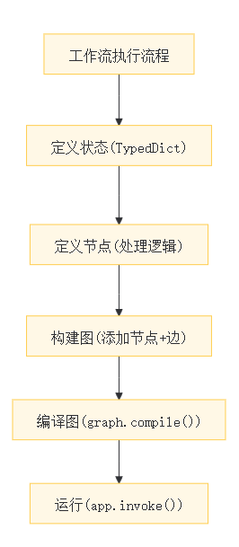

# Langgraph教程

# 模块一、LangGraph 基础

## 🎯 学习目标

本模块将帮助你理解 LangGraph 1\.0 的核心概念，学会创建状态图来构建复杂的 AI 工作流。

## 📚 核心概念

### 什么是 LangGraph？

LangGraph 是一个用于构建**状态化、多步骤 AI 应用**的框架。它使用**图（Graph）** 的概念来组织工作流：

- **节点（Nodes）**：图中的处理单元，可以是 LLM 调用、工具执行或自定义函数

- **边（Edges）**：连接节点的路径，定义执行顺序

- **状态（State）**：在节点之间传递的数据结构

#### 1️⃣ 节点（Nodes）= 分拣工位

每个节点是做具体事情的工位：

- LLM节点：像"智能客服工位"，读取包裹内容并写回复

- 工具节点：像"查重工位"，调用API查物流信息

- 函数节点：像"打包工位"，简单处理包裹格式

```Python
def 查重工位(state):*# 做具体事情：查物流*
    物流信息 = 调用快递API(state["快递单号"])
    return {"物流状态": 物流信息}  *# 返回更新内容*
```

#### 2️⃣ 边（Edges）= 传送带

连接工位的路径，决定包裹从哪来、到哪去：

- 普通边：固定路线（`START → 查重 → 打包 → END`）

- 条件边：智能路由（`IF 易碎品 → 特殊包装工位 ELSE → 普通包装工位`）

```Python
*# 普通传送带：固定走向*
graph.add_edge("查重工位", "打包工位")*# 智能分拣机：根据条件动态选择*
graph.add_conditional_edges("分拣中心", 路由判断函数)
```

#### 3️⃣ 状态（State）= 快递包裹\+面单

在节点间传递的共享数据箱，所有工位都能读写：

- TypedDict 定义：约定包裹里必须有什么字段（快递单号、物品信息、处理记录）

- 自动合并：每个工位只更新自己负责的字段，其他保持不变

```Python
class 快递状态(TypedDict):
    快递单号: str      *# 全程不变*
    物流信息: str      *# 查重工位填写*
    包装方式: str      *# 分拣工位决定*
    处理记录: list     *# 每个工位自动追加*
```

```SQL
用户输入："帮我查一下快递12345"
        ↓
[START节点] → 包裹创建：{"单号": "12345", "物流": "", "回复": ""}
        ↓
[查重节点] → 读取单号 → 查API → 包裹更新：{"物流": "已到达北京"}
        ↓
[回复节点] → 读取物流信息 → 生成回复 → 包裹更新：{"回复": "您的快递已到北京"}
        ↓
[END节点] → 取出"回复"字段返回给用户
```

#### 🔄 协作流程示例

```Plain Text

初始状态: {"单号": "123", "物流": "", "包装": "", "回复": ""}

A节点返回: {"物流": "已发货"}  
LangGraph合并 → 状态变为: {"单号": "123", "物流": "已发货", "包装": "", "回复": ""}

B节点返回: {"包装": "纸箱"}  
LangGraph合并 → 状态变为: {"单号": "123", "物流": "已发货", "包装": "纸箱", "回复": ""}

C节点看到完整黑板，生成: {"回复": "您的快递已发货，用纸箱包装"}
```

### LangGraph vs LangChain

|特性|LangChain|LangGraph|
|---|---|---|
|抽象级别|高级|低级|
|适用场景|快速构建标准 Agent|复杂自定义工作流|
|控制粒度|通过中间件|完全控制每个节点|
|状态管理|自动|手动但灵活|

### 核心组件

```Python
# 1. 定义状态 - 使用 TypedDict
from typing import TypedDict, Annotated
from langgraph.graph.message import add_messages

class State(TypedDict):
    messages: Annotated[list, add_messages]  # 消息列表，自动累加
    current_step: str                         # 当前步骤

# 2. 定义节点 - 接收和返回状态的函数
def my_node(state: State) -> dict:
    # 处理逻辑
    return {"current_step": "completed"}

# 3. 创建图
from langgraph.graph import StateGraph

graph = StateGraph(State)
graph.add_node("my_node", my_node)
graph.add_edge(START, "my_node")
graph.add_edge("my_node", END)

# 4. 编译并运行
app = graph.compile()
result = app.invoke({"messages": [], "current_step": "start"})
```

## 1\.1 前置准备

### 环境准备

1. 安装核心依赖（一行命令）：

```Bash
pip install langgraph langchain langchain-groq python-dotenv
```

2. 获取GROQ免费API密钥：[https://console\.groq\.com/keys](https://console.groq.com/keys)

3. 新建`.env`文件，写入密钥：

```Plain Text
# 读取环境变量
OPENAI_API_KEY = os.getenv("OPENAI_API_KEY")
OPENAI_BASE_URL = os.getenv("OPENAI_BASE_URL")
```

## 1\.2 编写代码

### 步骤1：导入核心依赖（只导必需的）

```Python
# 环境配置
import os
from dotenv import load_dotenv

# 类型约束（定义状态用）
from typing import TypedDict, Annotated, Literal

# LangGraph核心（图、节点、边、消息管理）
from langgraph.graph import StateGraph, START, END
from langgraph.graph.message import add_messages
from langgraph.checkpoint.memory import MemorySaver

# LangChain模型初始化+消息类型
from langchain.chat_models import init_chat_model
from langchain_core.messages import HumanMessage, SystemMessage
```

**说明**：只保留核心依赖，减少冗余，重点关注`StateGraph/START/END`（图核心）、`TypedDict`（状态定义）、`add_messages`（消息自动累加）。

### 步骤2：初始化模型（统一配置，一键复用）

```Python
# 加载.env文件中的密钥
model = init_chat_model(
    "openai:gpt-5-mini",
    api_key=OPENAI_API_KEY ,
    base_url=OPENAI_BASE_URL
)
```

**说明**：用`init_chat_model`统一初始化，兼容各大模型平台，后续所有工作流直接复用这个`model`即可。

---

## 示例1：简单顺序工作流

**核心逻辑**：`START → 节点1 → 节点2 → 节点3 → END`，按顺序执行，理解**状态传递**和**节点功能**

### 子步骤1：定义「状态」（工作流的“数据载体”）

```Python
# 用TypedDict定义强类型状态，所有节点都基于这个结构读写数据
class SimpleState(TypedDict):
    input_text: str      # 用户原始输入
    processed_text: str  # 预处理后的数据
    final_answer: str    # 最终结果
```

**说明**：状态是工作流中**节点之间传递的所有数据**，类似“全局变量”，但更规范；节点只需返回**需要更新的字段**，LangGraph会自动合并。

### 子步骤2：定义「节点」（工作流的“处理单元”）

```Python
# 节点1：预处理（清理输入文本）
def preprocess(state: SimpleState) -> dict:
    # 从状态中读取input_text，做简单清洗除去空行和全部小写
    clean_text = state["input_text"].strip().lower()
    print(f"预处理完成：{state['input_text']} → {clean_text}")
    # 只返回需要更新的字段，其他字段保留不变
    return {"processed_text": clean_text}

# 节点2：调用LLM生成答案（核心业务逻辑）
def call_llm(state: SimpleState) -> dict:
    # 从状态中读取预处理后的文本，构造消息调用模型
    messages = [
        SystemMessage(content="简洁回答，不超过30字"),
        HumanMessage(content=state["processed_text"])
    ]
    answer = model.invoke(messages).content
    # 更新final_answer字段
    return {"final_answer": answer}
```

**说明**：节点是**普通Python函数**，规则只有2个：

1. 入参是「状态类」的实例，能读取所有状态字段；

2. 返回是**字典**，只包含需要更新的字段（合并式更新）。

### 子步骤3：构建「图」（定义节点的执行顺序）

```Python
# 1. 创建图实例，绑定上面定义的状态类
graph = StateGraph(SimpleState)

# 2. 向图中添加节点（节点名+节点函数，自定义命名）
graph.add_node("preprocess", preprocess)
graph.add_node("call_llm", call_llm)

# 3. 定义「边」（执行顺序）：START→预处理→LLM→END
graph.add_edge(START, "preprocess")
graph.add_edge("preprocess", "call_llm")
graph.add_edge("call_llm", END)

# 4. 编译图（生成可执行的工作流，编译后不可修改）
app = graph.compile()
```

**说明**：`StateGraph`是LangGraph的核心，**边（add\_edge）** 决定节点执行顺序，`START`和`END`是LangGraph内置的起始/结束标识。

### 子步骤4：运行工作流（传入初始状态，一键执行）

```Python
# 传入初始状态（只需要给必选的input_text，其他字段自动生成）
result = app.invoke({"input_text": "  什么是人工智能？  "})

# 打印最终结果
print("\n最终答案：", result["final_answer"])
```

**运行结果示例**：

```Plain Text
预处理完成：  什么是人工智能？  → 什么是人工智能？
最终答案： 人工智能是模拟人类智能的技术，能学习、推理、解决问题。
```

---

## 示例2：条件分支工作流（核心重点）

**核心逻辑**：根据**状态中的数据**，动态选择执行路径，比如`查询分类 → 天气查询/数学计算/通用问答`，理解**条件边**的使用

### 子步骤1：定义分支状态

```Python
# 分支工作流的状态，新增query_type字段用于路由
class CondState(TypedDict):
    query: str        # 用户原始问题
    query_type: str   # 问题类型（weather/math/general）
    answer: str       # 最终答案
```

### 子步骤2：定义「节点\+路由函数」

```Python
# 节点1：分类问题（判断query类型，给query_type赋值）
def classify_query(state: CondState) -> dict:
    query = state["query"].lower()
    if "天气" in query or "温度" in query:
        return {"query_type": "weather"}
    elif "计算" in query or "加" in query or "减" in query:
        return {"query_type": "math"}
    else:
        return {"query_type": "general"}

# 节点2-4：不同类型的处理节点（极简逻辑）
def handle_weather(state: CondState) -> dict:
    return {"answer": "🌤️ 今日晴，25℃，适合外出！"}

def handle_math(state: CondState) -> dict:
    # 调用LLM做计算
    res = model.invoke([HumanMessage(content=state["query"])]).content
    return {"answer": f"🔢 计算结果：{res}"}

def handle_general(state: CondState) -> dict:
    # 调用LLM做通用问答
    res = model.invoke([HumanMessage(content=state["query"])]).content
    return {"answer": f"💡 {res}"}

# 路由函数（核心！根据状态返回「下一个节点名」）
def route(state: CondState) -> Literal["weather", "math", "general"]:
    # 返回值必须和后续节点名完全一致
    return state["query_type"]
```

**说明**：

1. 分类节点只负责**给状态打标签（query\_type）**，不做业务处理；

2. 路由函数是**条件分支的核心**，入参是状态，返回值是**目标节点名**（必须是字符串，和add\_node的节点名一致）；

3. `Literal`用于约束返回值，避免写错节点名。

### 子步骤3：构建带「条件边」的图

```Python
# 1. 创建图实例，绑定分支状态
graph = StateGraph(CondState)

# 2. 添加所有节点（分类节点+3个处理节点）
graph.add_node("classify", classify_query)
graph.add_node("weather", handle_weather)
graph.add_node("math", handle_math)
graph.add_node("general", handle_general)

# 3. 基础边：START→分类节点
graph.add_edge(START, "classify")

# 4. 条件边（核心！根据路由函数动态选节点）
graph.add_conditional_edges(
    source="classify",          # 从哪个节点出发
    path=route,         # 路由函数（返回节点名）
    path_map={                  # 路由映射：函数返回值→目标节点
        "weather": "weather",
        "math": "math",
        "general": "general"
    }
)

# 5. 所有分支最终都指向END
graph.add_edge("weather", END)
graph.add_edge("math", END)
graph.add_edge("general", END)

# 6. 编译图
app = graph.compile()
```

**说明**：`add_conditional_edges`是条件分支的核心API，`path_map`保证路由函数的返回值和目标节点一一对应，避免路由错误。

### 子步骤4：运行分支工作流（测试不同路径）

```Python
# 测试3个不同类型的问题
test_queries = [
    "今天上海的天气怎么样？",
    "计算100+200*3等于多少？",
    "Python是什么？"
]

for q in test_queries:
    res = app.invoke({"query": q})
    print(f"问题：{q}\n答案：{res['answer']}\n")
```

**运行结果示例**：

```Plain Text
问题：今天上海的天气怎么样？
答案：🌤️ 今日晴，25℃，适合外出！

问题：计算100+200*3等于多少？
答案：🔢 计算结果：700

问题：Python是什么？
答案：💡 Python是一种易上手的解释型编程语言，适用于开发、数据分析等场景。
```


---

## 示例3：带内存的多轮对话（实战常用）

**核心逻辑**：用`MemorySaver`保存对话状态，通过`thread_id`区分用户，实现**上下文记忆**，理解`add_messages`注解的妙用

### 子步骤1：定义对话状态（带自动消息累加）

```Python
# add_messages注解：新消息自动追加到列表，而非覆盖！
class ChatState(TypedDict):
    messages: Annotated[list, add_messages]  # 对话历史（自动累加）
```

**说明**：`add_messages`是LangGraph的“懒人神器”，无需手动拼接对话历史，只需每次传入**新消息**，LangGraph会自动把历史\+新消息合并。

### 子步骤2：定义对话节点

```Python
# 单个节点实现多轮对话，所有逻辑都在这里
def chat_node(state: ChatState) -> dict:
    # 构造系统提示，让AI记住上下文
    sys_msg = SystemMessage(content="你是友好的助手，严格记住用户的上下文信息")
    # 合并系统提示+对话历史
    all_messages = [sys_msg] + state["messages"]
    # 调用模型生成回复
    ai_resp = model.invoke(all_messages)
    # 返回新消息（add_messages会自动追加到messages列表）
    return {"messages": [ai_resp]}
```

**说明**：节点只需返回**新生成的AI消息**，`add_messages`会自动把它追加到对话历史中，下一轮能直接读取完整历史。

### 子步骤3：构建带「内存」的对话图

```Python
# 1. 创建图实例，绑定对话状态
graph = StateGraph(ChatState)

# 2. 添加唯一的对话节点
graph.add_node("chat", chat_node)

# 3. 定义执行顺序：START→chat→END
graph.add_edge(START, "chat")
graph.add_edge("chat", END)

# 4. 配置内存（核心！保存对话状态）
memory = MemorySaver()  # 内存型保存，重启后丢失（可替换为文件/数据库）
# 编译时绑定checkpointer，开启内存功能
app = graph.compile(checkpointer=memory)
```

**说明**：`MemorySaver`是LangGraph内置的内存检查点，编译图时传入`checkpointer=memory`，工作流就具备了**状态持久化**能力。

### 子步骤4：运行多轮对话（带会话ID）

```Python
# 会话配置：用thread_id区分不同用户，同一个用户用同一个ID
config = {"configurable": {"thread_id": "user001"}}

# 模拟多轮对话，每次只传入新的用户消息
chat_history = [
    "你好，我叫小红",
    "记住我的名字了吗？",
    "我喜欢吃草莓，再记一下"
]

for msg in chat_history:
    # 传入新消息：HumanMessage封装
    res = app.invoke({"messages": [HumanMessage(content=msg)]}, config=config)
    # 打印AI回复（取messages最后一个元素）
    print(f"用户：{msg}")
    print(f"AI：{res['messages'][-1].content}\n")
```

**运行结果示例**：

```Plain Text
用户：你好，我叫小红
AI：你好小红！很高兴认识你 😊

用户：记住我的名字了吗？
AI：当然记住啦，你是小红～

用户：我喜欢吃草莓，再记一下
AI：好的小红，我记住你喜欢吃草莓啦～
```

**说明**：`config`中的`thread_id`是**会话唯一标识**，同一个ID会复用对话历史，不同ID相互隔离（比如再建一个`user002`，AI不会记住小红的信息）。

---

## 1\.3 核心知识点总结（3句话讲清LangGraph）

1. **状态（TypedDict）**：工作流的“数据载体”，节点之间通过状态传递数据，**合并式更新**（只更改变动的字段）；

2. **节点（Python函数）**：工作流的“处理单元”，入参是状态，返回是字典（更新的字段），无其他额外规则；

3. **边（add\_edge/add\_conditional\_edges）**：工作流的“导航仪”，普通边定顺序，条件边定分支，`START/END`是固定起点/终点。


执行流程：




三类基础工作流：


# 模块二、多 Agent 协作

## 🎯 学习目标

本模块将帮助你理解如何在 LangGraph 中创建多个专业化 Agent，并让它们协作完成复杂任务。

## 📚 核心概念

### 为什么需要多 Agent？

单个 Agent 在处理复杂任务时可能存在以下问题：

- **上下文过载**：单个 Agent 需要处理所有类型的任务

- **专业性不足**：难以在所有领域都表现出色

- **维护困难**：单一庞大的 Agent 难以调试和优化

多 Agent 架构通过**分而治之**的策略解决这些问题。

### 常见的多 Agent 模式

#### 1\. 监督者模式（Supervisor Pattern）

```Plaintext
┌──────────────┐
                    │  Supervisor  │
                    │   (协调者)    │
                    └──────┬───────┘
           ┌───────────────┼───────────────┐
           ▼               ▼               ▼
    ┌─────────────┐ ┌─────────────┐ ┌─────────────┐
    │  Agent A    │ │  Agent B    │ │  Agent C    │
    │  (研究员)    │ │  (编辑)     │ │  (审核员)   │
    └─────────────┘ └─────────────┘ └─────────────┘
```

- **Supervisor**：接收任务，决定分配给哪个 Agent

- **Worker Agents**：专注于特定类型的任务

#### 2\. 协作模式（Collaborative Pattern）

```Plaintext
┌─────────────┐     ┌─────────────┐
    │  Agent A    │────▶│  Agent B    │
    │  (写初稿)    │     │  (审核修改)  │
    └─────────────┘     └──────┬──────┘
                               │
                               ▼
                        ┌─────────────┐
                        │  Agent C    │
                        │  (最终确认)  │
                        └─────────────┘
```

- Agent 按顺序处理任务

- 每个 Agent 的输出是下一个 Agent 的输入

#### 3\. 层级模式（Hierarchical Pattern）

```Plaintext
┌──────────────┐
                    │   Manager    │
                    └──────┬───────┘
           ┌───────────────┴───────────────┐
           ▼                               ▼
    ┌─────────────┐                 ┌─────────────┐
    │  Team Lead A│                 │  Team Lead B│
    └──────┬──────┘                 └──────┬──────┘
      ┌────┴────┐                     ┌────┴────┐
      ▼         ▼                     ▼         ▼
   Agent 1   Agent 2              Agent 3   Agent 4
```

### 实现多 Agent 的关键组件

```Python
from langchain.agents import create_agent
from langgraph.graph import StateGraph

# 1. 定义共享状态
class TeamState(TypedDict):
    task: str
    current_agent: str
    messages: list
    final_result: str

# 2. 创建专业化 Agent
researcher = create_agent(
    model="openai:gpt-4o",
    tools=[search_tool, wikipedia_tool],
    system_prompt="你是一个研究员，专门收集和整理信息。"
)

writer = create_agent(
    model="openai:gpt-4o",
    tools=[],
    system_prompt="你是一个作家，擅长将信息组织成清晰的文章。"
)

# 3. 创建监督者逻辑
def supervisor(state: TeamState) -> str:
    # 决定下一个执行的 Agent
    if "需要研究" in state["task"]:
        return "researcher"
    elif "需要写作" in state["task"]:
        return "writer"
    else:
        return "end"
```

## 🔑 关键 API

### 使用 send\(\) 进行动态分发

```Python
from langgraph.types import Send

def supervisor(state: State):
    """将任务分发给多个 Agent"""
    return [
        Send("agent_a", {"task": "子任务1"}),
        Send("agent_b", {"task": "子任务2"})
    ]
```

### Agent 间通信

```Python
# 通过状态传递信息
class SharedState(TypedDict):
    messages: Annotated[list, add_messages]
    agent_outputs: dict  # 存储各 Agent 的输出
```

### 前置依赖安装

```Bash
pip install langchain langgraph python-dotenv
```

### 环境变量配置

1. 创建`.env`文件，添加GROQ API密钥（免费获取地址：[https://console\.groq\.com/keys](https://console.groq.com/keys)）：

```Plain Text
GROQ_API_KEY=你的密钥
```

## 实验步骤

### 模式1：监督者模式（核心：协调者分配任务）

#### 步骤1：基础导入与初始化

```Python
# 导入核心库
import os
from typing import TypedDict, Annotated, Literal
from dotenv import load_dotenv
from langgraph.graph import StateGraph, START, END
from langgraph.graph.message import add_messages
from langchain.chat_models import init_chat_model
from langchain_core.messages import HumanMessage, AIMessage, SystemMessage

# 加载环境变量并初始化模型
load_dotenv()
OPENAI_API_KEY = os.getenv("OPENAI_API_KEY")
OPENAI_BASE_URL = os.getenv("OPENAI_BASE_URL")
print("OPENAI_API_KEY:", OPENAI_API_KEY[:10] + "...")
print("OPENAI_BASE_URL:", OPENAI_BASE_URL)

```

#### 步骤2：定义共享状态

```Python
# 定义团队协作的共享状态
class TeamState(TypedDict):
    task: str
    messages: Annotated[list, add_messages]
    research: str       # 研究员输出
    draft: str          # 作家输出
    final_content: str  # 编辑输出 
    next_agent: str     # 监督者指定下一个执行的Agent
```

#### 步骤3：实现监督者节点

```Python
# 监督者：决定任务分配
def supervisor(state: TeamState) -> dict:
#提醒 if not =if true 不空
    if not state["research"]:
        return {"next_agent": "researcher"}
    elif not state["draft"]:
        return {"next_agent": "writer"}
    elif not state["final_content"]:  
        return {"next_agent": "editor"}
    else:
        return {"next_agent": "end"}
```

#### 步骤4：实现单个Worker Agent

##### 1 、研究员

```Python
def researcher(state: TeamState) -> dict:
    print("→ 研究员：收集AI资料")
    research = "AI 全称 Artificial Intelligence，是模拟人类智能的技术。"
    return {"research": research}
```

##### 2、 作家

```Python

def writer(state: TeamState) -> dict:
    print("→ 作家：撰写初稿")
    draft = f"# AI 简介\n\n{state['research']}\n\nAI 正在改变世界。"
    return {"draft": draft}
```

##### 3、 编辑

```Python
def editor(state: TeamState) -> dict:
    print("→ 编辑：优化内容")
    final = state["draft"].replace("改变世界", "深刻改变各行各业")
    return {"final_content": final}
```

#### 步骤5：构建并运行图

```Python
# 构建图
graph = StateGraph(TeamState)

# 添加所有节点
graph.add_node("supervisor", supervisor)
graph.add_node("researcher", researcher)
graph.add_node("writer", writer)
graph.add_node("editor", editor)

# 1. 起点 → 监督者
graph.add_edge(START, "supervisor")

# 2. 监督者路由
graph.add_conditional_edges(
    source="supervisor",
    path=lambda s: s["next_agent"],
    path_map={
        "researcher": "researcher",
        "writer": "writer",
        "editor": "editor",
        "end": END
    }
)

# 3. 只有研究/作家→回到监督者，编辑完成后 → 直接结束
graph.add_edge("researcher", "supervisor")
graph.add_edge("writer", "supervisor")
graph.add_edge("editor", END)
```

#### 步骤6：测试结果

```Python
app = graph.compile()
result = app.invoke({
    "task": "写一篇关于AI的简介",
    "research": "",
    "draft": "",
    "final_content": "",  
    "next_agent": ""
})

print("最终结果：")
print(result["final_content"]) 
```


### 模式2：协作链模式（核心：按顺序接力处理）

#### 步骤1：定义审查状态

```Python
# 代码审查流程的共享状态
class ReviewState(TypedDict):
    code: str
    security_review: str  # 安全审查结果
    final_report: str     # 最终报告
```

#### 步骤2：实现两个接力Agent

```Python
# 安全审查员
def security_reviewer(state: ReviewState) -> dict:
    review = "代码存在SQL注入风险：直接拼接SQL语句"
    return {"security_review": review}

# 报告生成器
def report_generator(state: ReviewState) -> dict:
    report = f"审查报告：{state['security_review']}"
    return {"final_report": report}
```

#### 步骤3：构建顺序执行图

```Python
graph = StateGraph(ReviewState)
graph.add_node("security", security_reviewer)
graph.add_node("report", report_generator)

# 顺序执行
graph.add_edge(START, "security")
graph.add_edge("security", "report")
graph.add_edge("report", END)

# 运行
app = graph.compile()
result = app.invoke({"code": "SELECT * FROM users WHERE id = {user_id}"})
print("最终报告：", result["final_report"])
```

### 模式3：动态分发模式（核心：按类型分配任务）

#### 步骤1：定义客服状态

```Python
class SupportState(TypedDict):
    query: str
    category: str  # 问题分类
    response: str  # 客服回复
```

#### 步骤2：实现分类器和单个专业Agent

```Python
# 分类器：识别问题类型
def classifier(state: SupportState) -> dict:
    if "退款" in state["query"]:
        category = "billing"
    else:
        category = "general"
    return {"category": category}

# 账单客服Agent
def billing_agent(state: SupportState) -> dict:
    return {"response": "💰 账单客服：已收到退款申请，将在3个工作日内处理"}
```

#### 步骤3：构建动态路由图

```Python
graph = StateGraph(SupportState)
graph.add_node("classifier", classifier)
graph.add_node("billing", billing_agent)

# 动态路由
graph.add_edge(START, "classifier")
graph.add_conditional_edges(
    "classifier",
    lambda s: s["category"],
    {"billing": "billing", "general": END}
)
graph.add_edge("billing", END)

# 运行
app = graph.compile()
result = app.invoke({"query": "我想申请退款"})
print("客服回复：", result["response"])
```

# 模块三：条件路由

## 🎯 学习目标

掌握 LangGraph 中的条件路由机制，实现动态工作流控制。

## 📚 核心概念

### 什么是条件路由？

条件路由允许你根据**运行时的状态**动态决定下一步执行哪个节点。这是构建智能工作流的关键。

### 路由类型

1. **静态边（Static Edge）**：总是执行固定的下一个节点

2. **条件边（Conditional Edge）**：根据条件函数的返回值选择下一个节点

```Python
# 静态边
graph.add_edge("node_a", "node_b")  # 总是 A -> B

# 条件边
graph.add_conditional_edges(
    "node_a",                    # 起始节点
    condition_function,          # 返回下一个节点名的函数
    {"option1": "node_b", "option2": "node_c"}  # 映射
)
```

### 条件函数的写法

```Python
from typing import Literal

def my_router(state: MyState) -> Literal["next_a", "next_b", "end"]:
    """路由函数必须返回节点名称"""
    if state["score"] > 80:
        return "next_a"
    elif state["score"] > 50:
        return "next_b"
    else:
        return "end"
```

## 🔑 关键模式

### 1\. 循环控制

```Python
def should_continue(state) -> Literal["continue", "end"]:
    if state["iteration"] < state["max_iterations"]:
        return "continue"
    return "end"

graph.add_conditional_edges("process", should_continue, {
    "continue": "process",  # 回到自己
    "end": END
})
```

### 2\. 错误处理路由

```Python
def error_router(state) -> Literal["retry", "fallback", "success"]:
    if state.get("error"):
        if state["retry_count"] < 3:
            return "retry"
        return "fallback"
    return "success"
```

### 3\. 多条件组合

```Python
def complex_router(state) -> str:
    # 可以组合多个条件
    if state["is_urgent"] and state["has_permission"]:
        return "fast_track"
    elif state["needs_review"]:
        return "review"
    else:
        return "standard"
```

## 实验环境准备

1. 安装依赖：

```Bash
pip install langgraph langchain langchain-core python-dotenv
```

2. 准备 `.env` 文件（若使用第三方大模型）：

```Plain Text
GROQ_API_KEY=your_api_key_here  # 可替换为其他模型的API Key
```

## 实验步骤

### 步骤1：基础概念理解与环境初始化

**说明：**条件路由的核心是「根据状态动态选择下一个节点」，先完成基础环境配置和状态定义，这是所有 LangGraph 工作流的基础。

```Python
# 导入核心依赖
import os
from typing import TypedDict, Literal
from dotenv import load_dotenv
from langgraph.graph import StateGraph, START, END

# 加载环境变量（若无模型调用可省略）
load_dotenv()

# 定义状态结构：存储工作流的核心数据
class ScoreState(TypedDict):
    score: int  # 评分（路由判断的核心依据）
    result: str  # 最终结果
```

### 步骤2：定义路由判断函数

**说明：**路由函数是条件路由的「大脑」，接收状态对象，返回具体的节点名称，需严格匹配后续映射的节点名。

```Python
# 定义条件路由函数：根据分数判断下一步节点
def route_by_score(state: ScoreState) -> Literal["excellent", "fail"]:
    """
    简单路由规则：
    - 分数≥80 → 优秀节点（excellent）
    - 分数<80 → 失败节点（fail）
    """
    if state["score"] >= 80:
        return "excellent"
    else:
        return "fail"
```

### 步骤3：定义节点处理函数

**说明：**每个节点对应一个处理函数，接收状态并返回更新后的状态，完成具体业务逻辑。

```Python
# 定义「优秀」节点处理逻辑
def handle_excellent(state: ScoreState) -> dict:
    print("🎉 评分优秀，通过！")
    return {"result": "APPROVED"}

# 定义「失败」节点处理逻辑
def handle_fail(state: ScoreState) -> dict:
    print("❌ 评分不足，驳回！")
    return {"result": "REJECTED"}
```

### 步骤4：构建并编译条件路由图

**说明：**通过 `StateGraph` 构建工作流：添加节点 → 配置起始节点 → 配置条件边 → 编译为可执行应用。

```Python
# 1. 创建状态图实例
graph = StateGraph(ScoreState)

# 2. 添加业务节点（只有这两个真实节点）
graph.add_node("excellent", handle_excellent)
graph.add_node("fail", handle_fail)

# 3. 【修正】START 直接连接条件边，无需 "route" 节点
graph.add_conditional_edges(
    START,  # ✅ 直接从起点开始条件路由
    route_by_score,  # 路由判断函数
    {
        "excellent": "excellent",  # 返回值 → 目标节点
        "fail": "fail"
    }
)

# 4. 配置结束节点
graph.add_edge("excellent", END)
graph.add_edge("fail", END)

# 5. 编译
app = graph.compile()
```

### 步骤5：运行并测试工作流

**说明：**通过 `invoke` 方法传入初始状态，触发工作流执行，验证条件路由是否生效。

```Python
# 测试案例1：分数85（应走excellent节点）
print("测试1：分数85")
result1 = app.invoke({"score": 85})
print(f"最终结果：{result1['result']}\n")

# 测试案例2：分数70（应走fail节点）
print("测试2：分数70")
result2 = app.invoke({"score": 70})
print(f"最终结果：{result2['result']}")
```

# 模块四：综合RAG项目

## 📋 项目概述

本项目构建一个完整的 RAG（Retrieval\-Augmented Generation）系统，支持多种文档格式、智能检索和对话式问答。这是一个生产级别的实现，整合了前面所学的所有基础知识。

## 🎯 项目目标

通过本项目，你将学会：

- 构建端到端的 RAG 流水线

- 实现多种文档加载和处理策略

- 使用向量数据库进行语义检索

- 实现对话历史管理和上下文感知

- 添加来源引用和置信度评估

- 优化检索质量和生成效果

## 🏗️ 系统架构


## 📁 项目结构

```Plaintext
rag_system/
├── main.py                   # 主程序入口
└── rag_system/               # RAG 系统核心包
    ├── __init__.py           # 包初始化
    ├── config.py             # 配置管理
    ├── document_loader.py    # 文档加载模块
    ├── text_processor.py     # 文本处理模块
    ├── vector_store.py       # 向量存储模块
    ├── retriever.py          # 检索模块
    ├── generator.py          # 生成模块
    ├── rag_chain.py          # RAG 链整合
    └── sample_docs.py        # 示例文档数据
```

## 🔧 核心组件

### 1\. 文档加载器 \(DocumentLoader\)

- 支持多种格式：TXT、PDF、Markdown、CSV

- 自动格式检测

- 元数据提取

### 2\. 文本处理器 \(TextProcessor\)

- 智能分块策略

- 重叠处理保持上下文

- 元数据保留

### 3\. 向量存储 \(VectorStore\)

- 使用 Chroma 作为向量数据库

- 支持持久化存储

- 高效相似度搜索

### 4\. 检索器 \(Retriever\)

- 语义检索

- 多种检索策略（相似度、MMR）

- 可配置的 top\-k

### 5\. 生成器 \(Generator\)

- 基于上下文的回答生成

- 来源引用

- 置信度评估

---

## 🚀 实验步骤

### 步骤 1：项目初始化与环境配置

**目标**：搭建项目基础结构，配置开发环境

**任务清单**：

* [ ] 创建项目目录结构

* [ ] 创建虚拟环境

* [ ] 安装必要的依赖包

* [ ] 配置环境变量（API Key）

* [ ] 模拟文档

* [ ] 包初始化

**关键代码**：

```Python
# 安装依赖
pip install langchain langchain-openai langchain-text-splitters langgraph python-dotenv

# 创建 .env 文件
OPENAI_API_KEY=your_api_key_here
OPENAI_BASE_URL=optional_base_url
```

**验证方式**：

```Python
from dotenv import load_dotenv
import os

load_dotenv()
print(os.getenv("OPENAI_API_KEY"))  # 应输出你的 API Key
```

**模拟文档：**

```Python
"""
示例文档数据

包含用于演示 RAG 系统的示例文档
"""

from typing import List, Dict, Any

SAMPLE_DOCUMENTS: List[Dict[str, Any]] = [
    {
        "text": """LangChain 简介

LangChain 是一个用于开发大型语言模型（LLM）应用的开源框架。它提供了一套标准化的接口和工具，
帮助开发者快速构建基于 LLM 的应用程序。

主要特点：
1. 模块化设计：所有组件都可以独立使用或组合使用
2. 链式调用：支持将多个组件链接在一起形成复杂的工作流
3. 记忆管理：内置多种记忆类型，支持对话历史管理
4. 工具集成：可以轻松集成外部工具和 API

LangChain 1.0 于 2025 年 10 月发布，带来了重大改进：
- 更清晰的 API 设计
- 更好的类型提示支持
- 改进的错误处理
- 与 LangGraph 的深度集成

使用场景包括：聊天机器人、问答系统、文档分析、代码生成等。""",
        "metadata": {"source": "langchain_intro.txt", "topic": "introduction"}
    },
    {
        "text": """LangGraph 介绍

LangGraph 是 LangChain 生态系统中的一个重要组件，专门用于构建有状态的、多步骤的 AI 应用。
它基于图结构来定义工作流，使得复杂的 AI 流程变得清晰和可控。

核心概念：
1. 状态（State）：使用 TypedDict 定义应用状态，在节点间传递
2. 节点（Node）：处理状态的函数，执行具体的业务逻辑
3. 边（Edge）：定义节点之间的连接和流转规则
4. 条件边：根据状态动态决定下一个节点

LangGraph 的优势：
- 可视化流程：图结构使工作流一目了然
- 状态管理：自动处理状态的传递和更新
- 检查点：支持中间状态的保存和恢复
- 人机协作：支持 human-in-the-loop 模式

典型应用场景：
- 多步骤推理
- 多代理协作
- 复杂决策流程
- 带有循环的工作流""",
        "metadata": {"source": "langgraph_intro.txt", "topic": "langgraph"}
    },
    {
        "text": """RAG（检索增强生成）原理

RAG 是一种结合检索和生成的技术，通过从知识库中检索相关信息来增强 LLM 的回答质量。

工作流程：
1. 文档处理：将文档分割成小块，并转换为向量表示
2. 向量存储：将文档向量存入向量数据库
3. 查询检索：用户提问时，检索最相关的文档块
4. 上下文增强：将检索到的内容作为上下文提供给 LLM
5. 回答生成：LLM 基于上下文生成准确的回答

RAG 的优势：
- 减少幻觉：基于真实文档生成回答
- 知识更新：无需重新训练模型即可更新知识
- 来源可追溯：可以引用具体的信息来源
- 成本效益：比微调模型更经济

最佳实践：
- 选择合适的分块策略
- 优化检索算法
- 设计有效的提示模板
- 实现结果重排序""",
        "metadata": {"source": "rag_principles.txt", "topic": "rag"}
    },
    {
        "text": """向量数据库介绍

向量数据库是专门用于存储和检索向量数据的数据库系统，是 RAG 系统的核心组件之一。

主要特点：
1. 高效相似度搜索：支持快速的近似最近邻（ANN）搜索
2. 可扩展性：能够处理数百万甚至数十亿级别的向量
3. 实时更新：支持动态添加和删除向量
4. 元数据过滤：支持基于元数据的过滤查询

常见的向量数据库：
- Chroma：轻量级，适合开发和原型
- Pinecone：云原生，完全托管
- Milvus：开源，高性能
- Weaviate：支持混合搜索
- FAISS：Facebook 开发，适合研究

选择建议：
- 开发阶段：使用 Chroma 或内存向量存储
- 生产环境：根据规模选择 Pinecone 或 Milvus
- 需要混合搜索：考虑 Weaviate

性能优化：
- 选择合适的索引类型
- 调整搜索参数
- 使用批量操作""",
        "metadata": {"source": "vector_db.txt", "topic": "database"}
    }
]

def get_sample_texts() -> List[str]:
    """获取示例文档文本列表"""
    return [doc["text"] for doc in SAMPLE_DOCUMENTS]

def get_sample_metadatas() -> List[Dict[str, Any]]:
    """获取示例文档元数据列表"""
    return [doc["metadata"] for doc in SAMPLE_DOCUMENTS]

```

**包初始化：**

```Python
"""
RAG 检索增强生成系统

一个完整的 RAG 系统实现，包括：
- 文档加载和处理
- 向量存储和检索
- 上下文感知的问答生成
- 来源引用和置信度评估
"""

from .config import RAGConfig, OPENAI_API_KEY, OPENAI_BASE_URL
from .document_loader import DocumentLoader
from .text_processor import TextProcessor
from .vector_store import VectorStore, get_embeddings, SimpleEmbeddings
from .retriever import Retriever
from .generator import Generator
from .rag_chain import RAGChain, RAGState
from .sample_docs import SAMPLE_DOCUMENTS, get_sample_texts, get_sample_metadatas

__all__ = [
    "RAGConfig",
    "OPENAI_API_KEY",
    "OPENAI_BASE_URL",
    "DocumentLoader",
    "TextProcessor",
    "VectorStore",
    "get_embeddings",
    "SimpleEmbeddings",
    "Retriever",
    "Generator",
    "RAGChain",
    "RAGState",
    "SAMPLE_DOCUMENTS",
    "get_sample_texts",
    "get_sample_metadatas",
]

```

---

### 步骤 2：配置管理模块 \(config\.py\)

**目标**：创建统一的配置管理类

**学习内容**：

- 使用 dataclass 定义配置

- 环境变量的读取

- 配置参数的集中管理

```Python
"""
配置管理模块

管理 RAG 系统的所有配置参数
"""

import os
from dataclasses import dataclass
from dotenv import load_dotenv

# 加载环境变量
load_dotenv()

# API 配置
OPENAI_API_KEY = os.getenv("OPENAI_API_KEY")
OPENAI_BASE_URL = os.getenv("OPENAI_BASE_URL")


@dataclass
class RAGConfig:
    """RAG 系统配置"""
    # 模型配置
    temperature: float = 0.1
    max_tokens: int = 1000

    # 分块配置
    chunk_size: int = 500
    chunk_overlap: int = 100

    # 检索配置
    top_k: int = 3
    search_type: str = "similarity"  # similarity, mmr

    # Embeddings 配置
    embedding_dimension: int = 384

    # 对话历史配置
    max_chat_history: int = 4

```

---

### 步骤 3：文档加载模块 \(document\_loader\.py\)

**目标**：实现多种文档格式的加载

**学习内容**：

- LangChain Document 对象

- 文件格式检测

- 元数据提取

```Python
"""
文档加载模块

支持多种文档格式的加载和元数据提取
"""

import os
from typing import List, Dict, Any, Optional
from pathlib import Path

from langchain_core.documents import Document


class DocumentLoader:
    """文档加载器：支持多种格式"""

    def __init__(self):
        self.supported_extensions = {
            '.txt': self._load_txt,
            '.md': self._load_txt,
            '.csv': self._load_txt,
            '.py': self._load_txt,
            '.json': self._load_txt,
        }

    def load(self, file_path: str) -> List[Document]:
        """加载单个文档"""
        path = Path(file_path)

        if not path.exists():
            raise FileNotFoundError(f"文件不存在: {file_path}")

        extension = path.suffix.lower()

        if extension not in self.supported_extensions:
            raise ValueError(f"不支持的文件格式: {extension}")

        loader_func = self.supported_extensions[extension]
        return loader_func(file_path)

    def load_directory(self, directory: str) -> List[Document]:
        """加载目录中的所有支持文件"""
        documents = []
        dir_path = Path(directory)

        if not dir_path.exists():
            raise FileNotFoundError(f"目录不存在: {directory}")

        for ext in self.supported_extensions.keys():
            for file_path in dir_path.rglob(f"*{ext}"):
                try:
                    docs = self.load(str(file_path))
                    documents.extend(docs)
                except Exception as e:
                    print(f"加载文件失败 {file_path}: {e}")

        return documents

    def load_from_texts(self, texts: List[str],
                        metadatas: Optional[List[Dict]] = None) -> List[Document]:
        """从文本列表创建文档"""
        documents = []
        for i, text in enumerate(texts):
            metadata = metadatas[i] if metadatas and i < len(metadatas) else {"source": f"doc_{i}"}
            documents.append(Document(page_content=text, metadata=metadata))
        return documents

    def _load_txt(self, file_path: str) -> List[Document]:
        """加载文本文件"""
        with open(file_path, 'r', encoding='utf-8') as f:
            content = f.read()

        metadata = {
            "source": file_path,
            "filename": Path(file_path).name,
            "extension": Path(file_path).suffix
        }

        return [Document(page_content=content, metadata=metadata)]

    def detect_format(self, file_path: str) -> str:
        """检测文件格式"""
        return Path(file_path).suffix.lower()

```

---

### 步骤 4：文本处理模块 \(text\_processor\.py\)

**目标**：实现智能文本分块

**学习内容**：

- RecursiveCharacterTextSplitter 的使用

- 分块策略的选择

- 重叠处理保持上下文

```Python
"""
文本处理模块

智能分块策略和文本预处理
"""

from typing import List

from langchain_core.documents import Document
from langchain_text_splitters import RecursiveCharacterTextSplitter

from .config import RAGConfig


class TextProcessor:
    """文本处理器：分块和预处理"""

    def __init__(self, config: RAGConfig = None):
        self.config = config or RAGConfig()
        self.text_splitter = RecursiveCharacterTextSplitter(
            chunk_size=self.config.chunk_size,
            chunk_overlap=self.config.chunk_overlap,
            separators=["\n\n", "\n", "。", "！", "？", ".", "!", "?", " ", ""]
        )

    def split_documents(self, documents: List[Document]) -> List[Document]:
        """分割文档为小块"""
        return self.text_splitter.split_documents(documents)

    def split_text(self, text: str) -> List[str]:
        """分割纯文本"""
        return self.text_splitter.split_text(text)

    def create_documents(self, texts: List[str], metadatas: List[dict] = None) -> List[Document]:
        """从文本创建文档对象"""
        if metadatas is None:
            metadatas = [{} for _ in texts]
        return self.text_splitter.create_documents(texts, metadatas)

```

---

### 步骤 5：向量存储模块 \(vector\_store\.py\)

**目标**：实现 Embeddings 和向量数据库

**学习内容**：

- Embeddings 的概念和实现

- 向量存储的创建和管理

- 简单 Embeddings vs OpenAI Embeddings

```Python
"""
向量存储模块

管理 Embeddings 和向量数据库操作
"""

import hashlib
from typing import List

from langchain_core.embeddings import Embeddings
from langchain_core.documents import Document
from langchain_core.vectorstores import InMemoryVectorStore

from .config import RAGConfig, OPENAI_API_KEY


class SimpleEmbeddings(Embeddings):
    """
    简单的 Embeddings 实现（用于演示）

    使用简单的词频统计生成向量，适合演示目的。
    生产环境请使用 OpenAI 或 HuggingFace Embeddings。
    """

    def __init__(self, dimension: int = 384):
        self.dimension = dimension

    def embed_documents(self, texts: List[str]) -> List[List[float]]:
        """嵌入文档列表"""
        return [self._embed_text(text) for text in texts]

    def embed_query(self, text: str) -> List[float]:
        """嵌入查询"""
        return self._embed_text(text)

    def _embed_text(self, text: str) -> List[float]:
        """简单的文本嵌入（基于字符频率）"""
        # 使用文本的hash生成伪随机但确定的向量
        hash_obj = hashlib.md5(text.encode())
        hash_bytes = hash_obj.digest()

        # 扩展到目标维度
        vector = []
        for i in range(self.dimension):
            byte_idx = i % len(hash_bytes)
            # 归一化到 [-1, 1]
            value = (hash_bytes[byte_idx] / 255.0) * 2 - 1
            vector.append(value)

        return vector


def get_embeddings(config: RAGConfig = None):
    """根据环境选择合适的 Embeddings"""
    config = config or RAGConfig()

    if OPENAI_API_KEY and OPENAI_API_KEY != "your_openai_api_key_here":
        try:
            from langchain_openai import OpenAIEmbeddings
            print("📊 使用 OpenAI Embeddings")
            return OpenAIEmbeddings(model="text-embedding-3-small")
        except ImportError:
            print("⚠️ langchain_openai 未安装，使用简单 Embeddings")

    print("📊 使用简单 Embeddings（演示用）")
    return SimpleEmbeddings(dimension=config.embedding_dimension)


class VectorStore:
    """向量存储管理器"""

    def __init__(self, config: RAGConfig = None):
        self.config = config or RAGConfig()
        self.embeddings = get_embeddings(self.config)
        self.vector_store: InMemoryVectorStore = None

    def create_from_documents(self, documents: List[Document]) -> InMemoryVectorStore:
        """从文档创建向量存储"""
        self.vector_store = InMemoryVectorStore.from_documents(
            documents=documents,
            embedding=self.embeddings
        )
        return self.vector_store

    def add_documents(self, documents: List[Document]):
        """添加文档到向量存储"""
        if self.vector_store is None:
            return self.create_from_documents(documents)
        self.vector_store.add_documents(documents)

    def similarity_search(self, query: str, k: int = None) -> List[Document]:
        """相似度搜索"""
        if self.vector_store is None:
            raise ValueError("向量存储未初始化")
        k = k or self.config.top_k
        return self.vector_store.similarity_search(query, k=k)

    def similarity_search_with_score(self, query: str, k: int = None) -> List[tuple]:
        """带分数的相似度搜索"""
        if self.vector_store is None:
            raise ValueError("向量存储未初始化")
        k = k or self.config.top_k
        return self.vector_store.similarity_search_with_score(query, k=k)

```

---

### 步骤 6：检索模块 \(retriever\.py\)

**目标**：实现文档检索功能

**学习内容**：

- 相似度搜索

- 检索结果格式化

- 来源信息提取

```Python
"""
检索模块

从向量存储中检索相关文档
"""

from typing import List, Dict, Any

from langchain_core.documents import Document

from .config import RAGConfig
from .vector_store import VectorStore


class Retriever:
    """检索器：从向量存储中检索相关文档"""

    def __init__(self, vector_store: VectorStore, config: RAGConfig = None):
        self.vector_store = vector_store
        self.config = config or RAGConfig()

    def retrieve(self, query: str, top_k: int = None) -> List[Document]:
        """检索相关文档"""
        k = top_k or self.config.top_k
        return self.vector_store.similarity_search(query, k=k)

    def retrieve_with_scores(self, query: str, top_k: int = None) -> List[tuple]:
        """检索文档并返回相似度分数"""
        k = top_k or self.config.top_k
        return self.vector_store.similarity_search_with_score(query, k=k)

    def retrieve_with_sources(self, query: str, top_k: int = None) -> Dict[str, Any]:
        """检索文档并格式化来源信息"""
        k = top_k or self.config.top_k
        docs_with_scores = self.retrieve_with_scores(query, top_k=k)

        documents = []
        sources = []

        for i, (doc, score) in enumerate(docs_with_scores):
            documents.append(doc)
            sources.append({
                "index": i + 1,
                "source": doc.metadata.get("source", "unknown"),
                "score": float(score),
                "content_preview": doc.page_content[:100] + "..."
            })

        return {
            "documents": documents,
            "sources": sources
        }

    def format_context(self, documents: List[Document]) -> str:
        """将文档格式化为上下文字符串"""
        context_parts = []
        for i, doc in enumerate(documents):
            context_parts.append(f"[文档 {i+1}] {doc.page_content}")
        return "\n\n".join(context_parts)

```

---

### 步骤 7：生成模块 \(generator\.py\)

**目标**：实现基于上下文的回答生成

**学习内容**：

- ChatPromptTemplate 的使用

- 对话历史管理

- 查询改写技术

- 置信度评估

```Python
"""
生成模块

基于上下文生成回答，支持查询改写和置信度评估
"""

from typing import List, Dict, Any

from langchain.chat_models import init_chat_model
from langchain_core.prompts import ChatPromptTemplate, MessagesPlaceholder
from langchain_core.messages import HumanMessage, AIMessage
from langchain_core.output_parsers import StrOutputParser

from .config import RAGConfig, OPENAI_API_KEY, OPENAI_BASE_URL

# 初始化模型
model = init_chat_model(
    "openai:gpt-5-mini",
    api_key=OPENAI_API_KEY,
    base_url=OPENAI_BASE_URL
)


class Generator:
    """生成器：基于上下文生成回答"""

    def __init__(self, config: RAGConfig = None):
        self.config = config or RAGConfig()
        self.llm = model

        # RAG 提示模板
        self.rag_prompt = ChatPromptTemplate.from_messages([
            ("system", """你是一个专业的问答助手。请基于提供的上下文信息回答用户的问题。

重要规则：
1. 只使用提供的上下文信息来回答问题
2. 如果上下文中没有相关信息，请诚实地说"根据提供的信息，我无法回答这个问题"
3. 回答要准确、简洁、有条理
4. 在回答末尾标注信息来源

上下文信息：
{context}
"""),
            MessagesPlaceholder(variable_name="chat_history", optional=True),
            ("human", "{query}")
        ])

        # 查询改写提示
        self.rewrite_prompt = ChatPromptTemplate.from_messages([
            ("system", """你是一个查询优化专家。请根据对话历史，将用户的问题改写为一个独立、完整的查询。

如果问题本身已经很清晰完整，直接返回原问题。
只返回改写后的查询，不要添加任何解释。"""),
            MessagesPlaceholder(variable_name="chat_history"),
            ("human", "原始问题：{query}\n\n请改写为独立完整的查询：")
        ])

    def rewrite_query(self, query: str, chat_history: List[Dict[str, str]]) -> str:
        """根据对话历史改写查询"""
        if not chat_history:
            return query

        # 转换对话历史格式
        messages = []
        for msg in chat_history[-self.config.max_chat_history:]:
            if msg["role"] == "user":
                messages.append(HumanMessage(content=msg["content"]))
            else:
                messages.append(AIMessage(content=msg["content"]))

        chain = self.rewrite_prompt | self.llm | StrOutputParser()
        return chain.invoke({"query": query, "chat_history": messages})

    def generate(self, query: str, context: str,
                 chat_history: List[Dict[str, str]] = None) -> str:
        """生成回答"""
        messages = []
        if chat_history:
            for msg in chat_history[-self.config.max_chat_history:]:
                if msg["role"] == "user":
                    messages.append(HumanMessage(content=msg["content"]))
                else:
                    messages.append(AIMessage(content=msg["content"]))

        chain = self.rag_prompt | self.llm | StrOutputParser()
        return chain.invoke({
            "query": query,
            "context": context,
            "chat_history": messages
        })

    def evaluate_confidence(self, query: str, context: str, answer: str) -> float:
        """评估回答的置信度"""
        eval_prompt = ChatPromptTemplate.from_messages([
            ("system", """评估以下回答的置信度。考虑：
1. 回答是否基于提供的上下文
2. 信息的相关性和准确性
3. 回答的完整性

只返回一个0到1之间的数字，表示置信度。"""),
            ("human", """上下文：{context}

问题：{query}

回答：{answer}

置信度（0-1）：""")
        ])

        chain = eval_prompt | self.llm | StrOutputParser()
        try:
            score = float(chain.invoke({
                "context": context,
                "query": query,
                "answer": answer
            }).strip())
            return min(max(score, 0.0), 1.0)
        except:
            return 0.5

```

---

### 步骤 8：RAG 链整合 \(rag\_chain\.py\)

**目标**：使用 LangGraph 整合所有组件

**学习内容**：

- LangGraph 的核心概念（State、Node、Edge）

- 状态图的构建

- 工作流的定义

**核心代码**：

```Python
"""
RAG 链整合模块

整合所有组件的完整 RAG 流程
"""

from typing import List, Dict, Any, TypedDict, Optional

from langchain_core.documents import Document
from langgraph.graph import StateGraph, START, END

from .config import RAGConfig
from .document_loader import DocumentLoader
from .text_processor import TextProcessor
from .vector_store import VectorStore
from .retriever import Retriever
from .generator import Generator


class RAGState(TypedDict):
    """RAG 流程状态"""
    query: str                          # 用户查询
    chat_history: List[Dict[str, str]]  # 对话历史
    documents: List[Document]           # 检索到的文档
    context: str                        # 格式化的上下文
    answer: str                         # 生成的回答
    sources: List[Dict[str, Any]]       # 来源信息
    confidence: float                   # 置信度评分


class RAGChain:
    """RAG 链：整合所有组件的完整流程"""

    def __init__(self, config: RAGConfig = None):
        self.config = config or RAGConfig()
        self.loader = DocumentLoader()
        self.processor = TextProcessor(self.config)
        self.vector_store = VectorStore(self.config)
        self.retriever: Optional[Retriever] = None
        self.generator = Generator(self.config)
        self.graph = None

    def index_documents(self, texts: List[str],
                        metadatas: Optional[List[Dict]] = None):
        """索引文档"""
        print("📄 加载文档...")
        documents = self.loader.load_from_texts(texts, metadatas)
        print(f"   加载了 {len(documents)} 个文档")

        print("✂️  分割文档...")
        chunks = self.processor.split_documents(documents)
        print(f"   生成了 {len(chunks)} 个文本块")

        print("🔢 创建向量存储...")
        self.vector_store.create_from_documents(chunks)
        print("   向量存储创建完成")

        self.retriever = Retriever(self.vector_store, self.config)
        self._build_graph()

    def index_from_files(self, file_paths: List[str]):
        """从文件路径索引文档"""
        all_documents = []
        for path in file_paths:
            docs = self.loader.load(path)
            all_documents.extend(docs)

        print(f"📄 加载了 {len(all_documents)} 个文档")

        print("✂️  分割文档...")
        chunks = self.processor.split_documents(all_documents)
        print(f"   生成了 {len(chunks)} 个文本块")

        print("🔢 创建向量存储...")
        self.vector_store.create_from_documents(chunks)
        print("   向量存储创建完成")

        self.retriever = Retriever(self.vector_store, self.config)
        self._build_graph()

    def _build_graph(self):
        """构建 LangGraph 流程"""

        def process_query(state: RAGState) -> RAGState:
            """处理查询：改写查询（如有对话历史）"""
            query = state["query"]
            chat_history = state.get("chat_history", [])

            if chat_history:
                rewritten = self.generator.rewrite_query(query, chat_history)
                print(f"🔄 查询改写：{query} -> {rewritten}")
                state["query"] = rewritten

            return state

        def retrieve_documents(state: RAGState) -> RAGState:
            """检索相关文档"""
            query = state["query"]

            result = self.retriever.retrieve_with_sources(query)
            documents = result["documents"]
            sources = result["sources"]

            print(f"📚 检索到 {len(documents)} 个相关文档")

            state["documents"] = documents
            state["sources"] = sources
            state["context"] = self.retriever.format_context(documents)

            return state

        def generate_answer(state: RAGState) -> RAGState:
            """生成回答"""
            answer = self.generator.generate(
                query=state["query"],
                context=state["context"],
                chat_history=state.get("chat_history", [])
            )
            state["answer"] = answer
            print("💬 生成回答完成")
            return state

        def evaluate_response(state: RAGState) -> RAGState:
            """评估回答置信度"""
            confidence = self.generator.evaluate_confidence(
                query=state["query"],
                context=state["context"],
                answer=state["answer"]
            )
            state["confidence"] = confidence
            print(f"📊 置信度评估：{confidence:.2f}")
            return state

        # 构建图
        graph = StateGraph(RAGState)

        # 添加节点
        graph.add_node("process_query", process_query)
        graph.add_node("retrieve", retrieve_documents)
        graph.add_node("generate", generate_answer)
        graph.add_node("evaluate", evaluate_response)

        # 添加边
        graph.add_edge(START, "process_query")
        graph.add_edge("process_query", "retrieve")
        graph.add_edge("retrieve", "generate")
        graph.add_edge("generate", "evaluate")
        graph.add_edge("evaluate", END)

        self.graph = graph.compile()

    def query(self, question: str,
              chat_history: List[Dict[str, str]] = None) -> Dict[str, Any]:
        """执行查询"""
        if not self.retriever:
            raise ValueError("请先调用 index_documents() 索引文档")

        print(f"\n{'='*60}")
        print(f"🔍 问题：{question}")
        print('='*60)

        initial_state = {
            "query": question,
            "chat_history": chat_history or [],
            "documents": [],
            "context": "",
            "answer": "",
            "sources": [],
            "confidence": 0.0
        }

        result = self.graph.invoke(initial_state)

        return {
            "answer": result["answer"],
            "sources": result["sources"],
            "confidence": result["confidence"]
        }

```

### 步骤 9：主程序入口 \(main\.py\)

**目标**：创建简洁的演示程序

**学习内容**：

- 模块的导入和使用

- 示例数据的准备

- 交互式问答演示

```Python
"""
RAG 检索增强生成系统 - 主程序入口

本模块演示如何使用 rag_system 包构建和使用 RAG 系统
"""

from rag_system import RAGChain, RAGConfig, get_sample_texts, get_sample_metadatas

def main():
    """主程序：演示 RAG 系统的使用"""

    print("=" * 60)
    print("🚀 RAG 检索增强生成系统演示")
    print("=" * 60)

    # 1. 初始化 RAG 系统
    print("\n📦 初始化 RAG 系统...")
    config = RAGConfig(
        chunk_size=300,
        chunk_overlap=50,
        top_k=3
    )
    rag = RAGChain(config)

    # 2. 索引文档
    print("\n📄 索引示例文档...")
    texts = get_sample_texts()
    metadatas = get_sample_metadatas()
    rag.index_documents(texts, metadatas)

    # 3. 单轮问答演示
    print("\n" + "=" * 60)
    print("📝 示例 1：单轮问答")
    print("=" * 60)

    questions = [
        "什么是 LangChain？它有什么特点？",
        "RAG 系统的工作流程是怎样的？",
        "有哪些常见的向量数据库？"
    ]

    for q in questions:
        result = rag.query(q)
        print(f"\n📌 回答：\n{result['answer']}")
        print("\n📎 来源：")
        for src in result['sources']:
            print(f"   - [{src['index']}] {src['source']}")
        print(f"\n📊 置信度：{result['confidence']:.2f}")
        print("-" * 60)

    # 4. 多轮对话演示
    print("\n" + "=" * 60)
    print("📝 示例 2：多轮对话")
    print("=" * 60)

    chat_history = []

    # 第一轮
    q1 = "LangChain 是什么？"
    print(f"\n👤 用户：{q1}")
    result1 = rag.query(q1, chat_history)
    print(f"🤖 助手：{result1['answer'][:200]}...")
    chat_history.append({"role": "user", "content": q1})
    chat_history.append({"role": "assistant", "content": result1['answer']})

    # 第二轮（依赖上下文的追问）
    q2 = "它有哪些主要特点？"
    print(f"\n👤 用户：{q2}")
    result2 = rag.query(q2, chat_history)
    print(f"🤖 助手：{result2['answer'][:200]}...")
    chat_history.append({"role": "user", "content": q2})
    chat_history.append({"role": "assistant", "content": result2['answer']})

    # 第三轮（继续追问）
    q3 = "最新版本有什么改进？"
    print(f"\n👤 用户：{q3}")
    result3 = rag.query(q3, chat_history)
    print(f"🤖 助手：{result3['answer'][:200]}...")

    print("\n" + "=" * 60)
    print("✅ 演示完成！")
    print("=" * 60)

if __name__ == "__main__":
    main()

```

如果是要做可视化页面使用gradio开发框架

# 模块五：多代理智能客服项目

## 📋 项目概述

本项目构建一个多代理协作的智能客服系统，能够根据用户问题自动分类并路由到专业代理处理。系统支持技术支持、订单查询、产品咨询等多种服务场景。

## 🎯 项目目标

通过本项目，你将学会：

- 设计多代理协作架构

- 实现智能意图分类和路由

- 构建专业领域代理

- 管理代理间的状态传递

- 实现人工客服升级机制

- 添加服务质量监控

## 📝 前置知识

在开始本项目之前，建议你已经掌握：

- Python 基础编程

- LangChain 基础（Chains、Tools、Agents）

- LangGraph 基础概念（State、Node、Edge）

- 基本的 API 调用和 JSON 处理

## 🏗️ 系统架构


## 📁 项目结构

```Plaintext
multi_agent_support/
├── main.py                # 主程序入口
├── agents/                # 代理模块
│   ├── __init__.py
│   ├── classifier.py      # 意图分类代理
│   ├── tech_support.py    # 技术支持代理
│   ├── order_service.py   # 订单服务代理
│   └── product_consult.py # 产品咨询代理
├── tools/                 # 工具模块
│   ├── __init__.py
│   ├── mock_data.py       # 模拟数据
│   ├── order_tools.py     # 订单相关工具
│   └── product_tools.py   # 产品相关工具
└── utils/                 # 工具函数
    ├── __init__.py
    ├── json_parser.py     # JSON 解析辅助
    └── quality_checker.py # 质量检查器
```

## 🤖 代理角色

### 1\. 意图分类代理 \(Classifier\)

- 分析用户消息

- 识别意图类型

- 路由到专业代理

### 2\. 技术支持代理 \(TechSupport\)

- 处理技术问题

- 提供故障排除指南

- 收集问题信息

### 3\. 订单服务代理 \(OrderService\)

- 查询订单状态

- 处理退换货

- 物流跟踪

### 4\. 产品咨询代理 \(ProductConsult\)

- 产品功能介绍

- 价格咨询

- 产品推荐

## 🔧 核心功能

### 意图分类

- 技术支持：故障、错误、无法使用

- 订单服务：订单、发货、退款

- 产品咨询：价格、功能、推荐

- 其他/升级：无法分类或需要人工

### 服务质量监控

- 回答完整性检查

- 敏感词过滤

- 满意度预测

- 升级条件判断

## 🚀 实验步骤

### 步骤 1：项目初始化与环境配置

**目标**：搭建项目基础结构，配置开发环境

**任务清单**：

* [ ] 创建项目目录结构

* [ ] 创建虚拟环境

* [ ] 安装必要的依赖包

* [ ] 配置环境变量（Groq API Key）

* [ ] 初始化包

**关键代码**：

```Python
# 安装依赖
pip install langchain langgraph langchain-community python-dotenv

# 创建 .env 文件
OPENAI_API_KEY=XXXXXXXXXXXXXXXXXXXXXXXX
OPENAI_BASE_URL=XXXXXXXXXXXXXXXXXXXXXXX
```

**验证方式**：

```Python
from dotenv import load_dotenv
import os

load_dotenv()
print(os.getenv("OPENAI_API_KEY"))  # 应输出你的 API Key
```

**说明**：本项目使用 OPENAI API（提供免费额度），访问https://github\.com/chatanywhere/GPT\_API\_free获取密钥。

初始化包：

agents/\_\_init\_\_\.py

```Python
"""
代理模块

包含各种专业领域的客服代理
"""

from .classifier import IntentClassifier
from .tech_support import TechSupportAgent
from .order_service import OrderServiceAgent
from .product_consult import ProductConsultAgent

__all__ = [
    "IntentClassifier",
    "TechSupportAgent",
    "OrderServiceAgent",
    "ProductConsultAgent",
]

```

tools/\_\_init\_\_\.py

```Python
"""
工具模块

提供代理使用的各种工具
"""

from .order_tools import query_order, track_shipping
from .product_tools import search_product, get_product_recommendations, search_faq
from .mock_data import MOCK_ORDERS, MOCK_PRODUCTS, FAQ_DATABASE

__all__ = [
    "query_order",
    "track_shipping",
    "search_product",
    "get_product_recommendations",
    "search_faq",
    "MOCK_ORDERS",
    "MOCK_PRODUCTS",
    "FAQ_DATABASE",
]

```

---

### 步骤 2：工具模块 \(tools/\)

**目标**：创建代理可以调用的工具

#### 2\.1 模拟数据 \(mock\_data\.py\)

**学习内容**：

- 设计模拟数据结构

- 订单、产品、FAQ 数据建模

```Python
"""
模拟数据库

用于演示的模拟数据
"""

MOCK_ORDERS = {
    "ORD001": {
        "status": "已发货",
        "product": "智能手表 Pro",
        "price": 1299,
        "shipping": "顺丰快递",
        "tracking": "SF1234567890",
        "estimated_delivery": "2024-12-20"
    },
    "ORD002": {
        "status": "处理中",
        "product": "无线耳机 Max",
        "price": 899,
        "shipping": "待发货",
        "tracking": None,
        "estimated_delivery": "2024-12-22"
    },
    "ORD003": {
        "status": "已完成",
        "product": "便携充电宝",
        "price": 199,
        "shipping": "已签收",
        "tracking": "YT9876543210",
        "estimated_delivery": "2024-12-15"
    }
}

MOCK_PRODUCTS = {
    "智能手表 Pro": {
        "price": 1299,
        "features": ["心率监测", "GPS定位", "防水50米", "7天续航"],
        "stock": 50,
        "rating": 4.8
    },
    "无线耳机 Max": {
        "price": 899,
        "features": ["主动降噪", "40小时续航", "蓝牙5.3", "通话降噪"],
        "stock": 120,
        "rating": 4.6
    },
    "便携充电宝": {
        "price": 199,
        "features": ["20000mAh", "快充支持", "双USB输出", "LED显示"],
        "stock": 200,
        "rating": 4.5
    },
    "智能音箱": {
        "price": 499,
        "features": ["语音控制", "多房间音频", "智能家居联动", "Hi-Fi音质"],
        "stock": 80,
        "rating": 4.7
    }
}

FAQ_DATABASE = {
    "连接问题": "请尝试以下步骤：1) 重启设备 2) 检查蓝牙是否开启 3) 删除配对记录后重新配对 4) 确保设备电量充足",
    "充电问题": "建议使用原装充电器，检查充电线是否损坏。如果问题持续，可能需要更换电池或送修。",
    "软件更新": "打开设备对应的APP，进入设置-关于-检查更新，按提示操作即可完成更新。",
    "退货政策": "我们支持7天无理由退货，30天内有质量问题可换货。请保留好购买凭证和完整包装。"
}

```

#### 2\.2 订单工具 \(order\_tools\.py\)

**学习内容**：

- 使用 `@tool` 装饰器定义工具

- 工具参数和返回值的类型注解

```Python
"""
订单相关工具
"""

import json
from langchain_core.tools import tool
from .mock_data import MOCK_ORDERS


@tool
def query_order(order_id: str) -> str:
    """查询订单信息

    Args:
        order_id: 订单号，格式如 ORD001

    Returns:
        订单详情的JSON字符串
    """
    order = MOCK_ORDERS.get(order_id.upper())
    if order:
        return json.dumps(order, ensure_ascii=False, indent=2)
    return f"未找到订单 {order_id}"


@tool
def track_shipping(tracking_number: str) -> str:
    """查询物流信息

    Args:
        tracking_number: 物流单号

    Returns:
        物流状态信息
    """
    # 模拟物流信息
    if tracking_number.startswith("SF"):
        return f"顺丰快递 {tracking_number}: 包裹已到达配送站，预计今日送达"
    elif tracking_number.startswith("YT"):
        return f"圆通快递 {tracking_number}: 已签收"
    return f"未找到物流信息 {tracking_number}"

```

#### 2\.3 产品工具 \(product\_tools\.py\)

```Python
"""
产品相关工具
"""

import json
from langchain_core.tools import tool
from .mock_data import MOCK_PRODUCTS, FAQ_DATABASE


@tool
def search_product(keyword: str) -> str:
    """搜索产品信息

    Args:
        keyword: 产品关键词

    Returns:
        匹配产品的信息
    """
    results = []
    for name, info in MOCK_PRODUCTS.items():
        if keyword.lower() in name.lower():
            results.append({
                "name": name,
                "price": f"¥{info['price']}",
                "features": info['features'],
                "rating": f"{info['rating']}分"
            })

    if results:
        return json.dumps(results, ensure_ascii=False, indent=2)
    return f"未找到包含 '{keyword}' 的产品"


@tool
def get_product_recommendations(budget: int, category: str = "全部") -> str:
    """根据预算推荐产品

    Args:
        budget: 预算金额
        category: 产品类别（可选）

    Returns:
        推荐产品列表
    """
    recommendations = []
    for name, info in MOCK_PRODUCTS.items():
        if info['price'] <= budget:
            recommendations.append({
                "name": name,
                "price": f"¥{info['price']}",
                "rating": info['rating']
            })

    # 按评分排序
    recommendations.sort(key=lambda x: float(x['rating']), reverse=True)

    if recommendations:
        return json.dumps(recommendations[:3], ensure_ascii=False, indent=2)
    return f"在预算 ¥{budget} 内暂无推荐产品"


@tool
def search_faq(problem_type: str) -> str:
    """搜索常见问题解答

    Args:
        problem_type: 问题类型关键词

    Returns:
        相关FAQ答案
    """
    for key, answer in FAQ_DATABASE.items():
        if problem_type in key or key in problem_type:
            return f"【{key}】\n{answer}"
    return "未找到相关FAQ，建议联系人工客服获取更多帮助。"

```

---

### 步骤 3：工具函数模块 \(utils/\)

**目标**：创建通用的辅助功能

#### 3\.1 JSON 解析器 \(json\_parser\.py\)

**学习内容**：

- 处理 LLM 返回的非标准 JSON

- Markdown 代码块解析

- 错误处理和默认值

```Python
"""
JSON 解析辅助函数
"""

import json

def safe_parse_json(text: str, default: dict = None) -> dict:
    """
    安全地解析JSON文本

    处理：
    - Markdown 代码块 (```json ... ```)
    - 前后的空白字符
    - 解析失败时返回默认值
    """
    if default is None:
        default = {}

    content = text.strip()

    # 移除 Markdown 代码块
    if "```json" in content:
        try:
            content = content.split("```json")[1].split("```")[0]
        except IndexError:
            pass
    elif "```" in content:
        try:
            parts = content.split("```")
            if len(parts) >= 2:
                content = parts[1]
        except IndexError:
            pass

    content = content.strip()

    try:
        return json.loads(content)
    except json.JSONDecodeError as e:
        print(f"   ⚠️ JSON 解析失败: {e}")
        return default

```

#### 3\.2 质量检查器 \(quality\_checker\.py\)

**学习内容**：

- 使用 LLM 评估回复质量

- 多维度评分机制

- 升级条件判断

```Python
"""
质量检查器
"""

from typing import Dict, Any
from langchain.chat_models import init_chat_model
from langchain_core.prompts import ChatPromptTemplate
from langchain_core.output_parsers import StrOutputParser
from .json_parser import safe_parse_json
import os


class QualityChecker:
    """质量检查器"""

    def __init__(self):
        api_key = os.getenv("OPENAI_API_KEY")
        base_url = os.getenv("OPENAI_BASE_URL")
        self.llm = init_chat_model("openai:gpt-5-mini", 
                                   api_key=api_key,
                                   base_url=base_url
                                  )
        self.prompt = ChatPromptTemplate.from_messages([
            ("system", """你是客服质量检查专家。评估客服回复的质量。

评估维度：
1. 相关性（0-25分）：回复是否针对用户问题
2. 完整性（0-25分）：是否提供了足够的信息
3. 专业性（0-25分）：语言是否专业得体
4. 有用性（0-25分）：是否真正帮助到用户

返回格式（JSON）：
{{"total_score": 0-100, "needs_escalation": true/false, "reason": "评估说明"}}

只返回JSON。"""),
            ("human", """用户问题：{user_message}
客服回复：{agent_response}

请评估：""")
        ])

    def check(self, user_message: str, agent_response: str) -> Dict[str, Any]:
        """检查回复质量"""
        chain = self.prompt | self.llm | StrOutputParser()
        result = chain.invoke({
            "user_message": user_message,
            "agent_response": agent_response
        })

        # 使用安全的 JSON 解析
        default_result = {"total_score": 60, "needs_escalation": False, "reason": "评估完成"}
        return safe_parse_json(result, default_result)

```

---

### 步骤 4：代理模块 \(agents/\)

**目标**：创建各种专业代理

#### 4\.1 意图分类器 \(classifier\.py\)

**学习内容**：

- 使用 LLM 进行意图识别

- 返回结构化数据（JSON）

- 置信度评估

```Python
"""
意图分类器
"""

from typing import Dict, Any
from langchain.chat_models import init_chat_model
from langchain_core.prompts import ChatPromptTemplate
from langchain_core.output_parsers import StrOutputParser
from utils import safe_parse_json
import os


class IntentClassifier:
    """意图分类器"""

    def __init__(self):
        api_key = os.getenv("OPENAI_API_KEY")
        base_url = os.getenv("OPENAI_BASE_URL")
        self.llm = init_chat_model("openai:gpt-5-mini", 
                                   api_key=api_key,
                                   base_url=base_url
                                  )

        self.prompt = ChatPromptTemplate.from_messages([
            ("system", """你是一个意图分类专家。分析用户消息并返回意图分类。

可选意图：
- tech_support: 技术问题、故障排除、使用帮助
- order_service: 订单查询、物流跟踪、退换货
- product_consult: 产品咨询、价格询问、功能介绍
- escalate: 投诉、无法理解、需要人工

返回格式（JSON）：
{{"intent": "意图类型", "confidence": 0.0-1.0, "reason": "分类原因"}}

只返回JSON，不要其他内容。"""),
            ("human", "{message}")
        ])

    def classify(self, message: str) -> Dict[str, Any]:
        """分类用户意图"""
        chain = self.prompt | self.llm | StrOutputParser()
        result = chain.invoke({"message": message})

        # 使用安全的 JSON 解析
        default_result = {"intent": "escalate", "confidence": 0.5, "reason": "解析失败"}
        parsed = safe_parse_json(result, default_result)

        # 确保返回有效的意图
        if "intent" not in parsed:
            return default_result
        return parsed

```

#### 4\.2 技术支持代理 \(tech\_support\.py\)

**学习内容**：

- 使用 LangChain Agent

- 绑定工具到代理

- 系统提示词设计

```Python
"""
技术支持代理
"""

from typing import List
from langchain.chat_models import init_chat_model
from langchain.agents import create_agent
from tools import search_faq
import os


class TechSupportAgent:
    """技术支持代理"""

    def __init__(self):
        api_key = os.getenv("OPENAI_API_KEY")
        base_url = os.getenv("OPENAI_BASE_URL")
        self.llm = init_chat_model("openai:gpt-5-mini", 
                                   api_key=api_key,
                                   base_url=base_url
                                  )
        self.tools = [search_faq]

        # 定义 system_prompt
        self.system_prompt = """你是一个专业的技术支持工程师。你的职责是：
1. 分析用户遇到的技术问题
2. 提供清晰的故障排除步骤
3. 使用 search_faq 工具查找相关解决方案
4. 如果问题超出能力范围，建议升级到人工支持

回复要求：
- 语气友好专业
- 步骤清晰有序
- 提供多个可能的解决方案"""

        # 创建 agent
        self.agent = create_agent(
            model=self.llm,
            tools=self.tools,
            system_prompt=self.system_prompt
        )

    def handle(self, message: str, chat_history: List = None) -> str:
        """处理技术支持请求"""
        messages = [{"role": "user", "content": message}]

        result = self.agent.invoke({"messages": messages})

        # 提取最终回复
        if result["messages"]:
            return result["messages"][-1].content
        return "抱歉，我暂时无法处理您的问题。建议联系人工客服。"

```

#### 4\.3 订单服务代理 \(order\_service\.py\)

```Python
"""
订单服务代理
"""

from typing import List
from langchain.chat_models import init_chat_model
from langchain.agents import create_agent
from tools import query_order, track_shipping
import os


class OrderServiceAgent:
    """订单服务代理"""

    def __init__(self):
        api_key = os.getenv("OPENAI_API_KEY")
        base_url = os.getenv("OPENAI_BASE_URL")
        self.llm = init_chat_model("openai:gpt-5-mini", 
                                   api_key=api_key,
                                   base_url =base_url
                                  )
        self.tools = [query_order, track_shipping]

        self.system_prompt = """你是一个专业的订单服务专员。你的职责是：
1. 帮助用户查询订单状态
2. 提供物流跟踪信息
3. 解答退换货相关问题
4. 使用工具获取准确信息

回复要求：
- 信息准确完整
- 主动提供相关信息
- 如果需要订单号，礼貌询问"""

        self.agent = create_agent(
            model=self.llm,
            tools=self.tools,
            system_prompt=self.system_prompt
        )

    def handle(self, message: str, chat_history: List = None) -> str:
        """处理订单服务请求"""
        messages = [{"role": "user", "content": message}]

        result = self.agent.invoke({"messages": messages})

        if result["messages"]:
            return result["messages"][-1].content
        return "抱歉，订单查询服务暂时不可用。请稍后再试。"

```

#### 4\.4 产品咨询代理 \(product\_consult\.py\)

```Python
"""
产品咨询代理
"""

from typing import List
from langchain.chat_models import init_chat_model
from langchain.agents import create_agent
from tools import search_product, get_product_recommendations
import os


class ProductConsultAgent:
    """产品咨询代理"""

    def __init__(self):
        api_key = os.getenv("OPENAI_API_KEY")
        base_url = os.getenv("OPENAI_BASE_URL")
        self.llm = init_chat_model("openai:gpt-5-mini", 
                                   api_key=api_key,
                                   base_url =base_url
                                  )
        self.tools = [search_product, get_product_recommendations]

        self.system_prompt = """你是一个热情的产品顾问。你的职责是：
1. 介绍产品功能和特点
2. 根据用户需求推荐合适的产品
3. 解答价格和库存问题
4. 使用工具获取最新产品信息

回复要求：
- 热情有亲和力
- 突出产品优势
- 根据用户需求推荐
- 不要过度推销"""

        self.agent = create_agent(
            model=self.llm,
            tools=self.tools,
            system_prompt=self.system_prompt
        )

    def handle(self, message: str, chat_history: List = None) -> str:
        """处理产品咨询请求"""
        messages = [{"role": "user", "content": message}]

        result = self.agent.invoke({"messages": messages})

        if result["messages"]:
            return result["messages"][-1].content
        return "抱歉，产品信息查询暂时不可用。请稍后再试。"

```

---

### 步骤 5：主程序 \(main\.py\)

**目标**：使用 LangGraph 整合所有组件

**学习内容**：

- 定义系统状态（TypedDict）

- 构建 LangGraph 工作流

- 条件路由实现

- 节点间的状态传递

```Python
"""
多代理智能客服系统 - 主程序入口

本模块演示如何使用多代理客服系统处理用户请求
"""

import os
from typing import List, Dict, Any, TypedDict, Literal
from dotenv import load_dotenv

from langgraph.graph import StateGraph, START, END

from agents import IntentClassifier, TechSupportAgent, OrderServiceAgent, ProductConsultAgent
from utils import QualityChecker

# 加载环境变量
load_dotenv()

OPENAI_API_KEY= os.getenv("OPENAI_API_KEY")

OPENAI_BASE_URL=os.getenv("OPENAI_BASE_URL")

class CustomerServiceState(TypedDict):
    """客服系统状态"""
    user_message: str
    chat_history: List[Dict[str, str]]
    intent: str
    confidence: float
    agent_response: str
    needs_escalation: bool
    escalation_reason: str
    quality_score: float
    metadata: Dict[str, Any]


class CustomerServiceSystem:
    """多代理客服系统"""

    def __init__(self):
        # 初始化组件
        self.classifier = IntentClassifier()
        self.tech_agent = TechSupportAgent()
        self.order_agent = OrderServiceAgent()
        self.product_agent = ProductConsultAgent()
        self.quality_checker = QualityChecker()

        # 构建工作流图
        self.graph = self._build_graph()

    def _build_graph(self) -> StateGraph:
        """构建 LangGraph 工作流"""

        def classify_intent(state: CustomerServiceState) -> CustomerServiceState:
            """分类用户意图"""
            print("🔍 分析用户意图...")
            result = self.classifier.classify(state["user_message"])

            state["intent"] = result.get("intent", "escalate")
            state["confidence"] = result.get("confidence", 0.5)

            print(f"   意图: {state['intent']} (置信度: {state['confidence']:.2f})")
            return state

        def route_to_agent(state: CustomerServiceState) -> Literal["tech_support", "order_service", "product_consult", "escalate"]:
            """路由到对应代理"""
            intent = state["intent"]
            confidence = state["confidence"]

            # 低置信度直接升级
            if confidence < 0.6:
                return "escalate"

            if intent == "tech_support":
                return "tech_support"
            elif intent == "order_service":
                return "order_service"
            elif intent == "product_consult":
                return "product_consult"
            else:
                return "escalate"

        def tech_support_handler(state: CustomerServiceState) -> CustomerServiceState:
            """技术支持处理"""
            print("🔧 技术支持代理处理中...")
            response = self.tech_agent.handle(state["user_message"])
            state["agent_response"] = response
            return state

        def order_service_handler(state: CustomerServiceState) -> CustomerServiceState:
            """订单服务处理"""
            print("📦 订单服务代理处理中...")
            response = self.order_agent.handle(state["user_message"])
            state["agent_response"] = response
            return state

        def product_consult_handler(state: CustomerServiceState) -> CustomerServiceState:
            """产品咨询处理"""
            print("🛍️ 产品咨询代理处理中...")
            response = self.product_agent.handle(state["user_message"])
            state["agent_response"] = response
            return state

        def escalate_handler(state: CustomerServiceState) -> CustomerServiceState:
            """升级处理"""
            print("👤 升级到人工客服...")
            state["needs_escalation"] = True
            state["escalation_reason"] = "意图识别置信度低或用户要求人工服务"
            state["agent_response"] = """非常抱歉，您的问题需要人工客服来处理。

我已经为您转接人工客服，请稍候...

在等待期间，您也可以：
1. 拨打客服热线：400-xxx-xxxx
2. 发送邮件至：support@example.com
3. 工作日 9:00-18:00 在线客服响应更快

感谢您的耐心等待！"""
            return state

        def quality_check(state: CustomerServiceState) -> CustomerServiceState:
            """质量检查"""
            print("✅ 执行质量检查...")
            result = self.quality_checker.check(
                state["user_message"],
                state["agent_response"]
            )

            state["quality_score"] = result.get("total_score", 0) / 100

            # 质量太低需要升级
            if result.get("needs_escalation", False) or state["quality_score"] < 0.6:
                state["needs_escalation"] = True
                state["escalation_reason"] = result.get("reason", "质量检查未通过")

            print(f"   质量评分: {state['quality_score']:.2f}")
            return state

        def should_escalate(state: CustomerServiceState) -> Literal["escalate_final", "respond"]:
            """判断是否需要升级"""
            if state.get("needs_escalation", False):
                return "escalate_final"
            return "respond"

        def final_escalate(state: CustomerServiceState) -> CustomerServiceState:
            """最终升级处理"""
            original_response = state["agent_response"]
            state["agent_response"] = f"""{original_response}

---
⚠️ 系统提示：由于此问题可能需要更专业的处理，我们建议您联系人工客服以获得更好的服务。"""
            return state

        def respond(state: CustomerServiceState) -> CustomerServiceState:
            """最终响应"""
            return state

        # 构建图
        graph = StateGraph(CustomerServiceState)

        # 添加节点
        graph.add_node("classify", classify_intent)
        graph.add_node("tech_support", tech_support_handler)
        graph.add_node("order_service", order_service_handler)
        graph.add_node("product_consult", product_consult_handler)
        graph.add_node("escalate", escalate_handler)
        graph.add_node("quality_check", quality_check)
        graph.add_node("escalate_final", final_escalate)
        graph.add_node("respond", respond)

        # 添加边
        graph.add_edge(START, "classify")

        # 条件路由
        graph.add_conditional_edges(
            "classify",
            route_to_agent,
            {
                "tech_support": "tech_support",
                "order_service": "order_service",
                "product_consult": "product_consult",
                "escalate": "escalate"
            }
        )

        # 代理处理后进行质量检查
        graph.add_edge("tech_support", "quality_check")
        graph.add_edge("order_service", "quality_check")
        graph.add_edge("product_consult", "quality_check")
        graph.add_edge("escalate", END)

        # 质量检查后的条件路由
        graph.add_conditional_edges(
            "quality_check",
            should_escalate,
            {
                "escalate_final": "escalate_final",
                "respond": "respond"
            }
        )

        graph.add_edge("escalate_final", END)
        graph.add_edge("respond", END)

        return graph.compile()

    def process(self, message: str, chat_history: List[Dict[str, str]] = None) -> Dict[str, Any]:
        """处理用户消息"""
        print(f"\n{'='*60}")
        print(f"👤 用户: {message}")
        print('='*60)

        initial_state = {
            "user_message": message,
            "chat_history": chat_history or [],
            "intent": "",
            "confidence": 0.0,
            "agent_response": "",
            "needs_escalation": False,
            "escalation_reason": "",
            "quality_score": 0.0,
            "metadata": {}
        }

        result = self.graph.invoke(initial_state)

        return {
            "response": result["agent_response"],
            "intent": result["intent"],
            "confidence": result["confidence"],
            "quality_score": result["quality_score"],
            "needs_escalation": result["needs_escalation"]
        }


def main():
    """主程序"""
    print("=" * 60)
    print("🤖 多代理智能客服系统")
    print("=" * 60)

    # 初始化系统
    print("\n📦 初始化客服系统...")
    system = CustomerServiceSystem()
    print("✅ 系统初始化完成！\n")

    # 测试用例
    test_messages = [
        "我的订单 ORD001 什么时候到？",  # 订单服务
        "智能手表 Pro 有什么功能？",      # 产品咨询
        "我的设备连不上蓝牙怎么办？",      # 技术支持
        "我要投诉你们的服务！",           # 升级人工
    ]

    for msg in test_messages:
        result = system.process(msg)

        print(f"\n🤖 客服回复:\n{result['response']}")
        print(f"\n📊 处理信息:")
        print(f"   意图: {result['intent']}")
        print(f"   置信度: {result['confidence']:.2f}")
        print(f"   质量评分: {result['quality_score']:.2f}")
        print(f"   需要升级: {'是' if result['needs_escalation'] else '否'}")
        print("-" * 60)

    # 交互模式
    print("\n💬 进入交互模式 (输入 'quit' 退出)")
    print("-" * 60)

    chat_history = []

    while True:
        user_input = input("\n👤 您: ").strip()

        if user_input.lower() in ['quit', 'exit', '退出']:
            print("\n👋 感谢使用，再见！")
            break

        if not user_input:
            continue

        result = system.process(user_input)

        print(f"\n🤖 客服: {result['response']}")

        # 记录对话历史
        chat_history.append({"role": "user", "content": user_input})
        chat_history.append({"role": "assistant", "content": result['response']})


if __name__ == "__main__":
    main()

```

---

### 步骤 6：测试与运行

**目标**：验证系统功能，进行交互测试

**测试用例**：

```Python
test_messages = [
    "我的订单 ORD001 什么时候到？",  # 订单服务
    "智能手表 Pro 有什么功能？",      # 产品咨询
    "我的设备连不上蓝牙怎么办？",      # 技术支持
    "我要投诉你们的服务！",           # 升级人工
]
```

**运行方式**：

```Bash
python main.py
```

**验证清单**：

* [ ] 意图分类准确

* [ ] 代理路由正确

* [ ] 工具调用正常

* [ ] 质量检查有效

* [ ] 升级机制可用

---

## 📊 学习检查点

|步骤|检查内容|状态|
|---|---|---|
|1|环境配置正确，能读取 API Key|⬜|
|2|工具模块能正常导入和使用|⬜|
|3|JSON 解析器能处理各种格式|⬜|
|4|意图分类器能正确识别意图|⬜|
|5|各代理能调用工具并回复|⬜|
|6|LangGraph 工作流能正常运行|⬜|
|7|质量检查能评估回复质量|⬜|
|8|系统能处理各种场景并正确路由|⬜|

## 

