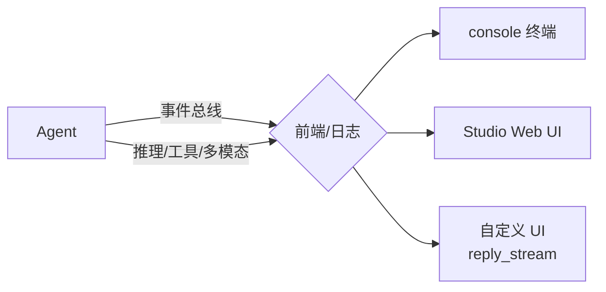

# 15 - 流式输出与可观测

本篇目标：让智能体「看得见」——通过**统一事件总线**流式推送每一步（推理、工具调用、多模态内容），并用 **Studio / console** 调试监控。

## 15.1 前置准备

```bash
pip install agentscope[full]
export DASHSCOPE_API_KEY="sk-你的密钥"
```

## 15.2 统一事件总线（核心）

2.0 的**事件系统**把智能体运行的全部活动（推理、工具调用、多模态内容）以统一事件流推送到前端/日志，解决「黑盒」痛点。这正是 AgentScope 「看得见、信得过」的底座。

事件流用法（完整枚举见 [04-消息与事件系统.md](04-消息与事件系统.md)）：

```python
from agentscope.event import EventType

async for event in agent.reply_stream(user_msg):
    match event.type:
        case EventType.REPLY_START:
            print("▶ 回复开始")
        case EventType.MODEL_CALL_START:
            print("  · 调用模型中…")
        case EventType.TEXT_BLOCK_DELTA:
            print(event.delta, end="")            # 实时文本
        case EventType.TOOL_CALL_START:
            print(f"\n[工具] {event.tool_name}")   # 工具调用可见
        case EventType.TOOL_CALL_END:
            print("  · 工具完成")
        case _:
            pass
```

## 15.3 多模态流式

事件系统原生支持 **text / image / audio** 多模态内容流式推送——图片生成、语音播报等都能实时回传前端。

```python
# 多模态内容以事件块形式到达，按 block.type 分流渲染
case EventType.MULTIMODAL_BLOCK_DELTA:   # 具体枚举以官方文档为准
    render(event.block)
```

## 15.4 console 终端调试

`launch_console` 是最快的调试入口：流式渲染、工具确认、Ctrl+C 中断全部内置。

```python
import os
import asyncio
from agentscope.agent import Agent
from agentscope.console import launch_console
from agentscope.credential import DashScopeCredential
from agentscope.model import DashScopeChatModel

async def main():
    agent = Agent(
        name="Friday",
        system_prompt="You're a helpful assistant named Friday.",
        model=DashScopeChatModel(
            credential=DashScopeCredential(api_key=os.environ["DASHSCOPE_API_KEY"]),
            model="qwen3.6-plus",
        ),
    )
    await launch_console(agent)   # 终端实时可见推理与工具调用

asyncio.run(main())
```

## 15.5 Studio 可视化监控

AgentScope Studio 提供 Web 端可视化监控，追踪智能体执行状态并支持多维度评估。

```bash
npx @agentscope/studio
```

在 AgentScope 项目中配置 Studio URL 即可把运行事件推送到 Studio 面板（具体配置字段以官方文档为准）。Studio 让你在不改代码的情况下「看见」每个智能体的提示、API 调用、内存与 workflow。

## 15.6 可观测性架构总结



## 关键 API 速查

| API | 说明 |
|-----|------|
| `agent.reply_stream(msg)` | 流式事件源（统一事件总线） |
| `EventType.*` | 事件枚举 |
| `launch_console(agent)` | 终端调试（流式+确认+中断） |
| `npx @agentscope/studio` | Web 可视化监控 |

## 2.0 注意事项

- 可观测性依赖事件系统，务必用 `reply_stream`（或 Studio/console），不要只取 `reply` 的最终结果——那样看不到中间过程。
- 多模态事件的具体枚举名以官方 `EventType` 为准。
- Studio 与 console 是「同一个事件总线」的不同消费者，可并存。

## 下一步

→ [16-代理Service与部署.md](16-代理Service与部署.md)：把智能体变成多租户、多会话的生产服务。
