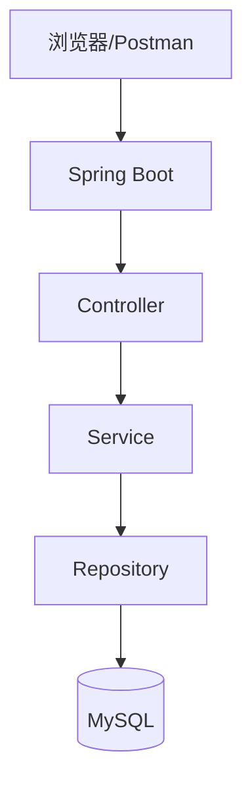
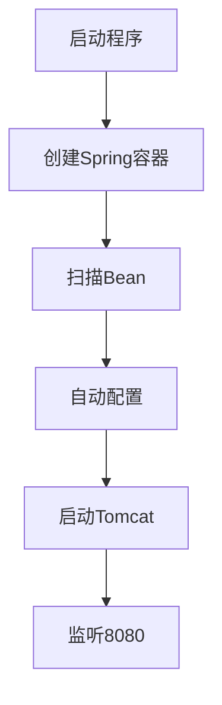
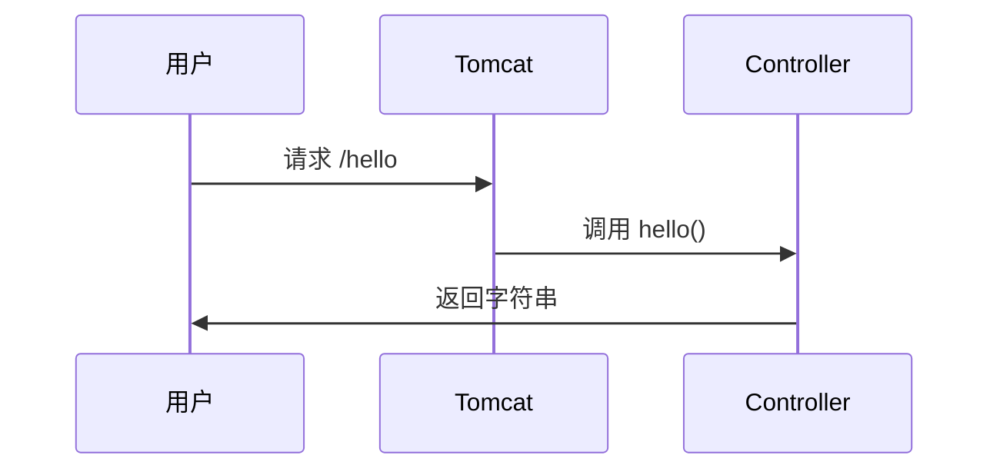

# Spring Boot 3 教程（超详细入门到实战）

这次我们不只讲概念。

而是：

- 从 0 创建项目

- 写完整代码

- 跑通接口

- 连接数据库

- 返回 JSON

- 理解每一步为什么这样写

你跟着做一遍。

基本就能独立写 Spring Boot 后端了。

---

# 1\. 我们最终要做什么

做一个：

# “用户管理系统”

支持：

最终架构：



---

# 2\. 准备环境

---

## 必须安装

---

# 3\. 创建 Spring Boot 项目

打开：

[Spring Initializr](https://start.spring.io/?utm_source=chatgpt.com)

---

## 配置

---

## 添加依赖

选择：

- Spring Web

- Spring Data JPA

- MySQL Driver

- Lombok

- Validation

---

# 4\. 项目结构（非常重要）

创建后：

```Plain Text
demo
├── src
│   ├── main
│   │   ├── java
│   │   │   └── com.example.demo
│   │   │       ├── controller
│   │   │       ├── service
│   │   │       ├── repository
│   │   │       ├── entity
│   │   │       └── DemoApplication
│   │   │
│   │   └── resources
│   │       └── application.yml
```

---

# 5\. 第一个 Spring Boot 程序

---

## DemoApplication\.java

```Java
package com.example.demo;

import org.springframework.boot.SpringApplication;
import org.springframework.boot.autoconfigure.SpringBootApplication;

@SpringBootApplication
public class DemoApplication {

    public static void main(String[] args) {

        SpringApplication.run(DemoApplication.class, args);

    }
}
```

---

# 6\. 这一行到底干了什么

```Java
SpringApplication.run()
```

实际上：



---

# 7\. 先写一个接口

---

## 创建 controller/HelloController\.java

```Java
package com.example.demo.controller;

import org.springframework.web.bind.annotation.GetMapping;
import org.springframework.web.bind.annotation.RestController;

@RestController
public class HelloController {

    @GetMapping("/hello")
    public String hello() {

        return "Hello Spring Boot 3";

    }
}
```

---

# 8\. 讲解这段代码

---

## @RestController

意思：

```Plain Text
这是一个接口类
返回JSON或者字符串
```

---

## @GetMapping\("/hello"\)

意思：

```Plain Text
浏览器访问：

/hello

就执行下面方法
```

---

## return

直接返回：

```Plain Text
Hello Spring Boot 3
```

---

# 9\. 运行项目

点击 IDEA：

```Plain Text
运行 DemoApplication
```

控制台出现：

```Plain Text
Tomcat started on port 8080
```

说明：

```Plain Text
Spring Boot 已经内嵌启动 Tomcat
```

---

# 10\. 浏览器访问

```Plain Text
http://localhost:8080/hello
```

看到：

```Plain Text
Hello Spring Boot 3
```

成功。

---

# 11\. Spring Boot 请求流程（核心）



---

# 12\. 开始真正做项目

现在做：

# 用户管理系统

---

# 13\. 创建数据库

---

## MySQL 创建数据库

```SQL
CREATE DATABASE demo;
```

---

## 创建表

```SQL
CREATE TABLE user (
    id BIGINT PRIMARY KEY AUTO_INCREMENT,
    name VARCHAR(50),
    age INT
);
```

---

# 14\. 配置数据库

---

## application\.yml

```YAML
server:
  port: 8080

spring:
  datasource:
    url: jdbc:mysql://localhost:3306/demo?serverTimezone=Asia/Shanghai
    username: root
    password: 123456

  jpa:
    hibernate:
      ddl-auto: update

    show-sql: true
```

---

# 15\. 讲解配置

---

## datasource

连接数据库。

---

## ddl\-auto

```Plain Text
update
```

表示：

```Plain Text
自动更新表结构
```

---

## show\-sql

控制台打印 SQL。

方便调试。

---

# 16\. 创建实体类 Entity

---

## entity/User\.java

```Java
package com.example.demo.entity;

import jakarta.persistence.*;
import lombok.Data;

@Data
@Entity
@Table(name = "user")
public class User {

    @Id
    @GeneratedValue(strategy = GenerationType.IDENTITY)
    private Long id;

    private String name;

    private Integer age;

}
```

---

# 17\. 讲解 Entity

---

## @Entity

表示：

```Plain Text
这个类对应数据库表
```

---

## @Table\(name = "user"\)

对应：

```SQL
user 表
```

---

## @Id

主键。

---

## @GeneratedValue

自增。

---

# 18\. Lombok 的作用

```Java
@Data
```

自动生成：

- getter

- setter

- toString

- equals

否则你得自己写几十行。

---

# 19\. 创建 Repository

---

## repository/UserRepository\.java

```Java
package com.example.demo.repository;

import com.example.demo.entity.User;
import org.springframework.data.jpa.repository.JpaRepository;

public interface UserRepository
        extends JpaRepository<User, Long> {
}
```

---

# 20\. Repository 是什么

这是：

```Plain Text
数据库操作层
```

---

## JpaRepository 已经帮你实现

- 保存

- 删除

- 查询

- 分页

你不用自己写 SQL。

---

# 21\. 创建 Service

---

## service/UserService\.java

```Java
package com.example.demo.service;

import com.example.demo.entity.User;
import com.example.demo.repository.UserRepository;
import lombok.RequiredArgsConstructor;
import org.springframework.stereotype.Service;

import java.util.List;

@Service
@RequiredArgsConstructor
public class UserService {

    private final UserRepository userRepository;

    // 查询全部
    public List<User> list() {

        return userRepository.findAll();

    }

    // 新增用户
    public User save(User user) {

        return userRepository.save(user);

    }

    // 删除用户
    public void delete(Long id) {

        userRepository.deleteById(id);

    }
}
```

---

# 22\. 为什么要 Service 层

很多新人直接：

```Plain Text
Controller -> 数据库
```

这是错误架构。

正确：

```Plain Text
graph TD

Controller
--> Service
--> Repository
--> MySQL
```

---

# 23\. Service 的职责

业务逻辑。

比如：

- 登录

- 权限

- 校验

- 事务

- 订单计算

都应该放这里。

---

# 24\. 创建 Controller

---

## controller/UserController\.java

```Java
package com.example.demo.controller;

import com.example.demo.entity.User;
import com.example.demo.service.UserService;
import lombok.RequiredArgsConstructor;
import org.springframework.web.bind.annotation.*;

import java.util.List;

@RestController
@RequiredArgsConstructor
@RequestMapping("/user")
public class UserController {

    private final UserService userService;

    // 查询全部
    @GetMapping
    public List<User> list() {

        return userService.list();

    }

    // 新增用户
    @PostMapping
    public User save(@RequestBody User user) {

        return userService.save(user);

    }

    // 删除用户
    @DeleteMapping("/{id}")
    public String delete(@PathVariable Long id) {

        userService.delete(id);

        return "删除成功";

    }
}
```

---

# 25\. 现在完整请求流程

```Plain Text
sequenceDiagram

participant U as 浏览器
participant C as Controller
participant S as Service
participant R as Repository
participant DB as MySQL

U->>C: POST /user
C->>S: save()
S->>R: save()
R->>DB: insert
DB->>U: 返回结果
```

---

# 26\. 测试接口

推荐：

- [Postman](https://www.postman.com/?utm_source=chatgpt.com)

- [Apifox](https://apifox.com/?utm_source=chatgpt.com)

---

# 27\. 新增用户

---

## POST

```Plain Text
http://localhost:8080/user
```

---

## JSON

```JSON
{
  "name": "Tom",
  "age": 20
}
```

---

## 返回

```JSON
{
  "id": 1,
  "name": "Tom",
  "age": 20
}
```

---

# 28\. 查询用户

---

## GET

```Plain Text
http://localhost:8080/user
```

返回：

```JSON
[
  {
    "id": 1,
    "name": "Tom",
    "age": 20
  }
]
```

---

# 29\. 删除用户

---

## DELETE

```Plain Text
http://localhost:8080/user/1
```

---

# 30\. 为什么 Spring Boot 能自动返回 JSON

因为：

Spring Boot 自动集成：

```Plain Text
Jackson
```

对象：

```Java
User
```

自动转：

```JSON
{
  "id":1
}
```

---

# 31\. Bean 的真正理解（非常重要）

很多人学不会 Spring。

就是因为不理解 Bean。

---

# 32\. 什么是 Bean

```Plain Text
Bean = 被Spring管理的对象
```

---

# 33\. Spring 容器

```Plain Text
graph TD

A[Spring容器]

A --> B[UserController]
A --> C[UserService]
A --> D[UserRepository]
```

---

# 34\. Spring 自动创建对象

你没写：

```Java
new UserService()
```

但能直接用。

因为：

Spring 帮你创建了。

---

# 35\. @Service 的本质

```Java
@Service
```

等于告诉 Spring：

```Plain Text
帮我创建这个对象
```

---

# 36\. @RequiredArgsConstructor

自动生成构造函数。

等于：

```Java
public UserController(UserService userService) {
    this.userService = userService;
}
```

---

# 37\. Spring Boot 自动注入流程

```Plain Text
graph TD

A[扫描@Service]
--> B[创建UserService Bean]
--> C[注入Controller]
```

---

# 38\. 加参数校验（企业必备）

---

## 修改 User\.java

```Java
package com.example.demo.entity;

import jakarta.persistence.*;
import jakarta.validation.constraints.Min;
import jakarta.validation.constraints.NotBlank;
import lombok.Data;

@Data
@Entity
@Table(name = "user")
public class User {

    @Id
    @GeneratedValue(strategy = GenerationType.IDENTITY)
    private Long id;

    @NotBlank
    private String name;

    @Min(1)
    private Integer age;

}
```

---

# 39\. Controller 开启校验

```Java
@PostMapping
public User save(@Valid @RequestBody User user) {

    return userService.save(user);

}
```

---

# 40\. 参数错误效果

如果：

```JSON
{
  "name":"",
  "age":0
}
```

Spring 会自动报错。

---

# 41\. 全局异常处理

企业项目一定有。

---

## exception/GlobalExceptionHandler\.java

```Java
package com.example.demo.exception;

import org.springframework.web.bind.MethodArgumentNotValidException;
import org.springframework.web.bind.annotation.ExceptionHandler;
import org.springframework.web.bind.annotation.RestControllerAdvice;

@RestControllerAdvice
public class GlobalExceptionHandler {

    @ExceptionHandler(Exception.class)
    public String error(Exception e) {

        return e.getMessage();

    }

    @ExceptionHandler(MethodArgumentNotValidException.class)
    public String validException() {

        return "参数校验失败";

    }
}
```

---

# 42\. 为什么需要全局异常

否则：

```Plain Text
后端直接500
```

用户体验极差。

---

# 43\. 最终项目结构（企业推荐）

```Plain Text
com.example.demo
├── controller
├── service
├── repository
├── entity
├── exception
├── config
└── DemoApplication
```

---

# 44\. Spring Boot 最核心思想

真正核心：

```Plain Text
Spring 管对象
Spring 自动组装对象
Spring 自动处理请求
```

---

# 45\. 现在你已经真正掌握了

你已经完成：

✅ Spring Boot 启动

✅ Controller

✅ 请求映射

✅ JSON

✅ MySQL

✅ JPA

✅ 三层架构

✅ Bean

✅ IOC

✅ DI

✅ 参数校验

✅ 全局异常

已经进入：

```Plain Text
真正后端开发
```

---

# 46\. 下一步应该学什么

建议顺序：

---

## 第一阶段

继续掌握：

- 分页

- 条件查询

- 文件上传

- JWT登录

---

## 第二阶段

学习：

- Redis

- Docker

- Nginx

---

## 第三阶段

进入微服务：

- Spring Cloud

- Kubernetes

- Apache Kafka

---

# 47\. 你现在最应该理解的一句话

真正重要的不是注解。

而是：

```Plain Text
请求怎么流动
对象怎么创建
Bean怎么注入
数据库怎么访问
```

当这些串起来：

Spring Boot 才真正学会。

